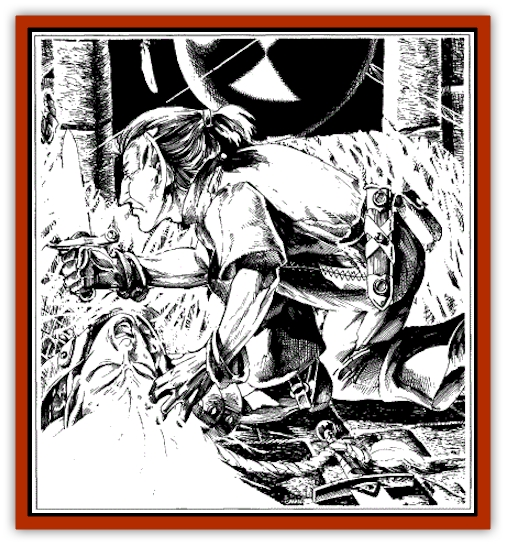

# Handmaiden of Takhisis

| Statistic | **Handmaiden of Takhisis** |
| --- | --- |
| **Activity Cycle:** | Nocturnal |
| **Alignment:** | Chaotic evil |
| **Armor Class:** | -7 |
| **Climate/Terrain:** | Abyss or subterranean caverns |
| **Damage/Attack:** | 5-11/5-11 (claws), 7-19 (bite) |
| **Diet:** | Carnivore |
| **Frequency:** | Unique |
| **Hit Dice:** | 16 (128 hp) |
| **Intelligence:** | Supra-Genius (18) |
| **Magic Resistance:** | 5% |
| **Morale:** | Fearless (20) |
| **Movement:** | 15, Cl 18 |
| **No. Appearing:** | 1 |
| **No. of Attacks:** | 3 or 2 |
| **Organization:** | Solitary |
| **Size:** | M or H (50'-long spider) |
| **Special Attacks:** | Slow, paralysis, poison, magic |
| **Special Defenses:** | See below |
| **THAC0:** | 5 |
| **Treasure:** | Nil |
| **XP Value:** | 85,000 |

The names of the great gods of Krynn are well known: Paladine, Takhisis, Gilean.

However, there are many entities, known to only a few, who prefer to allow the great gods to garner all the attention. Others, the minor personages of evil, have either been destroyed or enslaved by those who are more powerful than they. Among these latter entities are the handmaidens of Takhisis.

Jiathuli was the greatest of these handmaidens, and she had high honor in the court of the Abyss. Over the course of time, because of her cunning and her ability, she earned the title Princess of the Abyss. However, this honor was not enough for Jiathuli. She longed to replace the constellations of evil with her sign, the sign of the spider. She envied her mistress, the Dark Queen Takhisis. Eventually, she created the Deathdark, a demi-dimension she planned to use as a power base. There she bred the spider dragons in mockery of Takhisis and her dragons. When Takhisis discovered this, she was furious. She trapped Jiathuli in the Deathdark, sentencing her to permanent exile.

**Combat:** Jiathuli has two forms—that of a female [[Elf_Drow|drow]] of surpassing beauty and malevolence, and that of a giant spider. At the present time, she is trapped in the form of a giant spider. In either form, she has the following powers and abilities, as a 16th-level spellcaster (two of these are always active; the others she can use once per round, at will): *detect magic* (always active), *detect invisibility* (always active), *know alignment*, *read magic*, *dispel magic*, *web*, *telekinesis*

Jiathuli is immune to fire, lightning, acid, and poison. A +2 or better weapon is needed to harm her

Once she could change between forms at will, but the power of Takhisis keeps her in her spider form. In this form, she attacks with two claws and fangs. If she strikes an opponent with both claws in a round, the victim is automatically slowed (as the spell) for 3d4 rounds, and must roll a successful saving throw vs. paralysis or be paralyzed for 1d6 hours. If she bites an opponent, he must roll a successful saving throw vs. poison (with a -3 penalty) or fall into a comatose state for 1d4 days; if the saving throw is successful, the victim is slowed and attacks with a -3 attack and damage roll penalty for the duration of the battle. In her human form, she can cast spells as a 12th-level priest and a 16th-level wizard.

**Habitat/Society:** The handmaidens of Takhisis are servitors of the court of Takhisis. They are the pampered slaves of Takhisis, terrorizing those who have lesser social standing in the palace of Takhisis. Jiathuli has rejected the court of evil in order to become the absolute sovereign of her own domain; she is an absolute tyrant to the drow who serve her.

**Ecology:** As a princess of evil, Jiathuli has no place in a normal ecology. She is the ultimate predator, feasting on every morsel that is provided by her drow slaves.

---
## Discovery & Documentation

**Source Publication:** Wild Elves (1991)
**Campaign Setting:** Dragonlance
**Author(s):** Scott Bennie

### Other Creatures Found in This Source Book
   * [[Curotai|Curotai]]
   * [[Dragon_Spider|Dragon, Spider]]
   * [[Ice_Vampire|Ice Vampire]]
   * [[Spider_Horse|Spider Horse]]
   * [[Weapon_Living|Weapon, Living]]
