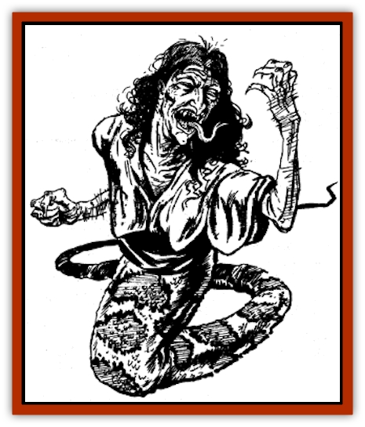

# Hannya

| Statistic | **Hannya** |
| --- | --- |
| **Activity Cycle:** | Night |
| **Alignment:** | Chaotic evil |
| **Armor Class:** | 3 |
| **Climate/Terrain:** | Any land |
| **Damage/Attack:** | 1-4/1-4/1-8 |
| **Diet:** | Carnivore |
| **Frequency:** | Very rare |
| **Hit Dice:** | 8 |
| **Intelligence:** | Average (8-10) |
| **Magic Resistance:** | 35% |
| **Morale:** | Steady (12) |
| **Movement:** | 9 |
| **No. Appearing:** | 1-4 |
| **No. of Attacks:** | 3 |
| **Organization:** | Solitary or covey |
| **Size:** | M (7' long) |
| **Special Attacks:** | Constriction |
| **Special Defenses:** | See below |
| **THAC0:** | 13 |
| **Treasure:** | X,Y |
| **XP Value:** | 2,000 |

A vicious variety of oriental [[Hag|hag]], the hannya is a cross between a wretched old woman and a serpent with an insatiable hunger for human prey.

The upper portion of a hannya's body is that of an elderly human female. Her nose is long and hooked, her tongue long and forked, and her beady black eyes are covered with a milky film. Her body is lean and bony, her flesh a sickly green. Sharp yellow teeth line her mouth. Her black, greasy hair dangles in long curls over her hunched shoulders. Her long, thin fingers end in sharp claws. She wears the tattered clothes of a peasant, which are usually black or grey in color, and caked with filth.

The bottom portion of a hannya's body is that of a thick serpent. This serpentine segment is supple and well-muscled, enabling the hannya to grasp and constrict victims like a boa. Thin green or black scales cover her skin, and they feel cold to the touch.

Hannya speak languages that are common to the areas they inhabit, as well as the languages of [[Yuan-ti|yuan-ti]] and all reptiles. An excited or agitated hannya speaks in sputtering hisses, interspersed with long, high-pitched cackles.

**Combat:** The hannya is a devious, cruel fighter, preying almost exclusively on the weak and helpless. When confronted by an opponent of equal or greater power, she withdraws at the earliest opportunity. But when facing a weaker adversary, she attacks with unparalleled viciousness, relishing her victim's every scream.

The hannya can *polymorph self* at will and has continual *ESP* to a radius of 100 feet. Additionally, she can project a *suggestion* into the mind of an unwary character up to 100 feet distant. When she detects the presence of a suitable victim, such as a traveling priest or a lost child, the hannya's typical strategy is to polymorph into the form of an old lady with a kind face and pleasing manner. Using her *suggestion* ability, she plants an idea in her victim's mind. She suggests to her victim that a lonely old lady needs help or desires company, or can provide him with shelter and food. If the victim is drawn to her, the *polymorphed* hannya engages him in pleasant conversation, attacking as soon as the victim drops his guard.

The hannya attacks with her claws and bite. She also can constrict a victim with her tail to inflict 1-4 hit points. If the first attempt to constrict a victim suceeds, the victim is constricted automatically each round thereafter, suffering an additional 1-4 hit points of damage per round. Constricted humanoid creatures can free themselves from a hannya's coils with a successful "bend bars/lift gates" roll. If a companion attempts to free an encoiled victim by attacking the hannya with a weapon, the chance of accidentally striking the victim is 20%.

A hannya has an aversion to violets. She will not voluntarily enter a home or any other building surrounded by beds of these flowers. A character carrying a bouquet of violets is protected from hannya; a hannya will not physically touch such a character, nor can she affect such a character with her spells. In such cases, the hannya, *polymorphed* as an old woman, will sweetly ask the victim to put his flowers in a vase where she can admire them, or claim that she is allergic to such flowers and ask the victim to put them away. (Note that such requests are verbal appeals, not *suggestions*, because a victim with violets is immune to the hannya's spells.) If the victim complies, the hannya attacks.

**Habitat/Society:** Hannya are former human female wu jen or shukenja of evil alignment who have been outcast from their villages for crimes against the community. Seeking revenge, these bitter women make unholy pacts with dark spirits, pledging their loyalty and worship in exchange for assuming the powerful hannya form.

Hannya dwell in abandoned buildings or ruined temples, usually near the outskirts of human settlements. They usually live alone, but sometimes several join together in a covey, equally sharing in any prey they lure to the lair. Hannya collect coins and other treasure items to use as bait for greedy victims, alerting passers-by to the presence of treasure by *suggestion*.

**Ecology:** The ravenous hannya eat all manner of living creatures. They favor human and humanoid flesh. They seldom associate with other monsters, but occasionally align with yuan-ti for the purpose of attacking large groups of humans.

---
## Discovery & Documentation

**Source Publication:** MC6 Kara-Tur Appendix (1990)
**Campaign Setting:** Kara-Tur (Forgotten Realms)
**Author(s):** Rick Swan

### Other Creatures Found in This Source Book
   * [[Bajang|Bajang]]
   * [[Bakemono|Bakemono]]
   * [[Bisan|Bisan]]
   * [[Buso|Buso]]
   * [[Carp_Giant|Carp, Giant]]
   * [[Centipede_Spirit|Centipede, Spirit]]
   * [[Chu-u|Chu-u]]
   * [[Con-tinh|Con-tinh]]
   * [[Doc_cu'o'c|Doc cu'o'c]]
   * [[Duruch'i-lin|Duruch'i-lin]]
   * [[Flame_Spirit|Flame Spirit]]
   * [[Foo_Creature|Foo Creature]]
   * [[Gaki|Gaki]]
   * [[Gargantua|Gargantua]]
   * [[Goblin_Rat|Goblin Rat]]
   * [[Hai_Nu|Hai Nu]]
   * [[Hengeyokai|Hengeyokai]]
   * [[Hsing-sing|Hsing-sing]]
   * [[Hu_Hsien|Hu Hsien]]
   * [[Human_Kara-Tur|Human (Kara-Tur)]]
   * [[Ikiryo|Ikiryo]]
   * [[Jishin_Mushi|Jishin Mushi]]
   * [[Kala|Kala]]
   * [[Kaluk|Kaluk]]
   * [[Kappa|Kappa]]
   * [[Korobokuru|Korobokuru]]
   * [[Krakentua|Krakentua]]
   * [[Kuei|Kuei]]
   * [[Memedi|Memedi]]
   * [[Men-shen|Men-shen]]
   * [[Nat|Nat]]
   * [[Ningyo|Ningyo]]
   * [[Oni|Oni]]
   * [[P'oh|P'oh]]
   * [[P'oh_Gohei|P'oh, Gohei]]
   * [[Shan_Sao|Shan Sao]]
   * [[Shirokinukatsukami|Shirokinukatsukami]]
   * [[Spirit_Folk|Spirit Folk]]
   * [[Spirit_Nature|Spirit, Nature]]
   * [[Spirit_Stone|Spirit, Stone]]
   * [[Tako|Tako]]
   * [[Tengu|Tengu]]
   * [[Wang-Liang|Wang-Liang]]
   * [[Yuan-ti_Histachii|Yuan-ti, Histachii]]
   * [[Yuki-on-na|Yuki-on-na]]
