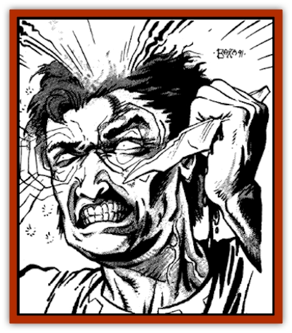

# Harrla

| Statistic | **Harrla** |
| --- | --- |
| **Activity Cycle:** | Night |
| **Alignment:** | Chaotic evil |
| **Armor Class:** | 0 |
| **Climate/Terrain:** | Any urban area |
| **Damage/Attack:** | Nil |
| **Diet:** | Life energy |
| **Frequency:** | Very rare |
| **Hit Dice:** | 4+3 |
| **Intelligence:** | Very (11-12) |
| **Magic Resistance:** | Nil |
| **Morale:** | Fearless (20) |
| **Movement:** | Fl 15 (A) |
| **No. Appearing:** | 1 |
| **No. of Attacks:** | 0 |
| **Organization:** | Solitary |
| **Size:** | M (6' tall) |
| **Special Attacks:** | Emotion control |
| **Special Defenses:** | See below |
| **THAC0:** | 15 |
| **Treasure:** | Nil |
| **XP Value:** | 5,000 |

Every culture has reports of unusual behavior by otherwise normal people. Perhaps a wife who has been true and faithful for many years suddenly seeks passion in the arms of a stranger. Maybe a man who has been good and kind his entire life suddenly lashes out and kills several of his best friends. Sometimes this sudden change is the result of natural psychological stress or madness, but often it is the work of the dreaded harrla.

The harrla is naturally and permanently invisible. Those capable of sensing invisible objects see it as a humanoid figure, the height of a man. Its edges shimmer and fluctuate, making it impossible to determine if the form is a man or a woman.

The harrla has no known language, and seems unable to communicate. Some scholars say that a harrla can communicate with others of its kind, but there is certainly no proof of this. As they are almost never encountered in pairs or groups, however, language is all but unnecessary for them.

**Combat:** The harrla does not enter physical combat the way that many creatures do. It has no capacity to inflict physical damage and takes whatever steps it must to avoid placing itself in danger of physical or mystical assault. Of course, it is aware that most material weapons and spells cannot harm it, so its judgment is affected by these considerations.

The main "attack" mode of the harrla is its ability to infuse a living creature with an overpowering emotion. Each harrla is able to project only a single emotion. Although there are, in theory, as many types of harrla as there are emotional states, some common examples include hate, passion, and fear.

*Hate:* This type of harrla is capable of inducing hate in its victims that causes them to be overwhelmed with the desire to kill and destroy. While they do not simply attack anyone that they see, the slightest provocation results in a violent outburst. Thus, someone at the breakfast table might go into a killing frenzy upon finding that his meal was improperly prepared.

*Passion:* Those infused with passion find themselves unable to control their romantic desires. They fall into the arms of the nearest person of the appropriate sex and behave in a most wanton manner. The effects of this infusion are similar to those of the *philter of love*, only more intense and of shorter duration.

*Fear:* Persons overcome with fear flee from anything that presents itself to them in a frightening manner. Because the victims lose control of basic common sense, however, even persons reaching out to or walking toward the characters will take on menacing overtones.

The harrla is naturally drawn to those who are struggling to keep the emotion that it generates in check. Once it finds such persons, it begins to stimulate the emotional centers of the victims' subconscious minds. Within a few seconds, the victims become consumed by the false emotions of the harrla and act purely according to their new emotional state. While in this condition, the characters are under the control of the Dungeon Master, just as if they were NPCs.

The victims have no memory of what they have done while under the influence of the harrla and are often shocked to learn what has transpired during the missing minutes of their life. The harrla's influence remains for 30 minutes, minus 1 minute per point of the victim's Wisdom score. A saving throw vs. spells is permitted to avoid the influences of this creature, with success indicating that the victims are safe for 24 hours. This save is permitted only when the harrla first attempts to dominate an individual.

Those under the influence of the harrla can be freed by a magical spell that counters the emotional effect of the creature. Thus, someone who was under the influence of a harrla that projected mindless happiness could be released by the casting of an *emotion* spell that induced sadness.

It is also possible to break the power of the creature through forceful persuasion and Charisma. In order for characters to drive out the influence of the harrla they must be a true and trusted friend of the dominated character. If this is the case, the individuals must try to convince the victims that things are not as they perceive them. The chance of this working is 1% per Charisma point of the person trying to break the enchantment.

Persons under the emotional influence of a harrla lose 1 point of Charisma. This loss is permanent, remaining even after the victims throw off the effects of the harrla's emotion controlling power. When the victims. Charisma scores are reduced to 0, the victims lose all vitality and will to live, dying in 1-6 rounds. Only restoring lost Charisma points prevents death.

When a harrla is dominating a specific person, it cannot travel more than 75 feet away from him. The creature retains its natural ability to fly, however, and often drifts above him as he moves through crowds and the like.

As an example of the harrla's dark and evil power, consider the following situation. A cleric of lawful good alignment is walking along the street when he is confronted by several members of another faith. They exchange cordial greetings and some brief conversation. During the chat, the priest is offended by several of the comments made about his church. This causes him to subconsciously resent the others, but he does not wish to make a public scene and says nothing about the insults. A passing harrla that induces rage senses his buried anger and begins to manipulate the priest's psyche. Fifteen minutes later, the priest suddenly finds that he has slain half a dozen innocent men and is now a wanted criminal. The harrla has done its evil work well.

The harrla is composed of nothing but emotional energy and is immune to damage from any manner of non-magical weapon. Further, even magical weapons inflict only half their normal damage to the creature. Of course, the weapon gains the traditional bonuses associated with an invisible opponent (-2 surprise modifier, etc.).

Magical spells have a reduced effectiveness against the harrla, because of its unusual form. It is immune to all spells that inflict damage based on heat or fire, cold or ice, electricity or lightning, and those that affect a biological function, such as *sleep* or *cause light wounds*. Emotion controlling spells, such as *charm*, have been known to affect the creature, although it gains a +4 bonus to any saving throw it makes against them.

The harrla's energy nature gives it the ability to pass through any solid objects with ease. The only known barriers through which a harrla cannot pass are those of a magical nature, such as a *protection from evil* or similar spell.

When a harrla passes through an individual, it momentarily infuses the individual with the emotion of the creature. The harrla does not actually feed upon the character's emotional energy, and the victim is entitled to a saving throw vs. spells with a +2 bonus to avoid its influence. If the save fails, the victim is consumed by the emotion for 1d4 rounds. Because the creature is not actually feeding when it does this, the harrla does not drain someone of a Charisma point.

While the harrla is indeed a dangerous adversary, it is not without weaknesses. Experience has shown that each and every harrla has a special weakness related to the emotion that it projects. For example, one scholar, a noted authority on paranormal creatures, reports that he once encountered a harrla that induced an utterly consuming depression in its victims. This despair was so great as to be life threatening. Upon researching the local rumors, he found ancient writings that convinced him that the tears of one of its victims would be damaging to the harrla. Sure enough, when the sage sprinkled such tears upon the harrla, it let out an audible shriek of agony and fled the area, never to be "seen" again.

In addition to its special weakness, a harrla can be driven away for 10-100 days with a *dismissal* spell or utterly destroyed with a *banishment* spell. The harrla is also vulnerable to spells such as *trap the soul*. An *emotion control* spell cast upon the creature stuns it for 1d4 rounds, during which time it can attempt no actions at all and is utterly helpless.

**Habitat/Society:** The harrla is a strange and solitary creature. It has no social organization, but drifts like a hunting [[Shark|shark]] through the sea of humanity in search of a victim. When it finds a target, it strikes.

Harrla seem to develop some sort of psychological attachment to their victims. They become fascinated with the character's ability to "feel" and the intensity of its emotions. They tend to linger near past victims, waiting for a chance to dominate them again. It is not uncommon for an individual to fall into repeated periods of domination over the course of several days until, exhausted by the feedings of the harrla and drained of all Charisma, he dies.

On the average, a harrla drives its victims into a superemotional state and feeds upon them once or twice a week. A harrla returns to a victim in its need to feed upon emotional energy every 2d4 days.

The harrla seldom remains in one place after exhausting a victim. It seems to be drawn to travel from place to place for some unknown reason. Those who would stalk these creatures are often placed in a situation where they must defeat it quickly or it escapes them. It is often possible, however, to track a harrla from town to town simply by keeping records of unusual events. For example, if a party of adventurers suspects that a hate-causing harrla is in their area, they might locate it by making a map and marking places where unusual acts of violence have occurred.

Of course, this method of tracking a harrla does not work for those that infuse less obvious emotions. A harrla that causes its victims to experience passion or fear, for example, might be much harder to track since reports of its activities would be far less likely to surface.

**Ecology:** The harrla seems to be a natural creature. While some speculate that it is undead or of extraplanar origin, there seems to be little proof of this. Most sages agree that the harrla is not a product of the negative material plane, as most undead are. It appears to be a natural creature that stalks mankind in much the same way that [[Wolf|wolves]] might hunt sheep who have wandered from the flock.

Although little is understood about the harrla's need for emotional energy, several theories have been put forth to account for the creature's behavior. Perhaps the most convincing of these is that the harrla stimulates emotions in others because it lacks them itself. According to this school of thought, the harrla's soul is barren and without happiness. In order to experience the joys of emotion, such as the warm touch of a lover's kiss, the stimulating fury of an angry rage, or the vibrant excitement of terror, the creature must make use of proxies.

If true, this theory explains much, including the creature's apparent attraction to those who do not normally display the emotion that it stimulates, for it desires to share the thrill of these emotions with those who also, in its mind, lack them. Whether this is true or not, only further studies of the creature's tragic influence will tell.

---
## Discovery & Documentation

**Source Publication:** MC11 Forgotten Realms Appendix II (1991)
**Campaign Setting:** Advanced Dungeons & Dragons 2nd Edition
**Author(s):** Tim Beach, Tim Brown, William W. Connors, Dale Donovan, Ed Greenwood, Jeff Grubb, Bruce Heard, Slade Henson, Rob King, Colin McComb, Roger E. Moore, Bruce Nesmith, Jon Pickens, Jean Rabe, Dori Watry, Skip Williams

### Other Creatures Found in This Source Book
   * [[Alaghi|Alaghi]]
   * [[Alguduir|Alguduir]]
   * [[Beguiler|Beguiler]]
   * [[Bird_Toril|Bird (Toril)]]
   * [[Cantobele|Cantobele]]
   * [[Carapace|Carapace]]
   * [[Cat_Toril|Cat (Toril)]]
   * [[Chitine|Chitine]]
   * [[Cildabrin|Cildabrin]]
   * [[Dimensional_Warper|Dimensional Warper]]
   * [[Dragon_Deep|Dragon, Deep]]
   * [[Fachan_Toril|Fachan (Toril)]]
   * [[Fael|Fael]]
   * [[Feyr|Feyr]]
   * [[Firetail|Firetail]]
   * [[Frost|Frost]]
   * [[Gaund|Gaund]]
   * [[Gloomwing|Gloomwing]]
   * [[Golden_Ammonite|Golden Ammonite]]
   * [[Golem_Lightning|Golem, Lightning]]
   * [[Hamadryad|Hamadryad]]
   * [[Harrier|Harrier]]
   * [[Haun|Haun]]
   * [[Haundar|Haundar]]
   * [[Hendar|Hendar]]
   * [[Inquisitor|Inquisitor]]
   * [[Lhiannan_Shee|Lhiannan Shee]]
   * [[Loxo|Loxo]]
   * [[Manni|Manni]]
   * [[Manscorpion|Manscorpion]]
   * [[Mara|Mara]]
   * [[Morin|Morin]]
   * [[Naga_Dark|Naga, Dark]]
   * [[Orpsu|Orpsu]]
   * [[Plant_Carnivorous_Black_Willow|Plant, Carnivorous, Black Willow]]
   * [[Plant_Carnivorous_Toril|Plant, Carnivorous (Toril)]]
   * [[Plant_Dangerous_I|Plant, Dangerous I]]
   * [[Ring-Worm|Ring-Worm]]
   * [[Rohch|Rohch]]
   * [[Sand_Cat|Sand Cat]]
   * [[Saurial|Saurial]]
   * [[Sha'az|Sha'az]]
   * [[Silver_Dog|Silver Dog]]
   * [[Simpathetic|Simpathetic]]
   * [[Skuz|Skuz]]
   * [[Spider_Monkey|Spider, Monkey]]
   * [[Tren|Tren]]
