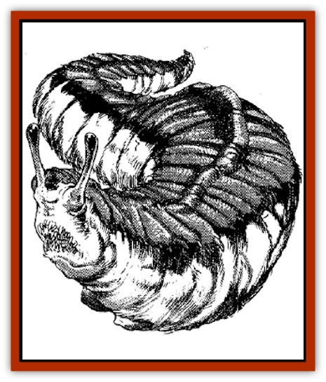

# Haundar

| Statistic | **Haundar** |
| --- | --- |
| **Activity Cycle:** | Day |
| **Alignment:** | Neutral |
| **Armor Class:** | 2 |
| **Climate/Terrain:** | Icebergs, arctic valleys |
| **Damage/Attack:** | 2-16 (2d8) |
| **Diet:** | Carnivore |
| **Frequency:** | Rare |
| **Hit Dice:** | 20 |
| **Intelligence:** | Animal (1) |
| **Magic Resistance:** | Nil |
| **Morale:** | Elite (15) |
| **Movement:** | 6, Fl 12 (D) |
| **No. Appearing:** | 1 |
| **No. of Attacks:** | 1 bite |
| **Organization:** | Solitary |
| **Size:** | G (30' long, 10' tall) |
| **Special Attacks:** | Spit acid |
| **Special Defenses:** | Nil |
| **THAC0:** | 1 |
| **Treasure:** | Nil |
| **XP Value:** | 12,000 |

The haundar is a gargantuan ice-slug. A very thick, flat shell covers most of the haundar.s back and its head. It is articulated in order to ease the creature's movement. The shell and the remainder of the haundar's body are white, with a slight green shimmer.

Thick fur covers the part of the haundar's body that its shell does not protect. The creature maintains body temperature thanks to a very thick, nutritious blubber under its skin. The largest quantity of body fat is located under the thickest part of the creature's shell, about 10 feet away from the head.

Like other common slugs, the haundar uses two retractile eyestalks, and two extra pseudopods to see and feel its way. Its mouth is located between the two lower pseudopods. The haundar's mouth is filled with an array of shark-like teeth that grow continuously. The haundar has infravision.

The haundar is capable of levitating, and moving through the air at a slow pace. It cannot fly in blizzard conditions.

**Combat:** The haundar fights primarily with its mouth, inflicting 2d8 points of damage per bite. Otherwise, it uses its acid spit which can reach a range of 12 feet. The haundar's acid strikes the target with an attack roll sufficient to hit Armor Class 0. The target consists of everything within a 10-foot radius from the point of impact. The acid causes 4d8 points of damage. A successful save vs. breath weapon allows the acid to cause only half damage. Victims who fail their saving throw must check all of their equipment to see if acid has affected any item.

The armored shell of the haundar is Armor Class 2. The unprotected parts of its body are Armor Class 6. If the haundar's eyestalks or sensory pseudopods are attacked, the haundar instantly  retracts them to avoid wounds. It keeps them retracted until the end of the combat encounter. The haundar can rely on its sense of smell to fight, but would do so with a -3 attack penalty.

Exposed stalks are Armor Class 8. Any single attack causing 10 points of damage or more either severs or incapacitates one eyestalk or pseudopod. The haundar needs at least one eyestalk to travel and hunt. Without its eyestalks, the haundar eventually dies of hunger. The pseudopods are sensory organs that tell the haundar which direction it flies, and at which altitude and speed. It cannot fly without at least one pseudopod. The severed stalks regrow within a month.

**Habitat/Society:** The haundar lives in large rocky caves, huge cracks in the ice, or caverns dug into the ice. Its sleeps there, protects itself from blizzard conditions, and reproduces there. Occasionally, the lair connects with [[Haun|haun]] broods. These worms are common parasites of the haundar.

The haundar is a migrating creature. If not hosting haun parasites, it travels the icy desert, trying to remain within a specific range of temperatures. In summer it moves north, while in winter it travels south. Migration patterns follow that of other beings, such as bears, seals, moose, and sometimes man.

When it is the farthest north and when food becomes scarce, it begins the mating season. Haundars are hermaphrodites, being both male and female. In order to begin the reproductive cycle, the haundar must fly almost continually for days. At last, it returns to its lair and lays 4d4 eggs. Exhausted, the haundar goes dormant for several weeks.

The eggs have little chance of hatching. Successful reproduction happens only once in a haundar's lifetime, for the hatchlings feed on the parent while it is dormant. As an average, two hatchlings become adults, and one successfully reproduces. Hatchlings grow at the rate of 1 HD (or 1½ feet a year) if properly fed. Haundars live as long as 60 years.

**Ecology:** The haundar is a dangerous predator. It feeds on almost anything that it can catch. The haundar is rare, since it is one of the main elements in the [[Sha'az|sha'az]] diet. Haundars indeed provide a very large, single source of meat that can feed an entire sha'az hive for weeks. Its blubber is used for oils. Its eyestalks are in demand for potions of infravision, and its lower pseudopods can be used as a potent ingredient in *potions of levitation*. The armor can be broken into smaller pieces and re-used as plate armor elements. A complete suit of armor made of this material weighs half its equivalent metal armor for the same protection, and is acid resistant. It also costs twice as much to build. Some northern knight orders may be willing to pay dearly for haundar shell pieces.

---
## Discovery & Documentation

**Source Publication:** MC11 Forgotten Realms Appendix II (1991)
**Campaign Setting:** Advanced Dungeons & Dragons 2nd Edition
**Author(s):** Tim Beach, Tim Brown, William W. Connors, Dale Donovan, Ed Greenwood, Jeff Grubb, Bruce Heard, Slade Henson, Rob King, Colin McComb, Roger E. Moore, Bruce Nesmith, Jon Pickens, Jean Rabe, Dori Watry, Skip Williams

### Other Creatures Found in This Source Book
   * [[Alaghi|Alaghi]]
   * [[Alguduir|Alguduir]]
   * [[Beguiler|Beguiler]]
   * [[Bird_Toril|Bird (Toril)]]
   * [[Cantobele|Cantobele]]
   * [[Carapace|Carapace]]
   * [[Cat_Toril|Cat (Toril)]]
   * [[Chitine|Chitine]]
   * [[Cildabrin|Cildabrin]]
   * [[Dimensional_Warper|Dimensional Warper]]
   * [[Dragon_Deep|Dragon, Deep]]
   * [[Fachan_Toril|Fachan (Toril)]]
   * [[Fael|Fael]]
   * [[Feyr|Feyr]]
   * [[Firetail|Firetail]]
   * [[Frost|Frost]]
   * [[Gaund|Gaund]]
   * [[Gloomwing|Gloomwing]]
   * [[Golden_Ammonite|Golden Ammonite]]
   * [[Golem_Lightning|Golem, Lightning]]
   * [[Hamadryad|Hamadryad]]
   * [[Harrier|Harrier]]
   * [[Harrla|Harrla]]
   * [[Haun|Haun]]
   * [[Hendar|Hendar]]
   * [[Inquisitor|Inquisitor]]
   * [[Lhiannan_Shee|Lhiannan Shee]]
   * [[Loxo|Loxo]]
   * [[Manni|Manni]]
   * [[Manscorpion|Manscorpion]]
   * [[Mara|Mara]]
   * [[Morin|Morin]]
   * [[Naga_Dark|Naga, Dark]]
   * [[Orpsu|Orpsu]]
   * [[Plant_Carnivorous_Black_Willow|Plant, Carnivorous, Black Willow]]
   * [[Plant_Carnivorous_Toril|Plant, Carnivorous (Toril)]]
   * [[Plant_Dangerous_I|Plant, Dangerous I]]
   * [[Ring-Worm|Ring-Worm]]
   * [[Rohch|Rohch]]
   * [[Sand_Cat|Sand Cat]]
   * [[Saurial|Saurial]]
   * [[Sha'az|Sha'az]]
   * [[Silver_Dog|Silver Dog]]
   * [[Simpathetic|Simpathetic]]
   * [[Skuz|Skuz]]
   * [[Spider_Monkey|Spider, Monkey]]
   * [[Tren|Tren]]
