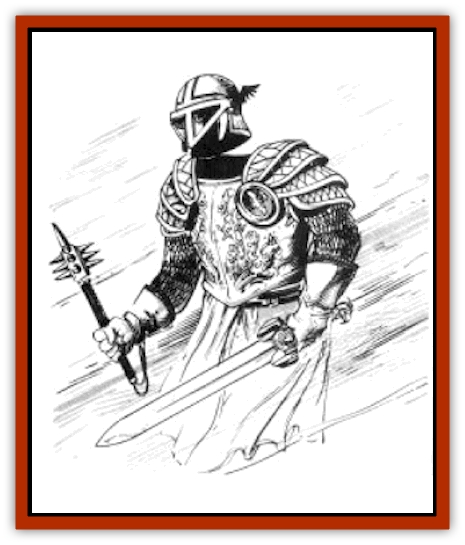

# Haunt - Knight

| Statistic | **Haunt, Knight** |
| --- | --- |
| **Activity Cycle:** | During Solinari full moon |
| **Alignment:** | Lawful good |
| **Armor Class:** | 2 or better |
| **Climate/Terrain:** | Any/Battlefield |
| **Damage/Attack:** | 1-8/1-8 |
| **Diet:** | Nil |
| **Frequency:** | Very rare |
| **Hit Dice:** | 8 |
| **Intelligence:** | Low (5-7) |
| **Magic Resistance:** | 10% |
| **Morale:** | Champion (16) |
| **Movement:** | 9 |
| **No. Appearing:** | 1-8 |
| **No. of Attacks:** | 2 |
| **Organization:** | Military |
| **Size:** | M (6' tall) |
| **Special Attacks:** | Horror |
| **Special Defenses:** | Cannot be turned by LG clerics |
| **THAC0:** | 13 |
| **Treasure:** | See below |
| **XP Value:** | 2,000 |

A knight [[Haunt|haunt]] is a floating suit of Solamnic armor, always accompanied by some sort of weapon. If the battle where the knight fell was one where more than 100 Solamnic knights died then it is always riding a suit of floating horse barding.

The armor is always mirror bright and its weapon is always in perfect condition. A faint golden haze can be seen, creating the form of the Knight who used to own the armor.

**Combat:** A knight haunt still has the inner fighting spirit of its former human form. It judges any conflict it encounters according to its Solamnic traditions and fights or withdraws exactly as a Knight would. It can sense the alignment of its enemies and always attacks evil and chaos before any other opponent. The creature never attacks Knights of Solamnia, but it defends itself and withdraws in an orderly manner when facing these opponents.

Knight haunts are immune to *sleep*, *charm*, *hold*, paralyzation, and mental control spells of any type, as well as cold-based attacks.

*Special Abilities:* A knight haunt can feel the power of magic in a 50-foot area. This enables it to find magical weapons from a battlefield and use these weapons for its own defense. This also enables it to attack the most magical enemy in a group if there is a decision as to which of two evil foes to attack.

All PCs and NPCs who encounter a knight haunt must roll a horror check upon first sighting it. The character rolls 1d20. If the roll is less than or equal to the combined total of character's Wisdom and experience level, the check succeeds and nothing happens. If the check fails, the character is horror struck and suffers a -4 penalty to all dice rolls for the duration of the battle with the knight haunt. These checks are also rolled for all characters every time the knight haunt kills a character.

The only way to end the menace is to kill the haunt and pour holy water on the armor afterward. If holy water is not used, the haunt reforms again, completely restored, at Solinari's next full moon phase.

**Habitat/Society:** A knight haunt is sometimes (5% chance) created when an especialiy lawful good Knight with a Wisdom of 17 or higher dies in battle. The haunt rises with the next full moon phase of Solinari. If its armor has been taken away, the power of the spirit can magically teleport the armor back to the site of the battlefield. If its armor has been destroyed, the power that creates the haunt can create an exact duplicate of the armor it wore.

When more than one knight haunt roams a battlefield, they) join into military groups and defend each other.

**Ecology:** The knight haunt rises with Solinari's full moon phase and roams for several miles around the battlefield. It is looking for a chance to do battle and will tight any intelligent creature it comes across.

The knight haunt does not battle defenseless beings, those with no weapons, or those trying to defend their homes. The undead spirit does not like to fight females and avoids such combat it there are others in the area to fight.

Young Knights of Solamnia often go hunting knight haunts. Although it is seldom talked about, it is considered very lucky to put a knight haunt spirit to rest and then use the haunt's armor.

---
## Discovery & Documentation

**Source Publication:** MC4 Dragonlance Appendix (w/binder #2) (1989)
**Campaign Setting:** Dragonlance
**Author(s):** Rick Swan

### Other Creatures Found in This Source Book
   * [[Anemone_Giant_Sea|Anemone, Giant Sea]]
   * [[Bear_Ice|Bear, Ice]]
   * [[Beast_Undead|Beast, Undead]]
   * [[Bird_Krynn|Bird (Krynn)]]
   * [[Disir|Disir]]
   * [[Draconian_Aurak|Draconian, Aurak]]
   * [[Draconian_Baaz|Draconian, Baaz]]
   * [[Draconian_Bozak|Draconian, Bozak]]
   * [[Draconian_Kapak|Draconian, Kapak]]
   * [[Draconian_General_Information|Draconian, General Information]]
   * [[Draconian_Sivak|Draconian, Sivak]]
   * [[Draconian_Proto-_Traag|Draconian, Proto-, Traag]]
   * [[Dragon_Amphi|Dragon, Amphi]]
   * [[Dragon_Astral|Dragon, Astral]]
   * [[Dragon_Kodragon|Dragon, Kodragon]]
   * [[Dragon_Krynn_Othlorx_General_Information|Dragon (Krynn), Othlorx, General Information]]
   * [[Dragon_Krynn_General_Information|Dragon (Krynn), General Information]]
   * [[Dragon_Sea|Dragon, Sea]]
   * [[Dreamshadow|Dreamshadow]]
   * [[Dreamwraith|Dreamwraith]]
   * [[Dwarf_Daergar|Dwarf, Daergar]]
   * [[Dwarf_Hill_Neidar|Dwarf, Hill, Neidar]]
   * [[Dwarf_Mountain_Hylar|Dwarf, Mountain, Hylar]]
   * [[Dwarf_Theiwar|Dwarf, Theiwar]]
   * [[Dwarf_Zakhar|Dwarf, Zakhar]]
   * [[Elf_Half-|Elf, Half-]]
   * [[Elf_High_Qualinesti|Elf, High, Qualinesti]]
   * [[Elf_High_Silvanesti|Elf, High, Silvanesti]]
   * [[Elf_Sea_Dargonesti|Elf, Sea, Dargonesti]]
   * [[Elf_Sea_Dimernesti|Elf, Sea, Dimernesti]]
   * [[Elf_Wild_Kagonesti|Elf, Wild, Kagonesti]]
   * [[Eyewing|Eyewing]]
   * [[Fetch|Fetch]]
   * [[Fire_Minion|Fire Minion]]
   * [[Fireshadow|Fireshadow]]
   * [[Gnome_Tinker|Gnome, Tinker]]
   * [[Gurik_Cha'ahl|Gurik Cha'ahl]]
   * [[Horax|Horax]]
   * [[Human_Krynn|Human (Krynn)]]
   * [[Imp_Blood_Sea|Imp, Blood Sea]]
   * [[Kalothagh|Kalothagh]]
   * [[Kani_Doll|Kani Doll]]
   * [[Kender|Kender]]
   * [[Kyrie|Kyrie]]
   * [[Lizard_Man_Krynn|Lizard Man (Krynn)]]
   * [[Minotaur_Krynn|Minotaur, Krynn]]
   * [[Ogre_High|Ogre, High]]
   * [[Ogre_Krynn|Ogre (Krynn)]]
   * [[Phaethon|Phaethon]]
   * [[Saqualaminoi|Saqualaminoi]]
   * [[Shadowperson|Shadowperson]]
   * [[Shimmerweed|Shimmerweed]]
   * [[Skrit|Skrit]]
   * [[Spectral_Minion|Spectral Minion]]
   * [[Spider_Krynn|Spider (Krynn)]]
   * [[Stag|Stag]]
   * [[Tayling|Tayling]]
   * [[Thanoi|Thanoi]]
   * [[Tylor|Tylor]]
   * [[Wichtlin|Wichtlin]]
   * [[Wyndlass|Wyndlass]]
   * [[Yaggol|Yaggol]]
