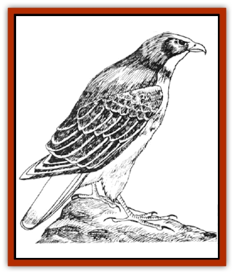

# Hawk

| Statistic | **Blood Hawk** | **Large** | **Small (Falcon)** |
| --- | --- | --- | --- |
| **Activity Cycle:** | Day | Day | Day |
| **Alignment:** | Neutral | Nil | Nil |
| **Armor Class:** | 7 | 6 | 5 |
| **Climate/Terrain:** | Subarctic to tropical/Any land | Subarctic to tropical/Any land | Subarctic to tropical/Any land |
| **Damage/Attack:** | 1-4/1-4/1-6 | 1-2/1-2/1 | 1/1/1 |
| **Diet:** | Carnivore | Carnivore | Carnivore |
| **Frequency:** | Very rare | Uncommon | Rare |
| **Hit Dice:** | 1+1 | 1 | 1-1 |
| **Intelligence:** | Semi- (2-4) | Animal (1) | Animal (1) |
| **Magic Resistance:** | Nil | Nil | Nil |
| **Morale:** | Steady (11) | Average (9) | Unsteady (6) |
| **Movement:** | Fl 24 (B) | Fl 33 (B) | Fl 36 (B) |
| **No. Appearing:** | 4-15 | 1-2 | 1-2 |
| **No. of Attacks:** | 3 | 3 | 3 |
| **Organization:** | Flock | Pair | Pair |
| **Size:** | S (3-4') | S (3-4') | S (2-3') |
| **Special Attacks:** | See below | See below | See below |
| **Special Defenses:** | Nil | Nil | Nil |
| **THAC0:** | 18 | 19 | 20 |
| **Treasure:** | (Q&times;2) | See below | See below |
| **XP Value:** | 120 | 65 | 65 |

Hawks are common throughout the world, from tropic to subarctic regions. They live mainly on vermin and rodents and thus are thought well of in many areas.

Hawks are smaller than [[Eagle|eagles]]. Their wingspan measures up to five feet from wing tip to wing tip. Coloration varies from species to species with red-brown to dark brown being most common.

Large hawks have been known to attack small demihumans, through such occurrences are extremely rare.

**Combat:** Hawks attack via plummeting dives, usually from a height of 100 feet or more. This dive gives them a +2 bonus to their attack roll and their momentum enables their talons to inflict twice the normal damage. Hawks cannot attack with their beaks on the round they engage in a dive attack.

After the initial dive, hawks fight by biting and pecking with their beaks and tearing at their opponents with their talons. Hawks always target wheezes and they have a 25% probability of striking an opponent's eye whenever their beaks hit. Opponents struck in the eye are blinded for 1d10 rounds and have a 10% chance of losing vision permanently in that eye. Because of their superior eyesight, hawks can never be surprised.

**Habitat/Society:** Hawks make their nests in tall trees or hidden among rocky slopes. There the female lays one to three eggs in early spring. The eggs hatch by summer's end and thereafter both the male and female work feeding the fledglings, beefing them up before winter arrives.

During the fledglings' first nine months, one of the adult hawks is usually (80%) within sight of their nest. Any intruder threatening the nest is attacked if seen, regardless of size.

**Ecology:** If taken while young and trained by an expert, hawks can be taught to hunt. Because of this many animal trainers pay well for healthy fledglings. The price for a fledgling is about 500 gold pieces on the open market. Trained hawks sell for as much as 1.200 gold pieces each.

**Falcon**

  Falcons are smaller, swifter, and more maneuverable than hawks. These birds of prey are more easily trained and are often preferred by hunters over hawks. Their nesting habits are similar to those of hawks, though many species roost underground. Trained falcons sell for around 1,000 gp each.

**Blood Hawk**

  Blood hawks resemble normal hawks in size alone, as their beaks are razor sharp and their talons unusually strong. Their feathersare a mottled grey. Large and powerfully built wings provide these killers with great speed and maneuverability when flying. These birds of prey hunt in small flocks and are fond of human flesh. They will continue to attack humans even if a melee is going against them and will break off very reluctantly.

Male blood hawks kill humans not only for food but also for gems, with which they line their nests assn allurement to females. All other types of treasure are ignored by blood hawks.

---
## Discovery & Documentation

**Source Publication:** MC2 Volume II (1993)
**Campaign Setting:** Advanced Dungeons & Dragons 2nd Edition
**Author(s):** Jay Batista, Scott Bennie, Grant Boucher, William W. Connors, Steve Gilbert, Heike Kubasch, James Lowder, David Edward Martin, Bruce Nesmith, Jean Rabe, Rick Swan, John J. Terra, Gary L. Thomas

### Other Creatures Found in This Source Book
   * [[Ant|Ant]]
   * [[Ant_Lion_Giant|Ant Lion, Giant]]
   * [[Ape_Carnivorous|Ape, Carnivorous]]
   * [[Baboon|Baboon]]
   * [[Badger|Badger]]
   * [[Barracuda|Barracuda]]
   * [[Beetle_Giant|Beetle, Giant]]
   * [[Bulette|Bulette]]
   * [[Bullywug|Bullywug]]
   * [[Dwarf_Duergar|Dwarf, Duergar]]
   * [[Dwarf_Gully|Dwarf, Gully]]
   * [[Eagle|Eagle]]
   * [[Eel|Eel]]
   * [[Elemental_Air_Kin|Elemental, Air Kin]]
   * [[Elemental_Water_Kin|Elemental, Water Kin]]
   * [[Elemental_Water_Kin_Water_Weird|Elemental, Water Kin, Water Weird]]
   * [[Firestar|Firestar]]
   * [[Firetail|Firetail]]
   * [[Fish_Giant|Fish, Giant]]
   * [[Frog|Frog]]
   * [[Gorgon|Gorgon]]
   * [[Heucuva|Heucuva]]
   * [[Hippocampus|Hippocampus]]
   * [[Hippogriff|Hippogriff]]
   * [[Kelpie|Kelpie]]
   * [[Kenku|Kenku]]
   * [[Killmoulis|Killmoulis]]
   * [[Kuo-Toa|Kuo-Toa]]
   * [[Lamia|Lamia]]
   * [[Lammasu|Lammasu]]
   * [[Lamprey|Lamprey]]
   * [[Leech|Leech]]
   * [[Leprechaun|Leprechaun]]
   * [[Leucrotta|Leucrotta]]
   * [[Locathah|Locathah]]
   * [[Lycanthrope_Wereboar|Lycanthrope, Wereboar]]
   * [[Lycanthrope_Werefox|Lycanthrope, Werefox]]
   * [[Mammal_Minimal|Mammal, Minimal]]
   * [[Mammal_Small|Mammal, Small]]
   * [[Mimic|Mimic]]
   * [[Morkoth|Morkoth]]
   * [[Muckdweller|Muckdweller]]
   * [[Myconid|Myconid]]
   * [[Naga|Naga]]
   * [[Obliviax|Obliviax]]
   * [[Octopus_Giant|Octopus, Giant]]
   * [[Otyugh|Otyugh]]
   * [[Piranha|Piranha]]
   * [[Plant_Dangerous_I|Plant, Dangerous I]]
   * [[Plant_Intelligent|Plant, Intelligent]]
   * [[Poltergeist|Poltergeist]]
   * [[Porcupine|Porcupine]]
   * [[Rat_Osquip|Rat, Osquip]]
   * [[Roc|Roc]]
   * [[Roper|Roper]]
   * [[Rot_Grub|Rot Grub]]
   * [[Rust_Monster|Rust Monster]]
   * [[Sahuagin|Sahuagin]]
   * [[Sea_Lion|Sea Lion]]
   * [[Sea_Horse_Giant|Sea Horse, Giant]]
   * [[Shambling_Mound|Shambling Mound]]
   * [[Shark|Shark]]
   * [[Sphinx|Sphinx]]
   * [[Squid_Giant|Squid, Giant]]
   * [[Stirge|Stirge]]
   * [[Swanmay|Swanmay]]
   * [[Tarrasque|Tarrasque]]
   * [[Tasloi|Tasloi]]
   * [[Triton|Triton]]
   * [[Troglodyte|Troglodyte]]
   * [[Urchin|Urchin]]
   * [[Urd|Urd]]
   * [[Weasel|Weasel]]
   * [[Wolverine|Wolverine]]
   * [[Yellow_Musk_Creeper|Yellow Musk Creeper]]
