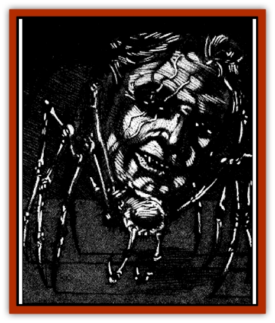

# Head Hunter

| Statistic | **Head Hunter** |
| --- | --- |
| **Activity Cycle:** | Any |
| **Alignment:** | Neutral evil |
| **Armor Class:** | 3 |
| **Climate/Terrain:** | Ravenloft |
| **Damage/Attack:** | 2-8 (2d4) |
| **Diet:** | Carnivore |
| **Frequency:** | Rare |
| **Hit Dice:** | 5+5 |
| **Intelligence:** | Average (8-10) |
| **Magic Resistance:** | 20% |
| **Morale:** | Very steady (13-14) |
| **Movement:** | 6, Wb 12 |
| **No. Appearing:** | 1-3 |
| **No. of Attacks:** | 1 |
| **Organization:** | Solitary |
| **Size:** | T (1' diameter) |
| **Special Attacks:** | Poison |
| **Special Defenses:** | Nil |
| **THAC0:** | 15 |
| **Treasure:** | Nil |
| **XP Value:** | 1,400 |

A head hunter is a horrid, [[Spider|spider]]like creature believed to have been created by the mysterious [[Elf_Drow|drow]] or some related, but even more sinister, race.

Head hunters look like long-legged spiders with human heads in place of bodies. First seen in the dread realm of Arak, they have recently been spotted in Arkandale, Borca, Darkon, and Dementlieu.

These frightful creatures can understand and speak drow, elvish, and several human tongues. It is almost certain that they have a language of their own, but if this is true it has never been heard by man.

**Combat:** Most encounters with a head hunter begin not with a sighting of the beast itself, but when some hapless soul wanders into its giant web. Spun in the same manner that a true spider would employ, the head hunter's web is fashioned from tremendously strong, sharp filaments. Those walking or running into the nearly invisible web have a 75% chance of lopping off one of their limbs. If such a loss is indicated, the DM should roll 1d10 to determine the exact nature of the injury. On a roll of 1-9, the victim has lost an arm or leg (determined randomly). Such a loss also inflict damages equal to one-quarter the character's base hit points, potentially killing a wounded character. If the roll was a 10, the character has been beheaded and is instantly killed. As one might expect, the head hunter can move freely in its web without any chance of injury.

Once the head hunter's web has done its work, the creature may resort to melee combat if the odds appear to be in its favor. They begin such combat by spitting type-N poison (contact, 1 minute. death/25) at one target up to 15 feet away. A head hunter can spit in this fashion three times per day.

If forced into direct physical combat, head hunters attack by biting for 2d4 points of damage. Those bitten by the head hunter are injected with its poison whenever the creature rolls doubles on its damage dice.

Head hunters are immune to all poisons and can easily walk on the webs of all other spiders. They are particularly susceptible to fire, taking one extra point per die of damage. They have poor eyesight past about 20' but are especially sensitive to vibrations, which allow them to track moving or speaking targets.

**Habitat/Society:** Head hunters hate all humans and demihumans, but particularly despise [[Elf|elves]]. Whenever possible, they will use their stolen bodies (see Ecology) to bring misery and suffering to the ranks of the fair folk.

**Ecology:** The most terrible aspect of the head hunter is not its combat ability, however. Once battle is done, the creature will gather up any corpses beheaded by encounters with its web and begin to transform them into vessels that can serve its dark schemes. Climbing atop the neck of the still-warm body, the head hunter slips its slender legs deep into the corpse and takes control of the body. Like the master of some organic machine, the head hunter can now cause the body to move about as if it were still alive. An animated corpse fights and makes saving throws as a 0 level human.

Over the course of the next week to ten days, the head hunter will feed upon the internal organs of the body. At the end of that time, it will abandon its host, leaving behind an empty shell not unlike the discarded skin of a growing [[Snake|snake]]. During that time, however, the head hunter will attempt to infiltrate human society and sow discord by passing itself off as a normal human.

In cases where more than one beheaded corpse is available to the creature, the head hunter will envelop those it does not intend to use in a cocoon of webbing. This quickly hardens, perfectly preserving the body within for up to 12 months. At any time during this period. the head hunter can recover and animate the corpse.

It is not uncommon for a head hunter to set up its lair within a human or demihuman city. As a rule, such places will have at least one secret chamber that houses several preserved bodies that will act as future vessels for the creature.

---
## Discovery & Documentation

**Source Publication:** Ravenloft Appendix III (1991)
**Campaign Setting:** Ravenloft
**Author(s):** Kirk Botulla

### Other Creatures Found in This Source Book
   * [[Akikage|Akikage]]
   * [[Animator_Common|Animator, Common]]
   * [[Animator_Greater|Animator, Greater]]
   * [[Animator_Minor|Animator, Minor]]
   * [[Animator_General_Information|Animator, General Information]]
   * [[Bakhna_Rakhna|Bakhna Rakhna]]
   * [[Baobhan_Sith|Baobhan Sith]]
   * [[Beetle_Scarab|Beetle, Scarab]]
   * [[Boneless|Boneless]]
   * [[Boowray|Boowray]]
   * [[Bruja|Bruja]]
   * [[Carrionette|Carrionette]]
   * [[Carrion_Stalker|Carrion Stalker]]
   * [[Cat_Midnight|Cat, Midnight]]
   * [[Cat_Skeletal|Cat, Skeletal]]
   * [[Cloaker_Resplendent|Cloaker, Resplendent]]
   * [[Cloaker_Shadow|Cloaker, Shadow]]
   * [[Cloaker_Undead|Cloaker, Undead]]
   * [[Corpse_Candle|Corpse Candle]]
   * [[Death's_Head_Tree|Death's Head Tree]]
   * [[Doppelganger_Ravenloft|Doppelganger (Ravenloft)]]
   * [[Familiar_Pseudo-|Familiar, Pseudo-]]
   * [[Familiar_Undead|Familiar, Undead]]
   * [[Feathered_Serpent|Feathered Serpent]]
   * [[Fenhound|Fenhound]]
   * [[Figurine_Ceramic|Figurine, Ceramic]]
   * [[Figurine_Crystal|Figurine, Crystal]]
   * [[Figurine_Ivory|Figurine, Ivory]]
   * [[Figurine_Obsidian|Figurine, Obsidian]]
   * [[Figurine_Porcelain|Figurine, Porcelain]]
   * [[Figurine_General_Information|Figurine, General Information]]
   * [[Fleas_of_Madness|Fleas of Madness]]
   * [[Furies|Furies]]
   * [[Geist|Geist]]
   * [[Ghost_Animal|Ghost, Animal]]
   * [[Golem_Flesh_Ravenloft|Golem, Flesh (Ravenloft)]]
   * [[Golem_Mist_Ravenloft|Golem, Mist (Ravenloft)]]
   * [[Golem_Wax_Ravenloft|Golem, Wax (Ravenloft)]]
   * [[Gremishka|Gremishka]]
   * [[Hag_Spectral|Hag, Spectral]]
   * [[Hearth_Fiend|Hearth Fiend]]
   * [[Hebi-No-Onna|Hebi-No-Onna]]
   * [[Hound_Phantom|Hound, Phantom]]
   * [[Hound_Skeletal|Hound, Skeletal]]
   * [[Imp_Wishing|Imp, Wishing]]
   * [[Ivy_Crawling|Ivy, Crawling]]
   * [[Jack_Frost|Jack Frost]]
   * [[Jolly_Roger|Jolly Roger]]
   * [[Kizoku|Kizoku]]
   * [[Lashweed|Lashweed]]
   * [[Leech_Magical|Leech, Magical]]
   * [[Leech_Psionic|Leech, Psionic]]
   * [[Lich_Defiler|Lich, Defiler]]
   * [[Lich_Drow|Lich, Drow]]
   * [[Lich_Elemental|Lich, Elemental]]
   * [[Lich_Psionic|Lich, Psionic]]
   * [[Living_Tattoo|Living Tattoo]]
   * [[Lycanthrope_Loup-garou|Lycanthrope, Loup-garou]]
   * [[Lycanthrope_Werejackal|Lycanthrope, Werejackal]]
   * [[Lycanthrope_Werejaguar_Ravenloft|Lycanthrope, Werejaguar (Ravenloft)]]
   * [[Lycanthrope_Wereleopard|Lycanthrope, Wereleopard]]
   * [[Lycanthrope_Wereray|Lycanthrope, Wereray]]
   * [[Mist_Ferryman|Mist Ferryman]]
   * [[Moor_Man|Moor Man]]
   * [[Obedient|Obedient]]
   * [[Odem|Odem]]
   * [[Paka|Paka]]
   * [[Plant_Blood_Rose|Plant, Blood Rose]]
   * [[Plant_Fearweed|Plant, Fearweed]]
   * [[Radiant_Spirit|Radiant Spirit]]
   * [[Recluse|Recluse]]
   * [[Remnant_Aquatic|Remnant, Aquatic]]
   * [[Rushlight|Rushlight]]
   * [[Sea_Spawn_Master|Sea Spawn, Master]]
   * [[Sea_Spawn_Minion|Sea Spawn, Minion]]
   * [[Shadow_Asp|Shadow Asp]]
   * [[Shattered_Brethren|Shattered Brethren]]
   * [[Skeleton_Archer|Skeleton, Archer]]
   * [[Skeleton_Insectoid|Skeleton, Insectoid]]
   * [[Skin_Thief|Skin Thief]]
   * [[Spirit_Psionic|Spirit, Psionic]]
   * [[Strahd_Skeleton|Strahd Skeleton]]
   * [[Strahd_Zombie|Strahd Zombie]]
   * [[Unicorn_Shadow|Unicorn, Shadow]]
   * [[Vampire_Drow|Vampire, Drow]]
   * [[Vampire_Nosferatu|Vampire, Nosferatu]]
   * [[Vampire_Oriental|Vampire, Oriental]]
   * [[Virus_General_Information|Virus, General Information]]
   * [[Virus_I|Virus I]]
   * [[Virus_II|Virus II]]
   * [[Virus_III|Virus III]]
   * [[Vorlog|Vorlog]]
   * [[Will_O'Dawn|Will O'Dawn]]
   * [[Will_O'Deep|Will O'Deep]]
   * [[Will_O'Mist|Will O'Mist]]
   * [[Will_O'Sea|Will O'Sea]]
   * [[Zombie_Cannibal|Zombie, Cannibal]]
   * [[Zombie_Desert|Zombie, Desert]]
   * [[Zombie_Wolf|Zombie Wolf]]
   * [[Zombie_Fog|Zombie Fog]]
