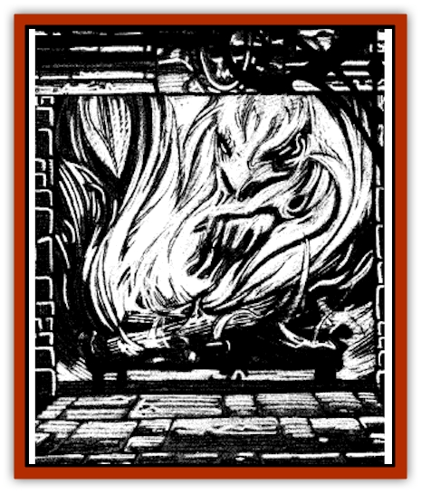

# Hearth Fiend

| Statistic | **Hearth Fiend** |
| --- | --- |
| **Activity Cycle:** | Any |
| **Alignment:** | Chaotic evil |
| **Armor Class:** | 0 |
| **Climate/Terrain:** | Open fires (Ravenloft only) |
| **Damage/Attack:** | Varies |
| **Diet:** | Special |
| **Frequency:** | Very rare |
| **Hit Dice:** | Varies |
| **Intelligence:** | Low (5-7) |
| **Magic Resistance:** | Nil |
| **Morale:** | Elite (13-14) |
| **Movement:** | See below |
| **No. Appearing:** | 1 |
| **No. of Attacks:** | 1 |
| **Organization:** | Solitary |
| **Size:** | Varies |
| **Special Attacks:** | Firebolt &amp; charm |
| **Special Defenses:** | Hit only by magical weapons |
| **THAC0:** | Varies |
| **Treasure:** | Nil |
| **XP Value:** | Varies |

Since the dawn of time, humankind has looked upon fire as a mixed blessing. It drives away the night and holds back the cold. Wild animals will not approach it, and much of civilization depends upon it. Still, there are times when the flames that have nurtured mankind from the Stone Age into an era of steel and magic turn upon him. Fires escape the confines of lanterns, and houses are burned to the ground. Someone reaching into a warm hearth stumbles and scorches his hand on the dancing flames within it. Oftcn, this is just chance. Sometimes, however, a more sinister force is at work.

The hearth fiend is an evil creature from the elemental plane of fire. Similar in many ways to the [[Elemental_Water_Kin_Water_Weird|water weird]], it is brought into Ravenloft as an accidental side effect of certain magical spells. As soon as they arrive in the Demiplane of Dread, hearth fiends begin to do evil. Hearth fiends have been encountered on other planes of existence, usually unwittingly carried by adventurers escaping from Ravenloft.

A hearth fiend is found only in a source of open fire: the guttering flame of a candle, the stout radiance of a torch, the warming blaze of a campfire, and so on. Here, it is visible occasionally (5% chance if closely examined) as a malevolent face that flickers menacingly in the fire. If the creature wishes to, it can make its features obvious to all who look upon it, otherwise it can be seen only with a *detect magic*, *detect invisibility*, or similar spell.

Hearth fiends communicate with others of their kind through the flickering of their flames and the pops and crackles they emit. When they wish to, which is seldom, they can speak to those near them in the common tongue of men. In such cases, their voices are sharp and crackling with hissing, whispery overtones. There is a 75% chance that those who hear the voice of the hearth fiend will not recognize it as speech unless they are aware of the creature's presence.

**Combat:** Hearth fiends attack by releasing powerful bolts of flame from their bodies. One bolt can be fired per combat round, and the amount of damage it inflicts is based upon the size of the fire that hosts the creature (see Ecology). These firebolts have a range of 5 feet per Hit Die of the creature. A normal attack roll is made by the fiery monster when it employs this assault. Anyone struck by the flames must make a saving throw vs. breath weapon. Success indicates that only half damage is taken from the attack. Failure indicates that the creature takes full damage and that some or all possessions must make saving throws vs. magical fire of be destroyed. Items stored within other items need not save unless the item holding them is destroyed.

Those wishing to harm the hearth fiend by direct assault must employ magical weapons. Any nonmagical item employed against the creature inflicts no damage and must save vs. magical fire or be destroyed.

Magical attacks based on lightning, electricity, heat, or flames inflict no damage upon the creature. Spells that rely upon cold or ice to inflict injury cause half damage to the hearth fiend. Those spells that create water in large quantities can be used to smother the hearth fiend, inflicting 1d4 points of damage per gallon of magically created water thrown upon the creature. Nonmagical water, including holy water, has no effect on the hearth fiend and may actually be burned and consumed by the creature just like any other material object that it comes into contact with.

Spells like *resist fire* and *flame walk* can be used to protect oneself from the ravages of a hearth fiend, although the creature is assumed to be composed magical fire. Spells that drive creatures back to their native planes or limit their actions (*dismiss fire elemental* or *protection from evil*, for example) affect the hearth fiend normally.

Those who hear the whisperings of the fire and recognize that it is speaking to them can be *charmed* by the creature, and it is in this way that the creature begins to spread its evil. Those who are aware that the fire is magical or know of its true nature are immune to the enchanting effects of the whispers. Thus, as soon as adventurers learn that a given flame is actually controlled by a hearth fiend, they become immune to its *charm* ability. The hearth fiend can *charm* only one individual at a time, so this power is limited.

**Habitat/Society:** Hearth fiends are solitary creatures that delight in causing mischief and evil. Once the monster takes up residence in a given fire, that flame cannot be extinguished by normal means. It continues to burn so long as there is fuel available. Because the magical fires of this creature can consume stone and water as easily as wood or coal, it almost always has something to consume. Hearth fiends have a taste for living flesh as a fuel source, however, and enjoy nothing the consumption more than of thrashing, screaming victims caught in their fiery embrace.

Thrice per day, the hearth fiend can release 2-12 (2d6) ember eyes. These appear as innocent embers, still smoldering from the heat of the fire, that drift out into the air. The eyes remain hot and glowing for 1d6 rounds, during which time they drift about at the speed of a walking man. The hearth fiend is able to see and hear all that comes to pass near the eyes, so it uses them to gather information about its surroundings. Ember eyes can be smothered by anything that would quench normal fire (a cup of water, etc.) or anything that robs them of their enchantment (like a *dispel magic* spell).

In addition to their use as sensory organs, the ember eyes can ignite anything they are directed to land upon. The object in question must make a saving throw vs. normal fires or begin to burn. If they land on a person, that individual must make a saving throw vs. breath weapon or suffer one point of damage.

Once the embers have ignited a fire, the hearth fiend can instantly transfer itself to these new flames. This takes but one round, during which time attacks on either the new or old location can affect the creature. As a rule, a hearth fiend will be reluctant to jump from a larger fire to a smaller one, for this diminishes its power. This is, however, the only way that a hearth fiend can move about on the Prime Material plane, so it is often forced to leap into smaller fires to escape destruction at the hands of adventurers.

As soon as a hearth fiend enters a new flame, it is fully healed of damage it might have suffered, and its his points are rerolled based on its new size. Further, the old fire is no longer considered to be magical and can be extinguished normally, while the new fire now becomes enchanted.

Typically, the hearth fiend will wait for several days after entering a new fire before taking any actions that might reveal its presence o those around it. When it begins its evil doings, it typically does so by whispering to those who are not likely to guess at its origins: a young child, a bar maid, or a dim-witted bully.

It begins to promise things to this person in exchange for his help in spreading its evil. At first, the promises are innocent and even helpful ("I will keep your inn warm and brightly lit&hellip;") and the demands minimal ("&hellip; if only you will bring me some tasty yew to feed upon.")

As time goes on, and the creature begins to acquire the trust and friendship of the fire's tender, the promises become more insidious and the demands greater. It might promise never to burn the evening meal, or even the family children, in exchange for a small animal being tossed into it once per month. Further, because the fire can see many things with its ember eyes that the tender cannot, it will begin to offer disturbing news. The intent of its efforts is to goad the person it speaks to into helping the hearth fire do more evil deeds.

For example, it might reveal to a housewife whose fireplace it inhabits that her husband has been having an affair with the serving girl. Of course, the fire will be only too happy to burn the girl's face, scaring her for life, the next time she comes near it. Because of the cruel nature of the fire, there may not have been any actual romance between the master of the house and his servant, but the wife may never learn that.

Eventually, the hearth fiend will demand great sacrifices from its host: perhaps intelligent beings lured near to it so that it can lash out at them with its firebolts or the transportation of its ember eyes to places where they will ignite and allow the creature potential refuge. Often, it will cloak these requests in terms that will make them pleasing to the person it has charmed.

For example, it might ask to have one of its embers transported to the hearth of a neighbor who has offended its tender. Once there, it vows to destroy the house, driving the inhabitants out and forcing them to seek a new home elsewhere. In actuality, of course, the creature will see to it that the neighbors are unable to escape the flames that engulf their home so that it may delight in the taste of their seared flesh.

**Ecology:** Whenever a wizard or priest employs a fire-based spell in Ravenloft, there is a 1% chance per level of the spell that it will cause a hearth fiend to appear. The creature will instantly be drawn into the nearest source of nonmagical fire, which it will enter. The power of the creature is based wholly upon the size of the fire that it inhabits, as indicated on the following chart:

| Fire | HD | THAC0 | Firebolt | XP |
| --- | --- | --- | --- | --- |
| Candle or lamp | 1 | 19 | 1d4 | 120 |
| Torch or cooking fire | 3 | 17 | 2d4 | 270 |
| Campfire or fireplace | 5 | 15 | 3d4 | 650 |
| Large hearth | 7 | 13 | 4d4 | 1,400 |
| Bonfire | 9 | 11 | 5d4 | 3,000 |
| Burning house | 11 | 9 | 6d4 | 5,000 |
| Burning mansion | 13 | 7 | 7d4 | 7,000 |
| Burning fort | 15 | 5 | 8d4 | 9,000 |
| Forest fire | 17 | 3 | 9d4 | 11,000 |

On their native plane, hearth fiends are lesser creatures. They drift about, always at the mercy of even the most minor inhabitants of the elemental plane of fire. The only thing that makes them unique and potent in any way is their ability to sense the use of magic that draws upon the elemental fire of their home dimension. Whenever a hearth fiend senses such a spell, it will latch on to the enchantment and leave behind the elemental plane of fire.

Once on the Prime Material plane, a hearth fiend is more powerful. Its fiery nature makes it dangerous and its intelligence makes it cunning enough to survive. Thus, hearth fiends are greatly reluctant to return to their plane of origin. If confronted with the possibility of banishment from the Prime Material plane, they will be more than willing to bargain and haggle for a chance to remain. Of course, they will lie and deceive those they must deal with in any way possible, planning all the while to destroy them at the earliest opportunity.

Just as the hearth fiend is drawn into the Prime Material plane by magic, so, too, can it be used to foster magic. It is known that Azalin of Darkon once harnessed the power of several of these creatures in a forge that is said to have burned hotter than any known before. Of course, in order to fuel the forge he was forced to cast living people, usually criminals from his dungeons and foolhardy adventurers, into it. However, this effort was rewarded with a device that proved unusually suited to the creation of magical items. There are those who say that each and every one of his dreaded Kargat [[Vampire_General_Information|vampires]] is armed with a weapon forged in the flames of this evil device. The means by which Azalin built this forge and contained the elemental creatures are unknown, but it is certain that the darkest of dark magics was involved.

---
## Discovery & Documentation

**Source Publication:** Ravenloft Appendix III (1991)
**Campaign Setting:** Ravenloft
**Author(s):** Kirk Botulla

### Other Creatures Found in This Source Book
   * [[Akikage|Akikage]]
   * [[Animator_Common|Animator, Common]]
   * [[Animator_Greater|Animator, Greater]]
   * [[Animator_Minor|Animator, Minor]]
   * [[Animator_General_Information|Animator, General Information]]
   * [[Bakhna_Rakhna|Bakhna Rakhna]]
   * [[Baobhan_Sith|Baobhan Sith]]
   * [[Beetle_Scarab|Beetle, Scarab]]
   * [[Boneless|Boneless]]
   * [[Boowray|Boowray]]
   * [[Bruja|Bruja]]
   * [[Carrionette|Carrionette]]
   * [[Carrion_Stalker|Carrion Stalker]]
   * [[Cat_Midnight|Cat, Midnight]]
   * [[Cat_Skeletal|Cat, Skeletal]]
   * [[Cloaker_Resplendent|Cloaker, Resplendent]]
   * [[Cloaker_Shadow|Cloaker, Shadow]]
   * [[Cloaker_Undead|Cloaker, Undead]]
   * [[Corpse_Candle|Corpse Candle]]
   * [[Death's_Head_Tree|Death's Head Tree]]
   * [[Doppelganger_Ravenloft|Doppelganger (Ravenloft)]]
   * [[Familiar_Pseudo-|Familiar, Pseudo-]]
   * [[Familiar_Undead|Familiar, Undead]]
   * [[Feathered_Serpent|Feathered Serpent]]
   * [[Fenhound|Fenhound]]
   * [[Figurine_Ceramic|Figurine, Ceramic]]
   * [[Figurine_Crystal|Figurine, Crystal]]
   * [[Figurine_Ivory|Figurine, Ivory]]
   * [[Figurine_Obsidian|Figurine, Obsidian]]
   * [[Figurine_Porcelain|Figurine, Porcelain]]
   * [[Figurine_General_Information|Figurine, General Information]]
   * [[Fleas_of_Madness|Fleas of Madness]]
   * [[Furies|Furies]]
   * [[Geist|Geist]]
   * [[Ghost_Animal|Ghost, Animal]]
   * [[Golem_Flesh_Ravenloft|Golem, Flesh (Ravenloft)]]
   * [[Golem_Mist_Ravenloft|Golem, Mist (Ravenloft)]]
   * [[Golem_Wax_Ravenloft|Golem, Wax (Ravenloft)]]
   * [[Gremishka|Gremishka]]
   * [[Hag_Spectral|Hag, Spectral]]
   * [[Head_Hunter|Head Hunter]]
   * [[Hebi-No-Onna|Hebi-No-Onna]]
   * [[Hound_Phantom|Hound, Phantom]]
   * [[Hound_Skeletal|Hound, Skeletal]]
   * [[Imp_Wishing|Imp, Wishing]]
   * [[Ivy_Crawling|Ivy, Crawling]]
   * [[Jack_Frost|Jack Frost]]
   * [[Jolly_Roger|Jolly Roger]]
   * [[Kizoku|Kizoku]]
   * [[Lashweed|Lashweed]]
   * [[Leech_Magical|Leech, Magical]]
   * [[Leech_Psionic|Leech, Psionic]]
   * [[Lich_Defiler|Lich, Defiler]]
   * [[Lich_Drow|Lich, Drow]]
   * [[Lich_Elemental|Lich, Elemental]]
   * [[Lich_Psionic|Lich, Psionic]]
   * [[Living_Tattoo|Living Tattoo]]
   * [[Lycanthrope_Loup-garou|Lycanthrope, Loup-garou]]
   * [[Lycanthrope_Werejackal|Lycanthrope, Werejackal]]
   * [[Lycanthrope_Werejaguar_Ravenloft|Lycanthrope, Werejaguar (Ravenloft)]]
   * [[Lycanthrope_Wereleopard|Lycanthrope, Wereleopard]]
   * [[Lycanthrope_Wereray|Lycanthrope, Wereray]]
   * [[Mist_Ferryman|Mist Ferryman]]
   * [[Moor_Man|Moor Man]]
   * [[Obedient|Obedient]]
   * [[Odem|Odem]]
   * [[Paka|Paka]]
   * [[Plant_Blood_Rose|Plant, Blood Rose]]
   * [[Plant_Fearweed|Plant, Fearweed]]
   * [[Radiant_Spirit|Radiant Spirit]]
   * [[Recluse|Recluse]]
   * [[Remnant_Aquatic|Remnant, Aquatic]]
   * [[Rushlight|Rushlight]]
   * [[Sea_Spawn_Master|Sea Spawn, Master]]
   * [[Sea_Spawn_Minion|Sea Spawn, Minion]]
   * [[Shadow_Asp|Shadow Asp]]
   * [[Shattered_Brethren|Shattered Brethren]]
   * [[Skeleton_Archer|Skeleton, Archer]]
   * [[Skeleton_Insectoid|Skeleton, Insectoid]]
   * [[Skin_Thief|Skin Thief]]
   * [[Spirit_Psionic|Spirit, Psionic]]
   * [[Strahd_Skeleton|Strahd Skeleton]]
   * [[Strahd_Zombie|Strahd Zombie]]
   * [[Unicorn_Shadow|Unicorn, Shadow]]
   * [[Vampire_Drow|Vampire, Drow]]
   * [[Vampire_Nosferatu|Vampire, Nosferatu]]
   * [[Vampire_Oriental|Vampire, Oriental]]
   * [[Virus_General_Information|Virus, General Information]]
   * [[Virus_I|Virus I]]
   * [[Virus_II|Virus II]]
   * [[Virus_III|Virus III]]
   * [[Vorlog|Vorlog]]
   * [[Will_O'Dawn|Will O'Dawn]]
   * [[Will_O'Deep|Will O'Deep]]
   * [[Will_O'Mist|Will O'Mist]]
   * [[Will_O'Sea|Will O'Sea]]
   * [[Zombie_Cannibal|Zombie, Cannibal]]
   * [[Zombie_Desert|Zombie, Desert]]
   * [[Zombie_Wolf|Zombie Wolf]]
   * [[Zombie_Fog|Zombie Fog]]
