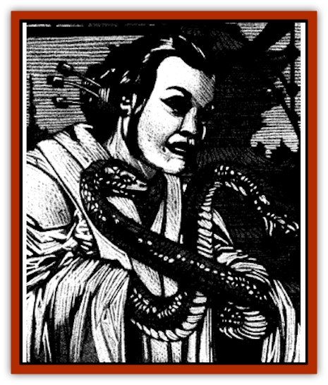

# Hebi-No-Onna

| Statistic | **Hebi-No-Onna** |
| --- | --- |
| **Activity Cycle:** | Any |
| **Alignment:** | Lawful evil |
| **Armor Class:** | 0 |
| **Climate/Terrain:** | Rokushima T�iyoo and Sri Raji |
| **Damage/Attack:** | 1-6/1-6/1 point |
| **Diet:** | Omnivore |
| **Frequency:** | Very rare |
| **Hit Dice:** | 14 |
| **Intelligence:** | Genius (17-18) |
| **Magic Resistance:** | Nil |
| **Morale:** | Fanatic (17-18) |
| **Movement:** | 12, Sw 12 |
| **No. Appearing:** | 1 |
| **No. of Attacks:** | 3 |
| **Organization:** | Solitary |
| **Size:** | M (4-5') |
| **Special Attacks:** | See below |
| **Special Defenses:** | See below |
| **THAC0:** | 7 |
| **Treasure:** | U (A) |
| **XP Value:** | 10,000 |

Hebi-no-onna. also known as *snake women*, are powerful spellcasters who can control [[Snake|snakes]] of all sorts. They often dupe normal men and women into forming cults dedicated to themselves in order to further their selfish and evil aims.

Hebi-no-onna have the bodies of exceptionally beautiful women with writhing serpents instead of arms. They have the skin tones, dark hair, elegant eyes, and delicate bone structure characteristic of oriental regions. Hebi-no-onna most often wear finely made kimonos, so that they may easily hide their arms within the voluminous sleeves. They adorn themselves with jewelry, especially that which features valuable gemstones.

They speak the common languages of several eastern realms and all reptilian tongues.

**Combat:** Hebi-no-onna prefer to cast spells and use their hypnotic gaze on opponents before engaging in close combat.

Hebi-no-onna have the magical ability of 14th level Enchanters, including their modified saving throws and bonus spells. They do not need material components, though they must be able to speak and gesture freely. Their most frequently used and favorite spells include *charm person*, *friends*, *ray of enfeeblement*, *hold person*, *suggestion*, *charm monster*, *confusion*, *minor globe of invulerability*, *chaos*, *domination*, *feeblemind*, *hold monster*, *geas*, *globe of invulnerability*, and *teleport without error*. In combat situations, they prefer to englobe themselves in protective spells and then paralyze or control their foes. In this way, they hope to acquire prisoners who can later be turned into servants or slaves.

In addition to their magical abilities, hebi-no-onna have a hypnotic gaze that they use to great advantage. This functions like the first level wizard spell *hypnotism* except that even those who are wary or hostile receive no bonus to their saving throws. When the snake woman directs this attack at someone, her eyes change to the yellow, slit-pupiled orbs of a snake. The hebi-no-onna cannot engage in melee or cast spells in the same round that she uses this ability. Those who are aware of this power have a 50% chance of avoiding the creature's gaze, while others will find it impossible to elude.

The bite of a snake woman causes 1 point of damage and injects a terrible poison into the target's body. Known by the [[Human_Vistana|Vistani]] as daigatu (nightmare wine), this mysterious toxin causes anyone bitten by the creature to attempt a saving throw vs. poison or begin to suffer vivid and horrifying hallucinations for 1d10+2 rounds. Characters caught in the grip of these nightmares are unable to fight, defend themselves, or take any other action. Instead, they howl in terror and thrash about as their deepest fears torment them. After three bites, the hebi-no-onna is unable to use her poison for 24 hours, though her fangs still cause their normal damage.

Both of the snake woman's arms can strike in a single round of combat. These arms may appear to be any of several varieties of poisonous snakes. In order to determine the exact properties of the hebi-no-onna's arms, the DM should roll 1d8 on the following table four times. These indicating the type of snake, the damage done by its bite, the type of poison that it injects with its bite, and the lethality of the venom. The "poison strength" column refers to *Table 51: Poison Strength* in the *Dungeon Master Guide* and the "Poison Intensity" column is a modifier to the victim's saving throw vs. poison.

| 1d8 Roll | Snake Type | Bite Damage | Poison Strength | Poison Intensity |
| --- | --- | --- | --- | --- |
| 1 | Asp | 1d2 | A | Diluted (+4) |
| 2 | Cobra | 1d3 | B | Weak (+2) |
| 3 | Mamba | 1d3+1 | C | Mild (+1) |
| 4 | Urutu | 1d4 | D | Average (+0) |
| 5 | Adder | 1d4+1 | E | Average (+0) |
| 6 | Pit Viper | 1d6 | F | Potent (-1) |
| 7 | Coral | 1d6+1 | O | Strong (-2) |
| 8 | Krait | 1d8 | P | Concentrated (-4) |

Hebi-no-onna are immune to all venoms and poisons. In addition, they are immune to the gaze attacks of any reptilian creature(including other snake women) and to the ESP powers of [[Naga_Dark|dark nagas]].

Snake women are able to control all sorts of normal and giant snakes without using any spells to do so. So long as such creatures can hear the spoken commands of these sinister women, they will obey them. Because of this, there will always be 5-40 (5d8) snakes in a hebi-no-onna's lair, many of them poisonous. These obey her without question, even dying in her defense should she command them to do so.

The hebi-no-onna takes great care never to place herself where anyone not under her control can easily reach her. Foes must make their way through her guards while she casts spells or uses her hypnotic gaze from inside her globe of invulnerability. If she believes she is in real danger, she always attempts to use her teleport without error spell to save herself. Unless she has sustained heavy damage, however, she is usually too proud to flee.

**Habitat/Society:** Hebi-no-onna may live in vast underground cavern and tunnel complexes, old ruins, abandoned temples, or walled private residences. They revel in creating secret cults around themselves. These snake-worshiping cults dedicate themselves to doing evil in the hebi-no-onna's name, deferring to her as if she were a goddess. The cultists commit robberies to provide money for their temple, steal beautiful clothing or jewelry to adorn the hebi-no-onna, kidnap innocents for use in sacrifices, and desecrate shrines and temples to good deities. Those who discover signs of the cult's existence or their activities are forced to join or be killed.

Most of the hebi-no-onna's spells are used to dominate and control her most powerful servitors. She uses many different kinds of dominated and controlled creatures as guards and they will always be deployed to her best advantage. There will usually be 2d10 human and demihuman slaves in her lair, These are completely under her domination and fight until they are slain or the snake woman is killed.

In addition to their magically dominated guards, hebi-no-onna surround themselves with human or demihuman cultists. These are fanatically loyal people who have come to believe that the snake woman is some manner of deity. In many cases they have been brainwashed and do not recognize the nature of the creature they serve. Some of the followers, however, will simply be evil men and women who wish to serve the terrible hebi-no-onna. Cultists are usually 0 level humans or demihumans. though some may be higher level adventurers.

Hebi-no-onna occasionally associate with [[Naga|spirit nagas]] or dark nagas and keep [[Feathered_Serpent|feathered serpents]] as favored servants. Whenever they cooperate with nagas there is usually a power struggle. Eventually one or the other will be forced to leave or be killed by the other. Until this time they usually cooperate, using their skills to control whole villages. Both the nagas and the feathered serpents delight in constructing traps and when several traps are found in a hebi-no-onna's lair it is indicative of the presence of one or the other type of creature.

All hebi-no-onna are quite vain and acquisitive. They love artwork, jewelry, gemstones, and insist on the finest materials and most beautiful patterns in the kimonos they wear. Many of their controlled minions are used as personal body servants who help them dress, wash, arrange their hair in intricate designs, and apply their make-up and perfumes.

Though their lairs may be in ruins or caverns, snake-women refuse to accept anything but the best furnishings and most costly, comfortable decor in their private rooms. There are always several mirrors in a hebi-no-onna's lair as a tribute to her vanity.

They are particularly fond of faceted gems such as rubies, diamonds, sapphires, and emeralds, though fine jade and colored pearls also interest them. They prefer gold and platinum settings for jewelry, but occasionally take a liking to a particularly beautiful or finely worked piece made of ivory or coral. Hebi-no-onna have no interest in money for its own sake: what treasure they acquire must be beautiful. All other riches, whether trade goods, coins, or aesthetically displeasing treasures are used to further the aims of the cult.

Hebi-no-onna seek to manipulate others into doing their will and providing them with beautiful items. They gain great satisfaction from forcing others to do their bidding and from being admired and worshiped. They are totally selfish and do not truly care for anyone other than themselves. Their lives are dedicated to surrounding themselves with beautiful luxuries and fulfilling all their desires. They believe that they have the right to rule because they are stronger and more intelligent than any other creature. They cannot be forced to serve anyone else. If they cannot escape certain capture, they will die rather than being brought under another's dominance.

**Ecology:** There are no male hebi-no-onna. In order to produce offspring, the snake-woman must mate with a human, elven, or halfelven partner. When the hebi-no-onna chooses a prospective mate, she tries to select someone who is intelligent, strong-willed, healthy, and handsome in order to provide these advantages for her child. Such a prospect is often resistant to her charms, forcing the snake woman to capture him and then break his spirit. It may require several weeks of *conditioning* before her chosen mate can be convinced to cooperate.

Once his work is done, the mate is sacrificed in a grand ritual attended by all the cult members. Because of the stringent requirements for a prospective mate, hebi-no-onna often devise plans to manipulate adventurers into discovering their cults and maneuver them into ill-planned attacks that are foiled by unforeseen traps. The most promising male adventurer is then chosen as the hebi-no-onna's mate, while the others are conditioned to be guards or slaves.

The offspring of the union is always a hebi-no-onna. These are as helpless as human children until they reach maturity (at about age 12), though their snake arms cause 1-4 points damage and may cause those bitten by them to experience severe nausea (save at +3 to avoid). At that time, they develop their powers and are strongly encouraged to move on and find another lair far from their mother's territory. On rare occasions, a daughter hebi-noonna is allowed to stay and take over her mother's place. Whenever this occurs, however, it is because the mother is in failing health.

The spellbooks of hebi-no-onna contain variations of normal spells that allow their casting without the use of material components. If a spellcaster devotes one month per level of spell to learning these spells, he may then cast them without material components.

---
## Discovery & Documentation

**Source Publication:** Ravenloft Appendix III (1991)
**Campaign Setting:** Ravenloft
**Author(s):** Kirk Botulla

### Other Creatures Found in This Source Book
   * [[Akikage|Akikage]]
   * [[Animator_Common|Animator, Common]]
   * [[Animator_Greater|Animator, Greater]]
   * [[Animator_Minor|Animator, Minor]]
   * [[Animator_General_Information|Animator, General Information]]
   * [[Bakhna_Rakhna|Bakhna Rakhna]]
   * [[Baobhan_Sith|Baobhan Sith]]
   * [[Beetle_Scarab|Beetle, Scarab]]
   * [[Boneless|Boneless]]
   * [[Boowray|Boowray]]
   * [[Bruja|Bruja]]
   * [[Carrionette|Carrionette]]
   * [[Carrion_Stalker|Carrion Stalker]]
   * [[Cat_Midnight|Cat, Midnight]]
   * [[Cat_Skeletal|Cat, Skeletal]]
   * [[Cloaker_Resplendent|Cloaker, Resplendent]]
   * [[Cloaker_Shadow|Cloaker, Shadow]]
   * [[Cloaker_Undead|Cloaker, Undead]]
   * [[Corpse_Candle|Corpse Candle]]
   * [[Death's_Head_Tree|Death's Head Tree]]
   * [[Doppelganger_Ravenloft|Doppelganger (Ravenloft)]]
   * [[Familiar_Pseudo-|Familiar, Pseudo-]]
   * [[Familiar_Undead|Familiar, Undead]]
   * [[Feathered_Serpent|Feathered Serpent]]
   * [[Fenhound|Fenhound]]
   * [[Figurine_Ceramic|Figurine, Ceramic]]
   * [[Figurine_Crystal|Figurine, Crystal]]
   * [[Figurine_Ivory|Figurine, Ivory]]
   * [[Figurine_Obsidian|Figurine, Obsidian]]
   * [[Figurine_Porcelain|Figurine, Porcelain]]
   * [[Figurine_General_Information|Figurine, General Information]]
   * [[Fleas_of_Madness|Fleas of Madness]]
   * [[Furies|Furies]]
   * [[Geist|Geist]]
   * [[Ghost_Animal|Ghost, Animal]]
   * [[Golem_Flesh_Ravenloft|Golem, Flesh (Ravenloft)]]
   * [[Golem_Mist_Ravenloft|Golem, Mist (Ravenloft)]]
   * [[Golem_Wax_Ravenloft|Golem, Wax (Ravenloft)]]
   * [[Gremishka|Gremishka]]
   * [[Hag_Spectral|Hag, Spectral]]
   * [[Head_Hunter|Head Hunter]]
   * [[Hearth_Fiend|Hearth Fiend]]
   * [[Hound_Phantom|Hound, Phantom]]
   * [[Hound_Skeletal|Hound, Skeletal]]
   * [[Imp_Wishing|Imp, Wishing]]
   * [[Ivy_Crawling|Ivy, Crawling]]
   * [[Jack_Frost|Jack Frost]]
   * [[Jolly_Roger|Jolly Roger]]
   * [[Kizoku|Kizoku]]
   * [[Lashweed|Lashweed]]
   * [[Leech_Magical|Leech, Magical]]
   * [[Leech_Psionic|Leech, Psionic]]
   * [[Lich_Defiler|Lich, Defiler]]
   * [[Lich_Drow|Lich, Drow]]
   * [[Lich_Elemental|Lich, Elemental]]
   * [[Lich_Psionic|Lich, Psionic]]
   * [[Living_Tattoo|Living Tattoo]]
   * [[Lycanthrope_Loup-garou|Lycanthrope, Loup-garou]]
   * [[Lycanthrope_Werejackal|Lycanthrope, Werejackal]]
   * [[Lycanthrope_Werejaguar_Ravenloft|Lycanthrope, Werejaguar (Ravenloft)]]
   * [[Lycanthrope_Wereleopard|Lycanthrope, Wereleopard]]
   * [[Lycanthrope_Wereray|Lycanthrope, Wereray]]
   * [[Mist_Ferryman|Mist Ferryman]]
   * [[Moor_Man|Moor Man]]
   * [[Obedient|Obedient]]
   * [[Odem|Odem]]
   * [[Paka|Paka]]
   * [[Plant_Blood_Rose|Plant, Blood Rose]]
   * [[Plant_Fearweed|Plant, Fearweed]]
   * [[Radiant_Spirit|Radiant Spirit]]
   * [[Recluse|Recluse]]
   * [[Remnant_Aquatic|Remnant, Aquatic]]
   * [[Rushlight|Rushlight]]
   * [[Sea_Spawn_Master|Sea Spawn, Master]]
   * [[Sea_Spawn_Minion|Sea Spawn, Minion]]
   * [[Shadow_Asp|Shadow Asp]]
   * [[Shattered_Brethren|Shattered Brethren]]
   * [[Skeleton_Archer|Skeleton, Archer]]
   * [[Skeleton_Insectoid|Skeleton, Insectoid]]
   * [[Skin_Thief|Skin Thief]]
   * [[Spirit_Psionic|Spirit, Psionic]]
   * [[Strahd_Skeleton|Strahd Skeleton]]
   * [[Strahd_Zombie|Strahd Zombie]]
   * [[Unicorn_Shadow|Unicorn, Shadow]]
   * [[Vampire_Drow|Vampire, Drow]]
   * [[Vampire_Nosferatu|Vampire, Nosferatu]]
   * [[Vampire_Oriental|Vampire, Oriental]]
   * [[Virus_General_Information|Virus, General Information]]
   * [[Virus_I|Virus I]]
   * [[Virus_II|Virus II]]
   * [[Virus_III|Virus III]]
   * [[Vorlog|Vorlog]]
   * [[Will_O'Dawn|Will O'Dawn]]
   * [[Will_O'Deep|Will O'Deep]]
   * [[Will_O'Mist|Will O'Mist]]
   * [[Will_O'Sea|Will O'Sea]]
   * [[Zombie_Cannibal|Zombie, Cannibal]]
   * [[Zombie_Desert|Zombie, Desert]]
   * [[Zombie_Wolf|Zombie Wolf]]
   * [[Zombie_Fog|Zombie Fog]]
