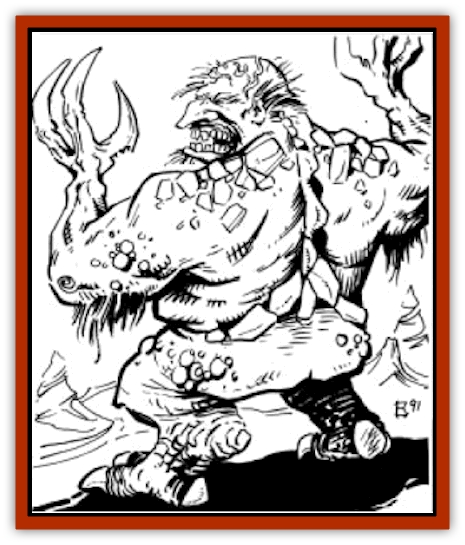

# Hej-kin

| Statistic | **Hej-kin** |
| --- | --- |
| **Activity Cycle:** | Night |
| **Alignment:** | Neutral evil |
| **Armor Class:** | 10 |
| **Climate/Terrain:** | Subterranean |
| **Damage/Attack:** | 1-4/1-4 |
| **Diet:** | Omnivore |
| **Frequency:** | Rare |
| **Hit Dice:** | 2 |
| **Intelligence:** | Average (8-10) |
| **Magic Resistance:** | Nil |
| **Morale:** | Average (8-10) |
| **Movement:** | 6 |
| **No. Appearing:** | 4-16 (4d4) |
| **No. of Attacks:** | 2 |
| **Organization:** | Clan |
| **Size:** | Small (4' tall) |
| **Special Attacks:** | Psionics |
| **Special Defenses:** | Psionics |
| **THAC0:** | 19 |
| **Treasure:** | O (C) |
| **XP Value:** | Warrior: 65 / Priest: 175 / Mage: 175 |

**Psionics Summary**

| Level | Dis/Sci/Dev | Attack/Defense | Score | PSPs |
| --- | --- | --- | --- | --- |
| 3 | 2/2/7 | PsC/IF,TS | 14 | 80 |

**Psychometabolism -** *Science:* life draining; *Devotions:* body equilibrium, heightened senses, biofeedback.

**Telepathy -** *Science:* mind link; *Devotions:* intellect fortress, psionic crush, send thoughts, post-hypnotic suggestion, contact, thought shield.

Hej-kin are a race of vile-looking humanoids who inhabit the natural subterranean caverns and tunnels of Athas.

Hej-kin have round chubby faces which are accented by large noses and small, slanted eyes. The ears of hej-kin are pointed, short, and covered with a thick fur. The skin color of hej-kin varies greatly, from deep red to a dark mossy green. Most hejkin clans will usually be all of the same color skin, and most tend to be reddish and orange colored. The skin of a hej-kin is thick and very tough, similar in texture to softened leather hide.

The language of the hej-kin is a combination of sign and verbal communication. Hej-kin speak in a low-pitched voice that resembles human mumbling in sound. Very few above-ground dwellers are familiar with the language of the hej-kin, for it is extremely difficult to learn. Characters attempting to interpret or speak hej-kin suffer a -3 penalty to their language proficiency, due to the unique and difficult nature of the language.

**Combat:** Hej-kin travel underground by means of a unique psionic ability which allows them to phase through rock. Use of this ability slows their movement to only 3 while phasing.

Hej-kin are able to use this ability to surprise any opponents or travellers who threaten their homes. When hej-kin attempt to surprise their enemies, apply a -2 penalty to all surprise rolls.

When they engage in combat, hej-kin attack with both their hands, raking their opponent with their sharp claws. A successful attack does 1-4 points of damage to their victim. Being competent psionicists, hej-kin are also able to attack with psionic powers. Like many of the creatures of Athas, hej-kin have naturally developed psionic defense modes, making them more resistant to psionic attacks. These defense modes are considered always "on", meaning that even when making physical attacks, hej-kin are able to use their defense modes (providing they have enough PSPs to power the mode being used).

**Habitat/Society:** Most clans make their homes in caverns adjacent to underground streams providing the clan with an adequate supply of water. Unlike many other types of subterranean dwellers, hej-kin do not dig tunnels or caves, for doing so would disturb the earth, which they consider to be sacred.

The average hej-kin clan contains four to five families, each consisting of three to six members. A family's living area is usually a smaller cave connected by tunnel to the cavern occupied by the rest of the clan. Hej-kin mark their dwellings by runes on the outer cave walls.

Hej-kin are omnivores, relying on both meat and vegetables as sources of food. Most of their food comes from subterranean plants and small underground creatures.

Within a clan of hej-kin, there exist examples of the warrior, priest, and mage classes. Warriors and mages rarely advance to high levels (7th or higher) due to the race's limited contact with other creatures. All hej-kin mages are preservers, due to their race's worship of the earth (see below). Priests, however, often reach very high levels of experience. All hej-kin priests worship the earth, as do all hej-kin. Hej-kin priests are the only members of their society who ever travel to the surface, usually to investigate some disturbance that threatens their home or the earth. Hej-kin are natural enemies to most other races, both surface dwellers and other subterranean races. This is due to the abuse and destruction of the earth perpetrated by other races.

**Ecology:** Hej-kin live an average of 40 to 45 years. Most clans stay in the same place for periods of up to ten years, at which time they migrate to a new area.

Dust from the withered eyeballs of dead hej-kin is usable by earth-worshipping priests as material components for many earthen spells.

---
## Discovery & Documentation

**Source Publication:** MC12 Dark Sun Appendix I - Terrors of the Desert (1991)
**Campaign Setting:** Dark Sun
**Author(s):** Tom Prusa, Louis J. Prosperi, Walter M. Baas

### Other Creatures Found in This Source Book
   * [[Animal_Herd_Athas|Animal, Herd (Athas)]]
   * [[Animal_Household_Athas|Animal, Household (Athas)]]
   * [[Antloid_Desert|Antloid, Desert]]
   * [[Banshee_Dwarf|Banshee, Dwarf]]
   * [[Beetle_Agony|Beetle, Agony]]
   * [[Bog_Wader|Bog Wader]]
   * [[Brambleweed|Brambleweed]]
   * [[B'rohg|B'rohg]]
   * [[Burnflower|Burnflower]]
   * [[Cat_Psionic|Cat, Psionic]]
   * [[Cha'thrang|Cha'thrang]]
   * [[Cistern_Fiend|Cistern Fiend]]
   * [[Clam_Giant|Clam, Giant]]
   * [[Cloud_Ray|Cloud Ray]]
   * [[Drake_Athas_Air|Drake (Athas), Air]]
   * [[Drake_Athas_Earth|Drake (Athas), Earth]]
   * [[Drake_Athas_Fire|Drake (Athas), Fire]]
   * [[Drake_Athas_Water|Drake (Athas), Water]]
   * [[Dune_Runner|Dune Runner]]
   * [[Dune_Trapper|Dune Trapper]]
   * [[Elemental_Athas_Greater_Air|Elemental (Athas), Greater, Air]]
   * [[Elemental_Athas_Greater_Earth|Elemental (Athas), Greater, Earth]]
   * [[Elemental_Athas_Greater_Fire|Elemental (Athas), Greater, Fire]]
   * [[Elemental_Athas_Greater_Water|Elemental (Athas), Greater, Water]]
   * [[Elemental_Athas_Lesser_Air_Earth|Elemental (Athas), Lesser, Air/Earth]]
   * [[Elemental_Athas_Lesser_Fire_Water|Elemental (Athas), Lesser, Fire/Water]]
   * [[Elemental_Athas_General_Information|Elemental (Athas), General Information]]
   * [[Erdland|Erdland]]
   * [[Esperweed|Esperweed]]
   * [[Flailer|Flailer]]
   * [[Floater|Floater]]
   * [[Giant_Athas|Giant (Athas)]]
   * [[Golem_Athas_I|Golem (Athas) I]]
   * [[Golem_Athas_II|Golem (Athas) II]]
   * [[Golem_Athas_III|Golem (Athas) III]]
   * [[Golem_Athas_General_Information|Golem (Athas), General Information]]
   * [[Halfling_Renegade|Halfling, Renegade]]
   * [[Id_Fiend|Id Fiend]]
   * [[Insect_Swarm_Athas|Insect Swarm (Athas)]]
   * [[Kank_Wild|Kank, Wild]]
   * [[Kirre|Kirre]]
   * [[Megapede|Megapede]]
   * [[Mul_Wild|Mul, Wild]]
   * [[Nightmare_Beast|Nightmare Beast]]
   * [[Plant_Carnivorous_Athas|Plant, Carnivorous (Athas)]]
   * [[Pterran|Pterran]]
   * [[Pterrax|Pterrax]]
   * [[Pulp_Bee|Pulp Bee]]
   * [[Pyreen|Pyreen]]
   * [[Rasclinn|Rasclinn]]
   * [[Razorwing|Razorwing]]
   * [[Roc_Athas|Roc (Athas)]]
   * [[Sand_Bride|Sand Bride]]
   * [[Sand_Cactus|Sand Cactus]]
   * [[Sand_Vortex|Sand Vortex]]
   * [[Scrab|Scrab]]
   * [[Silt_Horror|Silt Horror]]
   * [[Silt_Runner|Silt Runner]]
   * [[Sink_Worm|Sink Worm]]
   * [[Sloth_Athas|Sloth (Athas)]]
   * [[So-ut|So-ut]]
   * [[Spider_Cactus|Spider Cactus]]
   * [[Spider_Crystal|Spider, Crystal]]
   * [[Spirit_of_the_Land|Spirit of the Land]]
   * [[T'Chowb|T'Chowb]]
   * [[Thrax|Thrax]]
   * [[Tohr-kreen_I|Tohr-kreen I]]
   * [[Villichi|Villichi]]
   * [[Zhackal|Zhackal]]
   * [[Zombie_Plant|Zombie Plant]]
