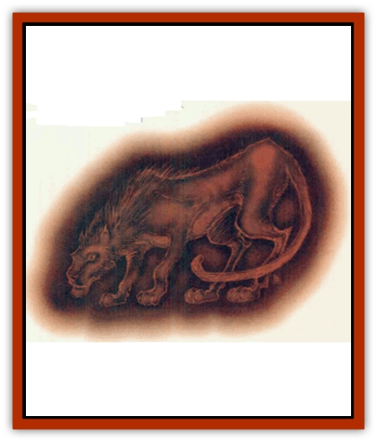

# Hellcat

| Statistic | **Hellcat** |
| --- | --- |
| **Activity Cycle:** | Any |
| **Alignment:** | Lawful evil |
| **Armor Class:** | 6 |
| **Climate/Terrain:** | Baator |
| **Damage/Attack:** | 1d4+1/1d4+1/2d6 |
| **Diet:** | Carnivore |
| **Frequency:** | Rare |
| **Hit Dice:** | 7+2 |
| **Intelligence:** | Average (91 |
| **Magic Resistance:** | 20% |
| **Morale:** | Elite (13) |
| **Movement:** | 15 |
| **No. Appearing:** | 1 |
| **No. of Attacks:** | 3 |
| **Organization:** | Solitary |
| **Size:** | L (7' long) |
| **Special Attacks:** | Nil |
| **Special Defenses:** | See below |
| **THAC0:** | 13 |
| **Treasure:** | Nil |
| **XP Value:** | 5,000 |

The bezekira (or hellcat, to those who don't know its proper name) is a catlike beast native to Baator. However, it's got none of the charms associated with a feline: It's got all the obnoxiousness - and then some! It pads about on feet quieter than velvet sliding across skin. Unlike a cat, however, the bezekira tends not to be very vocal, preferring instead to communicate via a telepathy that extends 9 yards.

One of the worst things about the hellcat is that it's damned near invisible in *any* kind of light. Though it can be seen by those beings who can ordinarily see invisible creatures, all others are at a serious disadvantage. However, if a body's smart enough to douse the light when a hellcat's suspected nearby, she'll see a glowing outline of a cat the size of a [[Cat_Great|tiger]]. She'll also see the thing's malevolently glowing red eyes - 'course, that might be the last thing she sees.

**Combat:** A bezekira attacks with a rather mundane form: two claw attacks and a vicious bite. However, it's not its attacks that make this creature a danger to be around, it's its defense. First, the hellcat's resistant to magic by 20%. Second, it's completely immune to any sort of mind-controlling spells; its catlike mentality makes it too independent to be open to such suggestion. Third (and most dangerous), a hellcat can only be hit by a magical weapon. Even then, the weapon's bonus doesn't apply to the damage (that is, a *long sword +4* used on a hellcat does only 1d12 points of damage, not 1d12+4).

Holy water and *bless* spells cause 1d8 points of damage to a hellcat, and holy items firmly presented keep them at hay.

**Habitat/Society:** Bezekiras are the associates and familiars of [[Baatezu_General_Information|baatezu]] and are found primarily on the Nine Layers of Baator. Only if summoned forth by a prime wizard (or some other fool who doesn't know any better) will a hellcat leave Baator. Typically it is turned loose on the Prime Material Plane. There, it may wander for a year and a day before it must return to its dismal lair, but during that time it can wreak considerable havoc.

The hellcat's nature is fickle and capricious. It will seek the one master who can bring it the most power and food - often changing masters a number of times, as outlined below. A bezekira has some standards, however, for it won't accept just *any* master. Life in Baator pounds home certain doctrines, and a hellcat will only take on a master who is both lawful evil and intelligent.

This monster has developed a unique sense that lets it determine how powerful a lawful-evil body is. Thus, a bezekira can gauge a being's might and then decide whether it wants to attach itself. If it so chooses, it serves that person to the best of its ability, communicating via telepathy only with him and protecting him while he commits his evil deeds. If it encounters two lawful-evil beings who are of the same level, the hellcat chooses to ally itself to a priest first then a cleric. Its third choice would be a mage, then a specialist. Its fifth choice would be a fighter, then a rogue. If the two most powerful are of the same class, the cat attaches itself to one randomly. However, the hellcat will automatically choose a baatezu (of any power) over a mortal, no matter how powerful.

If a bezekira has a master and then encounters a more desirable (read: powerful) lawful-evil person, it has no compunction about abandoning its former master to the dusty wayside. Before actually severing ties, however, the hellcat uses its telepathy to confirm whether the prospective new master might accept it. If he or she will, the bezekira abandons its old master immediately, excited by the prospect of spreading greater evil with its new cohort. The hellcat will readily turn on its former master if its new lord makes such a request.

In Baator, it's not clear just where the animal's position falls in the hierarchy. The chant is that hellcats serve the fiends, but in what capacity? Even the Guvners aren't sure, and if they've got guesses, they ain't sharing 'em.

**Ecology:** Bezekiras reproduce as do normal animals, but their numbers are occasionally augmented in two ways. The first occurs when a baatezu is punished - a frequent event in Baator, though not all those punished are turned into hellcats. The second method occurs far less often. If a petitioner performs a deed of monstrous evil and that deed is witnessed by a lesser or greater baatezu, he is "rewarded" by being turned into a bezekira. The time either of these cutters spends in hellcat form depends on how well each performs. A petitioner who does a good job is usually kept in that place, which is certainly a step up from being a [[Baatezu_Lemure|lemure]] or [[Baatezu_Least_Nupperibo|nupperibo]]. A fiend, on the other hand, has two options to consider while it's a bezekira: 1) If it performs badly, it'll be forced to stay in hellcat form until it learns how to use its new shape properly. 2) If it performs well, odds are it will be forced to remain in hellcat form&hellip; Punishment lasts a long time in Baator.

Hellcats are carnivorous, requiring a live human or demihuman victim from their masters once per week. If the master is unable to provide a meal, he or she may very well become the next. Bezekiras entirely devour their victims, though first they terrorize their prey so that the taste of fear permeates the flesh.

---
## Discovery & Documentation

**Source Publication:** MC14 Fiend Folio Appendix (1992)
**Campaign Setting:** Fiends Folio
**Author(s):** Don Bingle, John Terra, Wes Nicholson, Tim Beach, Steve Hardinger, Kris Hardinger, Rob Nicholls, Greg Swedberg, Al Boyce, Vince Garcia, Norm Ritchie

### Other Creatures Found in This Source Book
   * [[Aballin|Aballin]]
   * [[Achaierai|Achaierai]]
   * [[Adherer|Adherer]]
   * [[Algoid|Algoid]]
   * [[Al-Mi'raj|Al-Mi'raj]]
   * [[Apparition|Apparition]]
   * [[Caterwaul|Caterwaul]]
   * [[Coffer_Corpse|Coffer Corpse]]
   * [[Crabman|Crabman]]
   * [[Dark_Creeper|Dark Creeper]]
   * [[Dark_Stalker|Dark Stalker]]
   * [[Darter|Darter]]
   * [[Denzelian|Denzelian]]
   * [[Dune_Stalker|Dune Stalker]]
   * [[Dwarf_Urdunnir|Dwarf, Urdunnir]]
   * [[Falcon_Fire|Falcon, Fire]]
   * [[Faux_Faerie|Faux Faerie]]
   * [[Flawder|Flawder]]
   * [[Fyrefly|Fyrefly]]
   * [[Gambado|Gambado]]
   * [[Garbug|Garbug]]
   * [[Giant_Fhoimorien|Giant, Fhoimorien]]
   * [[Gibberling|Gibberling]]
   * [[Gorbel|Gorbel]]
   * [[Grimlock|Grimlock]]
   * [[Ice_Lizard|Ice Lizard]]
   * [[Iron_Cobra|Iron Cobra]]
   * [[Khargra|Khargra]]
   * [[Mantari|Mantari]]
   * [[Penanggalan|Penanggalan]]
   * [[Pernicon|Pernicon]]
   * [[Phantom_Stalker|Phantom Stalker]]
   * [[Retriever|Retriever]]
   * [[Ruve|Ruve]]
   * [[Scathe|Scathe]]
   * [[Sheet_Ghoul_Sheet_Phantom|Sheet Ghoul/Sheet Phantom]]
   * [[Shocker|Shocker]]
   * [[Spanner|Spanner]]
   * [[Stwinger|Stwinger]]
   * [[Sussurus|Sussurus]]
   * [[Symbiotic_Jelly|Symbiotic Jelly]]
   * [[Terithran|Terithran]]
   * [[Thunder_Children|Thunder Children]]
   * [[Troll_Ice|Troll, Ice]]
   * [[Tween|Tween]]
   * [[Umpleby|Umpleby]]
   * [[Volt|Volt]]
   * [[Xill|Xill]]
   * [[Xvart|Xvart]]
   * [[Zygraat|Zygraat]]
