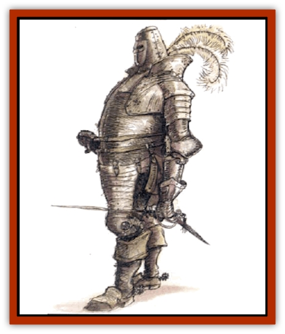

# Helmed Horror

| Statistic | **Helmed Horror** |
| --- | --- |
| **Activity Cycle:** | Any |
| **Alignment:** | Neutral |
| **Armor Class:** | 2 |
| **Climate/Terrain:** | Any |
| **Damage/Attack:** | 1d4 or by weapon |
| **Diet:** | Nil |
| **Frequency:** | Rare |
| **Hit Dice:** | 4+1 per level of the creator |
| **Intelligence:** | High (13-14) |
| **Magic Resistance:** | Special |
| **Morale:** | Special |
| **Movement:** | 12, Fl 12 (E) |
| **No. Appearing:** | 1d20 |
| **No. of Attacks:** | 1 |
| **Organization:** | Special |
| **Size:** | M (6-7' tall) |
| **Special Attacks:** | Nil |
| **Special Defenses:** | See below |
| **THAC0:** | 12 |
| **Treasure:** | V |
| **XP Value:** | 2,000 |

A helmed horror is empty, animated armor, capable of independent reasoning. It is neither undead nor a summoned creature. Often found as a guardian, this automaton appears to be a warrior completely clad in plate mail.

Often found as guardians, these automatons usually appear as warriors completely clad in plate mail. A horror is merely animated, empty armor, linked by magical forces. The process of creating a helmed horror results in silent, intelligent guardians, capable of independent reasoning.

**Combat:** Helmed horrors (also called shadowguards) can use all weapons allowed to fighters, and employ magical items that need no verbal commands or contact with living flesh to function (such as potions or ointments). Horrors cannot cast spells or conduct magical research.

A helmed horror can see invisible creatures and objects up to 120 feet away, and it has infravision to the same range. Its senses permeate its entire form - a "dehelmed" horror fights on, although separated appendages cease to move. (If brought back into contact with a horror, they reattach. A horror can't collect lost pieces and reattach them, but others can.) A horror heals lost hit points at the same rate as a living, resting human, restoring linking energies and mangled armor.

Helmed horrors are able to stand through levitation. Thus, they can walk on air or function without any legs at all. This allows flight at the movement rate given above, but it doesn't allow riders. (A falling horror is always protected as if a *feather fall* spell were cast upon it.) They can carry up to 200 lbs. of living or nonliving matter when on foot, but only 100 lbs of nonliving matter if "flying".

A helmed horror is fearless and cannot be controlled by magical or other means that work on the mind or senses. It can be contacted by means of ESP or similar spells, but it cannot be affected by illusions or enchantment/charms. Any mental contact with a horror allows it to read the current surface thoughts and emotions of the being contacting it, despite any defenses, which allows them to sense treachery and unerringly judge the sincerity of mentally encountered creatures.

*Magic missile* spells cast at a horror actually heal it by restoring its bonding energy. Excess hit points (above its maximum) are not gained by a horror, but are reflected back at the caster.

**Habitat/Society:** Horrors are seldom self-willed wanderers, but they continue to serve as guardians even after the deaths of their masters, operating continuously until destroyed. Some have been known to avenge a slain creator, following orders instilled in them. In some cases, however, the orders of a horror allow it autonomy in the absence of commands, or are simply silent on the subject of a horror's freedom. If not specifically commanded to cease existence at the death or behest of their creator, horrors will continue operating until destroyed.

**Ecology:** The process of creating helmed horrors remains secret, but it is known to require a priest of at least 7th level, some assistance from a wizard, and any nonmagical armor. The creator inputs a set of commands that govern its freedom, behavior, and limitations. The orders cannot be changed once given, and loopholes may put its loyalty in jeopardy; instilling orders in a horror is as delicate as wording a *wish* spell.

A horror can be made immune to the effects of three specific spells when created (typically *fireball*, *heat metal*, and *lightning bolts*). These spells must be named by the creator (who need not be able to cast them or have access to them) and cannot be changed thereafter. A horror's orders can never increase its spell immunity beyond three specific magics.

Horrors don't sleep, eat, or speak, and they cannot feel pain. They are ideal guardians, for their loyalty is total and devoid of ambition or emotion. If commanded by a telepathic being they can communicate, and a garrison of horrors can be coordinated into a well-organized fighting band.

**Battle horror**

  This appears identical to the helmed horror, but it can *dimension door* up to 180 feet once per day; *blink* for up to one turn once per day (it cannot cease blinking and start again, even if it hasn't used a full turn); and cast *magic missile* (two 1d4+1 missiles every three rounds, with a range of 70 yards). Battle horrors are lawful evil and have an XP value of 4,000.

---
## Discovery & Documentation

**Source Publication:** Monstrous Compendium, 1994 Annual, Volume 1 (1995)
**Campaign Setting:** Advanced Dungeons & Dragons 2nd Edition
**Author(s):** David Wise

### Other Creatures Found in This Source Book
   * [[Abyss_Ant|Abyss Ant]]
   * [[Achaierai|Achaierai]]
   * [[Afanc|Afanc]]
   * [[Al-Jahar|Al-Jahar]]
   * [[Baelnorn|Baelnorn]]
   * [[Baneguard|Baneguard]]
   * [[Banelar|Banelar]]
   * [[Bird_Talking|Bird, Talking]]
   * [[Blazing_Bones|Blazing Bones]]
   * [[Campestri|Campestri]]
   * [[Caniquine|Caniquine]]
   * [[Cat_Winged|Cat, Winged]]
   * [[Crypt_Servant|Crypt Servant]]
   * [[Death's_Head_Tree|Death's Head Tree]]
   * [[Dog_Saluqi|Dog, Saluqi]]
   * [[Dragon_Electrum|Dragon, Electrum]]
   * [[Dragon_Fang|Dragon, Fang]]
   * [[Dragon_Linnorm_Corpse_Tearer|Dragon, Linnorm, Corpse Tearer]]
   * [[Dragon_Linnorm_Dread|Dragon, Linnorm, Dread]]
   * [[Dragon_Linnorm_Flame|Dragon, Linnorm, Flame]]
   * [[Dragon_Linnorm_Forest|Dragon, Linnorm, Forest]]
   * [[Dragon_Linnorm_Frost|Dragon, Linnorm, Frost]]
   * [[Dragon_Linnorm_Gray|Dragon, Linnorm, Gray]]
   * [[Dragon_Linnorm_Land|Dragon, Linnorm, Land]]
   * [[Dragon_Linnorm_Midgard|Dragon, Linnorm, Midgard]]
   * [[Dragon_Linnorm_Rain|Dragon, Linnorm, Rain]]
   * [[Dragon_Linnorm_Sea|Dragon, Linnorm, Sea]]
   * [[Dragon_Neutral_Jacinth|Dragon, Neutral, Jacinth]]
   * [[Dragon_Neutral_Jade|Dragon, Neutral, Jade]]
   * [[Dragon_Neutral_Pearl|Dragon, Neutral, Pearl]]
   * [[Dread|Dread]]
   * [[Dragon-kin|Dragon-kin]]
   * [[Elemental_Earth_Kin_Chrysmal|Elemental, Earth Kin, Chrysmal]]
   * [[Elemental_Earth_Kin_Earth_Weird|Elemental, Earth Kin, Earth Weird]]
   * [[Elemental_Fire_Kin_Azer|Elemental, Fire Kin, Azer]]
   * [[Elemental_Sandman|Elemental, Sandman]]
   * [[Elemental_Wind_Walker|Elemental, Wind Walker]]
   * [[Elemental_Vermin|Elemental Vermin]]
   * [[Feystag|Feystag]]
   * [[Flame_Skull|Flame Skull]]
   * [[Foulwing|Foulwing]]
   * [[Gambado|Gambado]]
   * [[Garbug|Garbug]]
   * [[Genie_Tasked_Administrator|Genie, Tasked, Administrator]]
   * [[Genie_Tasked_Deceiver|Genie, Tasked, Deceiver]]
   * [[Genie_Tasked_Harim_Servant|Genie, Tasked, Harim Servant]]
   * [[Genie_Tasked_Messenger|Genie, Tasked, Messenger]]
   * [[Genie_Tasked_Miner|Genie, Tasked, Miner]]
   * [[Genie_Tasked_Oathbinder|Genie, Tasked, Oathbinder]]
   * [[Gibbering_Mouther|Gibbering Mouther]]
   * [[Gnasher|Gnasher]]
   * [[Gnasher_Winged|Gnasher, Winged]]
   * [[Golem_Brain|Golem, Brain]]
   * [[Golem_Hammer|Golem, Hammer]]
   * [[Golem_Metagolem|Golem, Metagolem]]
   * [[Golem_Spiderstone|Golem, Spiderstone]]
   * [[Gorynych|Gorynych]]
   * [[Greelox|Greelox]]
   * [[Jarbo|Jarbo]]
   * [[Laraken|Laraken]]
   * [[Lich_Psionic|Lich, Psionic]]
   * [[Living_Steel|Living Steel]]
   * [[Lock_Lurker|Lock Lurker]]
   * [[Loxo|Loxo]]
   * [[Lycanthrope_Loup_de_Noir|Lycanthrope, Loup de Noir]]
   * [[Lycanthrope_Werebadger|Lycanthrope, Werebadger]]
   * [[Lycanthrope_Werejaguar|Lycanthrope, Werejaguar]]
   * [[Lythlyx|Lythlyx]]
   * [[Magebane|Magebane]]
   * [[Marrashi|Marrashi]]
   * [[Metalmaster|Metalmaster]]
   * [[Mimic_House_Hunter|Mimic, House Hunter]]
   * [[Naga_Bone|Naga, Bone]]
   * [[Nautilus_Giant|Nautilus, Giant]]
   * [[Nightshade_Toril|Nightshade (Toril)]]
   * [[Nishruu|Nishruu]]
   * [[Noran|Noran]]
   * [[Opinicus|Opinicus]]
   * [[Ormyrr|Ormyrr]]
   * [[Parasite|Parasite]]
   * [[Pasari-Niml|Pasari-Niml]]
   * [[Plant_Vampire_Moss|Plant, Vampire Moss]]
   * [[Pteraman|Pteraman]]
   * [[Rautym|Rautym]]
   * [[Shadeling|Shadeling]]
   * [[Skum|Skum]]
   * [[Snake_Giant_Cobra|Snake, Giant Cobra]]
   * [[Snake_Stone|Snake, Stone]]
   * [[Spectral_Wizard|Spectral Wizard]]
   * [[Spell_Weaver|Spell Weaver]]
   * [[Spider_Brain|Spider, Brain]]
   * [[Suwyze|Suwyze]]
   * [[Tatalla|Tatalla]]
   * [[Tick_Heart|Tick, Heart]]
   * [[Tree_Dark|Tree, Dark]]
   * [[Tree_Singing|Tree, Singing]]
   * [[Tressym|Tressym]]
   * [[Troll_Snow|Troll, Snow]]
   * [[Tuyewera|Tuyewera]]
   * [[Ulitharid|Ulitharid]]
   * [[Undead_Dwarf|Undead Dwarf]]
   * [[Undead_Lake_Monster|Undead Lake Monster]]
   * [[Whipsting|Whipsting]]
   * [[Windghost|Windghost]]
   * [[Wolf_Dread|Wolf, Dread]]
   * [[Wolf_Stone|Wolf, Stone]]
   * [[Wolf_Vampiric|Wolf, Vampiric]]
   * [[Wraith_Shimmering|Wraith, Shimmering]]
   * [[Xantravar|Xantravar]]
   * [[Xaver|Xaver]]
