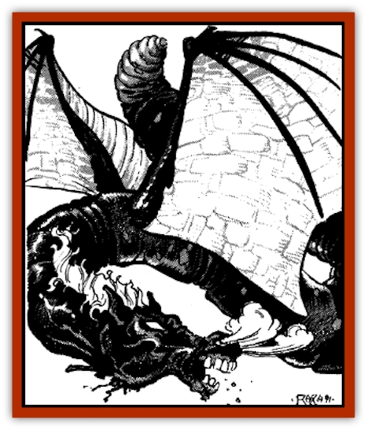
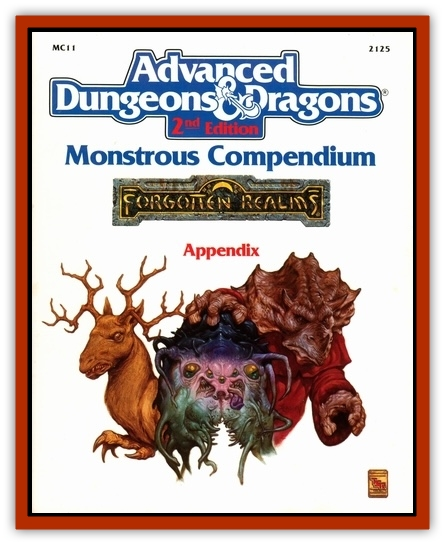

# Hendar

| Statistic | **Hendar** |
| --- | --- |
| **Activity Cycle:** | Night |
| **Alignment:** | Neutral (evil) |
| **Armor Class:** | 5 |
| **Climate/Terrain:** | Desolate areas (temperate) |
| **Damage/Attack:** | 2-8/1-3, or special |
| **Diet:** | Omnivorous, but prefer meat |
| **Frequency:** | Rare |
| **Hit Dice:** | 6+6 |
| **Intelligence:** | Average (8-10) |
| **Magic Resistance:** | Nil |
| **Morale:** | Fearless (18) |
| **Movement:** | 6, Sw 18, Fl 15(C) |
| **No. Appearing:** | 1 (1-3) |
| **No. of Attacks:** | 2 |
| **Organization:** | Solitary |
| **Size:** | L (14-22' wingspan) |
| **Special Attacks:** | Drowning dive |
| **Special Defenses:** | Nil |
| **THAC0:** | 15 |
| **Treasure:** | All possible, but no silver |
| **XP Value:** | 975 |

The heavily-bodied, fearsome, black hendar resembles a vast worm with bat wings and a horse-like head. It is a solitary hunter and is always encountered alone except during mating season. Hendar live in ruins, sea-caves, swamps, or atop moorland crags, preferring desolate places to well-populated areas, although they occasionally venture into populated areas to find food, especially when the hunting is bad in their territory. When they attack for food, they prefer humanoids to quadrupeds such as cattle and horses.

The creatures are black, with blue and purple iridescence when wet, and have fiery red eyes. When angered, hendar snort vapor from their nostrils and emit deep, rumbling roars. The manes ofolder individuals turn gray and then white with age. Hendar are thought to have a life span of hundreds of years.

**Combat:** Hendar can swim almost as fast as they can fly, by powerful beats of their tail and leathery wings. Although they prefer to hunt in shallow waters, they can survive at great depths. Their favorite attack is to crash into aerial targets, buffeting with their wings and/or tails for 2-8 points of damage, and biting for 1-3 points of damage. If an opponent irritates them, they grasp with their tail and jaws, and dive from the air, deep into the water to drown their foe. Conversely, if the foe is aquatic, the hendar bursts up from the air and flies toward land so that its foe expires from being out of water or suffers injury when dropped. An ungainly crawler on land, the hendar is a powerful but stodgy flier, bad-tempered and vain, often found gazing at its own reflection in still water. Hendar possess 120-foot infravision for use in night hunting.

Because of their great size, hendar fear almost nothing, and only stop an attack on foes when clearly outnumbered. Hendar never capitulate or cease an attack on a single enemy of size M or smaller. While they are of average intelligence, they cannot admit to themselves that any single creature smaller than themselves poses a threat.

**Habitat/Society:** Hendar have no society to speak of, since they usually cannot tolerate the presence of other hendar, except during mating periods. Even during this period, they are snappy and skittish near one another, and even go out of their way to attack other creatures.

They prefer to live in damp areas, for this keeps their skin strong and supple. If transplanted to another, drier area, their skin weakens, and they become Armor Class 6, and receive 1-4 points of additional damage per day because of the weakness of their skin. As well, extreme cold cracks their skin, causing similar results. Thus, they are only found in the middle reaches of the Sword Coast, usually never farther south than Amn or farther north than Luskan, and on the northern coast of the Sea of Fallen Stars.

**Ecology:** Hendar seldom mate, usually every thirty years or so. The parents cohabit for a year or so until the young achieve full strength and flight ability. Each mating typically produces 5-8 eggs, but only 2-4 usually hatch. Young hendar strike out on their own when they acquire their full powers at 3+3 Hit Dice size. The wing buffet attack of such a youngling causes only 2-6 points of damage. Although the hendar have no natural enemy, the young do not often survive for long because of lack of food. This accounts for the rarity of hendar in the Realms.

Hendar sleep during the winter months, for the cold slows them to half speed and could potentially make them easy prey for any target they chose to attack. When they wake in the spring, they are extremely ravenous, and often feed twice in a night. This behavior lasts for roughly a month, after which period they once again resume their ordinary once a week hunting schedule.

Hendar and [[Peryton|perytons]] generally tolerate each other, but the hendar attempts to slay or drive out any other large predators, aerial or aquatic, living within a mile of their lairs.

---
## Discovery & Documentation

**Source Publication:** MC11 Forgotten Realms Appendix II (1991)
**Campaign Setting:** Advanced Dungeons & Dragons 2nd Edition
**Author(s):** Tim Beach, Tim Brown, William W. Connors, Dale Donovan, Ed Greenwood, Jeff Grubb, Bruce Heard, Slade Henson, Rob King, Colin McComb, Roger E. Moore, Bruce Nesmith, Jon Pickens, Jean Rabe, Dori Watry, Skip Williams

### Other Creatures Found in This Source Book
   * [[Alaghi|Alaghi]]
   * [[Alguduir|Alguduir]]
   * [[Beguiler|Beguiler]]
   * [[Bird_Toril|Bird (Toril)]]
   * [[Cantobele|Cantobele]]
   * [[Carapace|Carapace]]
   * [[Cat_Toril|Cat (Toril)]]
   * [[Chitine|Chitine]]
   * [[Cildabrin|Cildabrin]]
   * [[Dimensional_Warper|Dimensional Warper]]
   * [[Dragon_Deep|Dragon, Deep]]
   * [[Fachan_Toril|Fachan (Toril)]]
   * [[Fael|Fael]]
   * [[Feyr|Feyr]]
   * [[Firetail|Firetail]]
   * [[Frost|Frost]]
   * [[Gaund|Gaund]]
   * [[Gloomwing|Gloomwing]]
   * [[Golden_Ammonite|Golden Ammonite]]
   * [[Golem_Lightning|Golem, Lightning]]
   * [[Hamadryad|Hamadryad]]
   * [[Harrier|Harrier]]
   * [[Harrla|Harrla]]
   * [[Haun|Haun]]
   * [[Haundar|Haundar]]
   * [[Inquisitor|Inquisitor]]
   * [[Lhiannan_Shee|Lhiannan Shee]]
   * [[Loxo|Loxo]]
   * [[Manni|Manni]]
   * [[Manscorpion|Manscorpion]]
   * [[Mara|Mara]]
   * [[Morin|Morin]]
   * [[Naga_Dark|Naga, Dark]]
   * [[Orpsu|Orpsu]]
   * [[Plant_Carnivorous_Black_Willow|Plant, Carnivorous, Black Willow]]
   * [[Plant_Carnivorous_Toril|Plant, Carnivorous (Toril)]]
   * [[Plant_Dangerous_I|Plant, Dangerous I]]
   * [[Ring-Worm|Ring-Worm]]
   * [[Rohch|Rohch]]
   * [[Sand_Cat|Sand Cat]]
   * [[Saurial|Saurial]]
   * [[Sha'az|Sha'az]]
   * [[Silver_Dog|Silver Dog]]
   * [[Simpathetic|Simpathetic]]
   * [[Skuz|Skuz]]
   * [[Spider_Monkey|Spider, Monkey]]
   * [[Tren|Tren]]
