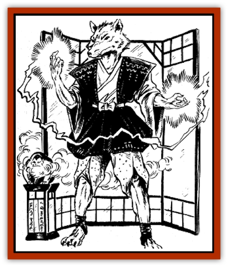

# Hengeyokai

| Statistic | **Hengeyokai** |
| --- | --- |
| **Activity Cycle:** | Any |
| **Alignment:** | Varies (usually Chaotic good or evil) |
| **Armor Class:** | 10 (as unarmored human or biped; see below for animal form) |
| **Climate/Terrain:** | Any |
| **Damage/Attack:** | By weapon (as human or biped; see below for animal form) |
| **Diet:** | Special |
| **Frequency:** | Uncommon |
| **Hit Dice:** | 1 |
| **Intelligence:** | Very to exceptional (12-15) |
| **Magic Resistance:** | Nil |
| **Morale:** | Elite (13) |
| **Movement:** | 12 (as human or biped; see below for animal form) |
| **No. Appearing:** | 1-20 |
| **No. of Attacks:** | 1 |
| **Organization:** | Solitary or band |
| **Size:** | Human or biped: M (5-6' tall) / Animal form: S (2-3' long) |
| **Special Attacks:** | See below |
| **Special Defenses:** | See below |
| **THAC0:** | 20 |
| **Treasure:** | N,P |
| **XP Value:** | 420 |

Hengeyokai are a race of intelligent shapechangers. Several subraces exist, each representing a different type of animal. Hengeyokai can be shukenja, kensai, bushi, or wu jen. They can never be samurai or ninja, since they are not human. The minimum and maximum ability requirements for a hengeyokai are summarized on a table below.

A hengeyokai can shapeshift between three different forms: animal, biped, and human. Each hengeyokai can assume only one animal form. The most common are carp, [[Cat_Small|cat]], crab, crane, [[Dog|dog]], drake, [[Mammal_Small|fox]], hare, [[Mammal_Small|monkey]], raccoon dog, [[Rat|rat]], and sparrow. Each animal form has its own alignment restrictions and special abilities; consult the Hengeyokai Creatures table below.

When in animal form, the hengeyokai is indistinguishable from normal animals of its kind. The change in form is genuine. Hence, the animal form appears normal and real to a caster who uses spells that reveal illusions.

When in bipedal form, the hengeyoki looks like a humanoid animal. He stands on his hind appendages to the height of a normal man. The front appendages (wings, paws, or fins) change into hands, capable of gripping and using normal weapons. The rest of the body retains the animal's general appearance, including fur, feathers, wings, a tail, and other characteristic features.

When in human form, the hengeyokai looks like a normal human being. Like his animal form, the human form is genuine and cannot be detected by spells that reveal illusions. However, the human form always retains one or more distinctive features of the animal form. For instance, a sparrow hengeyokai may have a pointed nose, and a rat hengeyokai may have beady eyes and long whiskers. (The DM determines such identifying features.)

Hengeyokai have their own language, which is the same regardless of their animal type. They can speak this language in all three of their forms. Additionally, hengeyokai can converse with normal animals and speak the trade language, as well as the languages of humans in the area. Hengeyokai only can speak human languages when in their human or bipedal forms.

**Combat:** The ability to shapechange is natural to hengeyokai. They are not [[Lycanthrope_General_Information|lycanthropes]], and have none of the characteristics of lycanthropy. In other words, they are not limited by the cycles of the moon, are not especially susceptible to silver weapons, cannot transmit their power through wounds, and cannot heal their own wounds by simply changing form.

Each day, a hengeyokai can shapechange the number of times that equals his level. For instance, a 1st level hengeyokai can change from human to animal (or biped) only once in a given day. He must remain in that form until the next day, when he can shapechange again.

Changing form requires one complete round. The hengeyokai can take no other actions during that time. Armor and equipment do not change form; they simply drop to the ground. A hengeyokai has the same level and ability scores in each form. When he reaches 0 hit points in any form, he is slain. Total hit points vary between forms. In animal form, a hengeyokai has only half the total he has in human or bipedal form (rounded up). Hit points lost in one form are carried over point for point when the creature changes form. In other words, if a hengeyokai normally has 23 points as a human, he has a maximum of 12 in animal form. If he loses 8 points in human form, and stays in that form, his current total will be 15 (23 - 8 = 12). If he changes to animal form, his total will drop to 4 (12 - 8 = 4). If a hengeyokai would be reduced to 0 hit points (or less) when changing to animal form, he cannot make the change.

Each form has advantages and disadvantages:

In *animal form*, hengeyokai have the movement rate, Armor Class, and damage range shown on the Hengeyokai Creatures table below. They also gain infravision at a 120-foot range and acquire the ability to speak with normal animals. Conversations with normal animals are usually limited to a few simple phrases and concepts, depending on the sophistication of the animal.

The animal form has disadvantages, too. As noted above, a hengeyokai has only half his normal hit points when in animal form. He cannot wear armor, use weapons or equipment, or cast spells. He may be mistaken for - and hunted as - a normal animal. He cannot speak any languages other than those of the hengeyokai and normal animals, though he can understand any languages he knows.

In *bipedal form*, the hengeyokai can speak any language he knows (including human and animal languages), has infravision to a range of 120 feet, has his full number of hit points, can cast spells, and can use weapons, equipment, and armor.

However, the bipedal hengeyokai cannot use the special movement abilities of its animal form, regardless of its appearance. (For instance, a hengeyokai sparrow cannot fly in bipedal form, and a bipedal carp must use the normal swimming rules.) The movement rate for all bipedal hengeyokai is 12. Furthermore, the bipedal form is distinctive, and easily recognized as a hengeyokai.

In *human form*, the hengeyokai can cast spells, wear armor, and use weapons and equipment. He has his full number of hit points and can easily pass for a normal human being. However, he has no infravision and he cannot speak to animals, although he still can understand their speech.

A hengeyokai's choice of form depends on his situation:

<ul><li>The animal form usually is used for reconnaissance and exploration rather than fighting, unless the animal form provides an especially advantageous attack or Armor Class. (For instance, if a dog hengeyokai in human form has neither arms nor armor, he probably would change to an animal to fight. As a dog, his AC is 9 and he can bite for 1-6 points of damage.)</li><li>The bipedal form is most natural for the hengeyokai. It also is preferred for intimidating opponents, as well as for its language and infravision capabilities.</li><li>The human form is most commonly used in combat. In this form, the hengeyokai attacks savagely and unrelentingly, shapeshifting to its animal form when necessary to escape from danger or to pursue a fleeing opponent.</li></ul>**Habitat/Society:** Hengeyokai are found throughout the world, usually on the fringes of human civilization. Hengeyokai do not form communities or villages of their own, preferring to form loosely organized bands, dwelling in crude but sturdy shelters made of wood and stone.

In general, the hengeyokai are a secretive race. They prefer to avoid prolonged contact with humans. Unlike most other races, hengeyokai do not form clans. They have little desire for land or position and never establish formal families or strongholds.

Hengeyokai of good alignment sometimes become protectors of human families or villages. As protectors, they assume the responsibilities of defending the area from outsiders and see to the general well-being of the inhabitants. In return, the hengeyokai receive offerings of food, gifts, and services from those they protect. Such offerings cover all the hengeyokai's needs.

The majority of hengeyokai are of chaotic alignment and form no associations with humans. Humans who dwell in the same area as a hengeyokai band usually are aware of the different animal forms this race may assume, as well as the usual alignment of each. The humans act accordingly. For instance, a fox hengeyokai is usually evil, so humans avoid it.

A typical hengeyokai band seldom consists of more than 20 adult members. Males and females are equal in number, as well as in abilities. The band includes one 2nd or 3rd level bushi (50% chance of either), who serves as the leader. The leader may be male or female. There is a 20% chance that a band includes a 1st or 2nd level shukenja, a 10% chance of a 1st or 2nd level wu jen, and a 10% chance of a 1st or 2nd level kensai. The remaining hengeyoaki are 1st level bushi. A few hengeyokai are bushi, shukenja, wu jen, and kensai of levels higher than those noted above. Such higher-level creatures seldom belong to a band, preferring to strike out on their own.

Hengeyokai have little use for material possessions, They rarely accumulate more than a few coins as treasure. Whatever else they acquire is usually exchanged for practical items, such as food or weapons, or given away to needy recipients.

Hengeyokai strive to make their lives as simple as possible. They enjoy storytelling, horticulture, and all forms of physical recreation such as swimming, running, and climbing. Though suspicious of strangers, they make deep and lasting friendships with those who treat them with kindness.

**Ecology:** The hengeyokai diet is similar to that of humans. However, they tend to eat foods associated with their animal forms. For instance, a cat hengeyokai may be a strict carnivore, while a sparrow hengeyokai may eat only seeds and grain.

Not many hengeyokai are artisans, but a few have natural artistic talent and exceptional skill. They are especially noted for their nishiki-e and beautifully carved kongi rikishi. The nishiki-e, colored woodcuts, have been known to fetch as much as 1,000 ch'ien from art collectors. Kongi rikishi are guardian figures mounted at the entrances of temples.

| Creature | Align. | Dmg | AC | MV | Modifications |
| --- | --- | --- | --- | --- | --- |
| Carp | Any good |  | 7 | Sw 12 | +1 Wis, -1 Str |
| Cat | Any chaotic | 1-3 | 9 | 12 | -1 Dex, -1 Wis |
| Crab | Any | 1-3 | 8 | 3, Sw 6 | +2 Str, -2 Cha |
| Crane | Any good | 1-2 | 9 | 6, Fl 12 (C) | +1 Wis, -1 Dex |
| Dog | Any good | 1-6 | 9 |  | +1 Con, -1 Int |
| Drake | Any good |  | 7 | Fl 12 (C), Sw 9 | +1 Cha, -1 Dex |
| Fox | Any evil | 1-3 | 6 | 15 | +1 Int, -1 Wis |
| Hare | Any good |  | 5 | 18 | +1 Wis, -1 Str |
| Monkey | Any chaotic |  | 6 | 12 | +2 Dex, -2 Wis |
| Raccoon dog | Any evil | 1-6 | 9 | 9 | +2 Str, -2 Wis |
| Rat | Any evil | 1-3 | 5 |  | +2 Con, -2 Cha |
| Sparrow | Any good |  | 3 | 3, Fl3 (C) | +2 Cha, -2 Con |

*Notes*
*Alignment* requirements are strict, and apply all three of a hengeyokai's forms.
*Damage (Dmg)* listings apply to animals with natural weapons, such as teeth or claws. Natural weapons can be used only when the hengeyokai is in animal form.
*Armor Class (AC)* applies only to the animal form, not the bipedal or human form. It cannot be augmented by armor or shields.
*Movement (MV)* indicates the hengeyokai's movement rate in animal form.
*Modifications* include changes to the hengeyokai's score based on its animal type. These modifications cannot increase a hengeyokai's scores above the racial maximums, but can make them lower than the minimums.

| Ability | Min. | Max. |
| --- | --- | --- |
| Str, Int, Wis, Con | 12 | 18 |
| Dex | 9 | 18 |
| Cha | 12 | 17 |

---
## Discovery & Documentation

**Source Publication:** MC6 Kara-Tur Appendix (1990)
**Campaign Setting:** Kara-Tur (Forgotten Realms)
**Author(s):** Rick Swan

### Other Creatures Found in This Source Book
   * [[Bajang|Bajang]]
   * [[Bakemono|Bakemono]]
   * [[Bisan|Bisan]]
   * [[Buso|Buso]]
   * [[Carp_Giant|Carp, Giant]]
   * [[Centipede_Spirit|Centipede, Spirit]]
   * [[Chu-u|Chu-u]]
   * [[Con-tinh|Con-tinh]]
   * [[Doc_cu'o'c|Doc cu'o'c]]
   * [[Duruch'i-lin|Duruch'i-lin]]
   * [[Flame_Spirit|Flame Spirit]]
   * [[Foo_Creature|Foo Creature]]
   * [[Gaki|Gaki]]
   * [[Gargantua|Gargantua]]
   * [[Goblin_Rat|Goblin Rat]]
   * [[Hai_Nu|Hai Nu]]
   * [[Hannya|Hannya]]
   * [[Hsing-sing|Hsing-sing]]
   * [[Hu_Hsien|Hu Hsien]]
   * [[Human_Kara-Tur|Human (Kara-Tur)]]
   * [[Ikiryo|Ikiryo]]
   * [[Jishin_Mushi|Jishin Mushi]]
   * [[Kala|Kala]]
   * [[Kaluk|Kaluk]]
   * [[Kappa|Kappa]]
   * [[Korobokuru|Korobokuru]]
   * [[Krakentua|Krakentua]]
   * [[Kuei|Kuei]]
   * [[Memedi|Memedi]]
   * [[Men-shen|Men-shen]]
   * [[Nat|Nat]]
   * [[Ningyo|Ningyo]]
   * [[Oni|Oni]]
   * [[P'oh|P'oh]]
   * [[P'oh_Gohei|P'oh, Gohei]]
   * [[Shan_Sao|Shan Sao]]
   * [[Shirokinukatsukami|Shirokinukatsukami]]
   * [[Spirit_Folk|Spirit Folk]]
   * [[Spirit_Nature|Spirit, Nature]]
   * [[Spirit_Stone|Spirit, Stone]]
   * [[Tako|Tako]]
   * [[Tengu|Tengu]]
   * [[Wang-Liang|Wang-Liang]]
   * [[Yuan-ti_Histachii|Yuan-ti, Histachii]]
   * [[Yuki-on-na|Yuki-on-na]]
