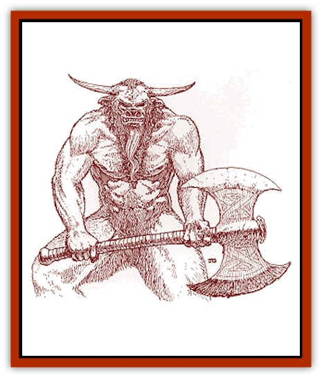
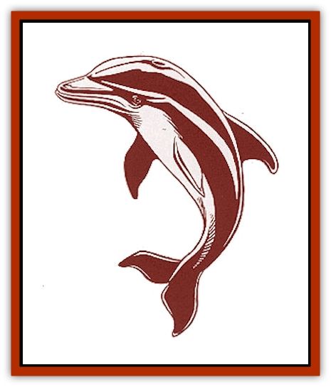

# Heraldic Servant I

| Statistic | **Aurochs** | **Bear** | **Bee** | **Dolphin** |
| --- | --- | --- | --- | --- |
| **Activity Cycle:** | Any | Any | Any | Any |
| **Alignment:** | Neutral | Neutral | Neutral | Neutral |
| **Armor Class:** | 4 | 5 | 5 | 4 |
| **Climate/Terrain:** | Any | Any | Any | Any |
| **Damage/Attack:** | 1d6 | 1d10/1d10/2d8 | 2d6 | 2d4 |
| **Diet:** | Nil | Nil | Nil | Nil |
| **Frequency:** | Very rare | Very rare | Very rare | Very rare |
| **Hit Dice:** | 7+2 | 6+6 | 6+4 | 4+4 |
| **Intelligence:** | High (13-14) | High (13-14) | Exceptional (15-16) | Genius (17-18) |
| **Magic Resistance:** | 25% | 20% | 35% | 15% |
| **Morale:** | Champion (15-16) | Fearless (19-20) | Champion (15-16) | Fearless (19-20) |
| **Movement:** | 16 | 12 | 8, Fl 36 (C) | 20, Sw 30 |
| **No. Appearing:** | 1 | 1 | 1 | 1 |
| **No. of Attacks:** | 1 | 3 | 1 | 1 |
| **Organization:** | Solitary | Solitary | Solitary | Solitary |
| **Size:** | M (4' long) | M (6½' tall) | M (5' long) | M (5' long) |
| **Special Attacks:** | Charge | Hold person, hug | Poison sting, fear | Spells |
| **Special Defenses:** | Spell immunity | Spell immunity | Nil | Special saves |
| **THAC0:** | 13 | 13 | 13 | 15 |
| **Treasure:** | Nil | Nil | Nil | Nil |
| **XP Value:** | 3,000 | 3,000 | 3,000 | 3,000 |

**

Aurochs**

  The aurochs looks very much like a [[Mammal_Herd_I|buffalo]] or bison. Its body is covered in coarse brown hair, and it has horns and close-set, black eyes. The head of the beast is covered in black, shaggy hair that hangs down in a thick beard across its chest. Its humanoid form looks very much like a [[Minotaur|minotaur]], only with aurochs coloring.

The aurochs attacks using its horns. With a running start, it can charge for double damage (2d6). On a successful charge, it also gains a trampling attack, which inflicts another 2d4 points of damage (with another successful attack roll). Trample victims who have not already attacked lose their initiative that round.

As a humanoid, the aurochs servant carries a large halberd, and it fights as a 7th-level warrior with a +2 damage bonus. It can also choose to use a halberd, battle axe, or lance (even a magical one) if given one by its master. Whatever weapon it holds when reverting to natural form is the weapon it will possess the next time it becomes a humanoid. The head of the aurochs is considered to have an AC of 0, and the creature is immune to any mind-affecting spells.

Baron Calturix of Nemausa is the only known bearer of the aurochs [[Heraldic_Servant_General_Information|servant]], though many consider him unworthy. In addition to the normal shared abilities, the bearer of an aurochs servant also gains a +2 damage bonus with each of the three weapons listed while in telepathic contact with the heraldic servant.

**Bear**

  The [[Bear|bear]] servant is covered in dark brown fur with light brown highlights around its eyes and paws. It typically walks upright, especially in combat, but can drop down to all fours for a better movement rate (18). Its humanoid form is not so very different; it becomes a tall, stocky human with the pinched face of a bear, claws for hands, and a light covering of fur over its body. The humanoid form gains a normal movement rate of 18.

This creature possesses an 18/00 Strength and has razor sharp teeth, which together account for its ability to inflict massive amounts of damage. In both forms, this servant attacks with its front claws and a vicious bite. In its natural form, the bear can attempt a hug if either claw attack hits. This attack requires a successful attack roll and inflicts an additional 2d8 points of damage.

Three times per day, the bear can *hold person* as per the 2nd-level priest spell. This heraldic servant is also completely immune to all *charm* and *hold* spells. However, it is strangely susceptible to the *sleep* spell; if it fails a magic resistance check against this spell, the bear must return to its coat of arms (by normal travel) and spend one turn in its inactive form.

The only known bearer of this heraldic servant is the Count of Harstal. When carrying the coat of arms as a shield, the bearer gains an 18/00 Strength unless the creature is active and more than one mile away. The bearer does not gain the ability to *hold person* or the susceptibility to *sleep*, but all other magical defenses do apply.

**Bee**

  This creature looks like a man-sized bumblebee. Its body has two segments, the thorax supporting six large legs and a pair of wings with an 8-foot wingspan. The abdomen, which boasts the creature's large stinger, is much larger. The head has two manipulative feelers near its mouth and large, multifaceted eyes. Short, yellow, bristly hair covers most of the body, but the lower abdomen is striped with thick bands of yellow and black.

In humanoid form, the creature retains the wings and multifaceted eyes (movement rate now becomes 18, Fl 24 C). Otherwise, it appears human except for yellow and black striped, bristly hair. In both forms, the bee possesses 90-foot infravision.

In combat, the bee servant can sting for 2d6 points of damage. The victim must attempt a saving throw vs. poison with a -2 penalty. Success means the victim takes only another 2d6 points of damage. A failed saving throw indicates that the victim is paralyzed for one round and takes an additional 5d4 points of damage. The bee also has a 10-foot *aura of fear* that affects only its opponents.

In humanoid form the bee servant loses its stinger but can attempt to touch an opponent, thereby inflicting the poison effect. The bee in humanoid form can also wield a dagger with proficiency.

Magus Rex, Wizard King of Herath is the only known bearer of this heraldic servant. The bee does not impart the power of flight to its bearer. However, while in telepathic contact with the servant or carrying the coat of arms with the inactive servant inside, the bearer can use the poison touch at half damage three times per day and the fear aura once per day.

**

Dolphin**

  As one would expect, this heraldic servant looks like a large [[Dolphin|dolphin]] with tough, blue-gray skin, a white underbelly, and some light blue streaks along its sides. It can move with incredible speed, hovering a few feet off the ground and propelling itself as if swimming. In humanoid form, it appears mostly human with webbed fingers and toes, gills just under the jaw line, blue-gray skin, and no body hair. As a humanoid, its movement rate is reduced to 18 and its swimming ability to 16. The dolphin servant can still communicate with other dolphins while in this humanoid form.

The dolphin servant is a spellcaster, able to work magic as an 8th-level wizard regardless of active form. In its natural state it cannot use spells which require material components, but flipper motions and dolphin speech suffice for the somatic and verbal components. As a humanoid it is suitably robed, can carry material components, and often possesses two minor magical items (such as wands). The dolphin servant has no spell book but can be provided with one that will be magically absorbed when transforming into its natural form.

The dolphin servant uses a hard-hitting ram attack in its natural form. As a humanoid, it can wield any weapon available to the wizard class but retains a THAC0 of 15. This creature makes all saving throws as if it were an 8th-level wizard.

The Baroness of Savaria is the dolphin servant's only known bearer. While in contact with the heraldic servant or carrying the coat of arms, bearers gain the creature's saving throws (if better than the ones they already have). While in telepathic contact, the bearer can also breathe water and cast any 1st-level spells known by the dolphin servant.

---
## Discovery & Documentation

**Source Publication:** Monstrous Compendium Savage Coast Appendix (Online Exclusive) (1995)
**Campaign Setting:** Mystara
**Author(s):** Loren L Coleman, Ted James, Thomas Zuvich, Cindi M. Rice

### Other Creatures Found in This Source Book
   * [[Aranea_Savage_Coast|Aranea (Savage Coast)]]
   * [[Arashaeem|Arashaeem]]
   * [[Batracine|Batracine]]
   * [[Cat_Marine|Cat, Marine]]
   * [[Cinnavixen|Cinnavixen]]
   * [[Clockwork_Swordsman|Clockwork Swordsman]]
   * [[Critter_Temple|Critter, Temple]]
   * [[Cursed_One|Cursed One]]
   * [[Deathmare|Deathmare]]
   * [[Dragon_Savage_Coast_Crimson|Dragon (Savage Coast), Crimson]]
   * [[Dragon_Savage_Coast_Red_Hawk|Dragon (Savage Coast), Red Hawk]]
   * [[Echyan|Echyan]]
   * [[Ee'aar|Ee'aar]]
   * [[Enduk|Enduk]]
   * [[Fachan_Savage_Coast|Fachan (Savage Coast)]]
   * [[Feliquine|Feliquine]]
   * [[Fiend_Narvaezan|Fiend, Narvaezan]]
   * [[Frelôn|Frelôn]]
   * [[Ghriest|Ghriest]]
   * [[Glutton_Sea|Glutton, Sea]]
   * [[Goatman|Goatman]]
   * [[Golem_Naâruk|Golem, Naâruk]]
   * [[Golem_Savage_Coast|Golem (Savage Coast)]]
   * [[Grudgling|Grudgling]]
   * [[Heraldic_Servant_II|Heraldic Servant II]]
   * [[Heraldic_Servant_III|Heraldic Servant III]]
   * [[Heraldic_Servant_IV|Heraldic Servant IV]]
   * [[Heraldic_Servant_V|Heraldic Servant V]]
   * [[Heraldic_Servant_General_Information|Heraldic Servant, General Information]]
   * [[Hermit_Sea|Hermit, Sea]]
   * [[Jorri|Jorri]]
   * [[Juhrion|Juhrion]]
   * [[Kla'a-tah|Kla'a-tah]]
   * [[Leech_Legacy|Leech, Legacy]]
   * [[Lich_Inheritor|Lich, Inheritor]]
   * [[Lizard_Kin_Savage_Coast|Lizard Kin (Savage Coast)]]
   * [[Lupasus|Lupasus]]
   * [[Lupin|Lupin]]
   * [[Lyra_Bird_Saragón|Lyra Bird, Saragón]]
   * [[Malfera|Malfera]]
   * [[Manscorpion_Nimmurian|Manscorpion, Nimmurian]]
   * [[Mythuínn_Folk|Mythuínn Folk]]
   * [[Neshezu|Neshezu]]
   * [[Nikt'oo|Nikt'oo]]
   * [[Nosferatu|Nosferatu]]
   * [[Omm-wa|Omm-wa]]
   * [[Omshirim|Omshirim]]
   * [[Parasite_Savage_Coast|Parasite (Savage Coast)]]
   * [[Phanaton|Phanaton]]
   * [[Plant_Savage_Coast|Plant (Savage Coast)]]
   * [[Pudding_Vermilion|Pudding, Vermilion]]
   * [[Rakasta|Rakasta]]
   * [[Ray_Forest|Ray, Forest]]
   * [[Shedu_Greater_Savage_Coast|Shedu, Greater (Savage Coast)]]
   * [[Shimmerfish|Shimmerfish]]
   * [[Skinwing|Skinwing]]
   * [[Spawn_of_Nimmur|Spawn of Nimmur]]
   * [[Spider-spy|Spider-spy]]
   * [[Spirit_Heroic|Spirit, Heroic]]
   * [[Spirit_Walleran|Spirit, Walleran]]
   * [[Succulus|Succulus]]
   * [[Swampmare|Swampmare]]
   * [[Symbiont_Shadow|Symbiont, Shadow]]
   * [[Tortle|Tortle]]
   * [[Troll_Legacy|Troll, Legacy]]
   * [[Trosip|Trosip]]
   * [[Tyminid|Tyminid]]
   * [[Utukku|Utukku]]
   * [[Voat|Voat]]
   * [[Voat_Herathian|Voat, Herathian]]
   * [[Vulturehound|Vulturehound]]
   * [[Wallara|Wallara]]
   * [[Wurmling|Wurmling]]
   * [[Wynzet|Wynzet]]
   * [[Yeshom|Yeshom]]
   * [[Zombie_Red|Zombie, Red]]
