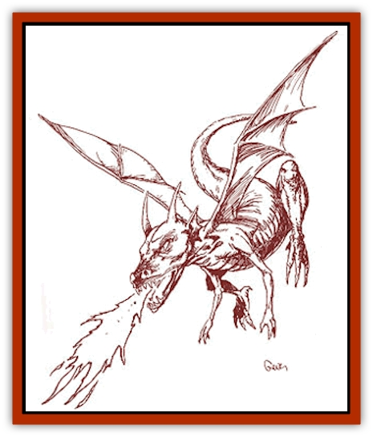
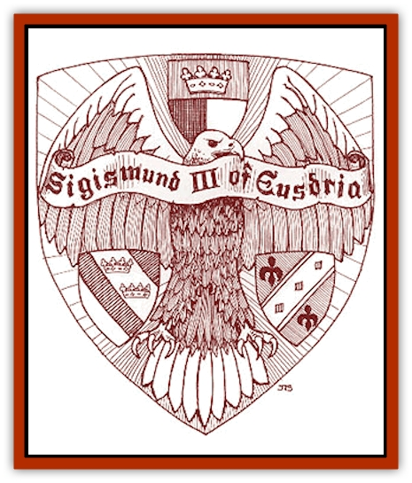

# Heraldic Servant II

| Statistic | **Dragon** | **Eagle** | **Griffon** | **Horse** |
| --- | --- | --- | --- | --- |
| **Activity Cycle:** | Any | Any | Any | Any |
| **Alignment:** | Neutral | Neutral | Neutral | Neutral |
| **Armor Class:** | 0 | 6 | 3 | 6 |
| **Climate/Terrain:** | Any | Any | Any | Any |
| **Damage/Attack:** | 1d10/1d10/3d6 | 1d8/1d8/2d6 | 1d4+1/1d4+1/2d8 | 1d8/1d8/1d6 |
| **Diet:** | Nil | Nil | Nil | Nil |
| **Frequency:** | Very rare | Very rare | Very rare | Very rare |
| **Hit Dice:** | 7+7 | 5+2 | 7+2 | 5+2 |
| **Intelligence:** | High (13-14) | Exceptional (15-16) | Exceptional (15-16) | High (13-14) |
| **Magic Resistance:** | 15% | 30% | 25% | 30% |
| **Morale:** | Champion (15-16) | Fanatic (17-18) | Fearless (19-20) | Fanatic (17-18) |
| **Movement:** | 12, Fl 30 (C) | 6, Fl 48 (C) | 12, Fl 30 (C) | 16, Fl 16 (C) |
| **No. Appearing:** | 1 | 1 | 1 | 1 |
| **No. of Attacks:** | 3 | 3 | 3 | 3 |
| **Organization:** | Solitary | Solitary | Solitary | Solitary |
| **Size:** | M (6' tall) | M (6' tall) | M (7' long) | M (6½' long) |
| **Special Attacks:** | Breath weapon, tail | Dive | Spell effects | Kick |
| **Special Defenses:** | Nil | Majestic aura | Need +1 weapon to hit | Regeneration |
| **THAC0:** | 13 | 15 | 13 | 15 |
| **Treasure:** | Nil | Nil | Nil | Nil |
| **XP Value:** | 6,000 | 2,000 | 4,000 | 2,000 |

**

Dragon**

  This [[Heraldic_Servant_General_Information|heraldic servant]] is a small [[Dragon_General_Information|dragon]], standing six feet tall. This servant has iridescent green scales and the usual dragon features, including a large set of leathery wings.

As a humanoid, the dragon loses the wings, tail, and much of its mass. It is still covered in scales and possesses vicious, clawlike hands; bright, amber eyes; and an extended mouth filled with sharp teeth.

Similar to a regular dragon, the dragon servant attacks with its claws and teeth. It can tail slap anyone standing behind it for 2d6 points of damage, and three times a day, it can let loose a fiery breath weapon, inflicting 6d8 points of damage. The breath weapon is made in lieu of physical attacks and is also available in humanoid form. As a humanoid, the dragon servant fights as an 8th-level fighter, relying on its natural weapons (which are now reduced to 1d6/1d6/2d6) or wielding a two-handed sword. If desired, the dragon servant arrives with a +1/+3 two-handed sword, which is absorbed when it takes dragon form.

The only known bearer of the dragon servant is the King of Robrenn, who allows the dragon to spend a lot of time in natural form. The dragon servant is perhaps the most prestigious of the heraldic servants, truly rivaled only by the unicorn and the phoenix. The bearer of this servant gains two levels of experience instead of one and is immune to fire-based attacks when telepathically linked to the dragon.

**

Eagle**

  The [[Eagle|eagle]] servant stands as tall as a man, with a wingspan of over 15 feet. The feathers are all dark brown with the hint of gold at their very tip, except for the snow-white head. The eagle servant's strong beak and claws can actually puncture plate-mail armor. In humanoid form, this servant could be mistaken for an [[Ee'aar|ee'aar]]; it has a humanoid body with white feathers for hair, taloned feet, and two dark gold wings folded back behind it. In humanoid form, the servant's movement rate becomes 18/40 (B).

The eagle servant attacks with both its claws and beak. If it dives more than 50 feet to attack, it gains a +4 bonus to its attack roll and doubles its claw damage. These servants have exceptional eyesight and cannot be surprised except at night or in their lairs (1 in 10 chance). This heraldic servant radiates a majestic aura while in its natural form; opponents must make a successful saving throw vs. spell with a -2 penalty or be unable to harm it in any way. This saving throw must be made before every attack. However, if the eagle servant is attacking the opponent directly, the aura has no effect; the servant loses this aura when in humanoid form. As a humanoid, the eagle servant attacks with a long sword as a 5th-level fighter, or it can use its claws for 1d6 points of damage each. If diving, it still gains double damage for claw attacks.

The Emperor of Eusdria is the bearer of this heraldic servant. Bearers gain the superior eyesight (treat as *eyes of the eagle*), and 3 times a day, they can invoke *majestic aura* for 1 round. To gain either of these, the bearer must either be in telepathic link or carrying the coat of arms which contains the inactive eagle servant.

**Griffon**

  [[Griffon|Griffons]] are known as much for their fierce and tenacious approach to combat as they are for their haughty attitude; the griffon servant is no exception. Griffons possess characteristics from two different animals, both majestic in their own right. The griffon servant has the lower body of a lion, with powerful rear legs and a tail, all covered in dusky yellow fur. Its upper body is that of an eagle, including a powerful beak and a large set of wings. This servant stands seven feet tall, large enough to carry a rider (speed 15, maneuverability class D). Its humanoid form is several hundred pounds lighter and walks upright. Movement rate for the humanoid form is 16/30 (C).

The griffon has superior smell and sight, allowing it to generally identify other creatures up to a mile away. Once in combat, the griffon does not stop until it or its opponent lies dead, or until its bearer calls it back. The griffon usually attacks from the sky, making a raking pass with its claws before landing and attacking with its beak and both claws. Only a +1 magical weapon or better can damage this heraldic servant.

The creature can *enlarge* as per the spell (but with double duration and the ability to carry a rider at full movement). It may also use *whispering wind* and call upon a *gust of wind*, each three times per day. The humanoid form gets these same abilities.

There are two known bearers of the griffon: the Margrave of Zvornik and the Duke of Pachester. Both use the griffin as a ceremonial steed, decked out in gems and jewelry. The Duke has also outfitted his with a magical saddle and harness that allows a better maneuverability class (B or C depending). Bearers of this servant can only be hit by magical weapons while in telepathic contact with the griffon.

**Horse**

  These heraldic servants are either the darkest black or the purest white. Though they are small for [[Horse|horses]], humanoids around five feet tall or less can ride them with no difficulty. In humanoid form, they appear as white- or black-skinned humans, with a thin mane of long hair running from the brow to the base of the neck in the place of regular hair.

The heraldic horse fights as a warhorse would; as its rider attacks, it is able to rear up and use its teeth and front hooves. On any round it does not make a frontal attack, the horse servant can also kick any opponent standing behind it, inflicting 2d8 points of damage. In the servant's humanoid form, it magically produces a common, double-headed mace, fighting as a 5th-level warrior.

This heraldic servant possesses a magical form of flight, walking or galloping into the air as it would higher ground. The horse's flight works only while being ridden by its bearer, who must telepathically command it to do this. In both forms, the horse servant regenerates 1 hit point per round, but acid and fire inflict permanent damage, which must be healed by magical methods. The horse servant may wear barding to improve its armor class, which will magically change to fit its humanoid form.

The only known bearers of this heraldic servant are the Duke of Cimarron and the Baron of Mohesia. Bearers of the horse servant receive the regenerative ability while in telepathic contact with the creature.

---
## Discovery & Documentation

**Source Publication:** Monstrous Compendium Savage Coast Appendix (Online Exclusive) (1995)
**Campaign Setting:** Mystara
**Author(s):** Loren L Coleman, Ted James, Thomas Zuvich, Cindi M. Rice

### Other Creatures Found in This Source Book
   * [[Aranea_Savage_Coast|Aranea (Savage Coast)]]
   * [[Arashaeem|Arashaeem]]
   * [[Batracine|Batracine]]
   * [[Cat_Marine|Cat, Marine]]
   * [[Cinnavixen|Cinnavixen]]
   * [[Clockwork_Swordsman|Clockwork Swordsman]]
   * [[Critter_Temple|Critter, Temple]]
   * [[Cursed_One|Cursed One]]
   * [[Deathmare|Deathmare]]
   * [[Dragon_Savage_Coast_Crimson|Dragon (Savage Coast), Crimson]]
   * [[Dragon_Savage_Coast_Red_Hawk|Dragon (Savage Coast), Red Hawk]]
   * [[Echyan|Echyan]]
   * [[Ee'aar|Ee'aar]]
   * [[Enduk|Enduk]]
   * [[Fachan_Savage_Coast|Fachan (Savage Coast)]]
   * [[Feliquine|Feliquine]]
   * [[Fiend_Narvaezan|Fiend, Narvaezan]]
   * [[Frelôn|Frelôn]]
   * [[Ghriest|Ghriest]]
   * [[Glutton_Sea|Glutton, Sea]]
   * [[Goatman|Goatman]]
   * [[Golem_Naâruk|Golem, Naâruk]]
   * [[Golem_Savage_Coast|Golem (Savage Coast)]]
   * [[Grudgling|Grudgling]]
   * [[Heraldic_Servant_I|Heraldic Servant I]]
   * [[Heraldic_Servant_III|Heraldic Servant III]]
   * [[Heraldic_Servant_IV|Heraldic Servant IV]]
   * [[Heraldic_Servant_V|Heraldic Servant V]]
   * [[Heraldic_Servant_General_Information|Heraldic Servant, General Information]]
   * [[Hermit_Sea|Hermit, Sea]]
   * [[Jorri|Jorri]]
   * [[Juhrion|Juhrion]]
   * [[Kla'a-tah|Kla'a-tah]]
   * [[Leech_Legacy|Leech, Legacy]]
   * [[Lich_Inheritor|Lich, Inheritor]]
   * [[Lizard_Kin_Savage_Coast|Lizard Kin (Savage Coast)]]
   * [[Lupasus|Lupasus]]
   * [[Lupin|Lupin]]
   * [[Lyra_Bird_Saragón|Lyra Bird, Saragón]]
   * [[Malfera|Malfera]]
   * [[Manscorpion_Nimmurian|Manscorpion, Nimmurian]]
   * [[Mythuínn_Folk|Mythuínn Folk]]
   * [[Neshezu|Neshezu]]
   * [[Nikt'oo|Nikt'oo]]
   * [[Nosferatu|Nosferatu]]
   * [[Omm-wa|Omm-wa]]
   * [[Omshirim|Omshirim]]
   * [[Parasite_Savage_Coast|Parasite (Savage Coast)]]
   * [[Phanaton|Phanaton]]
   * [[Plant_Savage_Coast|Plant (Savage Coast)]]
   * [[Pudding_Vermilion|Pudding, Vermilion]]
   * [[Rakasta|Rakasta]]
   * [[Ray_Forest|Ray, Forest]]
   * [[Shedu_Greater_Savage_Coast|Shedu, Greater (Savage Coast)]]
   * [[Shimmerfish|Shimmerfish]]
   * [[Skinwing|Skinwing]]
   * [[Spawn_of_Nimmur|Spawn of Nimmur]]
   * [[Spider-spy|Spider-spy]]
   * [[Spirit_Heroic|Spirit, Heroic]]
   * [[Spirit_Walleran|Spirit, Walleran]]
   * [[Succulus|Succulus]]
   * [[Swampmare|Swampmare]]
   * [[Symbiont_Shadow|Symbiont, Shadow]]
   * [[Tortle|Tortle]]
   * [[Troll_Legacy|Troll, Legacy]]
   * [[Trosip|Trosip]]
   * [[Tyminid|Tyminid]]
   * [[Utukku|Utukku]]
   * [[Voat|Voat]]
   * [[Voat_Herathian|Voat, Herathian]]
   * [[Vulturehound|Vulturehound]]
   * [[Wallara|Wallara]]
   * [[Wurmling|Wurmling]]
   * [[Wynzet|Wynzet]]
   * [[Yeshom|Yeshom]]
   * [[Zombie_Red|Zombie, Red]]
