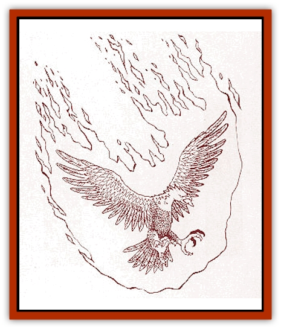
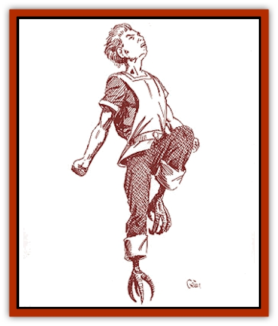

# Heraldic Servant III

| Statistic | **Lion** | **Phoenix** | **Ram** | **Rooster** |
| --- | --- | --- | --- | --- |
| **Activity Cycle:** | Any | Any | Any | Any |
| **Alignment:** | Neutral | Neutral | Neutral | Neutral |
| **Armor Class:** | 6 | -3 | 6 | 7 |
| **Climate/Terrain:** | Any | Any | Any | Any |
| **Damage/Attack:** | 1d4+2/1d4+2/1d10 | 1d10/1d10/2d8 | 2d4/2d4/2d4/2d4 | 2d6 |
| **Diet:** | Nil | Nil | Nil | Nil |
| **Frequency:** | Very rare | Very rare | Very rare | Very rare |
| **Hit Dice:** | 6+3 | 8+3 | 5+4 | 4+3 |
| **Intelligence:** | Exceptional (15-16) | High (13-14) | Exceptional (15-16) | Genius (17-18) |
| **Magic Resistance:** | 20% | 20% | 30% | 35% |
| **Morale:** | Champion (15-16) | Fearless (19-20) | Fanatic (17-18) | Champion (15-16) |
| **Movement:** | 18 | 8, Fl 48 (C) | 16 | 16, Fl 12 (D) |
| **No. Appearing:** | 1 | 1 | 1 | 1 |
| **No. of Attacks:** | 3 | 3 | 4 | 1 |
| **Organization:** | Solitary | Solitary | Solitary | Solitary |
| **Size:** | M (6' long) | M (5' tall) | M (6' long) | M (5' tall) |
| **Special Attacks:** | Eviscerate, roar | Immolation | Head-butt | Crow |
| **Special Defenses:** | Surprised only on 1 | Regeneration | Immune to blunt weapons | Special saves |
| **THAC0:** | 13 | 11 | 15 | 15 |
| **Treasure:** | Nil | Nil | Nil | Nil |
| **XP Value:** | 3,000 | 7,000 | 2,000 | 2,000 |

**Lion**

  This [[Heraldic_Servant_General_Information|servant]] is a fairly large version of a common [[Cat_Great|lion]], with dusky yellow fur, great claws, and a mouth full of sharp teeth. The male lion servant possesses a large mane of reddish-brown hair, but the female does not. In its humanoid form, this servant looks very much like a rakasta, with slightly more pronounced claws and a face that shows the strong characteristics of a lion.

This servant is a very alert creature and is able to move fairly stealthily, even through a battlefield. It is only surprised on a roll of 1, and it possesses the ability to move silently (75%) as per the thief ability. Striking from stealth when possible, it attacks with both a bite and its front claws. If both claw attacks are successful during the same round, the lion servant eviscerates its victim, leaping on and digging in with its powerful rear claws (additional 2d12 points of damage on a successful attack roll).

Once per turn, the lion produces a magical roar, stunning any opponent within 10 yards for 1d4 rounds unless a successful saving throw vs. paralyzation is made. The roar can be made with the lion's other attacks in place of the bite. In humanoid form, the servant possesses the same combat abilities except for the eviscerate, but it can wear armor.

The Queen of Bellayne, the Lord Governor of Lecoda, and the Margrave of Hojah are all known bearers of this heraldic servant. Bearers in telepathic contact with the servant may act as if influenced by a *potion of super-heroism* three times per day. If carrying the coat of arms in battle and the servant is within one mile, all troops and allies fight with a +2 bonus to their morale.

**

Phoenix**

  This heraldic servant appears as a bird with beautiful violet,scarlet, crimson, and orange plumage. It has gemlike talons and a beak of sapphire blue, and its eyes glow a deep ruby. In humanoid form, its body is distinguished by winged arms which end in raking claws, a face with blue-gem beak, and ruby eyes. Its hair and wings retain their bright and violent colors. As a humanoid, its movement rate is 18/24 (B).

The [[Phoenix|phoenix]] attacks with talons and beak unless on the ground, in which case only the beak can hit. In humanoid form, the phoenix can fight with all three attacks.

Five times per day, regardless of form, this heraldic servant can forgo attacks and burst into living flame for one round. Anyone standing within 10 feet must make a successful saving throw vs. breath weapon or suffer the full effects of an 8d6 fireball; a successful save indicates half damage. Also, the phoenix servant regenerates 3 hit points per round as per troll regeneration (which means it can rise even after being slain). The phoenix is immune to fire-based attacks, but anything else can "kill" it, turning it to ashes. If a limited wish or destruct spell is not cast within one turn, the servant rises from the ashes as a bird of living flame (this free use of the power is not counted against the five) with whatever hit points it has recovered.

The Priest-King of Eshu (ruler of the [[Enduk|enduks]]) is the bearer of the phoenix servant. Bearers gain two levels of experience instead of one while in contact with the servant. However, if the phoenix is slain and prevented from resurrecting, the bearer permanently loses four experience levels.

**Ram**

  The ram servant appears as a larger form of the mountain ram, with shaggy hair and a set of large horns. In its humanoid form, it is often mistaken for a goatman, with the shaggy hair, lower hooves, and head of its original form. Only the hands turn truly humanoid in form. The creature may move over rough or broken terrain at full movement regardless of form.

In its natural form, the ram attacks with a head-butt, and with a running start, it may inflict double damage (2d8). However, unless otherwise instructed this heraldic servant automatically adopts humanoid form for combat. As a humanoid, it attacks with a double-headed mace in each hand, giving it four attacks, each inflicting 2d4 points of damage. The servant automatically produces these weapons, reabsorbing them when shifting to natural form. It may wear armor, which must be acquired from its bearer; this can also be absorbed when changing form. In either form, the creature is immune to all magical and nonmagical, blunt weapons.

The Baron of Sedhuen is the only known bearer of this heraldic servant. The bearer shares the immunity to all blunt weapons if in contact with the servant or carrying the coat of arms which holds the inactive servant.

**

Rooster**

  This servant is simply the man-sized equivalent of the common barnyard animal, standing five feet tall. It can fly for only one round, after which it must remain on the ground for one round. In humanoid form, the servant appears as a red-haired, ruddy-faced human with only its pure black eyes and taloned feet giving it away. The humanoid form loses the power of flight, but it can jump up to 6 feet vertically and 12 feet horizontally.

The natural form of this heraldic servant only has one physical attack: its beak. It usually relies on its crow, which can imitate the effects of the following wizard spells: *feather fall*, *deafness*, *dispel magic*, *shout*, *chaos*, *conjure animals*, and *power word stun*. Each of these can be used once per day and do not require actual casting. The servant is considered a 12th-level wizard for purposes of determining any variable effects.

In humanoid form, the servant can carry a dagger, attacking with a THAC0 of 15, but it cannot wear armor. It also retains its crow. In both forms, this heraldic servant is immune to illusions, and it saves against all other magical attacks as a 12th-level wizard.

The rooster servant's only known bearer is the Count of Suerba. Its bearers gains the immunity against illusion and the special saves (unless theirs are better).

---
## Discovery & Documentation

**Source Publication:** Monstrous Compendium Savage Coast Appendix (Online Exclusive) (1995)
**Campaign Setting:** Mystara
**Author(s):** Loren L Coleman, Ted James, Thomas Zuvich, Cindi M. Rice

### Other Creatures Found in This Source Book
   * [[Aranea_Savage_Coast|Aranea (Savage Coast)]]
   * [[Arashaeem|Arashaeem]]
   * [[Batracine|Batracine]]
   * [[Cat_Marine|Cat, Marine]]
   * [[Cinnavixen|Cinnavixen]]
   * [[Clockwork_Swordsman|Clockwork Swordsman]]
   * [[Critter_Temple|Critter, Temple]]
   * [[Cursed_One|Cursed One]]
   * [[Deathmare|Deathmare]]
   * [[Dragon_Savage_Coast_Crimson|Dragon (Savage Coast), Crimson]]
   * [[Dragon_Savage_Coast_Red_Hawk|Dragon (Savage Coast), Red Hawk]]
   * [[Echyan|Echyan]]
   * [[Ee'aar|Ee'aar]]
   * [[Enduk|Enduk]]
   * [[Fachan_Savage_Coast|Fachan (Savage Coast)]]
   * [[Feliquine|Feliquine]]
   * [[Fiend_Narvaezan|Fiend, Narvaezan]]
   * [[Frelôn|Frelôn]]
   * [[Ghriest|Ghriest]]
   * [[Glutton_Sea|Glutton, Sea]]
   * [[Goatman|Goatman]]
   * [[Golem_Naâruk|Golem, Naâruk]]
   * [[Golem_Savage_Coast|Golem (Savage Coast)]]
   * [[Grudgling|Grudgling]]
   * [[Heraldic_Servant_I|Heraldic Servant I]]
   * [[Heraldic_Servant_II|Heraldic Servant II]]
   * [[Heraldic_Servant_IV|Heraldic Servant IV]]
   * [[Heraldic_Servant_V|Heraldic Servant V]]
   * [[Heraldic_Servant_General_Information|Heraldic Servant, General Information]]
   * [[Hermit_Sea|Hermit, Sea]]
   * [[Jorri|Jorri]]
   * [[Juhrion|Juhrion]]
   * [[Kla'a-tah|Kla'a-tah]]
   * [[Leech_Legacy|Leech, Legacy]]
   * [[Lich_Inheritor|Lich, Inheritor]]
   * [[Lizard_Kin_Savage_Coast|Lizard Kin (Savage Coast)]]
   * [[Lupasus|Lupasus]]
   * [[Lupin|Lupin]]
   * [[Lyra_Bird_Saragón|Lyra Bird, Saragón]]
   * [[Malfera|Malfera]]
   * [[Manscorpion_Nimmurian|Manscorpion, Nimmurian]]
   * [[Mythuínn_Folk|Mythuínn Folk]]
   * [[Neshezu|Neshezu]]
   * [[Nikt'oo|Nikt'oo]]
   * [[Nosferatu|Nosferatu]]
   * [[Omm-wa|Omm-wa]]
   * [[Omshirim|Omshirim]]
   * [[Parasite_Savage_Coast|Parasite (Savage Coast)]]
   * [[Phanaton|Phanaton]]
   * [[Plant_Savage_Coast|Plant (Savage Coast)]]
   * [[Pudding_Vermilion|Pudding, Vermilion]]
   * [[Rakasta|Rakasta]]
   * [[Ray_Forest|Ray, Forest]]
   * [[Shedu_Greater_Savage_Coast|Shedu, Greater (Savage Coast)]]
   * [[Shimmerfish|Shimmerfish]]
   * [[Skinwing|Skinwing]]
   * [[Spawn_of_Nimmur|Spawn of Nimmur]]
   * [[Spider-spy|Spider-spy]]
   * [[Spirit_Heroic|Spirit, Heroic]]
   * [[Spirit_Walleran|Spirit, Walleran]]
   * [[Succulus|Succulus]]
   * [[Swampmare|Swampmare]]
   * [[Symbiont_Shadow|Symbiont, Shadow]]
   * [[Tortle|Tortle]]
   * [[Troll_Legacy|Troll, Legacy]]
   * [[Trosip|Trosip]]
   * [[Tyminid|Tyminid]]
   * [[Utukku|Utukku]]
   * [[Voat|Voat]]
   * [[Voat_Herathian|Voat, Herathian]]
   * [[Vulturehound|Vulturehound]]
   * [[Wallara|Wallara]]
   * [[Wurmling|Wurmling]]
   * [[Wynzet|Wynzet]]
   * [[Yeshom|Yeshom]]
   * [[Zombie_Red|Zombie, Red]]
