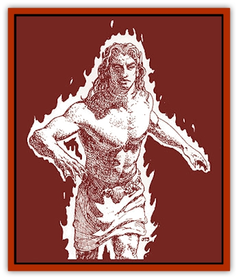
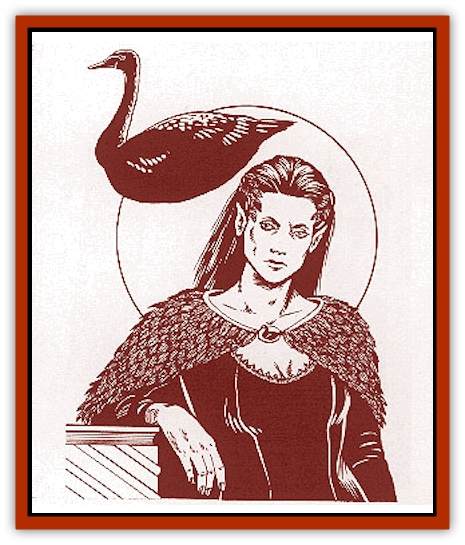

# Heraldic Servant IV

| Statistic | **Sea Horse** | **Sea Lion** | **Stag** | **Swan (black)** |
| --- | --- | --- | --- | --- |
| **Activity Cycle:** | Any | Any | Any | Any |
| **Alignment:** | Neutral | Neutral | Neutral | Neutral |
| **Armor Class:** | 2 | 5/3 | 6 | 7 |
| **Climate/Terrain:** | Any | Any | Any | Any |
| **Damage/Attack:** | 1d4+1/2d4 | 2d4/2d4/2d6 | 4d6 | 1d6 |
| **Diet:** | Nil | Nil | Nil | Nil |
| **Frequency:** | Very rare | Very rare | Very rare | Very rare |
| **Hit Dice:** | 4+3 | 6+6 | 6+3 | 4+4 |
| **Intelligence:** | High (13-14) | High (13-14) | High (13-14) | Exceptional (15-16) |
| **Magic Resistance:** | 30% | 20% | 35% | 40% |
| **Morale:** | Champion (15-16) | Fanatic (17-18) | Champion (15-16) | Champion (15-16) |
| **Movement:** | 11, Sw 21 | 8, Sw 18 | 21 | 6, Fl 18 (C) |
| **No. Appearing:** | 1 | 1 | 1 | 1 |
| **No. of Attacks:** | 2 | 3 | 1 | 1 |
| **Organization:** | Solitary | Solitary | Solitary | Solitary |
| **Size:** | M (6' long) | M (5' long) | M (6' long) | M (5' tall) |
| **Special Attacks:** | Nil | Maul, roar | Charge | Charm, command |
| **Special Defenses:** | Fire shield (cold) | Nil | Protection from missiles | Need +1 weapon to hit |
| **THAC0:** | 15 | 13 | 13 | 15 |
| **Treasure:** | Nil | Nil | Nil | Nil |
| **XP Value:** | 2,000 | 3,000 | 3,000 | 2,000 |

**

Sea Horse**

  The sea horse is an aquatic animal with an equine head and a long, curled tail. They swim with a rocking motion as the tail straightens and then snaps back to provide thrust. Like the [[Heraldic_Servant_I|dolphin]], this [[Heraldic_Servant_General_Information|servant]] is suspended in a magical field when summoned on land, allowing it to swim in the air but never rising more than a few feet above the ground. The sea horse servant is covered in scaly plates that acts as field-plate armor. They can be any combination of brown or green.

As a humanoid, this heraldic servant retains the natural armor scales and its color. The fingers and toes are webbed (new movement rate of 16/16), gills adorn its throat, and it has a mane of stringy hair. This creature possesses 120-foot infravision.

In its natural form, the sea horse servant attacks with a head-butt and a heavy tail slap; in humanoid form it attacks with its fists, which each inflict 1d4 points of damage. In either form, the heraldic servant can generate a *fire shield (cold)* as per the 4th-level wizard spell. Three times per day the creature can *polymorph self*, also as per the 4th-level wizard spell, into any man-sized nonmagical creature known to it or its bearer, then attacking with that creature's natural weapons. Each change lasts for up to one hour.

The only known bearer of this heraldic servant is the Lord Governor of Tartaruga. The bearer gains 120-foot infravision and the ability to generate a *fire shield (cold)* at will, provided the bearer is in contact with the servant.

**Sea Lion**

  This servant has the head and forepaws of a lion, and the body and tail of a fish. Like other aquatic servants, the [[Sea_Lion|sea lion]] gains the power of basic flight when traveling out of the water. It still moves by the thrust of its powerful tail,hovering a few feet in the air, but at a slower rate. In humanoid form, the sea lion servant looks the same as in its natural form except for large, webbed rear feet and gills located behind the ears. Its movement rate in this form is 12/8.

The Armor Class of the sea lion servant is considered AC 5 for the head and AC 3 for its scaly hide (except under special circumstances, all attacks hit the body). Its humanoid form possesses AC 5 and can wear armor. In combat, the sea lion attacks with claws and fangs. If both claws successfully strike an opponent in any round, that victim has been mauled and cannot make an attack that round if he has not done so already. When mauling, the sea lion gains a +4 bonus to its bite attack roll and inflicts double damage. In place of a bite (declared before any rolls are made) the sea lion can roar. If this happens, any enemy within 20 yards must make a successful saving throw vs. spell or be under the influence of a fear spell. The roar can be used only three times per day.

The bearer of the sea lion servant is the Lord Governor of Da Presa. If in contact or carrying the coat of arms with the inactive servant, the bearer gains the benefits of a *potion of heroism* when in combat and can breathe water.

**Stag**

  This heraldic servant is a deadly version of the common herd animal. Though smaller, it possesses an impressive array of antlers actually edged and tipped with sharpened glassteel. In humanoid form, the stag servant appears fully human except for short, dark brown fur and a ridge of bone where its antlers would normally be. The humanoid version is very stocky and muscular.

The [[Stag|stag]] normally attacks with its antlers; if it charges, it inflicts double damage - which will kill most creatures. As a humanoid, the stag carries two glassteel short swords +1 (these are a part of the servant and cannot be separated from it), attacking twice per round with each one. It also has a +1 damage bonus due to strength, giving it four attacks at 1d6+2 points of damage each. Unfortunately, it cannot wear armor without losing two of these attacks, but magical protection is allowed. In both active forms, the stag always has protection from normal missiles.

The bearer of this heraldic servant is the Countess of Morguen. A bearer who is in contact with the servant or carrying the coat of arms with the inactive servant gains the protection from normal missiles and the +1 damage bonus.

**

Swan, Black**

  This beautiful creature has glossy black feathers and a golden beak. It is very poised and graceful. Its humanoid form is always female - with enthralling, elven features; long black hair; dark eyes; and a beautifully feathered cloak. In this form, the servant still retains the power of flight as per the *fly* spell, which changes maneuverability to class A.

At will, the swan can exert a special *charm* ability on any person (once per day per person). All victims must make a successful saving throw vs. breath weapon to avoid being *charmed*; no creatures are immune to this (except Immortals). Magic resistance is merely added as a modifier to the saving throw: +1 bonus for every 10% resistance or fraction thereof. Total immunity to *charm* grants a +10 bonus. However, a roll of 1 always fails, no matter how many modifiers the person has. Once *charmed*, opponents can do nothing to harm the swan or its bearer. Those who successfully resist still require a +1 weapon or better to hit.

The swan can also direct a mental *command* (as per the 1st-level priest spell) at anyone already *charmed*. If the command word inspires negative emotion (such as "die", "surrender", "leave", etc.), the victim can attempt another saving throw to escape the effects of the charm. The humanoid form of this servant possesses the same powers and carries a dagger for physical defense.

The Count of Enom is the only known bearer of the black swan. If in contact with the servant, bearers gain the same protection against weapons of less than +1 enchantment and, three times a day, may *fly* as per the spell. Legends mention a white swan heraldic servant that has similar powers, but uses *suggestion* rather than *command*, so as not to inspire feelings of rejection.

---
## Discovery & Documentation

**Source Publication:** Monstrous Compendium Savage Coast Appendix (Online Exclusive) (1995)
**Campaign Setting:** Mystara
**Author(s):** Loren L Coleman, Ted James, Thomas Zuvich, Cindi M. Rice

### Other Creatures Found in This Source Book
   * [[Aranea_Savage_Coast|Aranea (Savage Coast)]]
   * [[Arashaeem|Arashaeem]]
   * [[Batracine|Batracine]]
   * [[Cat_Marine|Cat, Marine]]
   * [[Cinnavixen|Cinnavixen]]
   * [[Clockwork_Swordsman|Clockwork Swordsman]]
   * [[Critter_Temple|Critter, Temple]]
   * [[Cursed_One|Cursed One]]
   * [[Deathmare|Deathmare]]
   * [[Dragon_Savage_Coast_Crimson|Dragon (Savage Coast), Crimson]]
   * [[Dragon_Savage_Coast_Red_Hawk|Dragon (Savage Coast), Red Hawk]]
   * [[Echyan|Echyan]]
   * [[Ee'aar|Ee'aar]]
   * [[Enduk|Enduk]]
   * [[Fachan_Savage_Coast|Fachan (Savage Coast)]]
   * [[Feliquine|Feliquine]]
   * [[Fiend_Narvaezan|Fiend, Narvaezan]]
   * [[Frelôn|Frelôn]]
   * [[Ghriest|Ghriest]]
   * [[Glutton_Sea|Glutton, Sea]]
   * [[Goatman|Goatman]]
   * [[Golem_Naâruk|Golem, Naâruk]]
   * [[Golem_Savage_Coast|Golem (Savage Coast)]]
   * [[Grudgling|Grudgling]]
   * [[Heraldic_Servant_I|Heraldic Servant I]]
   * [[Heraldic_Servant_II|Heraldic Servant II]]
   * [[Heraldic_Servant_III|Heraldic Servant III]]
   * [[Heraldic_Servant_V|Heraldic Servant V]]
   * [[Heraldic_Servant_General_Information|Heraldic Servant, General Information]]
   * [[Hermit_Sea|Hermit, Sea]]
   * [[Jorri|Jorri]]
   * [[Juhrion|Juhrion]]
   * [[Kla'a-tah|Kla'a-tah]]
   * [[Leech_Legacy|Leech, Legacy]]
   * [[Lich_Inheritor|Lich, Inheritor]]
   * [[Lizard_Kin_Savage_Coast|Lizard Kin (Savage Coast)]]
   * [[Lupasus|Lupasus]]
   * [[Lupin|Lupin]]
   * [[Lyra_Bird_Saragón|Lyra Bird, Saragón]]
   * [[Malfera|Malfera]]
   * [[Manscorpion_Nimmurian|Manscorpion, Nimmurian]]
   * [[Mythuínn_Folk|Mythuínn Folk]]
   * [[Neshezu|Neshezu]]
   * [[Nikt'oo|Nikt'oo]]
   * [[Nosferatu|Nosferatu]]
   * [[Omm-wa|Omm-wa]]
   * [[Omshirim|Omshirim]]
   * [[Parasite_Savage_Coast|Parasite (Savage Coast)]]
   * [[Phanaton|Phanaton]]
   * [[Plant_Savage_Coast|Plant (Savage Coast)]]
   * [[Pudding_Vermilion|Pudding, Vermilion]]
   * [[Rakasta|Rakasta]]
   * [[Ray_Forest|Ray, Forest]]
   * [[Shedu_Greater_Savage_Coast|Shedu, Greater (Savage Coast)]]
   * [[Shimmerfish|Shimmerfish]]
   * [[Skinwing|Skinwing]]
   * [[Spawn_of_Nimmur|Spawn of Nimmur]]
   * [[Spider-spy|Spider-spy]]
   * [[Spirit_Heroic|Spirit, Heroic]]
   * [[Spirit_Walleran|Spirit, Walleran]]
   * [[Succulus|Succulus]]
   * [[Swampmare|Swampmare]]
   * [[Symbiont_Shadow|Symbiont, Shadow]]
   * [[Tortle|Tortle]]
   * [[Troll_Legacy|Troll, Legacy]]
   * [[Trosip|Trosip]]
   * [[Tyminid|Tyminid]]
   * [[Utukku|Utukku]]
   * [[Voat|Voat]]
   * [[Voat_Herathian|Voat, Herathian]]
   * [[Vulturehound|Vulturehound]]
   * [[Wallara|Wallara]]
   * [[Wurmling|Wurmling]]
   * [[Wynzet|Wynzet]]
   * [[Yeshom|Yeshom]]
   * [[Zombie_Red|Zombie, Red]]
