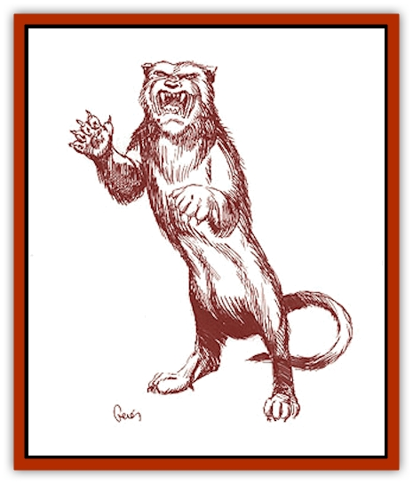
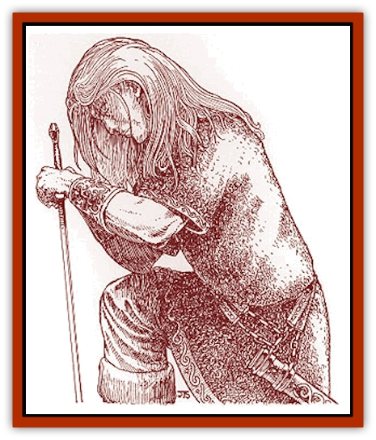

# Heraldic Servant V

| Statistic | **Talbot** | **Tyger** | **Unicorn** | **Wyvern** |
| --- | --- | --- | --- | --- |
| **Activity Cycle:** | Any | Any | Any | Any |
| **Alignment:** | Neutral | Neutral | Neutral | Neutral |
| **Armor Class:** | 6 | 6 | 2 | 3 |
| **Climate/Terrain:** | Any | Any | Any | Any |
| **Damage/Attack:** | 2d4 | 1d4/1d4/1d10 | 1d6/1d6/1d12 | 2d8/2d3 |
| **Diet:** | Nil | Nil | Nil | Nil |
| **Frequency:** | Very rare | Very rare | Very rare | Very rare |
| **Hit Dice:** | 6+2 | 8+1 | 6+6 | 7+7 |
| **Intelligence:** | High (13-14) | High (13-14) | Exceptional (15-16) | High (13-14) |
| **Magic Resistance:** | 25% | Nil | 15% | 20% |
| **Morale:** | Fanatic (17-18) | Elite (13-14) | Fearless (19-20) | Champion (15-16) |
| **Movement:** | 24 | 12 | 24 | 6, Fl 24 (D) |
| **No. Appearing:** | 1 | 1 | 1 | 1 |
| **No. of Attacks:** | 1 | 3 | 3 | 2 |
| **Organization:** | Solitary | Solitary | Solitary | Solitary |
| **Size:** | M (5' long) | L (9' long) | M (6' long) | M (6' long) |
| **Special Attacks:** | Nil | Rear claw | Charge, dispel magic | Poison, stealth |
| **Special Defenses:** | Invisible at will | 20% attack evasion | Special saves | Nil |
| **THAC0:** | 15 | 13 | 13 | 13 |
| **Treasure:** | Nil | Nil | Nil | Nil |
| **XP Value:** | 1,400 | 3,000 | 5,000 | 4,000 |

**Talbot**

  This [[Heraldic_Servant_General_Information|heraldic servant]] looks like a large [[Dog|dog]] with a smooth white coat, a broad mouth, and huge pendulous ears. It moves rather awkwardly but is actually quite strong and fast. Many people wrongly identify this heraldic servant's humanoid form as a [[Lupin|lupin]]. It has the same general build and characteristics, but with white hair, floppy ears, and a slightly more canine face.

The talbot possesses superior senses of hearing and smell, which it can use to track enemies. It also can turn *invisible* at will, allowing it to attack with almost guaranteed surprise (+3 bonus). In its natural state, its bite inflicts 2d4 points of damage.

As a humanoid, the talbot has all the skills of a 6th-level ranger and can use any ranger weapon with proficiency. It must be outfitted by its bearer, but afterwards, it can absorb the gear when changing to its natural form. It retains its keen senses and the ability to turn invisible when operating as a ranger.

The talbot has several known bearers: the King of Renardy, the Duke of Ysembragne, the Baron of Br�goigne, and the Countess of Marmandy. Bearers gain the servant's keen senses and may turn invisible (three times per day) if in contact with the servant. If in telepathic contact or carrying the coat of arms with the inactive servant, the bearers also gain the ranger bonuses against giant-class creatures.

**

Tyger**

  The tyger servant has a dark orange pelt of long, soft fur, which is lighter on its stomach, but it does not have the stripes usually associated with regular [[Cat_Great|tigers]]. Its eyes are jade green. In humanoid form, this servant is still covered with soft fur and retains the feline facial features that are often associated with rakastas. The rest of the body is fully humanoid.

In its natural form, the tyger attacks with two claws and a bite. If both front claw attacks succeed, the tyger may also attempt a rear claw attack. This special attack inflicts 2d6 for each claw. Uniquely, this servant has the ability to evade any attacks (even spells) that are not area affecting. It has a base 20% chance to do this, but it must not attack before its opponents. If successful, the tyger takes no damage and can still attack that round. If the attempt is unsuccessful, the tyger takes the damage inflicted and loses all attacks for that round. This ability is also used by the humanoid form, which uses fighting methods similar to those of far eastern monks. The servant can attack twice with each hand for 1d6 points of damage each, and may attempt to disarm its opponent (same chance as evade, but requires initiative and a successful attack roll).

No bearers of the tyger servant are known at this time. Bearers would receive the servant's ability to evade only if in telepathic contact with the tyger.

**

Unicorn**

  This heraldic servant is one of the most fantastic and beautiful creatures ever known. Its pure white hair is long and flowing, hinting at the [[Unicorn|unicorn's]] wild nature. Golden hair hangs from the mane and tail. Its hooves are yellow-ivory in color, and its eyes are usually a fiery pink or deep blue. A single, ivory horn extends from the center of its forehead. In its humanoid form, the unicorn servant appears as a young male or female knight - with flawless, snow-white skin, long white or golden hair, and blue or pink eyes.

The unicorn servant can sense a true enemy from 240 yards away. It attacks with forward hooves and its horn. With 30 feet of running room, it can charge in, attacking only with its horn but inflicting 3d12 points of damage. The horn always has a +2 attack bonus because of its magical nature.

The unicorn servant is immune to *charm* and *hold* magic and poison; it makes all other saves as an 11th-level wizard. The touch of a unicorn servant's horn acts as a *dispel magic* cast by an 11th-level wizard. Its humanoid form retains all the immunities and special saves.

This servant's humanoid form always appears dressed in immaculate, white chain mail, granting it an Armor Class of 3. If taken off, the armor disappears, and the servant must assume its natural form for one full turn before it can reappear in the chain mail. The humanoid servant also wields a +2 long sword with which it can attack twice each round. The sword has the same *dispel magic* power as the horn.

There are no known bearers of the unicorn heraldic servant. Legends indicate that this servant is always given to an elf or human maiden of fair and just reputation. If in contact with the unicorn, a bearer receives the servant's spell immunities and the ability to sense a true enemy.

**Wyvern**

  The [[Wyvern|wyvern]] servant measures about six feet long, not counting its additional six-foot tail. It has a serpentine body covered in grayish scales and a head resembling that of a dragon. Unlike the dragon, it only has only the two hind feet. Two leathery, batlike wings extend from its back, and its tail ends in a deadly stinger. The wyvern servant communicates with hisses and deep-throated growls in its natural form.

As a humanoid, the wyvern looks much like a lizardman, losing the wings but keeping its basic features and coloration (movement rate of 18). Unlike all other heraldic servants, the wyvern cannot speak even in humanoid form; in both forms, telepathic communication is possible with its bearer, however.

The wyvern attacks with a vicious bite and its stinger, which inflicts type F poison. Those stung must make a successful saving throw vs. poison or die; even if successful, they still take 2d3 points of damage. The wyvern prefers to attack from the air, gliding in and imposing a -2 surprise penalty on its victim. In humanoid form, the wyvern loses the power of flight, but it gains two claw attacks, which each inflict 1d6 points of damage.

The Margrave of Slagovich is the only known bearer of the wyvern heraldic servant. Bearers gain the ability to poison, as per the priest spell (reverse of neutralize poison), three times a day. They do not have to be in telepathic contact or carrying the coat of arms for this ability.

---
## Discovery & Documentation

**Source Publication:** Monstrous Compendium Savage Coast Appendix (Online Exclusive) (1995)
**Campaign Setting:** Mystara
**Author(s):** Loren L Coleman, Ted James, Thomas Zuvich, Cindi M. Rice

### Other Creatures Found in This Source Book
   * [[Aranea_Savage_Coast|Aranea (Savage Coast)]]
   * [[Arashaeem|Arashaeem]]
   * [[Batracine|Batracine]]
   * [[Cat_Marine|Cat, Marine]]
   * [[Cinnavixen|Cinnavixen]]
   * [[Clockwork_Swordsman|Clockwork Swordsman]]
   * [[Critter_Temple|Critter, Temple]]
   * [[Cursed_One|Cursed One]]
   * [[Deathmare|Deathmare]]
   * [[Dragon_Savage_Coast_Crimson|Dragon (Savage Coast), Crimson]]
   * [[Dragon_Savage_Coast_Red_Hawk|Dragon (Savage Coast), Red Hawk]]
   * [[Echyan|Echyan]]
   * [[Ee'aar|Ee'aar]]
   * [[Enduk|Enduk]]
   * [[Fachan_Savage_Coast|Fachan (Savage Coast)]]
   * [[Feliquine|Feliquine]]
   * [[Fiend_Narvaezan|Fiend, Narvaezan]]
   * [[Frelôn|Frelôn]]
   * [[Ghriest|Ghriest]]
   * [[Glutton_Sea|Glutton, Sea]]
   * [[Goatman|Goatman]]
   * [[Golem_Naâruk|Golem, Naâruk]]
   * [[Golem_Savage_Coast|Golem (Savage Coast)]]
   * [[Grudgling|Grudgling]]
   * [[Heraldic_Servant_I|Heraldic Servant I]]
   * [[Heraldic_Servant_II|Heraldic Servant II]]
   * [[Heraldic_Servant_III|Heraldic Servant III]]
   * [[Heraldic_Servant_IV|Heraldic Servant IV]]
   * [[Heraldic_Servant_General_Information|Heraldic Servant, General Information]]
   * [[Hermit_Sea|Hermit, Sea]]
   * [[Jorri|Jorri]]
   * [[Juhrion|Juhrion]]
   * [[Kla'a-tah|Kla'a-tah]]
   * [[Leech_Legacy|Leech, Legacy]]
   * [[Lich_Inheritor|Lich, Inheritor]]
   * [[Lizard_Kin_Savage_Coast|Lizard Kin (Savage Coast)]]
   * [[Lupasus|Lupasus]]
   * [[Lupin|Lupin]]
   * [[Lyra_Bird_Saragón|Lyra Bird, Saragón]]
   * [[Malfera|Malfera]]
   * [[Manscorpion_Nimmurian|Manscorpion, Nimmurian]]
   * [[Mythuínn_Folk|Mythuínn Folk]]
   * [[Neshezu|Neshezu]]
   * [[Nikt'oo|Nikt'oo]]
   * [[Nosferatu|Nosferatu]]
   * [[Omm-wa|Omm-wa]]
   * [[Omshirim|Omshirim]]
   * [[Parasite_Savage_Coast|Parasite (Savage Coast)]]
   * [[Phanaton|Phanaton]]
   * [[Plant_Savage_Coast|Plant (Savage Coast)]]
   * [[Pudding_Vermilion|Pudding, Vermilion]]
   * [[Rakasta|Rakasta]]
   * [[Ray_Forest|Ray, Forest]]
   * [[Shedu_Greater_Savage_Coast|Shedu, Greater (Savage Coast)]]
   * [[Shimmerfish|Shimmerfish]]
   * [[Skinwing|Skinwing]]
   * [[Spawn_of_Nimmur|Spawn of Nimmur]]
   * [[Spider-spy|Spider-spy]]
   * [[Spirit_Heroic|Spirit, Heroic]]
   * [[Spirit_Walleran|Spirit, Walleran]]
   * [[Succulus|Succulus]]
   * [[Swampmare|Swampmare]]
   * [[Symbiont_Shadow|Symbiont, Shadow]]
   * [[Tortle|Tortle]]
   * [[Troll_Legacy|Troll, Legacy]]
   * [[Trosip|Trosip]]
   * [[Tyminid|Tyminid]]
   * [[Utukku|Utukku]]
   * [[Voat|Voat]]
   * [[Voat_Herathian|Voat, Herathian]]
   * [[Vulturehound|Vulturehound]]
   * [[Wallara|Wallara]]
   * [[Wurmling|Wurmling]]
   * [[Wynzet|Wynzet]]
   * [[Yeshom|Yeshom]]
   * [[Zombie_Red|Zombie, Red]]
