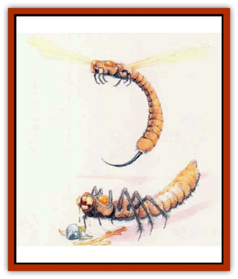

# Herex

| Statistic | **Adult** | **Larva** |
| --- | --- | --- |
| **Activity Cycle:** | Day | Night |
| **Alignment:** | Neutral | Neutral |
| **Armor Class:** | 2 | 3 |
| **Climate/Terrain:** | Any land | Any cavern |
| **Damage/Attack:** | 1d10 (bite)/1d6 (sting) | 2d8 (bite) |
| **Diet:** | Carnivore | Carnivore |
| **Frequency:** | Rare | Rare |
| **Hit Dice:** | 13 | 6-12 |
| **Intelligence:** | Non- (0) | Non- (0) |
| **Magic Resistance:** | Nil | Nil |
| **Morale:** | Champion (16) | Champion (15) |
| **Movement:** | 12, Fl 15 (D) | 12 |
| **No. Appearing:** | 1d3 | 1d6 |
| **No. of Attacks:** | 2 | 1 |
| **Organization:** | Clutch | Clutch |
| **Size:** | H (20' long) | L-H (10-20' long) |
| **Special Attacks:** | Acid, paralysis | Acid |
| **Special Defenses:** | Nil | Nil |
| **THAC0:** | 7 | 6 HD: 15 / 7-8 HD: 13 / 9-10 HD: 11 / 11-12 HD: 9 |
| **Treasure:** | Nil | Nil |
| **XP Value:** | 7,000 | 6 HD: 420 / 7 HD: 650 / 8 HD: 975 / 9 HD: 1,400 / 11 HG: 3,000 / 12 HD: 4,000 / 10 HD: 2,000 |

Herex are giant, insectoid creatures with dangerous, acidic bites. Characters can encounter them in any of the three stages of their hfe cycle egg, larva, or adult. However, only the latter two forms pose immediate danger to outsiders.

The spherical eggs measure about 3 feet in diameter, with hard, opaque white shells. When hatching time grows near, brave observers can see a glinting, shadowy form (the larva) shifting inside the shell.

## Larva

The larval form of a herex resembles a flattened, wingless beetle with an elongated, flexible abdomen, large head, and powerful mandibles. The mottled, dun-colored creature moves swiftly on its six short legs. Larvae range from 10 to 20 feet in length.

**Combat:** A herex larva seems continually ravenous, roaming the underground passages and caverns of its birthplace in search of prey. The larva uses its bite as its main attack. In addition to suffering normal damage (2d8), any creature it bites also becomes injured by its acidic saliva. The acid permanently reduces the efficiency of any normal armor it touches by a +2 penalty (for example, plate mail becomes AC 5 instead of AC 3) and inELicts a permanent +1 penalty to magical armor. Each successive bite has the same effect; if the armor reaches AC 9 or worse, it disintegrates. The acidic saliva does not affect magical protection devices (for example, rings ofprotection and cloaks of displacement). Victims wearing no armor suffer 1d10 additional points of acid damage from a bite.

**Habitat/Society:** Herex live solely to perpetuate their species. Lacking any quantifiable intelligence, they mindlessly go about their limited activities.

Unlike some insects, herex do not maintain any form of hive or group home. Although they often remain with others of their clutch, they are not particularly social creatures. Once they burst from their eggs, the larvae spend all their energy hunting, growing, and molting. When a larva reaches approximately 20 feet in length, it leaves its subterranean birthplace and digs its way to the surface, using its mandibles and saliva to tunnel through solid rock if need be. Once outside, the herex sheds its carapace a final time, emerging in adult form (13 Hit Dice). An adult herex flies about searching for both food and a mate. The male dies shortly after mating, while the female burrows into a deep cavern or dungeon to lay 1d6 eggs before dying. In four months, the cycle begins again when the new eggs hatch.

**Ecology:** The acidic saliva of the herex, if preserved in a ceramic container, can eat away almost any other material, including metal. Such acid also can be used to create *universal solvent*.

## Adult

When mature, a herex has a body very similar to its larval form but with a smaller head and mandibles, four thin wings (like those of a [[Dragonfly|dragonfly]]), and a 5-foot-long stinger at the end of its abdomen.

**Combat:** An adult herex always attacks from the air, sweeping down on its opponents from above. It lands only when it has rendered its foe immoblle or dead. Although the bite of an adult herex seems less dangerous than that of the larva (1d10 points of damage), the effects of its acidic saliva mirror those of the larva's. An adult also can attack with its tail stinger, which causes 1d6 points of damage and injects poison that paralyzes victims for 4d8 rounds unless they make a successful saving throw vs poison.

---
## Discovery & Documentation

**Source Publication:** Mystara Appendix (1994)
**Campaign Setting:** Mystara
**Author(s):** John Nephew, Teeuwynn Woodruff, John Terra, Skip Williams

### Other Creatures Found in This Source Book
   * [[Actaeon|Actaeon]]
   * [[Agarat|Agarat]]
   * [[Ash_Crawler|Ash Crawler]]
   * [[Baldandar|Baldandar]]
   * [[Bargda|Bargda]]
   * [[Bhut|Bhut]]
   * [[Bird_Mystara|Bird (Mystara)]]
   * [[Blackball|Blackball]]
   * [[Choker|Choker]]
   * [[Coltpixie|Coltpixie]]
   * [[Crone_of_Chaos|Crone of Chaos]]
   * [[Darkhood|Darkhood]]
   * [[Darkwing|Darkwing]]
   * [[Decapus|Decapus]]
   * [[Deep_Glaurant|Deep Glaurant]]
   * [[Diabolus|Diabolus]]
   * [[Dimensional_Warper|Dimensional Warper]]
   * [[Dragon_Mystara_Crystalline|Dragon (Mystara), Crystalline]]
   * [[Dragon_Mystara_Jade|Dragon (Mystara), Jade]]
   * [[Dragon_Mystara_Onyx|Dragon (Mystara), Onyx]]
   * [[Dragon_Mystara_Ruby|Dragon (Mystara), Ruby]]
   * [[Drake_Mystara|Drake (Mystara)]]
   * [[Dragonfly|Dragonfly]]
   * [[Dusanu|Dusanu]]
   * [[Elemental_of_Chaos_Air_Earth|Elemental of Chaos, Air/Earth]]
   * [[Elemental_of_Chaos_Fire_Water|Elemental of Chaos, Fire/Water]]
   * [[Elemental_of_Law_Air_Earth|Elemental of Law, Air/Earth]]
   * [[Elemental_of_Law_Fire_Water|Elemental of Law, Fire/Water]]
   * [[Familiar_Mystara|Familiar (Mystara)]]
   * [[Frost_Salamander|Frost Salamander]]
   * [[Fundamental_Air_Earth|Fundamental, Air/Earth]]
   * [[Fundamental_Fire_Water|Fundamental, Fire/Water]]
   * [[Gargantua_Mystara|Gargantua (Mystara)]]
   * [[Geonid|Geonid]]
   * [[Ghostly_Horde|Ghostly Horde]]
   * [[Giant_Athach|Giant, Athach]]
   * [[Giant_Hephaeston|Giant, Hephaeston]]
   * [[Golem_Drolem|Golem, Drolem]]
   * [[Golem_Mystara_I|Golem (Mystara) I]]
   * [[Golem_Mystara_II|Golem (Mystara) II]]
   * [[Golem_Mystara_III|Golem (Mystara) III]]
   * [[Gray_Philosopher|Gray Philosopher]]
   * [[Guardian_Warrior|Guardian Warrior]]
   * [[Gyerian|Gyerian]]
   * [[Hivebrood|Hivebrood]]
   * [[Horde|Horde]]
   * [[Hsiao|Hsiao]]
   * [[Huptzeen|Huptzeen]]
   * [[Hutaakan|Hutaakan]]
   * [[Imp_Mystara|Imp (Mystara)]]
   * [[Jellyfish_Giant_Mystara|Jellyfish, Giant (Mystara)]]
   * [[Kna|Kna]]
   * [[Kopru|Kopru]]
   * [[Lizard_Mystara|Lizard (Mystara)]]
   * [[Lizard-kin_Mystara|Lizard-kin (Mystara)]]
   * [[Lupin|Lupin]]
   * [[Lycanthrope_Werejaguar_Mystara|Lycanthrope, Werejaguar (Mystara)]]
   * [[Lycanthrope_Wereswine|Lycanthrope, Wereswine]]
   * [[Magen|Magen]]
   * [[Manikin|Manikin]]
   * [[Mek|Mek]]
   * [[Mujina|Mujina]]
   * [[Nagpa|Nagpa]]
   * [[Neh-thalggu|Neh-thalggu]]
   * [[Nightshade_Mystara|Nightshade (Mystara)]]
   * [[Nuckalavee|Nuckalavee]]
   * [[Pegataur|Pegataur]]
   * [[Phanaton|Phanaton]]
   * [[Plant_Dangerous_Mystara|Plant, Dangerous (Mystara)]]
   * [[Plasm|Plasm]]
   * [[Rakasta|Rakasta]]
   * [[Rock_Man|Rock Man]]
   * [[Sabreclaw|Sabreclaw]]
   * [[Sacrol|Sacrol]]
   * [[Scamille|Scamille]]
   * [[Shapeshifter|Shapeshifter]]
   * [[Shargugh|Shargugh]]
   * [[Shark-kin|Shark-kin]]
   * [[Sollux|Sollux]]
   * [[Spectral_Death|Spectral Death]]
   * [[Spectral_Hound|Spectral Hound]]
   * [[Spider-kin|Spider-kin]]
   * [[Spirit_Mystara|Spirit (Mystara)]]
   * [[Statue_Living|Statue, Living]]
   * [[Surtaki|Surtaki]]
   * [[Tabi|Tabi]]
   * [[Thoul|Thoul]]
   * [[Thunderhead|Thunderhead]]
   * [[Tiger_Ebon|Tiger, Ebon]]
   * [[Topi|Topi]]
   * [[Tortle|Tortle]]
   * [[Vampire_Velya|Vampire, Velya]]
   * [[White_Fang|White Fang]]
   * [[Worm_Mystara|Worm (Mystara)]]
   * [[Wyrd|Wyrd]]
   * [[Yowler|Yowler]]
   * [[Zombie_Lightning|Zombie, Lightning]]
