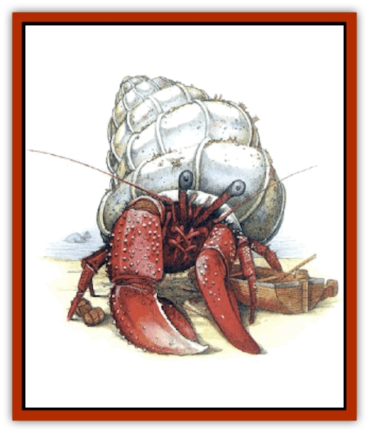
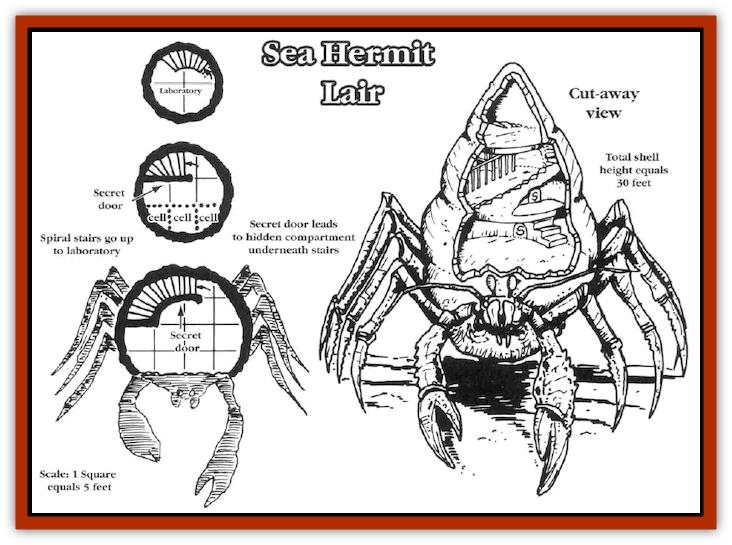

# Hermit - Sea

| Statistic | **Hermit, Sea** |
| --- | --- |
| **Activity Cycle:** | Any |
| **Alignment:** | Neutral evil |
| **Armor Class:** | 0 (3) |
| **Climate/Terrain:** | Any coastal |
| **Damage/Attack:** | 2d8/2d8 |
| **Diet:** | Omnivore |
| **Frequency:** | Very rare |
| **Hit Dice:** | 10+5 |
| **Intelligence:** | Genius (17-18) |
| **Magic Resistance:** | 15% |
| **Morale:** | Champion (15-16) |
| **Movement:** | 6, Sw 12 |
| **No. Appearing:** | 1 |
| **No. of Attacks:** | 2 |
| **Organization:** | Solitary |
| **Size:** | G (40' long) |
| **Special Attacks:** | Spell use |
| **Special Defenses:** | Nil |
| **THAC0:** | 9 |
| **Treasure:** | H |
| **XP Value:** | 8,000 |

The sea hermit poses a very significant danger to the unwary. This creature appears to be nothing more than a lonely, benevolent person living in a huge shell on a deserted beach. It can appear as a human, [[Tortle|tortle]], [[Lupin|lupin]], etc., acting the role of a recluse happy to have visitors. It will offer travelers shelter within its shell-home. Surprisingly, the shell is indeed large enough, a majestic form spiraling upward into a small tower roughly 20 feet in diameter at the base and rising 30 feet high. This shell is usually white with deep blue and red markings.

This large shell is truly the creature's natural home. The sea hermit is actually a creature of the deep - a powerful being from an underwater kingdom who is studying the surface world. It is also a shapechanger.

Its natural form is very similar to that of a giant hermit crab. In this natural state, it is 10 feet wide and almost 40 feet long. Large arms ending in huge pincers extend from its body near the front. Its large, black eyes are on stalks, which can be pulled into armored niches for protection, and its two pairs of large feelers can sense heat, motion, and sound. The creature's body is naturally armored in a dark red shell, and it has six skinny legs that extend out of the secondary shell to help pull it along the sea bottom and actually allow it to swim, dragging the majestic shell along behind it.

The sea hermit can speak several of the Savage Coast languages. It can also communicate with most intelligent, sea-dwelling creatures.

**Combat:** The sea hermit rarely attacks while in humanoid form. Occasionally, if it has lured people into its shell, it might attack while they sleep. Normally it prefers to capture specimens live. While in humanoid form, the sea hermit possesses the natural AC of that form. If attacked, the creature will shapechange back to its natural state during the first round of combat.

In its crab form, the sea hermit fights with two devastating pincer attacks. If the sea hermit makes a natural attack roll of 19 or 20, the victim must make a successful saving throw vs. death magic or lose a limb (determined randomly). In this form, the creature's Armor Class drops to 0 in the front and 3 for the softer shell at its rear. If the creature is in its majestic shell with only the front poking out, it is always AC 0; the shell is too thick and well armored to break through during the fast-paced action of combat. People trapped within the shell thinking to strike at the softer armor toward the creature's back will find themselves suddenly dealing with several hundred gallons of water as the creature dives under the sea, allowing the seals to break long enough to flood the lower spiral of its shell.

*Special Abilities:* A sea hermit has a 20% chance of being able to use the spells and skills of its previous prey. If so, the number and levels of any spells do not increase as with other spellcasters. Roll 4d10 for the actual number of spells learned previously, then determine each by rolling 1d8 for the level of spell, and then choose a spell randomly from the list. A sea hermit is considered a 16th-level mage, so 9th-level spells are beyond its capabilities. For skills, roll 2d10 and determine randomly.

The sea hermit's big advantage is its shapechanging ability. This ability functions like the 9th-level wizard spell *shapechange*, except that it is a natural ability. The sea hermit can imitate only intelligent creatures which it has studied.(The few sages who know of the sea hermit and [[Aranea_Savage_Coast|araneas]] have tried to find a link between their abilities. This has been unsuccessful because the sea hermit's ability is far more advanced, as it can quickly assume the form of any intelligent creature, not just a single humanoid.) It requires one round to change shape, after which the creature possesses full natural, nonmagical abilities.

**Habitat/Society:** Sea hermits are sages of deep, undersea kingdoms who seek to trap the unwary in order to study their memories. Through arcane processes, these memories are extracted to teach the sea hermits new skills, spells, and other information about the people who dwell on the surface. They have no qualms about the deception they employ or the fatal methods of memory extraction. To them, the situation is no different from collecting and dissecting insects to learn about them. These are simply the methods that are available.

The creature captures its prey alive when possible, taking it back down to the undersea kingdom where it can better perform its work. This sometimes requires that the sea hermit keep up its guise for hours, lulling its victims into a false sense of security.

A sea hermit will never wander far from its shell-home while in humanoid form for fear of losing it. Finding a new, unoccupied shell requires a long and dangerous undersea quest, with the sea hermit lacking its strongest form of protection. The creature will take any steps necessary to protect its home. This is one of the creature's few weaknesses.

**Ecology:** The sea hermit usually lives outside the Savage Coast, including its coastal waters. This deep sea creature only comes up to collect samples. Except for those it kidnaps, its actual, overall effect on the land is minimal. Sea hermits do not view themselves or their undersea life as superior or inferior, just different. They exploit those on land for knowledge and skills to provide themselves with greater power back in their own kingdoms.

The sea hermits hold a special animosity for [[Jorri|jorries]], some of which can see through their guise. Jorries will often watch a sea hermit and try to warn any potential victims of the creature. A sea hermit will sometimes go out of its way to run off any nearby dens of jorries before setting up its trap.

Some parts of a sea hermit's natural form can be used in magical preparations that deal with *water breathing* and *shapeshifting*. It has even been rumored that a tortle wizard had one of these majestic shells enchanted to act like *Daern's instant fortress*.

**Lair**

  This majestic structure is a squat, conical shell. It is approximately 20 feet across at its base (60 feet in circumference) and spirals upward 30 feet to a final room only 10 feet in diameter. In some areas, the overlapping spirals bend some of the ceilings, making the overall architecture lack the hard edges and corners to which most races are accustomed. In areas of sharp upward slope, the saa hermit has formed a polished stairway from the shell's glossy mother-of-pearl interior. The effect is quite beautiful.

The first 40 feet of the shell, as it wraps around the first curve, is where the sea hermit in its natural form fits. When posing as a humanoid, this portion is cluttered with driftwood and minor implements, suggesting a craft workshop or junk storage area. Past this, the shell has been reshaped to form archways, stairs, and rooms, including a laboratory and cells for prisoners. A few secret doors may be installed, perhaps some ending in traps for overcurious guests; these often involve spring-loaded tridents tipped with the poison of an exotic fish (THAC0 13, inflicting 1d10+4d8 points of damage; a successful saving throw vs. poison reduces damage to 1d10+2d8 points).

---
## Discovery & Documentation

**Source Publication:** Monstrous Compendium, 1997 Annual, Volume 4 (1995)
**Campaign Setting:** Advanced Dungeons & Dragons 2nd Edition
**Author(s):** Jon Pickens

### Other Creatures Found in This Source Book
   * [[Anemone_Giant_Sea|Anemone, Giant Sea]]
   * [[Asperii|Asperii]]
   * [[Bainligor|Bainligor]]
   * [[Beast_of_Chaos|Beast of Chaos]]
   * [[Blindheim|Blindheim]]
   * [[Bloodsipper_Far_Realm|Bloodsipper (Far Realm)]]
   * [[Bulette_Gohlbrorn|Bulette, Gohlbrorn]]
   * [[Child_of_the_Sea|Child of the Sea]]
   * [[Clockwork_Horror|Clockwork Horror]]
   * [[Clockwork_Swordsman|Clockwork Swordsman]]
   * [[Coral|Coral]]
   * [[Darklore|Darklore]]
   * [[Dharculus|Dharculus]]
   * [[Dolphin_Athas|Dolphin (Athas)]]
   * [[Dragon_Neutral_Moonstone|Dragon, Neutral, Moonstone]]
   * [[Dragon_Prismatic|Dragon, Prismatic]]
   * [[Dream_Stalker|Dream Stalker]]
   * [[Dragon-kin_Albino_Wyrm|Dragon-kin, Albino Wyrm]]
   * [[Echyan|Echyan]]
   * [[Firestar|Firestar]]
   * [[Firetail|Firetail]]
   * [[Fish_Ascallion|Fish, Ascallion]]
   * [[Fish_Deep_Ocean|Fish, Deep Ocean]]
   * [[Fish_Tropical|Fish, Tropical]]
   * [[Fish_Vurgens|Fish, Vurgens]]
   * [[Fogwarden|Fogwarden]]
   * [[Fraal|Fraal]]
   * [[Giant_Crag|Giant, Crag]]
   * [[Gibberling_Brood|Gibberling, Brood]]
   * [[Glutton_Sea|Glutton, Sea]]
   * [[Golden_Ammonite|Golden Ammonite]]
   * [[Golem_Brass_Minotaur|Golem, Brass Minotaur]]
   * [[Golem_Gemstone|Golem, Gemstone]]
   * [[Golem_Maggot|Golem, Maggot]]
   * [[Groundling|Groundling]]
   * [[Hound_of_Law|Hound of Law]]
   * [[Human_Amazon|Human, Amazon]]
   * [[Human_Pygmy|Human, Pygmy]]
   * [[Inquisitor|Inquisitor]]
   * [[Kercpa|Kercpa]]
   * [[Kreel|Kreel]]
   * [[Lycanthrope_Lythari|Lycanthrope, Lythari]]
   * [[Mercurial|Mercurial]]
   * [[Mold_Chromatic|Mold, Chromatic]]
   * [[Mummy_Bog|Mummy, Bog]]
   * [[Neh-thalggu|Neh-thalggu]]
   * [[Nymph_Grain|Nymph, Grain]]
   * [[Nymph_Unseelie|Nymph, Unseelie]]
   * [[Octopus_Octo-Jelly|Octopus, Octo-Jelly]]
   * [[Puddingfish|Puddingfish]]
   * [[Sea_Demon|Sea Demon]]
   * [[Shade|Shade]]
   * [[Shadowrath|Shadowrath]]
   * [[Shark_Athas|Shark (Athas)]]
   * [[Siren_Ravenloft|Siren (Ravenloft)]]
   * [[Skeleton_Variant|Skeleton, Variant]]
   * [[Skyfish|Skyfish]]
   * [[Spectral_Scion|Spectral Scion]]
   * [[Spyder_Fiend|Spyder Fiend]]
   * [[Squid_Squark|Squid, Squark]]
   * [[Tanar'ri_Lesser_Uridezu|Tanar'ri, Lesser, Uridezu]]
   * [[Troll_Mutate|Troll Mutate]]
   * [[Vaati|Vaati]]
   * [[Vampire_Cerebral|Vampire, Cerebral]]
   * [[Varkha|Varkha]]
   * [[Wizshade|Wizshade]]
   * [[Worm_Lukhorn|Worm, Lukhorn]]
   * [[Wyste|Wyste]]
   * [[Yugoloth_Lesser_Gacholoth|Yugoloth, Lesser, Gacholoth]]
   * [[Zombie_Mud|Zombie, Mud]]
