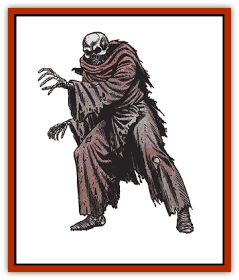

# Heucuva

| Statistic | **Heucuva** |
| --- | --- |
| **Activity Cycle:** | Any |
| **Alignment:** | Chaotic evil |
| **Armor Class:** | 3 |
| **Climate/Terrain:** | Any |
| **Damage/Attack:** | 1-6 |
| **Diet:** | Nil |
| **Frequency:** | Very rare |
| **Hit Dice:** | 2 |
| **Intelligence:** | Semi- (2-4) |
| **Magic Resistance:** | See below |
| **Morale:** | Steady (11) |
| **Movement:** | 9 |
| **No. Appearing:** | 1-10 |
| **No. of Attacks:** | 1 |
| **Organization:** | Solitary |
| **Size:** | M (5-7' tall) |
| **Special Attacks:** | Disease |
| **Special Defenses:** | Hit only by silver or +1 weapons |
| **THAC0:** | 19 |
| **Treasure:** | C |
| **XP Value:** | 270 |

The heucuva is an undead spirit similar in appearance to a [[Skeleton|skeleton]], but more dangerous and more difficult to dispel.

The heucuva appears to be a humanoid skeleton of normal size. The bones are covered by a robe that is little more than tattered rags.

**Combat:** The heucuva attacks by swiping with one of its hands; the sharp finger bones are capable of tearing into wood. A victim must roll a successful saving throw vs. poison or be afflicted with a disease. The victim suffers a daily loss of 1 point each of Strength and Constitution. A *cure disease* spell must be cast on the victim to prevent death and restore the lost points.

Heucuva are treated as wights on the Turning Undead table. They are resistant to all mind-influencing spells. Heucuva bones soon crumble once the monsters are destroyed.

Heucuva have a special hatred of priests. Once a priest uses his spells or tries to turn the heucuva, they will concentrate on attacking that priest. They may even ignore everyone else except for the priest and those defending him.

Heucuva are able to *polymorph* themselves up to three times a day. They may use this power to assume a nonthreatening shape in order to get close to an unsuspecting victim or avoid an undesired encounter when pursuing a specific prey. Heucuva may assume the form of people they have met in the recent past, such as a past victim or a member of the party that encounters the monsters. If the heucuva are in their lairs, they may assume their old (living) appearances. Groups encountered on the surface may appear to be pilgrims in procession. Such disguises fool only those who view the world solely via visible light; heucuva appear the same as other skeletal undead if looked at with infravision. The heucuva are incapable of speech; they can only moan or wail.

**Habitat/Society:** Heucuva roam the dark places of the world. They can be found in subterranean realms, as well as most temperate or tropical regions. Cold seems to prevent heucuvan activity, for they are not found in high, desolate mountains or in any cold regions.

Legends tell that heucuva are the restless spirits of monastic priests who were less than faithful to their holy vows. In punishment for their heresies, they are forced to roam the dark. Their spirits, appearance, and holy powers have become perverted mockeries of their old selves. The tatters they wear are the unrecognizable remains of their monks' robes. Instead of healing, they can kill with a diseased touch. Instead of helping others, they seek to kill all who still live. Even their old power to turn undead is now used to help them resist the efforts of others to turn them.

Heucuva retain dim memories of their old lives. Their lairs are decorated as grotesque mockeries of their old abbeys and temples. The corpses of past victims may be used to represent parishioners. These corpses may retain their original possessions, which may represent a large portion of the heucuvan treasure trove. Other accumulated treasures may be scattered around the mock altar as decorations or offerings. Such a mock temple is a chilling sight to most and an abomination that few good-aligned cleric can resist destroying.

Some heucuva are nomadic and constantly wander on a pilgrimage to nowhere. Even these are mockeries of real pilgrimages.

**Ecology:** Heucuva are malignant spirits that seek to destroy those who still live. They are used as examples to remind priests the fate that befalls those who stray from their devotion or use their religion as a mask to hide unpious deeds. Powdered heucuva bones may be used in the preparation of magical items intended to corrupt the spirits of living beings or to control undead.

---
## Discovery & Documentation

**Source Publication:** MC2 Volume II (1993)
**Campaign Setting:** Advanced Dungeons & Dragons 2nd Edition
**Author(s):** Jay Batista, Scott Bennie, Grant Boucher, William W. Connors, Steve Gilbert, Heike Kubasch, James Lowder, David Edward Martin, Bruce Nesmith, Jean Rabe, Rick Swan, John J. Terra, Gary L. Thomas

### Other Creatures Found in This Source Book
   * [[Ant|Ant]]
   * [[Ant_Lion_Giant|Ant Lion, Giant]]
   * [[Ape_Carnivorous|Ape, Carnivorous]]
   * [[Baboon|Baboon]]
   * [[Badger|Badger]]
   * [[Barracuda|Barracuda]]
   * [[Beetle_Giant|Beetle, Giant]]
   * [[Bulette|Bulette]]
   * [[Bullywug|Bullywug]]
   * [[Dwarf_Duergar|Dwarf, Duergar]]
   * [[Dwarf_Gully|Dwarf, Gully]]
   * [[Eagle|Eagle]]
   * [[Eel|Eel]]
   * [[Elemental_Air_Kin|Elemental, Air Kin]]
   * [[Elemental_Water_Kin|Elemental, Water Kin]]
   * [[Elemental_Water_Kin_Water_Weird|Elemental, Water Kin, Water Weird]]
   * [[Firestar|Firestar]]
   * [[Firetail|Firetail]]
   * [[Fish_Giant|Fish, Giant]]
   * [[Frog|Frog]]
   * [[Gorgon|Gorgon]]
   * [[Hawk|Hawk]]
   * [[Hippocampus|Hippocampus]]
   * [[Hippogriff|Hippogriff]]
   * [[Kelpie|Kelpie]]
   * [[Kenku|Kenku]]
   * [[Killmoulis|Killmoulis]]
   * [[Kuo-Toa|Kuo-Toa]]
   * [[Lamia|Lamia]]
   * [[Lammasu|Lammasu]]
   * [[Lamprey|Lamprey]]
   * [[Leech|Leech]]
   * [[Leprechaun|Leprechaun]]
   * [[Leucrotta|Leucrotta]]
   * [[Locathah|Locathah]]
   * [[Lycanthrope_Wereboar|Lycanthrope, Wereboar]]
   * [[Lycanthrope_Werefox|Lycanthrope, Werefox]]
   * [[Mammal_Minimal|Mammal, Minimal]]
   * [[Mammal_Small|Mammal, Small]]
   * [[Mimic|Mimic]]
   * [[Morkoth|Morkoth]]
   * [[Muckdweller|Muckdweller]]
   * [[Myconid|Myconid]]
   * [[Naga|Naga]]
   * [[Obliviax|Obliviax]]
   * [[Octopus_Giant|Octopus, Giant]]
   * [[Otyugh|Otyugh]]
   * [[Piranha|Piranha]]
   * [[Plant_Dangerous_I|Plant, Dangerous I]]
   * [[Plant_Intelligent|Plant, Intelligent]]
   * [[Poltergeist|Poltergeist]]
   * [[Porcupine|Porcupine]]
   * [[Rat_Osquip|Rat, Osquip]]
   * [[Roc|Roc]]
   * [[Roper|Roper]]
   * [[Rot_Grub|Rot Grub]]
   * [[Rust_Monster|Rust Monster]]
   * [[Sahuagin|Sahuagin]]
   * [[Sea_Lion|Sea Lion]]
   * [[Sea_Horse_Giant|Sea Horse, Giant]]
   * [[Shambling_Mound|Shambling Mound]]
   * [[Shark|Shark]]
   * [[Sphinx|Sphinx]]
   * [[Squid_Giant|Squid, Giant]]
   * [[Stirge|Stirge]]
   * [[Swanmay|Swanmay]]
   * [[Tarrasque|Tarrasque]]
   * [[Tasloi|Tasloi]]
   * [[Triton|Triton]]
   * [[Troglodyte|Troglodyte]]
   * [[Urchin|Urchin]]
   * [[Urd|Urd]]
   * [[Weasel|Weasel]]
   * [[Wolverine|Wolverine]]
   * [[Yellow_Musk_Creeper|Yellow Musk Creeper]]
