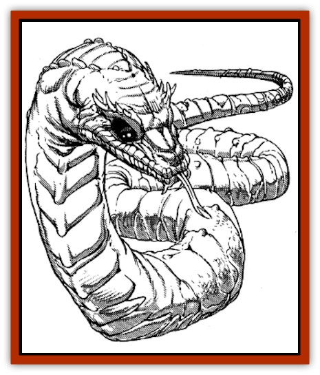

# Heway

| Statistic | **Heway** |
| --- | --- |
| **Activity Cycle:** | Dawn and dusk |
| **Alignment:** | Chaotic evil |
| **Armor Class:** | 7 |
| **Climate/Terrain:** | Desert oases |
| **Damage/Attack:** | 1-3 |
| **Diet:** | Carnivore |
| **Frequency:** | Uncommon |
| **Hit Dice:** | 1+3 |
| **Intelligence:** | Low (5-7) |
| **Magic Resistance:** | Nil |
| **Morale:** | Unsteady (5-7) |
| **Movement:** | 12, Sw 6 |
| **No. Appearing:** | 1-2 |
| **No. of Attacks:** | 1 |
| **Organization:** | Solitary |
| **Size:** | M (12' long) |
| **Special Attacks:** | Poison, hypnotic stare |
| **Special Defenses:** | Poison skin |
| **THAC0:** | 19 |
| **Treasure:** | Nil |
| **XP Value:** | 175 |

The heway is a large white [[Snake|snake]] with a deadly stare, a creature of the desert that enjoys poisoning wells and oases. It is hated and feared by other desert creatures, and desert tribesmen and others who depend on pure oasis water will kill heway on sight (with missile weapons so as to avoid being trapped by its stare).

Unlike the dry, scaly skin of most snakes, the heway has slimy, poison-coated scales that it sheds constantly. Its eyes are large because it only hunts by dim light; it has large pits on its snout that serve to detect heat, aiding it in nocturnal scavenging. A heway also has a very acute sense of smell, and its tongue can sense water from as far as 20 miles upwind. This allows the heway to orient itself to likely hunting grounds.

**Combat:** The heway is a cowardly animal and only fights when cornered. It prefers weakened prey, though if it is starving, it can stalk healthy animals. Its primary attack form is its ability to poison fresh water.

When it arrives at a well or oasis, the heway crawls in and swims around for several hours, slowing releasing its poison into every portion of the water. When the water is poisoned, any creature drinking from it must save versus poison at +2 or suffer 30 points damage within 3d6 minutes and be paralyzed for 1d6 hours. Creatures that make their save suffer 15 points of damage. Even animals that survive the initial effects are often doomed, as they must somehow reach another water source in their weakened state or die of dehydration. The snake is immune to the effects of its own poison.

The stare of the heway has a powerful hypnotic effect on its prey; any creature failing a saving throw vs. paralyzation will follow the heway to its lair and allow itself to be devoured. The heway sometimes uses this stare simply to immobilize a menacing creature. It then leaves the area while the hypnotized creature remains stationary for 1d6 turns.

Curiously, the heway does not have a venomous bite, and its jaws are weak. It will only take small, hypnotized game when poisoned prey is unavailable. Its poison is only excreted through the skin. Merely touching the skin of a heway has no poisonous effect; the poison must be ingested.

**Habitat/Society:** The lair of a heway is only large enough to accommodate the snake itself and perhaps one carcass. A cunning heway sometimes learns to poison a well, drag a large animal back to its lair, consume it, and then wait and digest until the well becomes drinkable again. Then it sallies forth to poison the well once more. It continues this trick as long as its lair remains undiscovered. If it requires additional food between poisonings, it may use its stare on small prey.

The heway avoids others of its kind except once a year, during the mating season. After the winter rains have come, the heway travel to ancestral spawning grounds in the deep desert. The young hatchlings are left to fend for themselves; the strongest devour the rest in order to survive and then crawl off in search of water.

**Ecology:** The heway is an opportunistic animal - it comes to a well, poisons it, and then waits for animals to drink and die before it attempts to feed. It doesn't mind sharing its kills with [[Jackal|jackals]] or other scavengers; a poisoned well usually results in plenty of meat for all the animals. A heway is most vulnerable during its overland journeys between wells, so it usually makes these trips by night.

Other animals, especially herd animals, will kill a heway by trampling it if they can catch it out in the open during daylight. Predators like [[Hyena|hyena]] and [[Cat_Great|great cats]] generally leave the area, as they can only hope to kill the snake with their claws; predators that bite a heway often don't survive.

The heway is occasionally hunted by unscrupulous tribes which use it to poison the waterholes of their enemies. Since its stare makes it dangerous even when caged, dead snakes are usually used for this purpose. In this case, the poison is at half strength and saves are made at twice the usual bonus (+4).

Poisoned bodies of water become drinkable up to 2d6 days after the snake is removed, depending on how quickly the water replenishes itself. A small, quickly evaporating oasis fed by an underground spring may be drinkable within two days, while a well which is not often used (and where the water is not frequently recirculated) might take two weeks.

---
## Discovery & Documentation

**Source Publication:** MC13 Al-Qadim Appendix (1992)
**Campaign Setting:** Al-Qadim (Forgotten Realms)
**Author(s):** C. Terry Phillips

### Other Creatures Found in This Source Book
   * [[Ammut|Ammut]]
   * [[Ashira|Ashira]]
   * [[Asuras|Asuras]]
   * [[Black_Cloud_of_Vengeance|Black Cloud of Vengeance]]
   * [[Buraq|Buraq]]
   * [[Camel|Camel]]
   * [[Camel_of_the_Pearl|Camel of the Pearl]]
   * [[Centaur_Desert|Centaur, Desert]]
   * [[Copper_Automaton|Copper Automaton]]
   * [[Debbi|Debbi]]
   * [[Elephant_Bird|Elephant Bird]]
   * [[Gen|Gen]]
   * [[Genie_Noble_Dao|Genie, Noble Dao]]
   * [[Genie_Noble_Djinni|Genie, Noble Djinni]]
   * [[Genie_Noble_Efreeti|Genie, Noble Efreeti]]
   * [[Genie_Noble_Marid|Genie, Noble Marid]]
   * [[Genie_Tasked_Architect_Builder|Genie, Tasked, Architect/Builder]]
   * [[Genie_Tasked_Artist|Genie, Tasked, Artist]]
   * [[Genie_Tasked_Guardian|Genie, Tasked, Guardian]]
   * [[Genie_Tasked_Herdsman|Genie, Tasked, Herdsman]]
   * [[Genie_Tasked_Slayer|Genie, Tasked, Slayer]]
   * [[Genie_Tasked_Warmonger|Genie, Tasked, Warmonger]]
   * [[Genie_Tasked_Winemaker|Genie, Tasked, Winemaker]]
   * [[Ghost_Mount|Ghost Mount]]
   * [[Ghul|Ghul]]
   * [[Giant_Desert|Giant, Desert]]
   * [[Giant_Jungle|Giant, Jungle]]
   * [[Giant_Reef|Giant, Reef]]
   * [[Giant_Zakhara_General_Information|Giant (Zakhara), General Information]]
   * [[Hama|Hama]]
   * [[Living_Idol|Living Idol]]
   * [[Lycanthrope_Werehyena|Lycanthrope, Werehyena]]
   * [[Lycanthrope_Werelion|Lycanthrope, Werelion]]
   * [[Markeen|Markeen]]
   * [[Maskhi|Maskhi]]
   * [[Mason_Wasp_Giant|Mason Wasp, Giant]]
   * [[Nasnas|Nasnas]]
   * [[Pahari|Pahari]]
   * [[Rom|Rom]]
   * [[Sabu_Lord|Sabu Lord]]
   * [[Sakina|Sakina]]
   * [[Serpent_Lord|Serpent Lord]]
   * [[Serpent_Winged|Serpent, Winged]]
   * [[Silat|Silat]]
   * [[Simurgh|Simurgh]]
   * [[Stone_Maiden|Stone Maiden]]
   * [[Vishap|Vishap]]
   * [[Zaratan|Zaratan]]
   * [[Zin|Zin]]
