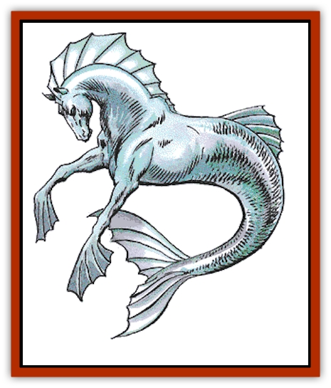

# Hippocampus

| Statistic | **Hippocampus** |
| --- | --- |
| **Activity Cycle:** | Any |
| **Alignment:** | Chaotic good |
| **Armor Class:** | 5 |
| **Climate/Terrain:** | Fresh or salt water depths |
| **Damage/Attack:** | 1-4 |
| **Diet:** | Herbivore |
| **Frequency:** | Rare |
| **Hit Dice:** | 4 |
| **Intelligence:** | Average (8-10) |
| **Magic Resistance:** | Nil |
| **Morale:** | Steady (11-12) |
| **Movement:** | Sw 24 |
| **No. Appearing:** | 2-8 |
| **No. of Attacks:** | 1 |
| **Organization:** | Herd |
| **Size:** | H (18' long) |
| **Special Attacks:** | Nil |
| **Special Defenses:** | Nil |
| **THAC0:** | 17 |
| **Treasure:** | Nil |
| **XP Value:** | 120 |

The hippocampus is the most prized of the marine steeds, a creature that combines features of a [[Horse|horse]] and a [[Fish|fish]].

The hippocampus has the head, forelegs, and torso of a horse. The equine section is covered with short hair. The mane is made of long, flexible fins. The front hooves are replaced by webbed fins that fold up as the leg moves forward, then fan out as the leg strokes back. Past the rib cage the body becomes fish-like. The tail tapers 14 feet into a wide horizontal fin. A dorsal fin is located on the rump. Coloration is that of seawater. Typical colors include ivory, pale green, pale blue, aqua, deep blue, and deep green.

**Combat:** Hippocampi are usually peaceful creatures. They do not attack unless cornered or if another hippocampus or an ally is threatened. They are fast enough to out-swim most anything that would want to attack them.

The hippocampus attacks with a strong bite. It suddenly extends its head, chomps down with a crushing bite, and then releases. Hippocampi do not hold onto their opponents.

Hippocampi also butt their heads against targets. Such attacks may stun an opponent or break his bones. Their firm, powerfully muscled bodies provide a strong protection against attack. The blood coagulates quickly on exposure to water, thus minimizing blood loss that could both debilitate the hippocampus and attract [[Shark|sharks]] (sharks have only a 20% chance of going into a feeding frenzy if the only bleeding creature is a hippocampus).

**Habitat/Society:** Hippocampi are the prized steeds of the sea. They can be found in deep waters anywhere, in freshwater lakes and oceans. They are able to breathe fresh and salt water with equal ease. They can also breathe air but require frequent gulps of water to keep from drying out. They are unable to move out of water.

Despite their radically different environments, horses and hippocampi are very similar. They have approximately the same sizes, life spans, and personalities, although hippocampi are blessed with much higher intelligence.

Hippocampi are herbivores. They normally graze on seaweed and other soft vegetation. If their usual fodder is unavailable, their strong teeth can chew up mollusks and coral.

Wild hippocampi roam in herds of 2d4. These are usually a stallion, 1d4 mares, and the rest young hippocampi of either sex. Hippocampus mares lay a single, large egg. After six months, the egg hatches a single foal. Twins are extremely rare (1% chance). The foals grow quickly in two years. The yearlings are physically the equals of the adults. Hippocampian tales speak of a "Great Herd" of hundreds or thousands of hippocampi that roams the uncharted reaches of the far seas. No non-hippocampi have ever seen this spectacle.

Hippocampi may be "domesticated" by water-breathing humanoids, especially [[Triton|tritons]]. In truth, the intelligent hippocampi cooperate with the humanoids. The hippocampi provide their services as steeds and allies while the humanoids provide protection. The benevolent hippocampi may assist surface dwellers who are visiting the aquatic world, whether voluntarily or by accident. Many a shipwrecked sailor has been saved from drowning by a passing hippocampus. Hippocampi are good judges of character; they will not assist an evil being or anyone who acts in a hostile manner toward them. Sometimes a hippocampus's offer of a ride can be more trouble than it is worth. Young hippocampi often forget that most surface dwellers breathe air, not water.

Hippocampi do not accumulate treasure. Most spurn even ornamental gifts such as collars or leg bands. They simply have no use for these gewgaws. They do appreciate delicacies, however, in the forms of tasty foods not available in the water.

**Ecology:** Hippocampi are one of the most successful of the intelligent, good-aligned marine monsters. They maintain ties with [[Merman|mermen]] and [[Elf_Aquatic|sea elves]], as well as surface dwellers who make their living in the water. They provide valuable services as steeds, guides, and allies. Hippocampus eggs sell for 1,500 gp. Young hippocampi are worth 2,500 gp. However, surface dwellers who have been saved by hippocampi remain so grateful to their former rescuers that they may attack any merchant selling eggs or foals in a public market and attempt to return the hippocampi to the sea.

---
## Discovery & Documentation

**Source Publication:** MC2 Volume II (1993)
**Campaign Setting:** Advanced Dungeons & Dragons 2nd Edition
**Author(s):** Jay Batista, Scott Bennie, Grant Boucher, William W. Connors, Steve Gilbert, Heike Kubasch, James Lowder, David Edward Martin, Bruce Nesmith, Jean Rabe, Rick Swan, John J. Terra, Gary L. Thomas

### Other Creatures Found in This Source Book
   * [[Ant|Ant]]
   * [[Ant_Lion_Giant|Ant Lion, Giant]]
   * [[Ape_Carnivorous|Ape, Carnivorous]]
   * [[Baboon|Baboon]]
   * [[Badger|Badger]]
   * [[Barracuda|Barracuda]]
   * [[Beetle_Giant|Beetle, Giant]]
   * [[Bulette|Bulette]]
   * [[Bullywug|Bullywug]]
   * [[Dwarf_Duergar|Dwarf, Duergar]]
   * [[Dwarf_Gully|Dwarf, Gully]]
   * [[Eagle|Eagle]]
   * [[Eel|Eel]]
   * [[Elemental_Air_Kin|Elemental, Air Kin]]
   * [[Elemental_Water_Kin|Elemental, Water Kin]]
   * [[Elemental_Water_Kin_Water_Weird|Elemental, Water Kin, Water Weird]]
   * [[Firestar|Firestar]]
   * [[Firetail|Firetail]]
   * [[Fish_Giant|Fish, Giant]]
   * [[Frog|Frog]]
   * [[Gorgon|Gorgon]]
   * [[Hawk|Hawk]]
   * [[Heucuva|Heucuva]]
   * [[Hippogriff|Hippogriff]]
   * [[Kelpie|Kelpie]]
   * [[Kenku|Kenku]]
   * [[Killmoulis|Killmoulis]]
   * [[Kuo-Toa|Kuo-Toa]]
   * [[Lamia|Lamia]]
   * [[Lammasu|Lammasu]]
   * [[Lamprey|Lamprey]]
   * [[Leech|Leech]]
   * [[Leprechaun|Leprechaun]]
   * [[Leucrotta|Leucrotta]]
   * [[Locathah|Locathah]]
   * [[Lycanthrope_Wereboar|Lycanthrope, Wereboar]]
   * [[Lycanthrope_Werefox|Lycanthrope, Werefox]]
   * [[Mammal_Minimal|Mammal, Minimal]]
   * [[Mammal_Small|Mammal, Small]]
   * [[Mimic|Mimic]]
   * [[Morkoth|Morkoth]]
   * [[Muckdweller|Muckdweller]]
   * [[Myconid|Myconid]]
   * [[Naga|Naga]]
   * [[Obliviax|Obliviax]]
   * [[Octopus_Giant|Octopus, Giant]]
   * [[Otyugh|Otyugh]]
   * [[Piranha|Piranha]]
   * [[Plant_Dangerous_I|Plant, Dangerous I]]
   * [[Plant_Intelligent|Plant, Intelligent]]
   * [[Poltergeist|Poltergeist]]
   * [[Porcupine|Porcupine]]
   * [[Rat_Osquip|Rat, Osquip]]
   * [[Roc|Roc]]
   * [[Roper|Roper]]
   * [[Rot_Grub|Rot Grub]]
   * [[Rust_Monster|Rust Monster]]
   * [[Sahuagin|Sahuagin]]
   * [[Sea_Lion|Sea Lion]]
   * [[Sea_Horse_Giant|Sea Horse, Giant]]
   * [[Shambling_Mound|Shambling Mound]]
   * [[Shark|Shark]]
   * [[Sphinx|Sphinx]]
   * [[Squid_Giant|Squid, Giant]]
   * [[Stirge|Stirge]]
   * [[Swanmay|Swanmay]]
   * [[Tarrasque|Tarrasque]]
   * [[Tasloi|Tasloi]]
   * [[Triton|Triton]]
   * [[Troglodyte|Troglodyte]]
   * [[Urchin|Urchin]]
   * [[Urd|Urd]]
   * [[Weasel|Weasel]]
   * [[Wolverine|Wolverine]]
   * [[Yellow_Musk_Creeper|Yellow Musk Creeper]]
