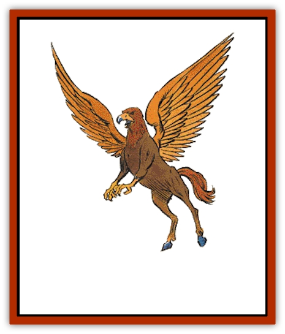

# Hippogriff

| Statistic | **Hippogriff** |
| --- | --- |
| **Activity Cycle:** | Day |
| **Alignment:** | Neutral |
| **Armor Class:** | 5 |
| **Climate/Terrain:** | Unpopulated regions |
| **Damage/Attack:** | 1-6/1-6/1-10 |
| **Diet:** | Omnivore |
| **Frequency:** | Rare |
| **Hit Dice:** | 3+3 |
| **Intelligence:** | Semi- (2-4) |
| **Magic Resistance:** | Nil |
| **Morale:** | Average (9) |
| **Movement:** | 18, Fl 36 (C,D) |
| **No. Appearing:** | 2-16 |
| **No. of Attacks:** | 3 |
| **Organization:** | Herd |
| **Size:** | L (10' long) |
| **Special Attacks:** | Nil |
| **Special Defenses:** | Nil |
| **THAC0:** | 17 |
| **Treasure:** | Q&times;5 |
| **XP Value:** | 175 |

Hippogriffs are flying monsters that have an equal likelihood to be predator, prey, or steed.

The hippogriff is a monstrous hybrid of [[Eagle|eagle]] and equine features. It has the ears, neck, mane, torso, and hind legs of a [[Horse|horse]]. The wings, forelegs, and face are those of an eagle. It is about the size of a light riding horse. A hippogriff may be colored russet, golden tan, or a variety of browns. The feathers are usually a different shade than the hide. The beak is ivory or golden yellow.

**Combat:** The hippogriff attacks with its eagle-like claws and beak. Each claw can tear for 1d6 points of damage, while the scissor-like beak inflicts 1d10 points of damage.

**Habitat/Society:** Hippogriffs prefer the desolate sections of the temperate and tropic regions, especially rolling hills that enable them to get quickly airborne.

Hippogriffs are territorial. They have a preferred grazing and hunting area that covers 1d4x10 square miles. Somewhere in this territory is a naturally protected site that serves as the hippogriff nest. Here is where the young hippogriffs stay. The nest is always guarded.

The typical hippogriff herd includes 1-3 adult males, an equal number of mares, and the rest are immature young. There is a 25% chance that one or more of the mares is pregnant. Gestation takes 10 months. During the first five months, this occurs within the mare. Then she lays an egg that hatches in another five months. Twin births are rare (1% chance).

The foal is able to walk upon hatching. Its beak remains soft for the first two weeks; this enables the foal to nurse. Then its beak hardens and the hippogriff switches to regurgitated food from its mother. The colts learn to eat solid meat at four months, although they are clumsy killers (-4 penalty to attack rolls and damage). At six months they can fly (18, class D) and fight with a -2 penalty to attack rolls and damage. Yearlings are identical to adults, although they are unable to breed until they are three years old.

Wild hippogriffs are omnivorous. They feed on whatever is available, whether greenery, fruits, or wildlife. Hippogriffs are able to attack fairly large prey, such as bison, but they do not prey on carnivores. The exception is humanoids. Hippogriffs may, in the absence of other meat, attack small groups of people. Bodies are then carried back to the nest to feed the others; this is where the victim's possessions usually spill out. Hippogriffs are clean monsters; they dispose of carcasses and other debris by carrying them downhill. They like clear, sparkly things like glass, crystals, and precious gems. Males may amass a small trove kept covered by brush. As a mating ritual, he arranges these in a display to entice mares.

**Ecology:** Hippogriffs are closely related to [[Griffon|griffons]]. Just as griffons are the result of crossing an eagle with a [[Cat_Great|lion]], hippogriffs resulted from the crossing of an eagle with a horse. Hippogriffs may have been created as a natural prey for the griffons. Fortunately for the hippogriff, its own formidable weapons give it a fighting chance. To make up for the griffon's superiority, hippogriffs gather in larger groups.

Hippogriffs are also related to [[Pegasus|pegasi]]. Because the hippogriffs eat meat, pegasi avoid their company.

Hippogriffs make excellent flying mounts. The maneuverability decreases to Class D, but their speed is unimpaired. They are less likely to eat the rider than a griffon is.

If a hippogriff is captured while still very young (under four months), it can be domesticated and trained to serve as a steed. Hippogriff eggs sell for 1,000 gp, young hippogriffs for 2,000-3,000 gp. It will probably have to be taught to fly. Domestic hippogriffs are also taught to recognize a limited number of species as food; humanoids of course are not on that list. Hippogriffs have difficulty breeding in captivity. Like flying, the wild hippogriff has to be captured before such skills are learned. Mature hippogriffs may be persuaded to voluntarily assist riders who can provide them with ample food or protection.

---
## Discovery & Documentation

**Source Publication:** MC2 Volume II (1993)
**Campaign Setting:** Advanced Dungeons & Dragons 2nd Edition
**Author(s):** Jay Batista, Scott Bennie, Grant Boucher, William W. Connors, Steve Gilbert, Heike Kubasch, James Lowder, David Edward Martin, Bruce Nesmith, Jean Rabe, Rick Swan, John J. Terra, Gary L. Thomas

### Other Creatures Found in This Source Book
   * [[Ant|Ant]]
   * [[Ant_Lion_Giant|Ant Lion, Giant]]
   * [[Ape_Carnivorous|Ape, Carnivorous]]
   * [[Baboon|Baboon]]
   * [[Badger|Badger]]
   * [[Barracuda|Barracuda]]
   * [[Beetle_Giant|Beetle, Giant]]
   * [[Bulette|Bulette]]
   * [[Bullywug|Bullywug]]
   * [[Dwarf_Duergar|Dwarf, Duergar]]
   * [[Dwarf_Gully|Dwarf, Gully]]
   * [[Eagle|Eagle]]
   * [[Eel|Eel]]
   * [[Elemental_Air_Kin|Elemental, Air Kin]]
   * [[Elemental_Water_Kin|Elemental, Water Kin]]
   * [[Elemental_Water_Kin_Water_Weird|Elemental, Water Kin, Water Weird]]
   * [[Firestar|Firestar]]
   * [[Firetail|Firetail]]
   * [[Fish_Giant|Fish, Giant]]
   * [[Frog|Frog]]
   * [[Gorgon|Gorgon]]
   * [[Hawk|Hawk]]
   * [[Heucuva|Heucuva]]
   * [[Hippocampus|Hippocampus]]
   * [[Kelpie|Kelpie]]
   * [[Kenku|Kenku]]
   * [[Killmoulis|Killmoulis]]
   * [[Kuo-Toa|Kuo-Toa]]
   * [[Lamia|Lamia]]
   * [[Lammasu|Lammasu]]
   * [[Lamprey|Lamprey]]
   * [[Leech|Leech]]
   * [[Leprechaun|Leprechaun]]
   * [[Leucrotta|Leucrotta]]
   * [[Locathah|Locathah]]
   * [[Lycanthrope_Wereboar|Lycanthrope, Wereboar]]
   * [[Lycanthrope_Werefox|Lycanthrope, Werefox]]
   * [[Mammal_Minimal|Mammal, Minimal]]
   * [[Mammal_Small|Mammal, Small]]
   * [[Mimic|Mimic]]
   * [[Morkoth|Morkoth]]
   * [[Muckdweller|Muckdweller]]
   * [[Myconid|Myconid]]
   * [[Naga|Naga]]
   * [[Obliviax|Obliviax]]
   * [[Octopus_Giant|Octopus, Giant]]
   * [[Otyugh|Otyugh]]
   * [[Piranha|Piranha]]
   * [[Plant_Dangerous_I|Plant, Dangerous I]]
   * [[Plant_Intelligent|Plant, Intelligent]]
   * [[Poltergeist|Poltergeist]]
   * [[Porcupine|Porcupine]]
   * [[Rat_Osquip|Rat, Osquip]]
   * [[Roc|Roc]]
   * [[Roper|Roper]]
   * [[Rot_Grub|Rot Grub]]
   * [[Rust_Monster|Rust Monster]]
   * [[Sahuagin|Sahuagin]]
   * [[Sea_Lion|Sea Lion]]
   * [[Sea_Horse_Giant|Sea Horse, Giant]]
   * [[Shambling_Mound|Shambling Mound]]
   * [[Shark|Shark]]
   * [[Sphinx|Sphinx]]
   * [[Squid_Giant|Squid, Giant]]
   * [[Stirge|Stirge]]
   * [[Swanmay|Swanmay]]
   * [[Tarrasque|Tarrasque]]
   * [[Tasloi|Tasloi]]
   * [[Triton|Triton]]
   * [[Troglodyte|Troglodyte]]
   * [[Urchin|Urchin]]
   * [[Urd|Urd]]
   * [[Weasel|Weasel]]
   * [[Wolverine|Wolverine]]
   * [[Yellow_Musk_Creeper|Yellow Musk Creeper]]
