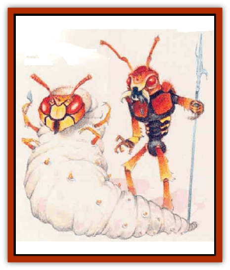

# Hivebrood

| Statistic | **Broodling** | **Controller** | **Lieutenant** | **Mother** | **Soldier** |
| --- | --- | --- | --- | --- | --- |
| **Activity Cycle:** | Night | Night | Night | Night | Night |
| **Alignment:** | Neutral | Neutral | Neutral | Neutral | Neutral |
| **Armor Class:** | 6 | 6 | 2 | 8 | 3 |
| **Climate/Terrain:** | Any cavern | Any cavern | Any land | Any cavern | Any land |
| **Damage/Attack:** | 1d4/1d4/1d6 or 1d6/hy weapon  | 1d4/1d4/1d6 | 1d6/1d6/1d10 or 1d10/by weapon | Nil | 1d4/1d4/1d9 or 1d8/by weapon |
| **Diet:** | Carnivore | Carnivore | Carnivore | Carnivore | Carnivore |
| **Frequency:** | Rare | Very rare | Very rare | Very rare | Rare |
| **Hit Dice:** | As host+1d4 hp or 2+1, / whichever is greater | 6+6 | 5+1 | 12+2 | 3+1 |
| **Intelligence:** | Semi- (4) | Exceptional (16) | Average (10) | Non- (0) | Low (7) |
| **Magic Resistance:** | Nil | Nil | Nil | Nil | Nil |
| **Morale:** | Fearless (20) | Fearless (20) | Fearless (20) | Fearless (20) | Fearless (20) |
| **Movement:** | 12 | 3 | 12 | 1 | 12 |
| **No. Appearing:** | 1d10&times;10 | 1d4 | 2d4 | 1 | 1d10&times;10 |
| **No. of Attacks:** | 3 or 2 | 3 | 3 or 2 | 0 | 3 or 2 |
| **Organization:** | Colony | Colony | Colony | Colony | Colony |
| **Size:** | M (4½-7' tall) | M (7' long) | M (7' tall) | L (12' long) | M (5' tall) |
| **Special Attacks:** | Hivemind powers | Paralysis, hivemind powers | Paralysis, hivemind powers | Poisonous gas | Paralysis, hivemind powers |
| **Special Defenses:** | Immune to vision- / affecting spells | Immune to vision- / affecting spells | Immune to vision- / affecting spells | Immune to vision- / affecting spells | Immune to vision- / affecting spells |
| **THAC0:** | As host or 19 | 13 | 15 | 9 | 17 |
| **Treasure:** | O (I) | N,O,U,V (I) | N,U,V (I) | N,O,U,V (I) | N,O,U (J) |
| **XP Value:** | 270 or by host | 4,000 | 1,400 | 4,000 | 420 |

Hivebroods are communities of insects somewhat similar to [[Ant|ant]] colonies. Unlike ants, however, the large, parasitic members of a hivebrood live by infesting other beings, controlling and eventually destroying the hosts in the process. For members of a hivebrood, individuals have no meaning or worth; only the interests of the hive matter.

Hivebrood insects have many specialized forms, each one performing a specific function for the hive. The five different functional types of hivebrood member are the broodling, soldier, lieutenant, mother, and controller.

A hivebrood also contains insects in a larval form that resembles a legless beetle about 6 inches in length. The larva has 1 hit point and AC 10 and cannot move or attack on its own. Another hivebrood member places a larva on a paralyzed humanoid victim; the immature creature uses its mouth to attach itself to the back of the victim's neck, where it bites into the spinal cord and begins altering the host's metabolism.

A humanoid altered by the parasitic larva becomes a broodling, the least powerful type of mobile hivebrood insect. Eventually, a broodling develops into a soldier. Broodlings and soldiers are the most common hivebrood members.

Broodlings and soldiers follow lieutenants, a stronger form of soldier. A controller (sometimes called the hivemind) transmits knowledge and abilities to hroodlings, soldiers, and lieutenants - in effect, coordinating all the hivebrood's activities. A mother exists solely for reproduction.

All hivebrood members emit asickly sweet chemical odor and make a wet clacking sound with their large mandibles. (Broodlings use their host's teeth to imitate this sound.) The following text details each type of functional hive insect.

**Broodling**

  Broodlings are the altered hosts of parasitic hivebrood larvae. Outsiders can recognize them by the fibrous membranes that cover their eyes and by their chitinous skin. A broodling's insectlike way of moving adds to its frightening aspect.

**Soldier**

  Though humanoid in appearance, soldiers have antennae, compound eyes, and a tough, chitinous exoskeleton.

**Lieutenant**

  Larger, stronger, and more intelligent than the average soldier, a lieutenant otherwise resembles the hivebrood insects it leads.

**Mother and Controller**

  These hivebrood members control the rest of the hive. Both forms have large, sacklike bodies and insectoid faces. Although the controller can attack with its claws and bite, neither of these forms is very mobile.

**Combat:** In battle, all members of the hivebrood attack fearlessly, having no thought whatsoever for personal safety. The controllers guide combat; these very intelligent creatures willingly sacrifice any of their vast resources for the best advantage of the hive. All members of the hivebrood fight as well in darkness as they do in daylight, sensing the posation of opponents by feel and smell. This ability makes them immune to the effects of spells such as *darkness*, although this type of spell cast in conjunction with *silence* confuses the creatures enough to give them a -2 modifier to all attacks. Hivebrood insects suffer double damage from fire- and heat-based attacks.

The attacks of each hivebrood type follow. Note that a controller can confer additional abilities upon any creature.

Broodlings do not make the best warriors, since their bodies are still undergoing metamorphosis, but they can attack with their developing bite and claws or with a bite and one weapon (often a spear or axe).

Even poorer warriors, mothers engage in combat only if the very center of the hive faces a threat. As their only form of attack, mothers emit a cloud of noxious chemicals within a 30-foot radius. They can spew this cloud up to three times a day; those caught in the spray must make a saving throw vs. poison at a -1 penalty or suffer 3d6 points of damage per round until making a successful saving throw against the chemical cloud.

Soldiers are the hivebrood's real workers. They attack in the same manner as broodlings, but their sticky, saliva-filled bite causes paralysis (unless a successful saving throw vs. poison counters it) for 2d8 turns or until a *neutralize poison*, *cure serious wounds*, or *haste* spell helps the victim recover. Soldiers almost never kill paralyzed victims immediately; instead, they bring them into the hive to serve as hosts for new broodlings.

Lieutenants command clusters of hivebrood soldiers with military precision. These "officers" of the hive give orders through chemical scent emissions in a 30-foot radius. They also can "store" up to five hivemind abilities (see below) and pass them on to the insects under their command.

Although controllers can attack with a soldier's claws and paralytic bite, their main ability, called hivemind, remains much more fearsome. Hivemind allows a controller to gain all the abilities of the creatures it eats, including any saving throws that improve on its own. It can pass on these hivemind abilities to any hivebrood member through airborne chemical emissions. If, for example, a controller has dined on a 3rd-level thief and a 6th-level wizard, it can send out chemical signals to all in the hivebrood that enable them to hide in shadows as 3rd-level thieves or cast any of the spells the wizard had memorized at the time the character was eaten. Thus, all the members of a hive could cast fireball spells, if a controller has eaten a wizard who knew and had memorized the spell!

Fortunately, the hivemind skill transfer has limits. The chemical emissions travel at a rate of only 60 feet per round and dissipates completely after three rounds. If hivebrood insects do not use a hivemind ability within three rounds of receiving it, they lose the ability) except lieutenants, which can "store" abilities, as mentioned above). Furthermore, a controller can activate only one hivemind ability at a time in a single hive. If it emits a second chemical scent before the first has vanished from the minds of the hivebrood members (six rounds), recipients become confused and unable to attack, although they remain able to defend themselves. If hivebrood insects receive two or more hvemind scents from different controllers, they can use them all, though only one at a time.

Once a controller emits a hivemind ability as a chemical scent, it "forgets" the ability, although it may keep an unlimited number in its mind at any one time. This collection can include duplicated abilities and spells, if the controller has eaten several individuals with similar abilities.

An "ability" is defined as one spell (of any level or type), a skill such as a thief's ability, an attack rank, or a fighter�s option such as multiple attacks, smash, parry, or disarm.

A hivebrood member loses 1 hit point in the process of casting any spell. Yet the creature will suffer the loss - even die - to cast a spell for the good of the all-important hive.

**Habitat/Society:** Within the hivebrood, the members form a strict and distinct hierarchy, each doing its appointed task to the best of its ability to further the goals of the hive. Each hivebrood has one mother, the queen and living center of the hive. This large creature can barely move, but others in the hivebrood protect it with fanatical devotion. Besides laying eggs, it secretes a chemical-rich, foul-smelling jelly, which it applies to certain larvae to cause them to develop into lieutenants and controllers.

Not only do the controllers dispense hivemind abilities, they make most of the hivebrood's decisions, including telling the mother when to produce another mother egg and choosing where to send this egg (with a retinue) to start another hive.

---
## Discovery & Documentation

**Source Publication:** Mystara Appendix (1994)
**Campaign Setting:** Mystara
**Author(s):** John Nephew, Teeuwynn Woodruff, John Terra, Skip Williams

### Other Creatures Found in This Source Book
   * [[Actaeon|Actaeon]]
   * [[Agarat|Agarat]]
   * [[Ash_Crawler|Ash Crawler]]
   * [[Baldandar|Baldandar]]
   * [[Bargda|Bargda]]
   * [[Bhut|Bhut]]
   * [[Bird_Mystara|Bird (Mystara)]]
   * [[Blackball|Blackball]]
   * [[Choker|Choker]]
   * [[Coltpixie|Coltpixie]]
   * [[Crone_of_Chaos|Crone of Chaos]]
   * [[Darkhood|Darkhood]]
   * [[Darkwing|Darkwing]]
   * [[Decapus|Decapus]]
   * [[Deep_Glaurant|Deep Glaurant]]
   * [[Diabolus|Diabolus]]
   * [[Dimensional_Warper|Dimensional Warper]]
   * [[Dragon_Mystara_Crystalline|Dragon (Mystara), Crystalline]]
   * [[Dragon_Mystara_Jade|Dragon (Mystara), Jade]]
   * [[Dragon_Mystara_Onyx|Dragon (Mystara), Onyx]]
   * [[Dragon_Mystara_Ruby|Dragon (Mystara), Ruby]]
   * [[Drake_Mystara|Drake (Mystara)]]
   * [[Dragonfly|Dragonfly]]
   * [[Dusanu|Dusanu]]
   * [[Elemental_of_Chaos_Air_Earth|Elemental of Chaos, Air/Earth]]
   * [[Elemental_of_Chaos_Fire_Water|Elemental of Chaos, Fire/Water]]
   * [[Elemental_of_Law_Air_Earth|Elemental of Law, Air/Earth]]
   * [[Elemental_of_Law_Fire_Water|Elemental of Law, Fire/Water]]
   * [[Familiar_Mystara|Familiar (Mystara)]]
   * [[Frost_Salamander|Frost Salamander]]
   * [[Fundamental_Air_Earth|Fundamental, Air/Earth]]
   * [[Fundamental_Fire_Water|Fundamental, Fire/Water]]
   * [[Gargantua_Mystara|Gargantua (Mystara)]]
   * [[Geonid|Geonid]]
   * [[Ghostly_Horde|Ghostly Horde]]
   * [[Giant_Athach|Giant, Athach]]
   * [[Giant_Hephaeston|Giant, Hephaeston]]
   * [[Golem_Drolem|Golem, Drolem]]
   * [[Golem_Mystara_I|Golem (Mystara) I]]
   * [[Golem_Mystara_II|Golem (Mystara) II]]
   * [[Golem_Mystara_III|Golem (Mystara) III]]
   * [[Gray_Philosopher|Gray Philosopher]]
   * [[Guardian_Warrior|Guardian Warrior]]
   * [[Gyerian|Gyerian]]
   * [[Herex|Herex]]
   * [[Horde|Horde]]
   * [[Hsiao|Hsiao]]
   * [[Huptzeen|Huptzeen]]
   * [[Hutaakan|Hutaakan]]
   * [[Imp_Mystara|Imp (Mystara)]]
   * [[Jellyfish_Giant_Mystara|Jellyfish, Giant (Mystara)]]
   * [[Kna|Kna]]
   * [[Kopru|Kopru]]
   * [[Lizard_Mystara|Lizard (Mystara)]]
   * [[Lizard-kin_Mystara|Lizard-kin (Mystara)]]
   * [[Lupin|Lupin]]
   * [[Lycanthrope_Werejaguar_Mystara|Lycanthrope, Werejaguar (Mystara)]]
   * [[Lycanthrope_Wereswine|Lycanthrope, Wereswine]]
   * [[Magen|Magen]]
   * [[Manikin|Manikin]]
   * [[Mek|Mek]]
   * [[Mujina|Mujina]]
   * [[Nagpa|Nagpa]]
   * [[Neh-thalggu|Neh-thalggu]]
   * [[Nightshade_Mystara|Nightshade (Mystara)]]
   * [[Nuckalavee|Nuckalavee]]
   * [[Pegataur|Pegataur]]
   * [[Phanaton|Phanaton]]
   * [[Plant_Dangerous_Mystara|Plant, Dangerous (Mystara)]]
   * [[Plasm|Plasm]]
   * [[Rakasta|Rakasta]]
   * [[Rock_Man|Rock Man]]
   * [[Sabreclaw|Sabreclaw]]
   * [[Sacrol|Sacrol]]
   * [[Scamille|Scamille]]
   * [[Shapeshifter|Shapeshifter]]
   * [[Shargugh|Shargugh]]
   * [[Shark-kin|Shark-kin]]
   * [[Sollux|Sollux]]
   * [[Spectral_Death|Spectral Death]]
   * [[Spectral_Hound|Spectral Hound]]
   * [[Spider-kin|Spider-kin]]
   * [[Spirit_Mystara|Spirit (Mystara)]]
   * [[Statue_Living|Statue, Living]]
   * [[Surtaki|Surtaki]]
   * [[Tabi|Tabi]]
   * [[Thoul|Thoul]]
   * [[Thunderhead|Thunderhead]]
   * [[Tiger_Ebon|Tiger, Ebon]]
   * [[Topi|Topi]]
   * [[Tortle|Tortle]]
   * [[Vampire_Velya|Vampire, Velya]]
   * [[White_Fang|White Fang]]
   * [[Worm_Mystara|Worm (Mystara)]]
   * [[Wyrd|Wyrd]]
   * [[Yowler|Yowler]]
   * [[Zombie_Lightning|Zombie, Lightning]]
