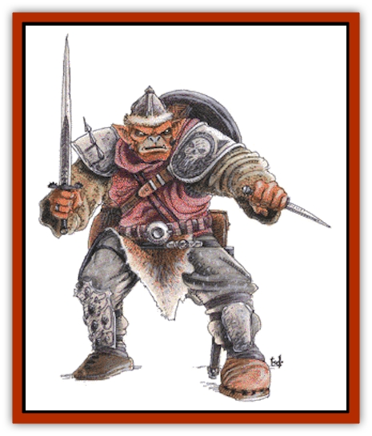

# Hobgoblin

| Statistic | **Hobgoblin** |
| --- | --- |
| **Activity Cycle:** | Any |
| **Alignment:** | Lawful evil |
| **Armor Class:** | 5 (10) |
| **Climate/Terrain:** | Any non-arctic |
| **Damage/Attack:** | By weapon |
| **Diet:** | Omnivore |
| **Frequency:** | Uncommon |
| **Hit Dice:** | 1+1 |
| **Intelligence:** | Average (8-10) |
| **Magic Resistance:** | Nil |
| **Morale:** | Steady (11-12) |
| **Movement:** | 9 |
| **No. Appearing:** | 2-20 (2d10) |
| **No. of Attacks:** | 1 |
| **Organization:** | Tribal |
| **Size:** | M (6½' tall) |
| **Special Attacks:** | Nil |
| **Special Defenses:** | Nil |
| **THAC0:** | 19 |
| **Treasure:** | J,M,D; (Q&times;5) |
| **XP Value:** | 35 / Sub-chief: 65 / Chief: 120 |

Hobgoblins are a fierce humanoid race that wage a perpetual war with the other humanoid races. They are intelligent, organized, and aggressive.

The typical hobgoblin is a burly humanoid standing 6½' tall. Their hairy hides range from dark reddish-brown to dark gray. Their faces show dark red or red-orange skin. Large males have blue or red noses. Hobgoblin eyes are either yellowish or dark brown while their teeth are yellow. Their garments tend to be brightly colored, often bold, blood red. Any leather is always tinted black. Hobgoblin weaponry is kept polished and repaired.

Hobgoblins have their own language and often speak with [[Orc|orcs]], [[Goblin|goblins]], and [[Ape_Carnivorous|carnivorous apes]]. Roughly 20% of them can speak the common tongue of man.

**Combat:** Hobgoblins in a typical force will be equipped with polearms (30%), morningstars (20%), swords and bows (20%), spears (10%), swords and spears (10%), swords and morning stars (5%), or swords and whips (5%).

Hobgoblins fight equally well in bright light or virtual darkness, having infravision with a range of 60 feet.

Hobgoblins hate [[Elf|elves]] and always attack them first.

**Habitat/Society:** Hobgoblins are nightmarish mockeries of the humanoid races who have a military society organized in tribal bands. Each tribe is intensely jealous of its status. Chance meetings with other tribes will result in verbal abuse (85%) or open fighting (15%). Hobgoblin tribes are found in almost any climate or subterranean realm.

A typical tribe of hobgoblins will have between 20 and 200 (2d10x10) adult male warriors. In addition, for every 20 male hobgoblins there will be a leader (known as a sergeant) and two assistants. These have 9 hit points each but still fight as 1+1 Hit Die monsters. Groups numbering over 100 are led by a sub-chief who has 16 hit points and an Armor Class of 3. The great strength of a sub-chief gives it a +2 on its damage rolls and allows it to fight as a 3 Hit Die monster. If the hobgoblins are encountered in their lair, they will be led by a chief with AC 2, 22 hit points, and +3 points of damage per attack, who fights as a 4 Hit Die monster. The chief has 5-20 (5d4) sub-chiefs acting as bodyguards. Leaders and chiefs always carry two weapons.

Each tribe has a distinctive battle standard which is carried into combat to inspire the troops. If the tribal chief is leading the battle, he will carry the standard with him, otherwise it will be held by one of his sub-chiefs.

In addition to the warriors present in a hobgoblin tribe, there will be half again that many females and three times as many children as adult males.

Fully 80% of all known hobgoblin lairs are subterranean complexes. The remaining 20% are surface villages which are fortified with a ditch, fence, 2 gates, and 3-6 guard towers. Villages are often built upon ruined humanoid settlements and may incorporate defensive features already present in the ruins.

Hobgoblin villages possess artillery in the form of 2 heavy catapults, 2 light catapults, and a ballista for each 50 warriors. Underground complexes may be guarded by 2-12 carnivorous apes (60%).

They are highly adept at mining and can detect new construction, sloping passages, and shifting walls 40% of the time.

**Ecology:** Hobgoblins feel superior to goblins or orcs and may act as leaders for them. In such cases, the "lesser races" are used as battle fodder. Hobgoblin mercenaries may work for powerful or rich evil humanoids.

**Koalinth**

  This marine species of hobgoblin is similar to the land dwelling variety in many respects. Koalinth dwell in shallow fresh or salt water and make their homes in caves.

Their bodies have adapted to marine environments via the evolution of gills. Their webbed fingers and toes give them a movement rate of 12 when swimming. Their bodies are sleeker than those of hobgoblins and they have light green skin. They speak an unusual dialect of the hobgoblin tongue.

They tend to employ thrusting weapons like spears and pole arms. Koalinth are every bit as disagreeable as hobgoblins, preying on every thing they come across, especially aquatic humanoid and demi-human races. They detest [[Elf_Aquatic|aquatic elves]].

---
## Discovery & Documentation

**Source Publication:** MC1 Volume I (w/binder #1) (1991)
**Campaign Setting:** Advanced Dungeons & Dragons 2nd Edition
**Author(s):** Jay Batista, Scott Bennie, Grant Boucher, William W. Connors, Steve Gilbert, Heike Kubasch, James Lowder, David Edward Martin, Bruce Nesmith, Jean Rabe, Rick Swan, John J. Terra, Gary L. Thomas

### Other Creatures Found in This Source Book
   * [[Bat|Bat]]
   * [[Bear|Bear]]
   * [[Behir|Behir]]
   * [[Boar|Boar]]
   * [[Bookworm|Bookworm]]
   * [[Brownie|Brownie]]
   * [[Bugbear|Bugbear]]
   * [[Carrion_Crawler|Carrion Crawler]]
   * [[Cat_Great|Cat, Great]]
   * [[Catoblepas|Catoblepas]]
   * [[Dragon_General_Information|Dragon, General Information]]
   * [[Dragonfish|Dragonfish]]
   * [[Elemental_Air_Kin_Aerial_Servant|Elemental, Air Kin, Aerial Servant]]
   * [[Elemental_Earth_Kin_Sandling|Elemental, Earth Kin, Sandling]]
   * [[Elephant|Elephant]]
   * [[Gnoll|Gnoll]]
   * [[Homunculus|Homunculus]]
   * [[Hornet_Giant|Hornet, Giant]]
   * [[Horse|Horse]]
   * [[Hyena|Hyena]]
   * [[Jackal|Jackal]]
   * [[Jackalwere|Jackalwere]]
   * [[Korred|Korred]]
   * [[Lich|Lich]]
   * [[Lizard|Lizard]]
   * [[Lizard_Man|Lizard Man]]
   * [[Lycanthrope_General_Information|Lycanthrope, General Information]]
   * [[Lycanthrope_Seawolf|Lycanthrope, Seawolf]]
   * [[Lycanthrope_Werebear|Lycanthrope, Werebear]]
   * [[Lycanthrope_Weretiger|Lycanthrope, Weretiger]]
   * [[Lycanthrope_Werewolf|Lycanthrope, Werewolf]]
   * [[Manticore|Manticore]]
   * [[Medusa|Medusa]]
   * [[Mind_Flayer|Mind Flayer]]
   * [[Minotaur|Minotaur]]
   * [[Mudman|Mudman]]
   * [[Mummy|Mummy]]
   * [[Nixie|Nixie]]
   * [[Nymph|Nymph]]
   * [[Ogre|Ogre]]
   * [[Ooze_Slime_Jelly_I|Ooze/Slime/Jelly I]]
   * [[Ooze_Slime_Jelly_II|Ooze/Slime/Jelly II]]
   * [[Orc|Orc]]
   * [[Owl|Owl]]
   * [[Owlbear_I|Owlbear I]]
   * [[Pegasus|Pegasus]]
   * [[Piercer|Piercer]]
   * [[Pudding_Deadly|Pudding, Deadly]]
   * [[Rakshasa|Rakshasa]]
   * [[Rat|Rat]]
   * [[Ray|Ray]]
   * [[Remorhaz|Remorhaz]]
   * [[Satyr|Satyr]]
   * [[Scorpion|Scorpion]]
   * [[Selkie|Selkie]]
   * [[Shadow|Shadow]]
   * [[Skeleton|Skeleton]]
   * [[Skunk|Skunk]]
   * [[Snake|Snake]]
   * [[Spectre|Spectre]]
   * [[Spider|Spider]]
   * [[Sprite|Sprite]]
   * [[Toad_Giant|Toad, Giant]]
   * [[Treant|Treant]]
   * [[Troll|Troll]]
   * [[Umber_Hulk|Umber Hulk]]
   * [[Unicorn|Unicorn]]
   * [[Vampire|Vampire]]
   * [[Wight|Wight]]
   * [[Will_O'Wisp|Will O'Wisp]]
   * [[Wolf|Wolf]]
   * [[Wolfwere|Wolfwere]]
   * [[Wraith|Wraith]]
   * [[Wyvern|Wyvern]]
   * [[Yeti|Yeti]]
   * [[Yuan-ti|Yuan-ti]]
   * [[Zombie|Zombie]]
