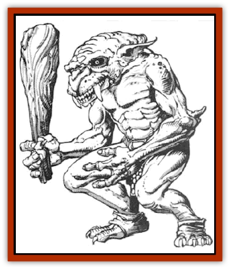

# Hobgoblin - Norker

| Statistic | **Hobgoblin, Norker** |
| --- | --- |
| **Activity Cycle:** | Any |
| **Alignment:** | Chaotic evil |
| **Armor Class:** | 3 |
| **Climate/Terrain:** | Any non-arctic |
| **Damage/Attack:** | 1-6 (weapon)/1-3 (bite) |
| **Diet:** | Omnivore |
| **Frequency:** | Tribal |
| **Hit Dice:** | 1+2 |
| **Intelligence:** | Average (8-10) |
| **Magic Resistance:** | Nil |
| **Morale:** | Steady (11-12) |
| **Movement:** | 9 |
| **No. Appearing:** | 3-30 |
| **No. of Attacks:** | 2 |
| **Organization:** | Rare |
| **Size:** | S (4' tall) |
| **Special Attacks:** | Nil |
| **Special Defenses:** | Nil |
| **THAC0:** | 19 |
| **Treasure:** | E |
| **XP Value:** | Normal: 35 / Sub-chief: 65 / Chief: 120 |

Distant relatives of [[Hobgoblin|hobgoblins]], norkers are nasty little humanoids with a war-like disposition. They are intelligent and aggressive.

Norkers are small, wiry humanoids. Their skin is any shade from reddish brown to dark gray. Unlike their hobgoblin cousins, they have no hair, just tough, leathery skin. Their faces are a brighter shade of their skin color. The males have brightly colored blue or red noses. Norkers' eyes are yellow, as are their teeth. These are easy to see, because the two canines protrude three inches down from their upper lips. It should come as no surprise that they have foul-smelling breath. As you would expect, their bodies are equally odorous, smelling of stale sweat and years of avoiding any liquid with soap in it.

Armor is not worn by norkers, because their skin is as tough as most armor. For clothing they wear only loin cloths or other hip gear. Trophies and other adornments are hung from the belt. Norkers like red and blue over other colors.

Norkers do not have their own language, but speak a dialect of hobgoblin that is difficult, but not impossible, for even hobgoblins to understand. They also can speak with [[Orc|orcs]], [[Goblin|goblins]], and such. Their voices are low and gravelly.

**Combat:** A typical force of norkers is armed with clubs or other bludgeoning weapon. They don't use shields or armor. When attacking, norkers swing their weapons and then bite with their fangs. Disarmed norkers have no effective claw or fist attack.

A band of norkers attacks using swarming tactics. They swing with their weapons and then leap in to sink their fangs into their victims. From there they cling if possible and keep on swinging and biting, eventually dragging their prey down by sheer numbers.

**Habitat/Society:** A tribe of norkers is a disorganized bunch of thugs. The strongest member rules, but only within the immediate reach of his arm.

A typical tribe of norkers has 2dlOx10 adult male warriors. In addition, for every 20 warriors there is a leader norker of maximum hit points (10) that dominates them. Any tribe with over 100 warriorshas a sub-chief of 3 Hit Dice and an AC of 1. Back in the lair there is a chief, who has 4 Hit Dice and an AC of 0. He usually has 2d4 sub-chief bodyguards and 3d4 leader bodyguards. In addition to the warriors in the tribe, there are 150% as many females and three times as many young as warriors.

Most (80%) norker lairs are underground or deep in old ruins. The rest are surface villages, usually taken by conquest and then fortified if necessary. Norkers cannot cooperate long enough to build more than a large fence around the village with a walkway at the top and a gate. While sunlight is not harmful to norkers, they dislike it and are most active after the sun goes down. These villages tend to stink, because the norkers do not understand sanitation. Norkers negotiate with strong parties, but always look for some way to double-cross. At best they are unreliable allies. Different tribes of norkers rarely meet each other, but when they do it is constant guerrilla warfare between them. Each side kills the individuals of the other whenever it can, keeping the fangs for trophies. However, they always stop short of all-out warfare.

Powerful, well-equipped bands of hobgoblins can command the dubious loyalty of a norker tribe for a while, as the norkers respect and fear their larger cousins.

**Ecology:** Norkers eat anything that moves or bleeds. If desperate, they can survive on grains or other edible plants. They dislike working to get their next meal and steal rather than hunt if possible. Norkers are hunted by the larger predators in their area. The hide is tough to get through, but the flesh is edible.

---
## Discovery & Documentation

**Source Publication:** MC5 Greyhawk Appendix (1989)
**Campaign Setting:** Advanced Dungeons & Dragons 2nd Edition
**Author(s):** Grant Boucher, William W. Connors, Steve Gilbert, Bruce Nesmith, Chris Mortika, Skip Williams

### Other Creatures Found in This Source Book
   * [[Aspis|Aspis]]
   * [[Beastman|Beastman]]
   * [[Bonesnapper|Bonesnapper]]
   * [[Booka|Booka]]
   * [[Brownie_Buckawn|Brownie, Buckawn]]
   * [[Brownie_Quickling|Brownie, Quickling]]
   * [[Crystalmist|Crystalmist]]
   * [[Dragon_Cloud|Dragon, Cloud]]
   * [[Dragon_Oerth_Greyhawk|Dragon (Oerth), Greyhawk]]
   * [[Dragonfly_Giant|Dragonfly, Giant]]
   * [[Dragonnel|Dragonnel]]
   * [[Elf_Grugach|Elf, Grugach]]
   * [[Elf_Valley|Elf, Valley]]
   * [[Golem_Necrophidius|Golem, Necrophidius]]
   * [[Grell_Wild|Grell, Wild]]
   * [[Grung|Grung]]
   * [[Hook_Horror|Hook Horror]]
   * [[Horgar|Horgar]]
   * [[Hound_Yeth|Hound, Yeth]]
   * [[Iguana_Giant|Iguana, Giant]]
   * [[Ingundi|Ingundi]]
   * [[Kech|Kech]]
   * [[Kyuss_Son_of|Kyuss, Son of]]
   * [[Mite|Mite]]
   * [[Needleman|Needleman]]
   * [[Plant_Carnivorous_Oerth|Plant, Carnivorous (Oerth)]]
   * [[Plant_Carnivorous_Vampire_Cactus|Plant, Carnivorous, Vampire Cactus]]
   * [[Plasmoid_General_Information|Plasmoid, General Information]]
   * [[Rat_Oerth|Rat (Oerth)]]
   * [[Raven_Crow|Raven/Crow]]
   * [[Scarecrow|Scarecrow]]
   * [[Shadow_Slow|Shadow, Slow]]
   * [[Skulk|Skulk]]
   * [[Snail|Snail]]
   * [[Sprite|Sprite]]
   * [[Taer|Taer]]
   * [[Tentamort|Tentamort]]
   * [[Turtle_Giant|Turtle, Giant]]
   * [[Tyrg|Tyrg]]
   * [[Wolf_Mist|Wolf, Mist]]
   * [[Wraith_Oerth|Wraith (Oerth)]]
   * [[Zygom|Zygom]]
