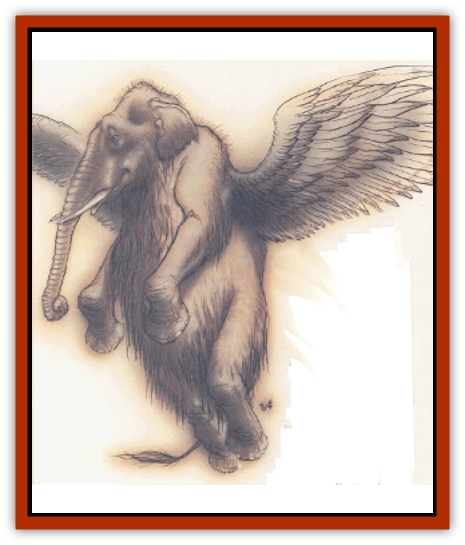

# Hollyphant

| Statistic | **Hollyphant** |
| --- | --- |
| **Activity Cycle:** | Any |
| **Alignment:** | Neutral Good |
| **Armor Class:** | -4 |
| **Climate/Terrain:** | Any Upper Plane |
| **Damage/Attack:** | 1d3/1d3 |
| **Diet:** | Herbivore |
| **Frequency:** | Rare |
| **Hit Dice:** | 6+6 |
| **Intelligence:** | Genius (17-18) |
| **Magic Resistance:** | 60% |
| **Morale:** | Steady (11-12) |
| **Movement:** | 9, Fl 36 (B) |
| **No. Appearing:** | 1 (1-3) |
| **No. of Attacks:** | 2 |
| **Organization:** | Solitary |
| **Size:** | S (2' long) |
| **Special Attacks:** | Trumpet, psionics |
| **Special Defenses:** | See below |
| **THAC0:** | 15 |
| **Treasure:** | Incidental |
| **XP Value:** | 9,000 |

**Psionics Summary**

| Level | Dis/Sci/Dev | Attack/Defense | Score | PSPs |
| --- | --- | --- | --- | --- |
| 6 | 2/3/8 | EW,PB,MT/All | 14 | 120 |

**Clairsentience -** *Sciences:* aura sight, precognition; *Devotions:* danger sense, know direction, know location, poison sense, spirit sense.

**Telepathy -** *Science:* mind link; *Devotions:* ESP, identity penetration, invisibility, post-hypnotic suggestion.

Hollyphants are servants of the powers of good, found throughout the Upper Planes. They're the messengers and helpers of the various good pantheons, acting as couriers or advisers to mortals the powers've got an interest in, or working as assistants to more powerful proxies.

A hollyphant looks like a tiny, golden-furred [[Elephant|elephant]] only 2 feet long, with a pair of shining white wings sprouting from its back. Its coat shimmers and gleams, and its eyes dance with a rainbow of colors. Some sages speculate that hollyphants're really spirits or manifestations of some kind, since nature would never've given birth to such a silly-looking creature. Hollyphants seem sincerely offended by this view and may take steps to teach a vocal detractor a lesson.

Adventurers are likely to run across a hollyphant any time they're about the business of a good power.  Hollyphants are fond of keeping an eye on mortal heroes doing their patron's work. Hollyphants can also be encountered transiting the Astral or Ethereal Planes, since many of their tasks involve journeying to the prime material. Of course, any trip to the Upper Planes is likely to result in an encounter with a hollyphant in its home.

**Combat:** Hollyphants automatically *detect evil* within a 20-yard range, and go to great lengths to avoid fights with good-aligned or even neutral creatures. Evil creatures are another matter entirely; a hollyphant'll look for ways to harass or hinder an evil creature unless its mission is so pressing that it can't spare the time. Even if the evil is too powerful for the hollyphant to overcome on its own, it'll try to alert more powerful good creatures to the evil presence, or make an effort to delay or misdirect its enemy.

In physical confrontations, the hollyphant's at a distinct disadvantage. It strikes with its small tusks for only 1d3 points of damage each. While hollyphants've got minimal physical combat abilities, they do possess a number of magical powers with which they defend themselves. Three times per day a hollyphant can trumpet, choosing one of three effects: a blast like that of a *horn of blasting*; a call that acts as *drums of deafening* in a cone-shaped area 70 feet long by 30 feet wide at the end; or a fan-shaped shower of *sun-sparkles* 50 feet long by 20 feet wide. *Sun-sparkles* are motes of positive energy that inflict 8d6+8 points of damage to fiends, undead, and other creatures of supernatural evil. (Damage is halved with a successful save vs. breath weapon.)

In addition to their trumpet-calls, hollyphants can use the following spell-like powers, one at a time, at will: *bless*, *cure serious wounds* (twice per day), *light*, *protection from evil* (twice per day), and *teleport without error*. Once per day they can call a *flame strike*, *heal*, *raise dead*, and use *banishment*. Hollyphants are considered 16th-level for casting purposes.

The magical tusks of a hollyphant protect it from all disease and poisons. Its shimmering coat functions as a *globe of invulnerability*, and it can be hit only by +1 or better weapons. Hollyphants can attempt to open a *gate* with a 50% chance of success; there's a 70% chance that another hollyphant responds, and a 30% chance that a [[Aasimon_Deva|deva]] appropriate to the setting shows up (an astral deva for a hollyphant on the Outer Planes, a monadic deva for one on the Inner Planes, or a movanic deva for a hollyphant on the prime material).

**Habitat/Society:** Hnllyphants're usually found alone, since they're often pursuing the tasks of some power or another. On their native planes, they can occasionally be found in small family groups of 1 to 3 individuals. Hollyphants live on alI good planes, but they're especially common on Bytopia, the Beastlands, and Mount Celestia.

As proxies of good powers, hollyphants often are given missions that bring them into contact with mortal adventurers and heroes. In these situations, hollyphants act as advisers and aid their charges by helping them to defeat evil themselves instead of doing it for them.

Hollyphants have a surprisingly strong sense of mischief and love a good prank or jest. Sharp bloods've pointed out that anything that looks like a hollyphant shouldn't take itself too seriously, and hollyphants generally don't. (Cutters had best remember, though, that a hollyphant's definition of humor doesn't include jokes about its origins.)

**Ecology:** It's pretty clear that hollyphants're creatures that exist outside of nature. They're highly magical and don't even really need to eat or sleep, even though they do so anyway to make those around them feel more comfortable. When they do ingest food, hollyphants favor nuts, berries, and young shoots.

If removed, a hollyphant's tusk can be ground into a magical powder that transforms water or wine into an *elixir of health*. 'Course, hollyphants take a real dim view of some basher hunting them for their tusks.

---
## Discovery & Documentation

**Source Publication:** Planescape II (1996)
**Campaign Setting:** Planescape
**Author(s):** Rich Baker, Karen S. Boomgarden

### Other Creatures Found in This Source Book
   * [[Aasimar|Aasimar]]
   * [[Abrian|Abrian]]
   * [[Arcane|Arcane]]
   * [[Balaena|Balaena]]
   * [[Beholder-kin_Observer|Beholder-kin, Observer]]
   * [[Bloodthorn|Bloodthorn]]
   * [[Bonespear|Bonespear]]
   * [[Darkweaver|Darkweaver]]
   * [[Demarax|Demarax]]
   * [[Dhour|Dhour]]
   * [[Eater_of_Knowledge|Eater of Knowledge]]
   * [[Eladrin_Greater_Firre|Eladrin, Greater, Firre]]
   * [[Eladrin_Greater_Ghaele|Eladrin, Greater, Ghaele]]
   * [[Eladrin_Greater_Tulani|Eladrin, Greater, Tulani]]
   * [[Eladrin_Lesser_Bralani|Eladrin, Lesser, Bralani]]
   * [[Eladrin_Lesser_Coure|Eladrin, Lesser, Coure]]
   * [[Eladrin_Lesser_Noviere|Eladrin, Lesser, Noviere]]
   * [[Eladrin_Lesser_Shiere|Eladrin, Lesser, Shiere]]
   * [[Fhorge|Fhorge]]
   * [[Ghostlight|Ghostlight]]
   * [[Guardinal_Avoral|Guardinal, Avoral]]
   * [[Guardinal_Cervidal|Guardinal, Cervidal]]
   * [[Guardinal_General_Information|Guardinal, General Information]]
   * [[Guardinal_Equinal|Guardinal, Equinal]]
   * [[Guardinal_Leonal|Guardinal, Leonal]]
   * [[Guardinal_Lupinal|Guardinal, Lupinal]]
   * [[Guardinal_Ursinal|Guardinal, Ursinal]]
   * [[Incantifer|Incantifer]]
   * [[Ironmaw|Ironmaw]]
   * [[Keeper|Keeper]]
   * [[Khaasta|Khaasta]]
   * [[Leomarh|Leomarh]]
   * [[Monster_of_Legend|Monster of Legend]]
   * [[Mortai|Mortai]]
   * [[Noctral|Noctral]]
   * [[Quill|Quill]]
   * [[Razorvine|Razorvine]]
   * [[Reave|Reave]]
   * [[Retriever|Retriever]]
   * [[Rilmani_Abiorach|Rilmani, Abiorach]]
   * [[Rilmani_General_Information|Rilmani, General Information]]
   * [[Rilmani_Argenach|Rilmani, Argenach]]
   * [[Rilmani_Aurumach|Rilmani, Aurumach]]
   * [[Rilmani_Cuprilach|Rilmani, Cuprilach]]
   * [[Rilmani_Ferrumach|Rilmani, Ferrumach]]
   * [[Rilmani_Plumach|Rilmani, Plumach]]
   * [[Shadowdrake|Shadowdrake]]
   * [[Spellhaunt|Spellhaunt]]
   * [[Spider_Hook|Spider, Hook]]
   * [[Sunfly|Sunfly]]
   * [[Sword_Spirit|Sword Spirit]]
   * [[Tanar'ri_Lesser_Bulezau|Tanar'ri, Lesser, Bulezau]]
   * [[Tanar'ri_Lesser_Maurezhi|Tanar'ri, Lesser, Maurezhi]]
   * [[Tanar'ri_Lesser_Yochlol|Tanar'ri, Lesser, Yochlol]]
   * [[Tanar'ri_General_Information|Tanar'ri, General Information]]
   * [[Tanar'ri_True_Alkilith|Tanar'ri, True, Alkilith]]
   * [[Terlen|Terlen]]
   * [[Tso|Tso]]
   * [[T'uen-rin|T'uen-rin]]
   * [[Vaporighu|Vaporighu]]
   * [[Vorr|Vorr]]
   * [[Wastrel|Wastrel]]
   * [[Wraithworm|Wraithworm]]
   * [[Yugoloth_Lesser_Canoloth|Yugoloth, Lesser, Canoloth]]
   * [[Zoveri|Zoveri]]
