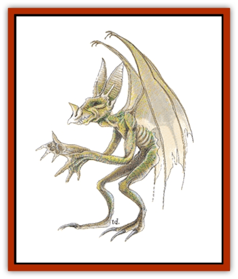

# Homunculus

| Statistic | **Homunculus** |
| --- | --- |
| **Activity Cycle:** | Any |
| **Alignment:** | See below |
| **Armor Class:** | 6 |
| **Climate/Terrain:** | Any |
| **Damage/Attack:** | 1-3 |
| **Diet:** | Omnivore |
| **Frequency:** | Very rare |
| **Hit Dice:** | 2 |
| **Intelligence:** | See below |
| **Magic Resistance:** | See below |
| **Morale:** | Elite (13-14) |
| **Movement:** | 6, Fl 18 (B) |
| **No. Appearing:** | 1 |
| **No. of Attacks:** | 1 |
| **Organization:** | Solitary |
| **Size:** | T (18&rdquo; tall) |
| **Special Attacks:** | Bite causes sleep |
| **Special Defenses:** | See below |
| **THAC0:** | 19 |
| **Treasure:** | Nil |
| **XP Value:** | 270 |

Homunculi are small mystical beings created by magicians for spying and other special tasks.

The average homunculus is vaguely humanoid in form. It is 18 inches tall and its greenish, reptilian skin may have spots or warts. They have leathery, bat-like wings with a span of 24 inches and a mouth filled with long, pointed teeth that can inject a potent sleeping venom.

**Combat:** The homonculous is a quick and agile flyer which uses this ability to great advantage in combat. It can dart to and fro so quickly that any attempt to capture it short of a net or web spell is almost impossible.

In combat, the homunculus will land on its chosen victim and bite with its needle-like fangs. In addition to doing 1-3 points of damage, the creature injects a powerful venom. Anyone bitten by the homunculus must save vs. poison or fall into a comatose sleep for 5-30 (5d6) minutes.

The creature's saving throws are the same as those of its creator. While most attacks against either the homonculous or creator do not affect the other, there is one exception. Any attack which destroys the homonculous causes its creator to suffer 2-20 (2d10) points of damage. Conversely, if the creator is slain, the homonculous also dies and its body swiftly melts away into a pool of ichor.

**Habitat/Society:** Homonculi are artificial creatures created by wizards as living tools. The process by which one is created is long, complicated, and expensive. Any wizard who desires a homunculus servant must first locate and hire an alchemist. The wizard must provide one pint of his own blood and 500-2,000 (1d4x500) gold pieces. The blood becomes the basis for the creature's body while the money pays for a variety of other supplies and the alchemist's time. The alchemist requires 1-4 weeks to transform the blood into the necessary magical base. The wizard is then sent for and required to cast *mending*, *mirror image*, and *wizard eye* spells upon the fluids. As the last of these spells is worked, the fluids spontaneously coagulate and form the body of the homonculous.

The homunculus is telepathically linked to its creator. It knows everything that its master knows and transmits everything it sees and hears to him. The creator can telepathically control the actions of the homunculus at a range of up to 480 yards. The homonculous will never willingly travel beyond the limits of contact with its master, though it can be removed from that region by force. As soon as it loses contact with its master, the creature panics and will do anything to regain contact. Contact between the two cannot be maintained across planar or dimensional barriers. If either the creator or homunculus is on another plane, the homunculus will remain near the point where it was last in contact with its master. Homunculi are a reflection of their creator. They have the creator's alignment, basic intelligence, and even physical mannerisms. They are mute but can write if the creator is literate. They may assist their creator in a variety of tasks including magical endeavors, although they cannot themselves cast spells.

Homunculi lairs are in the homes of their creators. Indulgent wizards may provide a specially built bed, nest, or living chamber. Otherwise, the homonculous simply perches wherever it can.

**Ecology:** Homunculi are nothing more than tools. They have no place in the natural world and are not part of any ecological system. They provide the wizard who created them with a variety of useful services. Commonly, a homunculus is called upon to act as a spy, scout, messenger, or emissary. Because of the potential harm which the death of a homonculous inflicts on its master, they are seldom employed as body guards or living weapons.

Although they are magical creations, homunculi possess the same biological functions as non-magical creatures. They must rest and require food and drink in order to survive. When eating, they share the tastes of their masters and generally consume about as much as a typical [[Cat_Small|cat]].

There are rumors of magical means by which non-wizards can acquire their own form of homunculus. Although these are not widely believed to be valid, there are those who report having seen the process or its results first hand. If such a procedure exists, it would be quite valuable to its discoverer.

---
## Discovery & Documentation

**Source Publication:** MC1 Volume I (w/binder #1) (1991)
**Campaign Setting:** Advanced Dungeons & Dragons 2nd Edition
**Author(s):** Jay Batista, Scott Bennie, Grant Boucher, William W. Connors, Steve Gilbert, Heike Kubasch, James Lowder, David Edward Martin, Bruce Nesmith, Jean Rabe, Rick Swan, John J. Terra, Gary L. Thomas

### Other Creatures Found in This Source Book
   * [[Bat|Bat]]
   * [[Bear|Bear]]
   * [[Behir|Behir]]
   * [[Boar|Boar]]
   * [[Bookworm|Bookworm]]
   * [[Brownie|Brownie]]
   * [[Bugbear|Bugbear]]
   * [[Carrion_Crawler|Carrion Crawler]]
   * [[Cat_Great|Cat, Great]]
   * [[Catoblepas|Catoblepas]]
   * [[Dragon_General_Information|Dragon, General Information]]
   * [[Dragonfish|Dragonfish]]
   * [[Elemental_Air_Kin_Aerial_Servant|Elemental, Air Kin, Aerial Servant]]
   * [[Elemental_Earth_Kin_Sandling|Elemental, Earth Kin, Sandling]]
   * [[Elephant|Elephant]]
   * [[Gnoll|Gnoll]]
   * [[Hobgoblin|Hobgoblin]]
   * [[Hornet_Giant|Hornet, Giant]]
   * [[Horse|Horse]]
   * [[Hyena|Hyena]]
   * [[Jackal|Jackal]]
   * [[Jackalwere|Jackalwere]]
   * [[Korred|Korred]]
   * [[Lich|Lich]]
   * [[Lizard|Lizard]]
   * [[Lizard_Man|Lizard Man]]
   * [[Lycanthrope_General_Information|Lycanthrope, General Information]]
   * [[Lycanthrope_Seawolf|Lycanthrope, Seawolf]]
   * [[Lycanthrope_Werebear|Lycanthrope, Werebear]]
   * [[Lycanthrope_Weretiger|Lycanthrope, Weretiger]]
   * [[Lycanthrope_Werewolf|Lycanthrope, Werewolf]]
   * [[Manticore|Manticore]]
   * [[Medusa|Medusa]]
   * [[Mind_Flayer|Mind Flayer]]
   * [[Minotaur|Minotaur]]
   * [[Mudman|Mudman]]
   * [[Mummy|Mummy]]
   * [[Nixie|Nixie]]
   * [[Nymph|Nymph]]
   * [[Ogre|Ogre]]
   * [[Ooze_Slime_Jelly_I|Ooze/Slime/Jelly I]]
   * [[Ooze_Slime_Jelly_II|Ooze/Slime/Jelly II]]
   * [[Orc|Orc]]
   * [[Owl|Owl]]
   * [[Owlbear_I|Owlbear I]]
   * [[Pegasus|Pegasus]]
   * [[Piercer|Piercer]]
   * [[Pudding_Deadly|Pudding, Deadly]]
   * [[Rakshasa|Rakshasa]]
   * [[Rat|Rat]]
   * [[Ray|Ray]]
   * [[Remorhaz|Remorhaz]]
   * [[Satyr|Satyr]]
   * [[Scorpion|Scorpion]]
   * [[Selkie|Selkie]]
   * [[Shadow|Shadow]]
   * [[Skeleton|Skeleton]]
   * [[Skunk|Skunk]]
   * [[Snake|Snake]]
   * [[Spectre|Spectre]]
   * [[Spider|Spider]]
   * [[Sprite|Sprite]]
   * [[Toad_Giant|Toad, Giant]]
   * [[Treant|Treant]]
   * [[Troll|Troll]]
   * [[Umber_Hulk|Umber Hulk]]
   * [[Unicorn|Unicorn]]
   * [[Vampire|Vampire]]
   * [[Wight|Wight]]
   * [[Will_O'Wisp|Will O'Wisp]]
   * [[Wolf|Wolf]]
   * [[Wolfwere|Wolfwere]]
   * [[Wraith|Wraith]]
   * [[Wyvern|Wyvern]]
   * [[Yeti|Yeti]]
   * [[Yuan-ti|Yuan-ti]]
   * [[Zombie|Zombie]]
