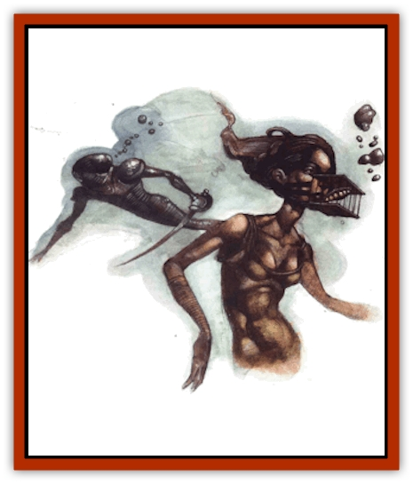
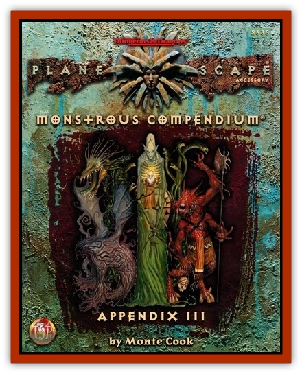

# Homunculus - Elemental

| Statistic | **Breather** | **Skin** |
| --- | --- | --- |
| **Activity Cycle:** | Any | Any |
| **Alignment:** | Neutral | Neutral |
| **Armor Class:** | 8 | 10 |
| **Climate/Terrain:** | Varies | Varies |
| **Damage/Attack:** | Nil | Nil |
| **Diet:** | None | None |
| **Frequency:** | Varics | Varies |
| **Hit Dice:** | 1d3 hp | 2 |
| **Intelligence:** | Non- (0) | Non- (0) |
| **Magic Resistance:** | Ni1 | Nil |
| **Morale:** | N/A | N/A |
| **Movement:** | Nil | Nil |
| **No. Appearing:** | 1 | 1 |
| **No. of Attacks:** | Nil | Nil |
| **Organization:** | Nil | Nil |
| **Size:** | T (3&rdquo; tall) | M (6' tall) |
| **Special Attacks:** | Nil | Nil |
| **Special Defenses:** | Immune to one element | Immune to one element |
| **THAC0:** | N/A | N/A |
| **Treasure:** | Nil | Nil |
| **XP Value:** | 15 | 65 |

As planewalkers cope with the problems presented by travel on the Inner Plancs, more and more solutions present themselves. Sometimes those solutions come from the most unlikely sources. In one case, a conclave of evil wizards working for a secret society called thc Tacharim created a version of [[Homunculus|homunculi]] that could be used by the group's members to help them breathe on a mission to the quasi-plane of Ash. These little creatures were "built" to breathe in ash and breathe out clean air. Held close to the mouth, these homunculi enabled a body to breathe safely in an otherwise hostile environment. scourge, it wasn't long before the secret of the process leaked out, and other wizards and alchemists modified the homunculi to help folks breathe in all sorts of environments, particularly those of the Inner Planes.

But the bloods didn't stop there. Using the inspiration and knowledge gleaned from these advances in homunculus creation, another wizard developed a magical process that produced a man-sized creature resembling a strange suit of leather armor. This homunculus, when "worn", allows the wearer to share the homunculus' immunity to the particular element designated by the creator. This skin homunculus covers a cutter's entire body, but offers no protection other than imunity to one element (that is, it doesn't serve as armor).

Now, creation and use of these creatures is somewhat commonplace. Examples of both types keyed to virtually every element exist, and breathers can even be modified to provide substances other than air; for example, a fire creature could - for a hefty price - obtain a homunculus that inhales air and produces fire. Breathers can even exude air when there is no environment to transmute, as in the planes of Positive Energy, Negative Energy, and Vacuum. These odd creations allow beings of one element to exist in virtually any other.

**Combat:** Neither of these types of homunculi can engage in combat. In fact, neither is even ambulatory. They resemble inanimate objects more than creatures.

Nevertheless, both can sustain damage and be killed. Though they're immune to their keyed element, these creatures can be wounded and slain by any other normal means. And when put in the dead-book, elemental homunculi cease providing any protection at all.

Thus, breathers are often housed within protective cages of some sort, usually hung by a harness in front of a cutter's mouth or built right into a helmet (which gives the creatures an AC of 8).

Skin homunculi, since they surround a basher's entire body, always take damage intended for the wearer before the wearer does. Thus, in battle the skin dies quickly, leaving the wearer unprotected. To avoid this, a basher can wear the skin underneath his armor. The armor's AC then protects the homunculus' skin (as opposed to its own AC 10). When worn underneath armor, the wearer and the skin each suffer half the total damage from any attack. (For example, if an attack inflicts 10 points of damage, the wearer suffers five points and the skin suffers five points, deducting the damage from its hit point total like any creature.) The elemental skin may still die more quickly than the wearer would probably like - especially considering the amount of jink he spent on the thing! - but not as quickly as if it were worn outside and unprotected.

Note, however, that armor outside the homunculus skin is not protected against the element(s). and may be damaged or destroyed depending on the situation. Canny bloods always avoid combat, but those wearing elemental skin homunculi are far more likely to give a fight the laugh.

Fortunately for homunculi owners, these magical creations can be repaired by common magic. *Cure light wounds* and similar spells restore lost hit points to the creatures and heal external damage, repairing their ability to protect their owners. Note, however, that healing potions have no effect, since elemental homunculi have no mouths with which to ingest the liquids. (Breathers take in one substance and expel another through their entire bodies, which is much more efficient, anyway.) Tales of injured travelers spending their last curative enchantments on damaged homunculi aren't uncommon; if a body's skin homunculus dies in the middle of the plane of Fire, a little more blood loss is the last thing that poor sod has to worry about!

**Habitat/Society:** As magical creations, elemental homunculi are more likely found in a wizard's laboratory than a natural lair. Mages or alchemists sell these beings for 100 to 500 gp (for breathers) or 300 to 1,000 gp (for skins). The price depends on the situation, the element keyed to the homunculi (the more dangerous, the more expensive), and the bargaining skills of those involved. In Sigil, a body's very likely to come across a wizard or a merchant selling one or more of these homunculi near a portal to an Elemental Plane.

**Ecology:** Since they're examples of magical, artificial life, elemental homunculi don't require any sort of food or water to survive. Breathers don't even need to breathe; they just do so when presented with the appropriate element.

Further, these creatures don't reproduce in any way. Only the proper spells, materials, and processes can create one. Rumor has it that some of the required ingredients include the essence of an [[Elemental_General_Information|elemental]], the flesh of a [[Mephit_General_Information|mephit]], and the blood of a [[Dragon_General_Information|dragon]], giant, [[Genie|genie]], or other creature - each associated with the appropriate element.

---
## Discovery & Documentation

**Source Publication:** Planescape III (1996)
**Campaign Setting:** Planescape
**Author(s):** Monte Cook

### Other Creatures Found in This Source Book
   * [[Animental|Animental]]
   * [[Archomental_Evil|Archomental, Evil]]
   * [[Archomental_Good|Archomental, Good]]
   * [[Belker|Belker]]
   * [[Bzastra|Bzastra]]
   * [[Chososion|Chososion]]
   * [[Darklight|Darklight]]
   * [[Devete|Devete]]
   * [[Devourer_Planescape|Devourer (Planescape)]]
   * [[Dharum_Suhn|Dharum Suhn]]
   * [[Egarus|Egarus]]
   * [[Elemental_Athas_Lesser_Air_Earth|Elemental (Athas), Lesser, Air/Earth]]
   * [[Elemental_Athas_Lesser_Fire_Water|Elemental (Athas), Lesser, Fire/Water]]
   * [[Elemental_Fire_Kin_Salamander_II|Elemental, Fire Kin, Salamander II]]
   * [[Entrope|Entrope]]
   * [[Facet|Facet]]
   * [[Frost_Salamander|Frost Salamander]]
   * [[Fundamental_Air_Earth|Fundamental, Air/Earth]]
   * [[Fundamental_Fire_Water|Fundamental, Fire/Water]]
   * [[Fundamental_All_Elements|Fundamental, All Elements]]
   * [[Garmorm|Garmorm]]
   * [[Immoth|Immoth]]
   * [[Khargra|Khargra]]
   * [[Klyndes|Klyndes]]
   * [[Magran|Magran]]
   * [[Menglis|Menglis]]
   * [[Nathri|Nathri]]
   * [[Ooze_Sprite|Ooze Sprite]]
   * [[Paraelemental|Paraelemental]]
   * [[Phirblas|Phirblas]]
   * [[Psurlon|Psurlon]]
   * [[Quasielemental_Negative|Quasielemental, Negative]]
   * [[Quasielemental_Positive|Quasielemental, Positive]]
   * [[Rast|Rast]]
   * [[Ravid|Ravid]]
   * [[Ruvoka|Ruvoka]]
   * [[Scile|Scile]]
   * [[Shad|Shad]]
   * [[Shocker|Shocker]]
   * [[Sislan|Sislan]]
   * [[Suisseen|Suisseen]]
   * [[Terithran|Terithran]]
   * [[Thoqqua|Thoqqua]]
   * [[Trilloch|Trilloch]]
   * [[Tsnng|Tsnng]]
   * [[Ungulosin|Ungulosin]]
   * [[Vacuous|Vacuous]]
   * [[Wavefire|Wavefire]]
   * [[Xag-Ya_Xeg-Yi|Xag-Ya/Xeg-Yi]]
   * [[Xill|Xill]]
