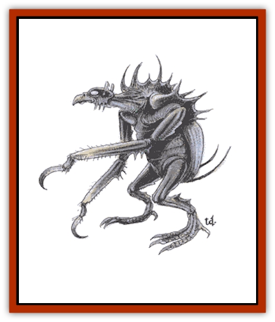

# Hook Horror

| Statistic | **Hook Horror** |
| --- | --- |
| **Activity Cycle:** | Any |
| **Alignment:** | Neutral |
| **Armor Class:** | 3 |
| **Climate/Terrain:** | Any/Subterranean |
| **Damage/Attack:** | 1-8/1-8/2-12 |
| **Diet:** | Omnivore |
| **Frequency:** | Rare |
| **Hit Dice:** | 5 |
| **Intelligence:** | Low (5-7) |
| **Magic Resistance:** | Nil |
| **Morale:** | Steady (11-12) |
| **Movement:** | 9 |
| **No. Appearing:** | 2-12 |
| **No. of Attacks:** | 3 |
| **Organization:** | Clan |
| **Size:** | L (9' tall) |
| **Special Attacks:** | Nil |
| **Special Defenses:** | Nil |
| **THAC0:** | 15 |
| **Treasure:** | P |
| **XP Value:** | 175 |

The hook horror is a bipedal, underground-dwelling monster that looks like a cross between a [[Vulture|vulture]] and a man with hooks instead of hands.

The hook horror stands about nine feet tall and weighs almost 350 pounds. It has a tough, mottled grey exoskeleton, like that of an insect. Its front limbs end in 12-inch-long hooks. Its legs end in feet that have three small hooks, like long, sharp toes. Its head is shaped like that of a vulture, including the hooked beak. Its eyes are multifaceted. It is thought that the hook horror is distantly related to the cockroach or cave cricket.

Hook horrors do not have a smell to humans and demihumans, but an animal would detect a dry musty odor. They communicate in a series of clicks and clacks made by the exoskeleton at their throats. In a cave, this eerie sound can echo a long way. They can use this to estimate cavern sizes and distances, much like the sonic radar of a bat.

**Combat:** Hook horrors have acute hearing and are surprised only on a roll of 1. They always know their territory, and they try to ambush unsuspecting travelers or denizens. Each round they swing with both hooks. If in any round both hit, during that round their beaks hit automatically. They automatically inflict 2d6 points of damage each round with the beak until at least one of the hooks is dislodged.

The eyesight of the hook horrors is very poor. They are blinded in normal light. They use their extremely acute hearing to track and locate prey. Since their eyesight is so poor anyway, they suffer no combat or movement penalties if blinded or in complete darkness. They attack silenced opponents with the penalties others suffer when attacking blind.

Hook horrors are natural climbers, as their hooks give them excellent purchase on rock surfaces. They can move at normal speed up vertical surfaces that are not sheer. Their great weight means that they cannot hang from the ceiling like other insects.

**Habitat/Society:** The obvious penalty for having hooks instead of hands is that hook horrors cannot use weapons or tools. They can only pick up items in their beaks. This severely restricts their ability to amass large treasures.

A clan of hook horrors most often lives in caves and underground warrens. The entrance is usually up a vertical or steeply sloped rock wall. Each family unit in the clan has its own small cavern off a central cave area. The clan's eggs are kept in the safest, most defensible place. The clan is ruled by the eldest female, who never participates in combat. The eldest male, frequently the mate of the clan ruler, takes charge of all hunting or other combat situations and is considered the war chieftain.

Members of a clan rarely fight each other. They may quarrel or not cooperate, but they rarely come to blows. Clans sometimes fight each other, but only when there is a bone of contention, such as territorial disputes. It is rare for a clan of hook horrors to want to rule large areas or to conquer other clans.

Hook horrors have poor relationships with other races. Although they do not foolishly attack strong parties, generally other creatures are considered to be meat. They retreat when faced with a stronger group. Hook horrors do not recognize indebtedness or gratitude. Their simple language does not even have a term for these concepts. Just because a player character saves the life of a hook horror does not mean that it will feel grateful and return the favor.

**Ecology:** Although hook horrors are basically omnivores, they prefer meat. They can eat just about any cave-dwelling fungus, plants, lichens, or animals. Hook horrors are well acclimated to cave life. They have few natural predators, although anything that managed to catch one would try to eat it. The hook horror's exoskeleton dries and becomes too brittle for use after a month or so.

---
## Discovery & Documentation

**Source Publication:** MC5 Greyhawk Appendix (1989)
**Campaign Setting:** Advanced Dungeons & Dragons 2nd Edition
**Author(s):** Grant Boucher, William W. Connors, Steve Gilbert, Bruce Nesmith, Chris Mortika, Skip Williams

### Other Creatures Found in This Source Book
   * [[Aspis|Aspis]]
   * [[Beastman|Beastman]]
   * [[Bonesnapper|Bonesnapper]]
   * [[Booka|Booka]]
   * [[Brownie_Buckawn|Brownie, Buckawn]]
   * [[Brownie_Quickling|Brownie, Quickling]]
   * [[Crystalmist|Crystalmist]]
   * [[Dragon_Cloud|Dragon, Cloud]]
   * [[Dragon_Oerth_Greyhawk|Dragon (Oerth), Greyhawk]]
   * [[Dragonfly_Giant|Dragonfly, Giant]]
   * [[Dragonnel|Dragonnel]]
   * [[Elf_Grugach|Elf, Grugach]]
   * [[Elf_Valley|Elf, Valley]]
   * [[Golem_Necrophidius|Golem, Necrophidius]]
   * [[Grell_Wild|Grell, Wild]]
   * [[Grung|Grung]]
   * [[Hobgoblin_Norker|Hobgoblin, Norker]]
   * [[Horgar|Horgar]]
   * [[Hound_Yeth|Hound, Yeth]]
   * [[Iguana_Giant|Iguana, Giant]]
   * [[Ingundi|Ingundi]]
   * [[Kech|Kech]]
   * [[Kyuss_Son_of|Kyuss, Son of]]
   * [[Mite|Mite]]
   * [[Needleman|Needleman]]
   * [[Plant_Carnivorous_Oerth|Plant, Carnivorous (Oerth)]]
   * [[Plant_Carnivorous_Vampire_Cactus|Plant, Carnivorous, Vampire Cactus]]
   * [[Plasmoid_General_Information|Plasmoid, General Information]]
   * [[Rat_Oerth|Rat (Oerth)]]
   * [[Raven_Crow|Raven/Crow]]
   * [[Scarecrow|Scarecrow]]
   * [[Shadow_Slow|Shadow, Slow]]
   * [[Skulk|Skulk]]
   * [[Snail|Snail]]
   * [[Sprite|Sprite]]
   * [[Taer|Taer]]
   * [[Tentamort|Tentamort]]
   * [[Turtle_Giant|Turtle, Giant]]
   * [[Tyrg|Tyrg]]
   * [[Wolf_Mist|Wolf, Mist]]
   * [[Wraith_Oerth|Wraith (Oerth)]]
   * [[Zygom|Zygom]]
