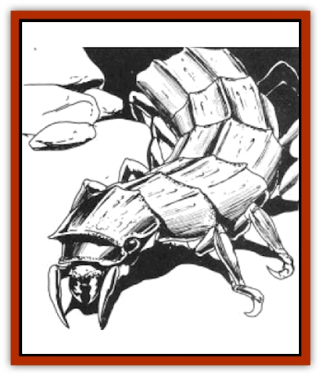

# Horax

| Statistic | **Horax** |
| --- | --- |
| **Activity Cycle:** | Any |
| **Alignment:** | Neutral |
| **Armor Class:** | 3 |
| **Climate/Terrain:** | Subterranean |
| **Damage/Attack:** | 2d8 |
| **Diet:** | Carnivore |
| **Frequency:** | Uncommon |
| **Hit Dice:** | 4 |
| **Intelligence:** | Animal (1) |
| **Magic Resistance:** | Nil |
| **Morale:** | Average (10) |
| **Movement:** | 15 |
| **No. Appearing:** | 3d10 |
| **No. of Attacks:** | 1 |
| **Organization:** | Colony |
| **Size:** | M (5-6' long) |
| **Special Attacks:** | -1 initiative, crush |
| **Special Defenses:** | Nil |
| **THAC0:** | 17 |
| **Treasure:** | Nil (D) |
| **XP Value:** | 270 / Young: 15 |

The horax are insectoid creatures, as ferocious as they are mindless. They are long with 12 legs, small but powerful mandibles, and tough chitinous plates that cover the back. Horax are long and low to the ground. Their legs end in strong grippers, able to hold firmly to nearly any surface. They are very dark in color, blue-black to pure black and are not easily seen, even by those with infravision.

**Combat:** The horax almost always attack in packs. They rely on numbers and speed to make their kills. Although they appear short and stocky, they are surprisingly quick, making them difficult to fight. They gain a +1 bonus to their chances of being surprised and a -1 bonus to all initiative die roils.

The horax have exceptional climbing ability and can cling and attack from almost any surface and any angle. It is not unusual to find horax packs scouring underground tunnels, some moving along the floor while others cling to the ceilings and walls. This can make them dangerous and difficult to fight for the unwary.

Horax attack with their mandibles. Though these are small, they are strong enough to crush bones. Once a horax scores a hit, it maintains its lock. Each round this lock causes 1d6 points of additional damage. No attack roll is needed for this. A horax's lock can be broken by a character (whether the attacked character or another) who spends an entire round working to dislodge the beast. The character attempting must still roll for the attack. If successful, he has pried the beast's jaws open.

Being insectoid, horax are vulnerable to cold. While ice- and cold-based attacks do not cause any additional damage, they have the effect of a *slow* spell. This effect lasts for 2d6 rounds.

**Habitat/Society:** The horax are communal creatures, living in small colonies of 30+1d10 individuals. There is no distinction between male and female horax. Each colony is located underground in a series of chambers. There are several communal chambers connected to a central egg chamber. Normally, there are 3d6 young among the eggs (HD 1, AC 7, Dmg 1d6). Other chambers are used to store food dragged back to the lair by the horax. These are kept for later use, preserved by the dry air of the tunnels. These chambers contain whatever treasure the horax have accidentally collected. Magical items found are most often weapons or armor from the bodies of dead warriors slain and brought back by the foragers.

**Ecology:** Although subterranean, the horax do venture to the surface when prey is scarce in the tunnels underground. They venture onto only the surface in the hours of dusk, after the hot desert sun has cooled, but before the chill night air makes them sluggish. Although they prefer fresh kills, they also scavenge. They do not seem to have preferences for prey, although they seldom attack other insectoid creatures.

The back plates of the horax can be fashioned into a lightweight and durable armor (AC 4) by armorers experienced at handling the stuff. The Glass Sailors of Taladas are among the best in the world at this art.

---
## Discovery & Documentation

**Source Publication:** Time of the Dragon (1989)
**Campaign Setting:** Dragonlance
**Author(s):** David Cook

### Other Creatures Found in This Source Book
   * [[Disir|Disir]]
   * [[Draconian_Proto-_Traag|Draconian, Proto-, Traag]]
   * [[Dragon_Krynn_Othlorx_General_Information|Dragon (Krynn), Othlorx, General Information]]
   * [[Fire_Minion|Fire Minion]]
   * [[Gurik_Cha'ahl|Gurik Cha'ahl]]
   * [[Saqualaminoi|Saqualaminoi]]
   * [[Skrit|Skrit]]
   * [[Yaggol|Yaggol]]
