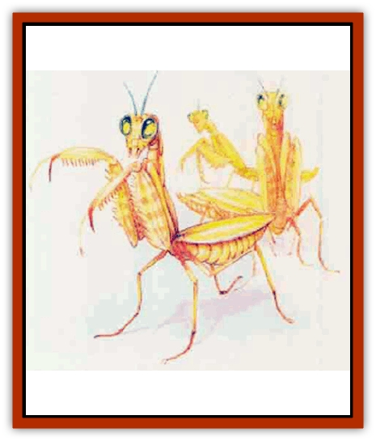

# Horde

| Statistic | **Horde** |
| --- | --- |
| **Activity Cycle:** | Any |
| **Alignment:** | Lawful evil |
| **Armor Class:** | 3 |
| **Climate/Terrain:** | Any land |
| **Damage/Attack:** | Varies by Hit Dice (see below) |
| **Diet:** | Omnivore |
| **Frequency:** | Very rare |
| **Hit Dice:** | 3-21 |
| **Intelligence:** | High (13) |
| **Magic Resistance:** | Nil |
| **Morale:** | Fanatic (17) |
| **Movement:** | 15 |
| **No. Appearing:** | 2d4 (patrol) or 1d100&times;10 |
| **No. of Attacks:** | 1 |
| **Organization:** | Collective being |
| **Size:** | S-H (3-21' long) |
| **Special Attacks:** | Telekinesis |
| **Special Defenses:** | See below |
| **THAC0:** | Varies by Hit Dice (see below) |
| **Treasure:** | Nil |
| **XP Value:** | Varies by Hit Dice (see below) |

| Hit Dice | THAC0 | Bite Damage | Size | XP |
| --- | --- | --- | --- | --- |
| 3 | 17 | 1d6 | S | 420 |
| 4 | 17 | 1d6 | S | 650 |
| 5 | 15 | 1d8 | M | 975 |
| 6 | 15 | 1d8 | M | 1,400 |
| 7 | 13 | 1d10 | M | 2,000 |
| 8 | 13 | 1d10 | L | 3,000 |
| 9 | 11 | 2d6 | L | 4,000 |
| 10 | 11 | 2d6 | L | 5,000 |
| 11-12 | 9 | 2d8 | L | 6,000 |
| 13-14 | 7 | 3d6 | H | 7,000 |
| 15-16 | 5 | 3d6 | H | 7,000 |
| 17-20 | 3 | 4d6 | H | 10,000 |
| 21 | 3 | 5d6 | H | 11,000 |

Hordes are frightening life forms native to the Elemental Plane of Earth. Each single horde entity comprises hundreds of separate, insectlike bodies united by a single mind.

The bodies of a particular horde consciousness all look alike, and different hordes often feature their own distinct body types. The bodies of one horde might resemble huge, golden praying mantises, while another horde's bodies might look like small black beetles with glowing red antennae. The size of the individual bodies within a horde varies; each body's length responds to its Hit Dice (one with 3 HD measures 3 feet long). The above statistics describe individual horde bodies.

**Combat:** The horde attacks other creatures whenever it finds such an action in its own best interest. Hordes do not consider any other life forms intelligent and have no compunctions against destroying others. Small patrols (of 2d4 bodies each) guard the outer limits of the area the horde claims; typically, all the bodies in a patrol have an equal number of Hit Dice (therefore, the same size).

In battle, the horde quite willingly sacrifices its individual bodies to further its cause; the bodies automatically fail any required saving throws. However, if the Horde loses more than 10% of its bodies in a single activity (one battle, for example), the creature either decides to resolve the problem peacefully (by negotiating or fleeing) or calls another horde for assisance.

In combat, the horde's bodies normally bite foes, overpowering any resistance with sheer numbers. A horde entity can cast *ESP* and *telekinesis* (up to 200 lbs.) up to once per round; use of this spell-like power does not interfere with the activities of individual bodies. The horde communicates among its bodies by telepathy; it can easily handle dozens of conversations at once. Though bodies are immune to mental assaults (*charm*, sleep, hold, etc.), physical attacks can hurt them.

A horde dies only if all its bodies are destroyed. If any body escapes, the horde immediately begins to rebuild. It can create a replacement body (or increase the size of a physically inactive body) at the rate of 1 Hit Die per turn. The horde cannot use *ESP* or *telekinesis* while creating or incensing a body's size.

**Habitat/Society:** Sages speculate that a horde life force can control practically limitless numbers of members. Perhaps up to 10,000 Hit Dice of bodies. Fortunately, the largest individual horde component body ever scan on Mystara boasted only 21 Hit Dice; some suggest that a horde can have large: component bodies on its home plane. The entity has no controlling body, such as the queen of an insect hive; its mind and life force occupy all component bodies evenly. However, the horde life force can control bodies only within an area 100 miles across. If one of the horde's bodies is taken outside this range, that body becomes a mindless thing and dies in 1d10 days.

Each horde has its own name. All the bodies of a single horde will respond to this name, which can cause confusion among those dealing with a horde.

The extremly lawful hordes will sacrifice as many bodies as needed to reach a goal. A horde does not recognize any other form of life as worthy of respect - even another of its own kind. When a horde needs more room, it simply tries to take it, without regard for other creatures; thus, most consider these creatures evil. Hordes often battle each other for living space.

**Ecology:** All other intelligent creatures fear and hate hordes. Horrific tales abound of whole lands overrun by a single horde and stripped of all vegetation and native creatures, save for a few "herds" of humanoids raised for food.

The hordes' particular enemies include [[Elemental_of_Law_Air_Earth|krysts]], [[Elemental_of_Chaos_Air_Earth|erdeens]], and [[Elemental_of_Chaos_Fire_Water|undines]]. Krysts and erdeens, both from the Elemental Plane of Earth, particularly loathe the hordes that have taken over so much of their home plane.

---
## Discovery & Documentation

**Source Publication:** Mystara Appendix (1994)
**Campaign Setting:** Mystara
**Author(s):** John Nephew, Teeuwynn Woodruff, John Terra, Skip Williams

### Other Creatures Found in This Source Book
   * [[Actaeon|Actaeon]]
   * [[Agarat|Agarat]]
   * [[Ash_Crawler|Ash Crawler]]
   * [[Baldandar|Baldandar]]
   * [[Bargda|Bargda]]
   * [[Bhut|Bhut]]
   * [[Bird_Mystara|Bird (Mystara)]]
   * [[Blackball|Blackball]]
   * [[Choker|Choker]]
   * [[Coltpixie|Coltpixie]]
   * [[Crone_of_Chaos|Crone of Chaos]]
   * [[Darkhood|Darkhood]]
   * [[Darkwing|Darkwing]]
   * [[Decapus|Decapus]]
   * [[Deep_Glaurant|Deep Glaurant]]
   * [[Diabolus|Diabolus]]
   * [[Dimensional_Warper|Dimensional Warper]]
   * [[Dragon_Mystara_Crystalline|Dragon (Mystara), Crystalline]]
   * [[Dragon_Mystara_Jade|Dragon (Mystara), Jade]]
   * [[Dragon_Mystara_Onyx|Dragon (Mystara), Onyx]]
   * [[Dragon_Mystara_Ruby|Dragon (Mystara), Ruby]]
   * [[Drake_Mystara|Drake (Mystara)]]
   * [[Dragonfly|Dragonfly]]
   * [[Dusanu|Dusanu]]
   * [[Elemental_of_Chaos_Air_Earth|Elemental of Chaos, Air/Earth]]
   * [[Elemental_of_Chaos_Fire_Water|Elemental of Chaos, Fire/Water]]
   * [[Elemental_of_Law_Air_Earth|Elemental of Law, Air/Earth]]
   * [[Elemental_of_Law_Fire_Water|Elemental of Law, Fire/Water]]
   * [[Familiar_Mystara|Familiar (Mystara)]]
   * [[Frost_Salamander|Frost Salamander]]
   * [[Fundamental_Air_Earth|Fundamental, Air/Earth]]
   * [[Fundamental_Fire_Water|Fundamental, Fire/Water]]
   * [[Gargantua_Mystara|Gargantua (Mystara)]]
   * [[Geonid|Geonid]]
   * [[Ghostly_Horde|Ghostly Horde]]
   * [[Giant_Athach|Giant, Athach]]
   * [[Giant_Hephaeston|Giant, Hephaeston]]
   * [[Golem_Drolem|Golem, Drolem]]
   * [[Golem_Mystara_I|Golem (Mystara) I]]
   * [[Golem_Mystara_II|Golem (Mystara) II]]
   * [[Golem_Mystara_III|Golem (Mystara) III]]
   * [[Gray_Philosopher|Gray Philosopher]]
   * [[Guardian_Warrior|Guardian Warrior]]
   * [[Gyerian|Gyerian]]
   * [[Herex|Herex]]
   * [[Hivebrood|Hivebrood]]
   * [[Hsiao|Hsiao]]
   * [[Huptzeen|Huptzeen]]
   * [[Hutaakan|Hutaakan]]
   * [[Imp_Mystara|Imp (Mystara)]]
   * [[Jellyfish_Giant_Mystara|Jellyfish, Giant (Mystara)]]
   * [[Kna|Kna]]
   * [[Kopru|Kopru]]
   * [[Lizard_Mystara|Lizard (Mystara)]]
   * [[Lizard-kin_Mystara|Lizard-kin (Mystara)]]
   * [[Lupin|Lupin]]
   * [[Lycanthrope_Werejaguar_Mystara|Lycanthrope, Werejaguar (Mystara)]]
   * [[Lycanthrope_Wereswine|Lycanthrope, Wereswine]]
   * [[Magen|Magen]]
   * [[Manikin|Manikin]]
   * [[Mek|Mek]]
   * [[Mujina|Mujina]]
   * [[Nagpa|Nagpa]]
   * [[Neh-thalggu|Neh-thalggu]]
   * [[Nightshade_Mystara|Nightshade (Mystara)]]
   * [[Nuckalavee|Nuckalavee]]
   * [[Pegataur|Pegataur]]
   * [[Phanaton|Phanaton]]
   * [[Plant_Dangerous_Mystara|Plant, Dangerous (Mystara)]]
   * [[Plasm|Plasm]]
   * [[Rakasta|Rakasta]]
   * [[Rock_Man|Rock Man]]
   * [[Sabreclaw|Sabreclaw]]
   * [[Sacrol|Sacrol]]
   * [[Scamille|Scamille]]
   * [[Shapeshifter|Shapeshifter]]
   * [[Shargugh|Shargugh]]
   * [[Shark-kin|Shark-kin]]
   * [[Sollux|Sollux]]
   * [[Spectral_Death|Spectral Death]]
   * [[Spectral_Hound|Spectral Hound]]
   * [[Spider-kin|Spider-kin]]
   * [[Spirit_Mystara|Spirit (Mystara)]]
   * [[Statue_Living|Statue, Living]]
   * [[Surtaki|Surtaki]]
   * [[Tabi|Tabi]]
   * [[Thoul|Thoul]]
   * [[Thunderhead|Thunderhead]]
   * [[Tiger_Ebon|Tiger, Ebon]]
   * [[Topi|Topi]]
   * [[Tortle|Tortle]]
   * [[Vampire_Velya|Vampire, Velya]]
   * [[White_Fang|White Fang]]
   * [[Worm_Mystara|Worm (Mystara)]]
   * [[Wyrd|Wyrd]]
   * [[Yowler|Yowler]]
   * [[Zombie_Lightning|Zombie, Lightning]]
