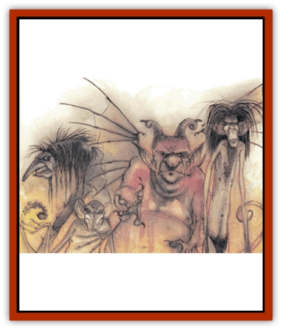

# Hordling

| Statistic | **Hordling** |
| --- | --- |
| **Activity Cycle:** | Any |
| **Alignment:** | Neutral evil |
| **Armor Class:** | 3, 2, 1, or 0 |
| **Climate/Terrain:** | Gray Waste |
| **Damage/Attack:** | See below |
| **Diet:** | Carnivore |
| **Frequency:** | Common (Prime, rare) |
| **Hit Dice:** | 6+3, 7+2, 8+1, or 9 |
| **Intelligence:** | Semi- to average (2-10) |
| **Magic Resistance:** | 0%, 5%, 15%, or 30% |
| **Morale:** | Unsteady (5-7) |
| **Movement:** | 6, 9, 12, or 15 (D with wings) |
| **No. Appearing:** | 1-6 (Prime 1) |
| **No. of Attacks:** | By hordling type |
| **Organization:** | Solitary |
| **Size:** | S, M, or L |
| **Special Attacks:** | See below |
| **Special Defenses:** | See below |
| **THAC0:** | 6+3 HD: 15 / 7+2 and 8+1 HD: 13 / 9 HD: 11 |
| **Treasure:** | Nil |
| **XP Value:** | Varies by hordling |

Hordlings are the uncounted hordes of the Gray Wastes. They form the majority of the population of that plane. They vary widely in size and appearance. Some are large, some small; some humanoid, some animal-like, some amorphous; some have wings or tentacles. No two look exactly alike, and they have no standard means of communication.

**Combat:** Choose each hordling's characteristics as the situation requires. These tables present traits that pertain to combat and flight. Other tables (below) give the appearance of individual hordlings. Choose AC, movement rate, Hit Dice, magic resistance, and size from this table, or roll 1d4 for each characteristic:

| Roll | AC | MV | HD | MR | SZ |
| --- | --- | --- | --- | --- | --- |
| 1 | 3 | 6 | 6+3 | 0 | S |
| 2 | 2 | 9 | 7+2 | 5% | M |
| 3 | 1 | 12 | 8+1 | 15% | L |
| 1 | 0 | 15 | 9 | 30% | H |

Choose physical attributes as desired; the lists below suggest typical attributes. Some attributes enhance combat ability, and are labeled with a parenthetical lower case letter, further explained in the Combat section.

| Arms | 1 (1), 2 (2-5), 4 (6) | Legs | 2 (1-4) 3(5) 4(6) |
| --- | --- | --- | --- |
| 1 | multi-jointed | 1 | long, thin |
| 2 | telescoping (doubled reach) | 2 | short, bowed |
| 3 | short, thick | 3 | short, massive |
| 4 | long, thin | 4 | springing (20' range) |
| 5 | trunk-like | 5 | hopping (10', any direction) |
| 6 | tentacles | 6 | telescoping (can add 50% height) |

|  | Hands/Extremeties |  | Feet/Extremeties |
| --- | --- | --- | --- |
| 1 | large, thick-fingered (g) | 1 | prehensile toes, long |
| 2 | clawed (h) | 2 | full hoofed (m) |
| 3 | taloned (i) | 3<splayed hoofed (n) |
| 4 | pincered (j) | 4 | clawed (0) |
| 5 | barbed (k) | 5 | suckered |
| 6 | knobbed(1) | 6 | full webbed (swim at normal speed) |

|  | Back |  | Tail |
| --- | --- | --- | --- |
| 1 | humped | 1 | long, prehensile |
| 2 | hunched | 2 | short |
| 3 | knobbed mane | 3 | long |
| 4 | bristle-maned | 4 | long, clubbed (j) |
| 5 | fan-winged | 5 | long, barbed (k) |
| 6 | bat-winged | 6 | none |

Fan-winged hordlings fly 18 (maximum ground speed 9). Batwinged hordlings fly 12 (maximum ground speed 12). Hordlings with hands, tentacles, or prehensile toes or tail can use weapons.

|  | Strength | Mouth (Large(1-4), Huge(5-6)) |
| --- | --- | --- |
| 1 | 17 (+1/+1) | protruding tusks [a) |
| 2 | 18 (+1/+2) | many small fangs (b) |

3|18/50 (+1/+3)|long canines (c)#4|18/75 (+2/+3)|small tusks (d)#5|18/00 (+3/+6)|crushing teeth (e)#6|19 (+3/+7)|saw-toothed (e)

Having created a hordling, assign its attacks according to its mouth, arm, tail, and leg attributes. The following table provides examples.

|  | Attack Table - Damage |
| --- | --- |
| a | tusks: small 1d4; large 2d4; huge 2d6 |
| b | fangs: small 1d6; large 1d8 |
| c | long canines: large 1d6; huge 1d8 |
| d | small tusks: large 1d8; huge 1d10 |
| e | crushing teeth: large 1d4+2; huge 1d4+3 |
| f | saw-toothed: large 1d3 (1d4 per round thereafter) huge 1d4 (1d6 per round thereafter) |
| g | blow: one hit 1d4 + strength; two hits strangle for 2d4 + strength |
| h | claw: 1d4+1 |
| i | talon: 1d6 |
| j | pincer: 1d4 |
| k | barb: 1 per round and stuck fast (Strength check to escape) |
| l | knob or club tail: 1d3 |
| m | full hoof: 1d2 |
| n | splayed hoof 1d3 |

For example, a hordling with two claws, crushing teeth, and a strength of 18/00 would attack at +3 and do 2-5+6/2-5+6/3-6+6.

A hordling may also have special attacks (10%, chance) or defenses (20% chance). These tables list the abilities; roll randomly or choose:

|  | Special Attacks Table |
| --- | --- |
| 1 | Breath works as a small stinking cloud vs. one opponent in a 3' range. |
| 2 | Gaze works as a ray of enfeeblement vs. one opponent in a 5' range. |
| 3 | Legs can trip one opponent in melee as a trip spell. |
| 4 | Sound emanation works as a fumble spell against one opponent in a 5� range. |
| 5 | Double attacks for 1 round once per turn. |
| 6 | Acidic spittle missile once per turn (10� range, 2d4 damage) |

|  | Special Defenses Table |
| --- | --- |
| 1 | Hit only by +2 or better magical weapons. |
| 2 | Immune to fire and acid attacks. |
| 3 | Immune to cold, gas, and poison attacks. |
| 4 | Immune to electrical and magic missile attacks. |
| 5 | Unaffected by illusions and mental attacks (charm, etc.). |
| 6 | Regenerates 1d4+1 hp per turn. |

Hordlings have infravision to 120'. Treat hordlings as having 5 Hit Dice for purposes of clerical turning of undead.

**Habitat/Society:** There are an infinite number of hordlings on the infinite layers of the Abyss. They have no purpose or organization.

Hordlings are petty and vile. They roam the Gray Waste, attacking those weaker than themselves. They sometimes serve under strong leaders, but few leaders maintain hordlings for long, for they are unruly, untrustworthy, and chaotic.

Occasionally, evil mages summon hordlings to do their bidding. Normal summonings always produce a single hordling. The only known way to summon more than a single hordling into the Prime Material Plane is the Bringer of doom, a strange device created by arcane magic during the Age of Doom.

**The Bringer of Doom:** *So distant in the past is the Age of Doom that it cannot even be conceived of by mortals. This was a time of great lamenting, for the beings of that age had discovered magic and sciences too powerful to handle. Their passions overcame their sense and, in a wave of power, the race destroyed itself, leaving behind no remnant, save one.*

The *Bringer of doom* is a small box with a strange, circular red gem set in its lid. If the gem is touched and depressed, the box itself explodes in a blinding flash. So great is the force of the blast that everything within 100' (including the user and the item itself) is destroyed utterly.

The explosion opens a temporary, one-way rift to the Gray Waste from which 100-1,000 hordlings pour forth and destroy everything they encounter. Rarely (10% chance) some other, greater fiend comes through the rift as well. The Bringer of doom always reforms, to be discovered some time later.

One account of the Bringer comes from a scrap of parchment found in the Desert of Yin, near the blasted tower of the evil mage Althabazzerid.

*"We have set up magical circles of protection, but we don't know how long we can keep them up. I hope that my observations may be of help to my fellow researchers of the Mages' Guild of MakBran. The assault against the black tower went well, the elven archers easily destroying Althabazzerid's undead army while we dealt with his dragon allies. We had closed in and were in the midst of magical combat when Althabazzerid himself appeared on the tower's battlements, protected by a multicolored sphere of light. He raised a small box in his left hand, and perhaps pressed a button on it - hard to tell from our vantage point.*

*"At once there was a deafening blast, and the wizard and his tower were destroyed. A huge hole in space opened, and we could see into the dismal spaces of the Gray Wastes. A great crowd of horrid beings - a more fantastic mix of humans, beasts, and fiends cannot be imagined - began moving into our world. Some walked, some hopped, some dragged their deformed bodies along. They gibbered and screamed. Some spat fire, or gas, or acid. Some were horned, others bore tentacles. More and more came, destroying the elves by sheer press of numbers. They attacked without plan or strategy, yet their horrid deformations allowed them many advantages.*

*"Then a great fiend flew out from the darkened sky of the Gray Wastes. It has assaulted unceasingly since then. Soon our magics will fail, and we will die either at the hands of the fiend or the press of the horde of darkness&hellip;"*

**Ecology:** Hordlings devour whatever they destroy, usually other hordlings. That there is otherwise no readily available food supply on the Lower Planes makes the endless, relatively weak hordlings common prey for more powerful beings.

The physical appearance of a hordling may become important in play. The following list offers typical features, but many others are possible.

|  | Color |  | Head |  | Head Adornment |
| --- | --- | --- | --- | --- | --- |
| 1 | black-brown | 1 | wedge-shaped | 1 | bald |
| 2 | russet-red | 2 | conical | 2 | mane |
| 4 | olive-green | 4 | spherical | 4 | lumps |
| 5 | blue-purple | 5 | cubical | 5 | spikes (2-8) |
| 6 | gray-white | 6 | ovoid | 6 | horns (1-4) |

|  | Neck |  | Nose |
| --- | --- | --- | --- |
| 1 | thick | 1 | wide, protruding |
| 2 | thin | 2 | slits only |
| 3 | long | 3 | hanging snout |
| 4 | thrust forward | 4 | long, pointed |
| 5 | snaky | 5 | large, many warts |
| 6 | none apparent | 6 | beaked |

|  | Ears |  | Overall Visage |
| --- | --- | --- | --- |
| 1 | large, pointed | 1 | gibbering, drooling |
| 2 | small, pointed | 2 | glaring, menacing |
| 3 | drooping | 3 | twitching, crawling |
| 4 | large, fanlike | 4 | wrinkled, seamed |
| 5 | huge, humaniod | 5 | hanging, flaccid |
| 6 | none | 6 | rotting, tattered |

---
## Discovery & Documentation

**Source Publication:** MC8 Outer Planes Appendix (1990)
**Campaign Setting:** Planescape
**Author(s):** Timothy B. Brown, Jamie LaFountain

### Other Creatures Found in This Source Book
   * [[Aasimon_Agathinon|Aasimon, Agathinon]]
   * [[Aasimon_Deva|Aasimon, Deva]]
   * [[Aasimon_Light|Aasimon, Light]]
   * [[Aasimon_General_Information|Aasimon, General Information]]
   * [[Aasimon_Planetar|Aasimon, Planetar]]
   * [[Aasimon_Solar|Aasimon, Solar]]
   * [[Air_Sentinel|Air Sentinel]]
   * [[Animal_Lord|Animal Lord]]
   * [[Archon|Archon]]
   * [[Baatezu_Lesser_Abishai|Baatezu, Lesser, Abishai]]
   * [[Baatezu_Greater_Amnizu|Baatezu, Greater, Amnizu]]
   * [[Baatezu_Lesser_Barbazu|Baatezu, Lesser, Barbazu]]
   * [[Baatezu_Greater_Cornugon|Baatezu, Greater, Cornugon]]
   * [[Baatezu_Lesser_Erinyes|Baatezu, Lesser, Erinyes]]
   * [[Baatezu_General_Information|Baatezu, General Information]]
   * [[Baatezu_Greater_Gelugon|Baatezu, Greater, Gelugon]]
   * [[Baatezu_Lesser_Hamatula|Baatezu, Lesser, Hamatula]]
   * [[Baatezu_Lemure|Baatezu, Lemure]]
   * [[Baatezu_Least_Nupperibo|Baatezu, Least, Nupperibo]]
   * [[Baatezu_Lesser_Osyluth|Baatezu, Lesser, Osyluth]]
   * [[Baatezu_Greater_Pit_Fiend|Baatezu, Greater, Pit Fiend]]
   * [[Baatezu_Least_Spinagon|Baatezu, Least, Spinagon]]
   * [[Balaena|Balaena]]
   * [[Bariaur|Bariaur]]
   * [[Bebilith|Bebilith]]
   * [[Bodak|Bodak]]
   * [[Dog_Moon|Dog, Moon]]
   * [[Dragon_Adamantite|Dragon, Adamantite]]
   * [[Einheriar|Einheriar]]
   * [[Gehreleth|Gehreleth]]
   * [[Githyanki|Githyanki]]
   * [[Githzerai|Githzerai]]
   * [[Lammasu_Celestial|Lammasu, Celestial]]
   * [[Larva|Larva]]
   * [[Maelephant|Maelephant]]
   * [[Marut|Marut]]
   * [[Mediator|Mediator]]
   * [[Mortai|Mortai]]
   * [[Night_Hag|Night Hag]]
   * [[Nightmare|Nightmare]]
   * [[Noctral|Noctral]]
   * [[Per|Per]]
   * [[Phoenix|Phoenix]]
   * [[Slaad|Slaad]]
   * [[Tanar'ri_Greater_Babau|Tanar'ri, Greater, Babau]]
   * [[Tanar'ri_Greater_Chasme|Tanar'ri, Greater, Chasme]]
   * [[Tanar'ri_Greater_Nabassu|Tanar'ri, Greater, Nabassu]]
   * [[Tanar'ri_Least_Dretch|Tanar'ri, Least, Dretch]]
   * [[Tanar'ri_Least_Manes|Tanar'ri, Least, Manes]]
   * [[Tanar'ri_Least_Rutterkin|Tanar'ri, Least, Rutterkin]]
   * [[Tanar'ri_Lesser_Alu-Fiend|Tanar'ri, Lesser, Alu-Fiend]]
   * [[Tanar'ri_Lesser_Bar-Lgura|Tanar'ri, Lesser, Bar-Lgura]]
   * [[Tanar'ri_Lesser_Cambion|Tanar'ri, Lesser, Cambion]]
   * [[Tanar'ri_Lesser_Succubus|Tanar'ri, Lesser, Succubus]]
   * [[Tanar'ri_Guardian_Molydeus|Tanar'ri, Guardian, Molydeus]]
   * [[Tanar'ri_General_Information|Tanar'ri, General Information]]
   * [[Tanar'ri_True_Balor|Tanar'ri, True, Balor]]
   * [[Tanar'ri_True_Glabrezu|Tanar'ri, True, Glabrezu]]
   * [[Tanar'ri_True_Hezrou|Tanar'ri, True, Hezrou]]
   * [[Tanar'ri_True_Marilith|Tanar'ri, True, Marilith]]
   * [[Tanar'ri_True_Nalfeshnee|Tanar'ri, True, Nalfeshnee]]
   * [[Tanar'ri_True_Vrock|Tanar'ri, True, Vrock]]
   * [[Titan|Titan]]
   * [[Translator|Translator]]
   * [[T'uen-rin|T'uen-rin]]
   * [[Vaporighu|Vaporighu]]
   * [[Warden_Beast|Warden Beast]]
   * [[Yugoloth_Greater_Arcanaloth|Yugoloth, Greater, Arcanaloth]]
   * [[Yugoloth_Lesser_Dergoloth|Yugoloth, Lesser, Dergoloth]]
   * [[Yugoloth_Lesser_Hydroloth|Yugoloth, Lesser, Hydroloth]]
   * [[Yugoloth_General_Information|Yugoloth, General Information]]
   * [[Yugoloth_Lesser_Mezzoloth|Yugoloth, Lesser, Mezzoloth]]
   * [[Yugoloth_Greater_Nycaloth|Yugoloth, Greater, Nycaloth]]
   * [[Yugoloth_Lesser_Piscoloth|Yugoloth, Lesser, Piscoloth]]
   * [[Yugoloth_Greater_Ultroloth|Yugoloth, Greater, Ultroloth]]
   * [[Yugoloth_Lesser_Yagnoloth|Yugoloth, Lesser, Yagnoloth]]
   * [[Zoveri|Zoveri]]
