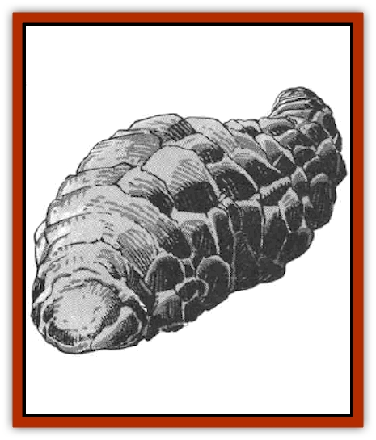

# Horgar

| Statistic | **Horgar** |
| --- | --- |
| **Activity Cycle:** | Any |
| **Alignment:** | Neutral |
| **Armor Class:** | -10 (head is AC 0) |
| **Climate/Terrain:** | Any/Subterranean |
| **Damage/Attack:** | 20-80 |
| **Diet:** | Rocks or earth |
| **Frequency:** | Very rare |
| **Hit Dice:** | 30 to 100 |
| **Intelligence:** | Semi (5-7) |
| **Magic Resistance:** | Nil |
| **Morale:** | Fearless (19-20) |
| **Movement:** | 3 |
| **No. Appearing:** | 1 |
| **No. of Attacks:** | 1 |
| **Organization:** | Solitary |
| **Size:** | G (30-100' long) |
| **Special Attacks:** | Squirt acid |
| **Special Defenses:** | Intense heat |
| **THAC0:** | 5 |
| **Treasure:** | Nil |
| **XP Value:** | 30 HD: 26,000 / (add 1,000/HD above 30) |

This immense and powerful creature eats its way through solid rock, creating tunnels, passageways, and caverns in its wake. When not in motion, a horgar resembles a lava formation. In motion it looks like a giant, black rock slug. It is an oblong lump with a thick skin of true stone (five feet thick in an adult). Great cracks in the skin divide it into large plates that shift and slide when the horgar is moving. The only exposed part is the head, located at one end of the oblong, which is just a lump of softerlooking stone.

The horgar smells like the super-heated acid that it secretes from between its rock plates, somewhat like ammonia. These gases make other creatures' eyes water and irritate their mouths and nasal passages. The only sounds it makes are the grinding of its skin against the tunnel walls and the hiss of acid and heat melting rock

**Combat:** The horgar is not an aggressive creature. The main problem is that it does not recognize most living creatures at all. If unprovoked, it goes its own way, whether or not somebody is in the way. If attacked, it tries to leave. The tunnels it leaves behind are dangerously hot for the first three hours, causing 2d10 points of damage if touched by bare flesh. Wood or paper that comes in contact with a hot wall ignite instantly; metal that is in contact with the wall for one turn can cause 2d10 points of bum damage. The walls are still hot, but not dangerous, for a full 24 hours after the horgar passes. The tunnel is also littered with pools of acid, which cause 1d4x10 points of damage to bare flesh. Other objects must roll successfd saving throws vs. acid or be destroyed.

This creature is immune to acid, fire, and electrical attacks. Striking it with physical weapons is like hitting a granite boulder. Edged weapons cause only half damage and must roll saving throws vs. crushing blow. All weapons must roll saving throws vs. acid, which means edged weapons must roll two saving throws for each hit. Failure of either saving throw means the weapon is destroyed, either shattered or dissolved.

If the horgar can't run away from attackers, it turns and fights. Its only weapon is to squirt acid from its head up to 20 feet away. At the first opportunity, it again tries to flee. Horgar are so hard to hurt, and so dangerous, that most creatures just leave them alone.

**Habitat/Society:** Horgar live in the deep, hard-rock regions of the earth. On rare occasions they can be found closer to the surface or in softer rock. They do not have any society of their own, but they have affected many other societies. The name horgar is [[Dwarf|dwarvish]], while the [[Gnome|gnomes]] call them storgin; both names translate loosely to stone-eater.

For all the ages that the horgar have been tunneling in the Underdark, thousands of miles of tunnels and caverns are left behind. Other natural conditions, such as running water, have eroded most of them, giving them a natural look. These caverns have become homes to many races.

Some of the more primitive races of the Underdark worship the horgar as gods. Others, such as the dwarves, [[Dwarf_Duergar|duergar]], [[Elf_Drow|drow]], gnomes, and the [[Gnome|deep gnomes]] use them as work beasts. The horgar are kept in reinforced, glass-lined pits. They can be driven by slipping thin, glass-sheathed spears between the plates of their skin. This causes no damage, but irritates them sufficiently to make them move away from that side. The handler, called horgarin in dwarvish, must be skilled and quick to avoid having his spear snapped by the sliding plates of the skin. The dwarves have a saying, "as unlucky as a horgarin without a spear".

Every 500 years, a horgar splits off 2d10 small parts of itself in a deep, hidden cave with only a single entrance. Each egg that is laid subtracts 1 Hit Die from the horgar. They radiate heat and slowly ooze acid. In the next two years the eggs mature into 30-Hit Die infants and become active, hungry, and mobile. After that they grow 1 Hit Die per year until they reach adulthood at 100 Hit Dice. Horgar are roughly one foot long for each Hit Die.

**Ecology:** The horgar are vital to the ecology of the Underdark. The ayproducts of the stone-eaters are breathable gases, acids and other fluids, and various mineral deposits. Without the tunneling horgar, life would not be possible in the Underdark. The bodies of the horgar provides nothing of value, except to wizards - some parts of it are used for spells involving earth, stone, digging, and molten heat.

---
## Discovery & Documentation

**Source Publication:** MC5 Greyhawk Appendix (1989)
**Campaign Setting:** Advanced Dungeons & Dragons 2nd Edition
**Author(s):** Grant Boucher, William W. Connors, Steve Gilbert, Bruce Nesmith, Chris Mortika, Skip Williams

### Other Creatures Found in This Source Book
   * [[Aspis|Aspis]]
   * [[Beastman|Beastman]]
   * [[Bonesnapper|Bonesnapper]]
   * [[Booka|Booka]]
   * [[Brownie_Buckawn|Brownie, Buckawn]]
   * [[Brownie_Quickling|Brownie, Quickling]]
   * [[Crystalmist|Crystalmist]]
   * [[Dragon_Cloud|Dragon, Cloud]]
   * [[Dragon_Oerth_Greyhawk|Dragon (Oerth), Greyhawk]]
   * [[Dragonfly_Giant|Dragonfly, Giant]]
   * [[Dragonnel|Dragonnel]]
   * [[Elf_Grugach|Elf, Grugach]]
   * [[Elf_Valley|Elf, Valley]]
   * [[Golem_Necrophidius|Golem, Necrophidius]]
   * [[Grell_Wild|Grell, Wild]]
   * [[Grung|Grung]]
   * [[Hobgoblin_Norker|Hobgoblin, Norker]]
   * [[Hook_Horror|Hook Horror]]
   * [[Hound_Yeth|Hound, Yeth]]
   * [[Iguana_Giant|Iguana, Giant]]
   * [[Ingundi|Ingundi]]
   * [[Kech|Kech]]
   * [[Kyuss_Son_of|Kyuss, Son of]]
   * [[Mite|Mite]]
   * [[Needleman|Needleman]]
   * [[Plant_Carnivorous_Oerth|Plant, Carnivorous (Oerth)]]
   * [[Plant_Carnivorous_Vampire_Cactus|Plant, Carnivorous, Vampire Cactus]]
   * [[Plasmoid_General_Information|Plasmoid, General Information]]
   * [[Rat_Oerth|Rat (Oerth)]]
   * [[Raven_Crow|Raven/Crow]]
   * [[Scarecrow|Scarecrow]]
   * [[Shadow_Slow|Shadow, Slow]]
   * [[Skulk|Skulk]]
   * [[Snail|Snail]]
   * [[Sprite|Sprite]]
   * [[Taer|Taer]]
   * [[Tentamort|Tentamort]]
   * [[Turtle_Giant|Turtle, Giant]]
   * [[Tyrg|Tyrg]]
   * [[Wolf_Mist|Wolf, Mist]]
   * [[Wraith_Oerth|Wraith (Oerth)]]
   * [[Zygom|Zygom]]
