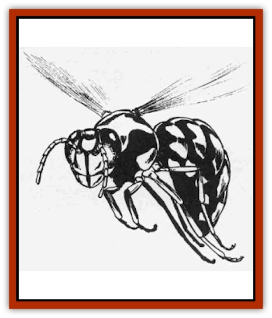

# Hornet - Giant

| Statistic | **Hornet** | **Wasp** |
| --- | --- | --- |
| **Activity Cycle:** | Day | Day |
| **Alignment:** | Neutral | Neutral |
| **Armor Class:** | 2 (4) | 4 |
| **Climate/Terrain:** | Any forest or cave | Any forest or cave |
| **Damage/Attack:** | 1d4 | 2d4/1d4 |
| **Diet:** | Omnivore | Omnivore |
| **Frequency:** | Uncommon | Rare |
| **Hit Dice:** | 5 | 4 |
| **Intelligence:** | Semi- (2-4) | Non- (0) |
| **Magic Resistance:** | Nil | Nil |
| **Morale:** | Average (8-10) | Average (8-10) |
| **Movement:** | 6, Fl 24 (B) | 6, Fl 21 (B) |
| **No. Appearing:** | 1 | 1-20 |
| **No. of Attacks:** | 1 | 2 |
| **Organization:** | Solitary | Hive |
| **Size:** | M (5' long) | M (5' long) |
| **Special Attacks:** | Poison and paralysis | Poison and paralysis |
| **Special Defenses:** | Nil | Nil |
| **THAC0:** | 15 | 17 |
| **Treasure:** | Nil | Q(&times;20) |
| **XP Value:** | 650 | 420 |

Giant hornets are nothing more than fantastically enlarged versions of normal insects. Unlike their more common cousins, they are often hostile and aggressive.

The giant hornet has a 5' long body and a 10' wingspan. Their chitinous exoskeleton is marked by shiny, parallel stripes of black and yellow. The abdomen is tipped by a retractable stinger.

**Combat:** Giant hornets are solitary creatures who will attack on sight. It swoops down onto its prey and takes hold with its legs while its stinger stabs into the victim's body. In addition to inflicting 1-4 points of damage, the stinger also injects a potent toxin. If a saving throw versus poison is not made, the toxin does 5-30 points of damage and paralyzes the victim for 2-12 (2d6) hours.

Smoke and flame are powerful weapons in any battle against these giant insects. Smoke causes them to become somewhat tranquilized, invoking a -2 penalty on its attack rolls. Flame frightens them greatly, and they will suffer a -4 on their attack rolls against anyone who is using it to defend himself. The hornet's wings are especially vulnerable to flame and will be consumed by any form of fire-based attack in one round. Although this does no physical harm to the hornet, it does render it flightless until its wings grow back in 2-12 (2d6) weeks.

The giant hornet is a very noisy flier and the buzzing of its wings can be heard up to 150' away. Underground, this range is halved by each wall or closed door between the monster and the listener.

**Habitat/Society:** Giant hornets are believed to be the result of magical experiments gone awry. Save for the fact that they are much more aggressive than the common hornet, their gigantic size has not changed their instinctual behavior.

Once per month, female hornets will prepare a nest and attract a male for mating. Together, the two create an egg chamber in some out of the way place. Egg clambers can be established in pits, abandoned buildings, caves, or any similar area. The wales of the chamber are coated with a mixture of mud, cellulose, and hornet saliva which hardens into rock. The construction of the chamber takes between 1 and 6 days, depending on its size.

When the chamber is complete, the couple mates. The male departs shortly afterwards, but dies within a day from exhaustion. The female leaves the chamber in search of a victim which it paralyzes and carries back to the chamber. Once in the chamber, the hornet uses its mud-like compound to bind its prey and injects it with 2-4 (2d8) eggs. It leaves promptly thereafter, pausing only to seal the egg chamber (which takes 1-6 hours), Mere hours later, the eggs hatch and the larvae within begin to feed on the body around them. The six inch long larvae do 1 point of damage each per turn. After devouring the body, the young hornets break through the wall of the egg chamber by dissolving it with their saliva and fly off to begin their lives in the wild.

Although hornets do not keep treasure troves, their egg chambers may be a source of valuable in the form of victims' possessions.

**Ecology:** The giant hornets are the result of deliberate tampering with nature. They roam the world mindlessly following their primal instinct to reproduce.

Hornet toxin decays quickly when removed from the body. It can be used to coat blades and such only if the toxin is less than two days old. The toxin may also be used in the preparation of anti-paralysis potions and antidotes.

**Gianl Wasp**

  These insects are very similar to giant hornets but live in swarms of as many as 20 individuals. Giant wasps are cooperative insects who build and maintain immense hives. Constructed of a thick paper-like substance, giant wasp hives are home to 21-40 (1d20+20) adults and 100-400 (1d4x100) eggs, larvae, and pupae. Their hives may surround a lace tree or fill a vast chamber in the earth.

A giant wasp first attacks with its powerful bite (2d4 points of damage), then stabs with its stinger (1-4 points). Failure to make a save against poison means that any victim hit by the stinger has been injured with a poison similar to that employs by the giant hornet. Paralyzed victims are carried back to the hive and placed in the communal egg chamber where they are quickly consumed by the hungry young.

---
## Discovery & Documentation

**Source Publication:** MC1 Volume I (w/binder #1) (1991)
**Campaign Setting:** Advanced Dungeons & Dragons 2nd Edition
**Author(s):** Jay Batista, Scott Bennie, Grant Boucher, William W. Connors, Steve Gilbert, Heike Kubasch, James Lowder, David Edward Martin, Bruce Nesmith, Jean Rabe, Rick Swan, John J. Terra, Gary L. Thomas

### Other Creatures Found in This Source Book
   * [[Bat|Bat]]
   * [[Bear|Bear]]
   * [[Behir|Behir]]
   * [[Boar|Boar]]
   * [[Bookworm|Bookworm]]
   * [[Brownie|Brownie]]
   * [[Bugbear|Bugbear]]
   * [[Carrion_Crawler|Carrion Crawler]]
   * [[Cat_Great|Cat, Great]]
   * [[Catoblepas|Catoblepas]]
   * [[Dragon_General_Information|Dragon, General Information]]
   * [[Dragonfish|Dragonfish]]
   * [[Elemental_Air_Kin_Aerial_Servant|Elemental, Air Kin, Aerial Servant]]
   * [[Elemental_Earth_Kin_Sandling|Elemental, Earth Kin, Sandling]]
   * [[Elephant|Elephant]]
   * [[Gnoll|Gnoll]]
   * [[Hobgoblin|Hobgoblin]]
   * [[Homunculus|Homunculus]]
   * [[Horse|Horse]]
   * [[Hyena|Hyena]]
   * [[Jackal|Jackal]]
   * [[Jackalwere|Jackalwere]]
   * [[Korred|Korred]]
   * [[Lich|Lich]]
   * [[Lizard|Lizard]]
   * [[Lizard_Man|Lizard Man]]
   * [[Lycanthrope_General_Information|Lycanthrope, General Information]]
   * [[Lycanthrope_Seawolf|Lycanthrope, Seawolf]]
   * [[Lycanthrope_Werebear|Lycanthrope, Werebear]]
   * [[Lycanthrope_Weretiger|Lycanthrope, Weretiger]]
   * [[Lycanthrope_Werewolf|Lycanthrope, Werewolf]]
   * [[Manticore|Manticore]]
   * [[Medusa|Medusa]]
   * [[Mind_Flayer|Mind Flayer]]
   * [[Minotaur|Minotaur]]
   * [[Mudman|Mudman]]
   * [[Mummy|Mummy]]
   * [[Nixie|Nixie]]
   * [[Nymph|Nymph]]
   * [[Ogre|Ogre]]
   * [[Ooze_Slime_Jelly_I|Ooze/Slime/Jelly I]]
   * [[Ooze_Slime_Jelly_II|Ooze/Slime/Jelly II]]
   * [[Orc|Orc]]
   * [[Owl|Owl]]
   * [[Owlbear_I|Owlbear I]]
   * [[Pegasus|Pegasus]]
   * [[Piercer|Piercer]]
   * [[Pudding_Deadly|Pudding, Deadly]]
   * [[Rakshasa|Rakshasa]]
   * [[Rat|Rat]]
   * [[Ray|Ray]]
   * [[Remorhaz|Remorhaz]]
   * [[Satyr|Satyr]]
   * [[Scorpion|Scorpion]]
   * [[Selkie|Selkie]]
   * [[Shadow|Shadow]]
   * [[Skeleton|Skeleton]]
   * [[Skunk|Skunk]]
   * [[Snake|Snake]]
   * [[Spectre|Spectre]]
   * [[Spider|Spider]]
   * [[Sprite|Sprite]]
   * [[Toad_Giant|Toad, Giant]]
   * [[Treant|Treant]]
   * [[Troll|Troll]]
   * [[Umber_Hulk|Umber Hulk]]
   * [[Unicorn|Unicorn]]
   * [[Vampire|Vampire]]
   * [[Wight|Wight]]
   * [[Will_O'Wisp|Will O'Wisp]]
   * [[Wolf|Wolf]]
   * [[Wolfwere|Wolfwere]]
   * [[Wraith|Wraith]]
   * [[Wyvern|Wyvern]]
   * [[Yeti|Yeti]]
   * [[Yuan-ti|Yuan-ti]]
   * [[Zombie|Zombie]]
