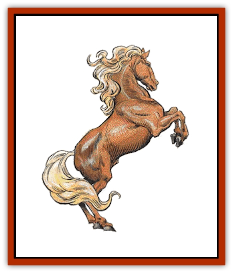

# Horse

| Statistic | **Draft** | **Heavy** | **Light** | **Medium** | **Mule** | **Pony** | **Riding** | **Wild** |
| --- | --- | --- | --- | --- | --- | --- | --- | --- |
| **Activity Cycle:** | Day | Day | Day | Day | Day | Day | Day | Day |
| **Alignment:** | Neutral | Neutral | Neutral | Neutral | Neutral | Neutral | Neutral | Neutral |
| **Armor Class:** | 7 | 7 | 7 | 7 | 7 | 7 | 7 | 7 |
| **Climate/Terrain:** | Any non-mountainous | Any non-mountainous | Any non-mountainous | Any non-mountainous | Any non-mountainous | Any non-mountainous | Any non-mountainous | Any non-mountainous |
| **Damage/Attack:** | 1-3 | 1-8/1-8 | 1-4/1-4 | 1-6/1-6 | 1-2/1-6 | 1-2 | 1-2/1-2 | 1-3 |
| **Diet:** | Herbivore | Herbivore | Herbivore | Herbivore | Herbivore | Herbivore | Herbivore | Herbivore |
| **Frequency:** | Common | Uncommon | Uncommon | Uncommon | Common | Uncommon | Common | Uncommon |
| **Hit Dice:** | 3 | 3+3 | 2 | 2+2 | 3 | 1+1 | 3 | 2 |
| **Intelligence:** | Animal (1) | Animal (1) | Animal (1) | Animal (1) | Animal (1) | Animal (1) | Animal (1) | Animal (1) |
| **Magic Resistance:** | Nil | Nil | Nil | Nil | Nil | Nil | Nil | Nil |
| **Morale:** | Unsteady (5-7) | Unsteady (5-7) | Unsteady (5-7) | Unsteady (5-7) | Unsteady (5-7) | Unsteady (5-7) | Unsteady (5-7) | Unsteady (5-7) |
| **Movement:** | 12 | 15 | 24 | 18 | 12 | 12 | 24 | 24 |
| **No. Appearing:** | 1 | 1 | 1 | 1 | 1 | 1 | 5-50(5d6) | 5-30 (5d6) |
| **No. of Attacks:** | 1 | 2 | 2 | 2 | 1 or 2 | 1 | 2 | 1 |
| **Organization:** | Herd | Herd | Herd | Herd | Herd | Herd | Herd | Herd |
| **Size:** | L | L | L | L | M | M | L | L |
| **Special Attacks:** | Nil | Nil | Nil | Nil | Nil | Nil | Nil | Nil |
| **Special Defenses:** | Nil | Nil | Nil | Nil | Nil | Nil | Nil | Nil |
| **THAC0:** | 17 | 17 | 19 | 19 | 17 | 19 | 17 | 19 |
| **Treasure:** | Nil | Nil | Nil | Nil | Nil | Nil | Nil | Nil |
| **XP Value:** | 65 | 120 | 35 | 65 | 65 | 35 | 65 | 35 |

Horses are large quadrupeds often used for transportation, or as pack and draft animals, by human and demihuman races. They are frequently bred for their speed and for their beauty.

A horse can be solid white, gray, chestnut, brown, black, or various reddish tones; its hide can instead show a variation or combination of these colors. Some of the more interesting variations include the piebald, which has a coat of large, irregular patches of black and white; the palomino, with its rich yellow-gold coat and white mane and tail; and the dapple gray, which is dark gray with flecks of lighter color on the chest, belly, and hindquarters.

In addition to the coat's color, the horse may have markings of various sorts. The long hairs of the mane and tail can be lighter, darker, or of the same color as the body of the horse. Possible markings include socks (meaning the leg from the hoof, halfway to the knee, or hock, is white); a white muzzle; a blaze (a wide band of white from the top of the horse's head to the tip of its nose); and a star (a white, diamond-shaped patch set on the horse's forehead, right between its eyes).

Horses are measured in "hands". One hand equals 4 inches.

**Combat:** War horses will fight independently of the rider on the second and succeeding rounds of a melee. Other breeds fight only if cornered. Most attack twice per round by kicking with their front hooves.

Unless specially trained, horses can be panicked by loud noises, strange smells, fire, or sudden movements 90% of the time. Horses trained and accustomed to such things (usually warhorses) panic only 10% of the time.

**Habitat/Society:** The horse's gestation period is about 11 months. Mares (female horses) usually give birth to a single foal (young horse). Twins do occur, but only about 10% of the time (or less). Even triplets are possible, but are extremely rare. The foal is weaned after six months. It is mature after two to three years, and is considered adult at age five. The usual life span of a horse is 30-35 years, though rare exceptions have lived to age 50, and hard-worked horses rarely live past age 12.

Only 10% of ponies and wild horses can be trained to serve as warhorses. Of all the breeds and varieties listed here, only mules are agile enough for use in mountainous or subterranean environments.

**Ecology:** Modern horses evolved in temperate plains and grasslands. Domestic breeds can be found anywhere people live (even in the high mountains, if the local roads are good).

Horses can carry great weights for long periods of time, but not without tiring. The table below shows the maximum weight a horse can carry; as illustrated, greater weights cause the horse to move at slower movement rates.

| Type of Horse | Full speed | Half speed | One-third speed |
| --- | --- | --- | --- |
| Draft | 260 | 390 | 520 |
| Heavy war horse | 260 | 390 | 520 |
| Medium war horse | 220 | 330 | 440 |
| Light war horse | 170 | 255 | 340 |
| Pony | 160 | 240 320 |
| Wild | 170 | 255 | 340 |
| Riding | 180 | 270 | 360 |
| Mule | 250 | 375 | 500 |

A horse can also move at speeds higher than those given as their base movement rates, as shown on the table below. The horse's normal movement rate is considered a trot.

| Type of Horse | Walk | Trot | Canter | Gallop |
| --- | --- | --- | --- | --- |
| Draft | 6 | 12 | 18 | 24 |
| Heavy war horse | 6 | 15 | 21 | 27 |
| Medium war horse | 9 | 18 | 27 | 36 |
| Light war horse | 12 | 24 | 36 | 48 |
| Pony | 6 | 12 | 18 | 24 |
| Wild | 12 | 24 | 36 | 48 |
| Riding | 12 | 24 | 36 | 48 |
| Mule | 6 | 12 | 18 | 24 |

As noted in Chapter 14 of the *Player's Handbook*, in a day of travel over good terrain, a creature can travel a number of miles equal to twice its normal movement rate. A horse's overland movement rate can be improved by pushing it to a canter or gallop. A canter can be safely maintained for two hours, or a gallop for one hour, but the horse must be walked for an hour before its speed can again be increased. For the effects of increasing a horse's speed enough to affect its overland movement rate, see Chapter 14 of the *DMG*.

A horse will not gallop when loaded with enough material to reduce its normal movement rate by half; nor will it canter or gallop if carrying a load which will reduce its normal movement rate to one-third normal (see Horse Table 1).

**Draft Horse**

  Draft horses are large animals bred to haul very heavy loads, and are usually trained to be part of a dray team. Muscular but slow, these ponderous animals haul freight over long distances without complaint, and are frequently used by traders.

**War Horse**

  Warhorses are bred and trained to the lance, the spear, and the sword. They have higher morale than other horses, and are not as skittish about sudden movements and loud noises. The choice of knights and cavalry, these are the pinnacle of military horses. There are three varieties; heavy, medium and light.

*Heavy war horses* are similar to draft animals. Large and muscular, they are relatively slow. Their size and powerful legs allow them to be armored in plate, and to carry a warrior in plate, as easily as a pony carries saddle bags. A good heavy war horse, fully trained, costs 400 or more gold pieces.

*Medium war horses* are lighter and smaller than their heavy cousins. They can be encumbered with leather or light plate armor and carry a rider wearing leather or light plate. The advantage of the medium war horse is its increased speed. The price of a medium war horse is 200 gp or more.

*Light war horses* are the fastest of the breed. They can carry warriors in leather armor, but are rarely armored themselves. They make excellent mounts for raiding parties, light cavalry, and thieves. Light war horses cost 150 gp or more.

**Pony**

  Small horses used primarily for transportation and occasionally farm work, ponies are a lively breed. They are more excitable than the larger horses, but frequently more gentle, as well. They are sometimes trained and used as war horses by several of the smaller demihuman races. Prices vary depending on training and size, but most cost around 500 gp.

**Wild Horse**

  Wild horses can be captured and trained to serve as mounts or work ponies. Training usually takes twice as long as training a domestic horse. Wild horses are hardy but jittery, and difficult to catch in the wild. They are sometimes hunted for food by human and demihuman tribes.

**Riding Horse**

  Riding horses are bred to the saddle. Perhaps the most common of all horses, they are ridden, worked, and raced by humans and demihumans alike. The price of a riding horse will vary, depending on its bloodlines, training, and appearance. Fast and agile, this breed is a good choice for personal transportation and general use.

**Mule**

  Sterile hybrids of horses and donkeys, mules are very sure-footed and exceptionally stubborn. They can be ridden by patient handlers who know how to control them, but are best used as pack animals in difficult or mountainous terrain. They are sometimes used by adventurers, for they are the only breed that can be taken into subterranean regions. The price of mules depends on how much grief they have given their current owners.

**Steppe Pony**

  A steppe pony is not attractive, graceful, or large, but its homely, ungainly appearance disguises an animal of great endurance, speed, and strength. A steppe pony looks like a cross between a horse and a pony, but is a breed unto itself. They are small, averaging 13 hands (4'4") at the withers, and they have short necks, large heads, and heavily boned bodies. Their winter coat is shaggy and gives them the appearance of being "half-wild". They are most commonly colored copper or bronze, with a light yellow stripe running down their backs.

These horses are tough, hard to kill, and aggressive in battle. They have most of the same characteristics as a light war horse, with a few exceptions. It attacks three times per round, its third attack being a bite which causes 1-3 points of damage. The steppe pony's thick, shaggy coat and tough hide gives it an AC of 6. Its short legs are powerful and can carry horse and rider swiftly, over long distances; its small back is also very strong and it can carry as much as a medium war horse (220/330/440). The steppe pony is even-tempered and steady in battle; its morale is average (8-10), and it panics very rarely (5% chance) due to such things as fire and loud noises.

The steppe pony has remarkable endurance. It can survive by grazing alone and does not require feeding and handling by its rider, so separate supplies of grain are not needed. It can be ridden for long distances without tiring or faltering. A +3 modifier is applied to the pony's saving throws for lameness and exhaustion checks when travelling overland.

In spite of all its qualities, the steppe pony is not sought after or considered valuable. It is most commonly ridden by nomadic tribes. Outside the steppes, the animal is almost completely unknown and does not command high prices at auction. Only breeders who know the steppe pony's qualities, and who seek strength and stamina in their own horses' bloodlines, are likely to consider the steppe pony as valuable.

---
## Discovery & Documentation

**Source Publication:** MC1 Volume I (w/binder #1) (1991)
**Campaign Setting:** Advanced Dungeons & Dragons 2nd Edition
**Author(s):** Jay Batista, Scott Bennie, Grant Boucher, William W. Connors, Steve Gilbert, Heike Kubasch, James Lowder, David Edward Martin, Bruce Nesmith, Jean Rabe, Rick Swan, John J. Terra, Gary L. Thomas

### Other Creatures Found in This Source Book
   * [[Bat|Bat]]
   * [[Bear|Bear]]
   * [[Behir|Behir]]
   * [[Boar|Boar]]
   * [[Bookworm|Bookworm]]
   * [[Brownie|Brownie]]
   * [[Bugbear|Bugbear]]
   * [[Carrion_Crawler|Carrion Crawler]]
   * [[Cat_Great|Cat, Great]]
   * [[Catoblepas|Catoblepas]]
   * [[Dragon_General_Information|Dragon, General Information]]
   * [[Dragonfish|Dragonfish]]
   * [[Elemental_Air_Kin_Aerial_Servant|Elemental, Air Kin, Aerial Servant]]
   * [[Elemental_Earth_Kin_Sandling|Elemental, Earth Kin, Sandling]]
   * [[Elephant|Elephant]]
   * [[Gnoll|Gnoll]]
   * [[Hobgoblin|Hobgoblin]]
   * [[Homunculus|Homunculus]]
   * [[Hornet_Giant|Hornet, Giant]]
   * [[Hyena|Hyena]]
   * [[Jackal|Jackal]]
   * [[Jackalwere|Jackalwere]]
   * [[Korred|Korred]]
   * [[Lich|Lich]]
   * [[Lizard|Lizard]]
   * [[Lizard_Man|Lizard Man]]
   * [[Lycanthrope_General_Information|Lycanthrope, General Information]]
   * [[Lycanthrope_Seawolf|Lycanthrope, Seawolf]]
   * [[Lycanthrope_Werebear|Lycanthrope, Werebear]]
   * [[Lycanthrope_Weretiger|Lycanthrope, Weretiger]]
   * [[Lycanthrope_Werewolf|Lycanthrope, Werewolf]]
   * [[Manticore|Manticore]]
   * [[Medusa|Medusa]]
   * [[Mind_Flayer|Mind Flayer]]
   * [[Minotaur|Minotaur]]
   * [[Mudman|Mudman]]
   * [[Mummy|Mummy]]
   * [[Nixie|Nixie]]
   * [[Nymph|Nymph]]
   * [[Ogre|Ogre]]
   * [[Ooze_Slime_Jelly_I|Ooze/Slime/Jelly I]]
   * [[Ooze_Slime_Jelly_II|Ooze/Slime/Jelly II]]
   * [[Orc|Orc]]
   * [[Owl|Owl]]
   * [[Owlbear_I|Owlbear I]]
   * [[Pegasus|Pegasus]]
   * [[Piercer|Piercer]]
   * [[Pudding_Deadly|Pudding, Deadly]]
   * [[Rakshasa|Rakshasa]]
   * [[Rat|Rat]]
   * [[Ray|Ray]]
   * [[Remorhaz|Remorhaz]]
   * [[Satyr|Satyr]]
   * [[Scorpion|Scorpion]]
   * [[Selkie|Selkie]]
   * [[Shadow|Shadow]]
   * [[Skeleton|Skeleton]]
   * [[Skunk|Skunk]]
   * [[Snake|Snake]]
   * [[Spectre|Spectre]]
   * [[Spider|Spider]]
   * [[Sprite|Sprite]]
   * [[Toad_Giant|Toad, Giant]]
   * [[Treant|Treant]]
   * [[Troll|Troll]]
   * [[Umber_Hulk|Umber Hulk]]
   * [[Unicorn|Unicorn]]
   * [[Vampire|Vampire]]
   * [[Wight|Wight]]
   * [[Will_O'Wisp|Will O'Wisp]]
   * [[Wolf|Wolf]]
   * [[Wolfwere|Wolfwere]]
   * [[Wraith|Wraith]]
   * [[Wyvern|Wyvern]]
   * [[Yeti|Yeti]]
   * [[Yuan-ti|Yuan-ti]]
   * [[Zombie|Zombie]]
