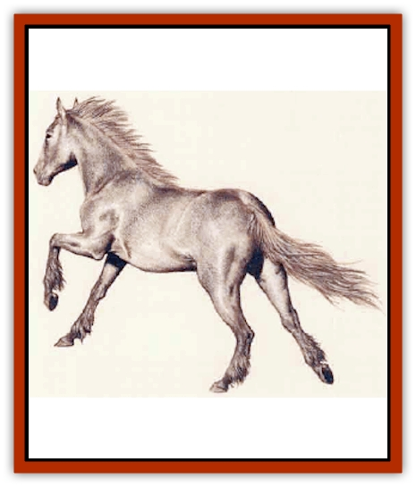

# Horse - Moon

| Statistic | **Horse, Moon-** |
| --- | --- |
| **Activity Cycle:** | Day |
| **Alignment:** | Chaotic Good |
| **Armor Class:** | 7 |
| **Climate/Terrain:** | Plains, meadows (Evermeet) |
| **Damage/Attack:** | 1-8/1-8 |
| **Diet:** | Herbivore |
| **Frequency:** | Rare |
| **Hit Dice:** | 4 |
| **Intelligence:** | Average.very (9-12) |
| **Magic Resistance:** | Nil |
| **Morale:** | Champion (15) |
| **Movement:** | 18 |
| **No. Appearing:** | 5-20 |
| **No. of Attacks:** | 2 |
| **Organization:** | Herd |
| **Size:** | L |
| **Special Attacks:** | Magic |
| **Special Defenses:** | Undead immunity |
| **THAC0:** | 17 |
| **Treasure:** | Nil |
| **XP Value:** | 270 |

Moon-horses, also known as teu'kelytha, are a race of highly intelligent, magic-using [[Horse|horses]] that are unique to Evermeet. The last herds of moon-horses on Faer�n were transported to the isle during the retreat, and most continue to run free through Evermeet's forests and meadows, serving the [[Elf|elves]] as needed.

These magnificent animals vary from white to silverygray in color, with manes ranging from white to black. A moon-horse.s eyes are deep and highly intelligent, and its facial expressions reflect a wide variety of moods.

Moon-horses are similar in temperament to the elves whom they serve. They roam Evermeet freely, but voluntarily serve as cavalry mounts for Evermeet's cavalry.

**Combat:** Moon-horses are tough fighters, and far less flighty than ordinary horses. Each moon-horse has the ability to cast one magical spell per day, as determined by rolling 1d10 and referring to the following table.

| Die Roll | Spell |
| --- | --- |
| 1 | Color spray |
| 2 | Magic Missile |
| 3 | Shield |
| 4 | Sleep |
| 5 | Wall of Fog |
| 6 | Knock |
| 7 | Ray of Enfeeblement |
| 8 | Stinking Cloud |
| 9 | Summon Swarm |
| 10 | Web |

Moon-horses are completely immune to all special attacks such as *level drain* or *paralysis* by undead, although they still take normal damage.

**Habitat/Society:** Moon-horses normally travel in herds of as many as 20 individuals. However, many associate voluntarily with elves, serving as companions and mounts.

The horses' association with the elves is a very old one. Ancient legends tell of heroes who rode wise and mighty moon-horses into battle, and of moon-horses who saved their masters at the cost of their own lives. The alliance between the two races continues to this day, with moon-horses serving the riders of Queen Amlaruil.

**Ecology:** Moon-horses suffer from many of the same fertility problems as elves. Typically, a given moonhorse female has only one or two foals during her entire lifetime. Moon-horses are quite long-lived, with a lifespan of 200 years or more. Because of the rarity of foals among the moon-horses, births are momentous events, celebrated by elves and horses alike.

---
## Discovery & Documentation

**Source Publication:** Monstrous Compendium, 1995 Annual, Volume 2 (1995)
**Campaign Setting:** Advanced Dungeons & Dragons 2nd Edition
**Author(s):** Jon Pickens

### Other Creatures Found in This Source Book
   * [[Aboleth_Savant|Aboleth, Savant]]
   * [[Addazahr|Addazahr]]
   * [[Amiq_Rasol|Amiq Rasol]]
   * [[Arch-Shadow|Arch-Shadow]]
   * [[Automaton_Scaladar|Automaton, Scaladar]]
   * [[Automaton_Trobriand's|Automaton, Trobriand's]]
   * [[Bat_Sporebat|Bat, Sporebat]]
   * [[Beetle_Dragon|Beetle, Dragon]]
   * [[Bi-nou|Bi-nou]]
   * [[Boggle|Boggle]]
   * [[Brownie_Dobie|Brownie, Dobie]]
   * [[Brownie_Quickling|Brownie, Quickling]]
   * [[Cat_Crypt|Cat, Crypt]]
   * [[Cat_Great_Cath_Shee|Cat, Great, Cath Shee]]
   * [[Centaur-kin_Dorvesh|Centaur-kin, Dorvesh]]
   * [[Centaur-kin_Gnoat|Centaur-kin, Gnoat]]
   * [[Centaur-kin_Ha'pony|Centaur-kin, Ha'pony]]
   * [[Centaur-kin_Zebranaur|Centaur-kin, Zebranaur]]
   * [[Chronolily|Chronolily]]
   * [[Curst|Curst]]
   * [[Darktentacles|Darktentacles]]
   * [[Dinosaur_Aquatic|Dinosaur, Aquatic]]
   * [[Dinosaur_II|Dinosaur II]]
   * [[Dinosaur_III|Dinosaur III]]
   * [[Doppelganger_Greater|Doppelganger, Greater]]
   * [[Dragon_Brine|Dragon, Brine]]
   * [[Dragon_Half-|Dragon, Half-]]
   * [[Dragon-kin_Sea_Wyrm|Dragon-kin, Sea Wyrm]]
   * [[Dwarf_Wild|Dwarf, Wild]]
   * [[Ekimmu|Ekimmu]]
   * [[Elemental_Nature|Elemental, Nature]]
   * [[Elf_Winged|Elf, Winged]]
   * [[Fish_Great_Glacier|Fish (Great Glacier)]]
   * [[Fish_Subterranean|Fish, Subterranean]]
   * [[Fish_Toril|Fish (Toril)]]
   * [[Flareater|Flareater]]
   * [[Flumph|Flumph]]
   * [[Froghemoth|Froghemoth]]
   * [[Ghost_Casurua|Ghost, Casurua]]
   * [[Ghost_Ker|Ghost, Ker]]
   * [[Ghul|Ghul]]
   * [[Ghul-Kin|Ghul-Kin]]
   * [[Giant_Half-giant|Giant, Half-giant]]
   * [[Golem_Burning_Man|Golem, Burning Man]]
   * [[Golem_Phantom_Flyer|Golem, Phantom Flyer]]
   * [[Gulguthhydra|Gulguthhydra]]
   * [[Hakeashar|Hakeashar]]
   * [[Human_Dragonslayer|Human, Dragonslayer]]
   * [[Human_Vistana|Human, Vistana]]
   * [[Jellyfish_Giant|Jellyfish, Giant]]
   * [[Kalin|Kalin]]
   * [[Kholiathra|Kholiathra]]
   * [[Laerti|Laerti]]
   * [[Leucrotta_Greater|Leucrotta, Greater]]
   * [[Lich_Suel|Lich, Suel]]
   * [[Lurker_Shadow|Lurker, Shadow]]
   * [[Lycanthrope_Werepanther|Lycanthrope, Werepanther]]
   * [[Lycanthrope_Wereshark|Lycanthrope, Wereshark]]
   * [[Mammal_Herd_II|Mammal, Herd II]]
   * [[Marl|Marl]]
   * [[Meenlock|Meenlock]]
   * [[Mimic_Greater|Mimic, Greater]]
   * [[Mold_II|Mold II]]
   * [[Mummy_Creature|Mummy, Creature]]
   * [[Nyth|Nyth]]
   * [[Ooze_Slime_Jelly_Ghaunadan|Ooze/Slime/Jelly, Ghaunadan]]
   * [[Palimpsest|Palimpsest]]
   * [[Peltast|Peltast]]
   * [[Plant_Dangerous_II|Plant, Dangerous II]]
   * [[Pleistocene_Animal|Pleistocene Animal]]
   * [[Pudding_Subterranean|Pudding, Subterranean]]
   * [[Raggamoffyn|Raggamoffyn]]
   * [[Snake_Serpent|Snake, Serpent]]
   * [[Snake_Serpent_Vine|Snake, Serpent Vine]]
   * [[Sphinx_Draco-|Sphinx, Draco-]]
   * [[Sprite_Seelie_Faerie|Sprite, Seelie Faerie]]
   * [[Sprite_Unseelie_Faerie|Sprite, Unseelie Faerie]]
   * [[Squealer|Squealer]]
   * [[Turtle_Giant|Turtle, Giant]]
   * [[Umpleby|Umpleby]]
   * [[Vizier's_Turban|Vizier's Turban]]
   * [[Wall_Walker|Wall Walker]]
   * [[Webbird|Webbird]]
   * [[Yak-Man|Yak-Man]]
   * [[Zorbo|Zorbo]]
