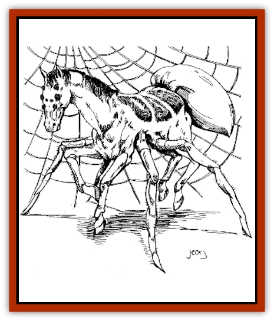

# Horse - Spider

| Statistic | **Horse, Spider-** |
| --- | --- |
| **Activity Cycle:** | Any |
| **Alignment:** | Neutral |
| **Armor Class:** | 7 |
| **Climate/Terrain:** | Any, but usually mountainous |
| **Damage/Attack:** | 1-4/1-4 or 1-3/1-3 |
| **Diet:** | Herbivore |
| **Frequency:** | Very rare |
| **Hit Dice:** | 3+3 |
| **Intelligence:** | Animal (1) |
| **Magic Resistance:** | Nil |
| **Morale:** | Average (9-10) |
| **Movement:** | 18 |
| **No. Appearing:** | 1 |
| **No. of Attacks:** | 2 |
| **Organization:** | Solitary |
| **Size:** | L |
| **Special Attacks:** | Webbing |
| **Special Defenses:** | Nil |
| **THAC0:** | 17 |
| **Treasure:** | Nil |
| **XP Value:** | 175 |

Spider-horses, as the name suggests, are magical crossbreeds of a riding [[Horse|horse]] and a giant <a href="spider">spider</a>. The body is primarily horse-like, although a spidery abdomen, complete with spinnerets, sticks out at the end. Four of the spiderhorse's legs are horse-like, down to the hooves, while four more spider-like legs grow out of the horse-body. The spider legs are situated between the front and rear horse legs. The head is equine in nature, except for the eight eyes, all of which are compound.

**Combat:** A spider-horse attacks with either set of its front legs, whichever ones aren't being used for balance. Its hoofed horse-legs each strike for 1-4 hp bludgeoning damage, while its clawed, spidery legs slash for 1-3 hp each. Optionally, the spider-horse can shoot a strand of webbing at a single opponent, then reel him in with its front spiderlegs. Treat a spider-horse's web-strand attack as a [[Roper|roper's]] strand attack, without the roper's magical Strength drain.

Since spider-horses have four normal hooves, they can be fitted with magical horseshoes, such as *horseshoes of speed* or *horseshoes of a zephyr*. In either case, the magical effects of the horseshoes only occur when the spider-horse is traveling on its horse-legs. It does not, for instance, gain a higher movement rate while using its spider-legs to climb up a cliff face simply because it has horseshoes of speed on its hooves.

Because of the unusual shape of the spider-horse's body, and its requirement to have its spider-legs flexible and free, standard horse barding cannot be used on a spider-horse. It might be possible to modify horse barding or have barding custom made, but this would at least triple the price.

**Habitat/Society:** Spider-horses, for reasons still unknown to wizards, cannot reproduce. The magic employed to merge the two beings renders the newly-created being sterile. Therefore, spider-horses usually live a solitary existence. Their spidery bodies often make standard horses skittish and nervous around them. However, this often makes them more emotionally attached to their masters, which wizards agree is a good thing. Nonetheless, wizards are currently experimenting on ways to correct this defect, in the hopes of creating spider-horses able to reproduce on their own.

**Ecology:** Spider-horses are usually created as riding mounts by wizards living in rough, mountainous terrain. Spiderhorses are able to move about on either of their sets of four legs, running like a horse with their horse-legs (during which time their spider-legs are tucked under their bodies), or using their longer spider-legs to climb up or down steep surfaces such as sheer cliffs. Wizards employing spiderhorses as mounts have intricately-buckled saddles which hold the rider in place during such steep ascents and descents. Because of the differences between spider-horses and normal horses, and between the kinds of gear needed to ride them, a separate proficiency is required to ride a spider-horse. This is the riding land-based proficiency, with spider-horse selected as the specified creature. Anyone attempting to ride a spider-horse with a riding proficiency geared toward normal horses is likely to end up being pitched head over heels at the first steep ascent or descent, although they could probably get by as long as the spiderhorse kept to level terrain.

Besides their ability to travel where normal horses cannot, the spider-horse is prized for its ability to spin webs. A single web-line can be used to help lower the creature and its rider down a mountain slope, or the spider-horse can make an intricate web like those of a standard spider. A lone rider can often sleep easier knowing his faithful spider-horse steed has created walls of sticky webs around his master (essentially, weaving a "tent" in which the wizard can  sleep). Because spider-horses cannot close their compound eyes, they are peripherally aware of their surroundings even when sleeping and can awaken at a moments notice, sounding a warning to their masters in case of trouble.

Any creatures caught in a spider-horse's web are left alone by the creature, who is strictly herbivorous. While it is not understood why spider-horses do not retain the venomous bites of the giant spiders used to create them, most wizards are happy enough with the beneficial traits.

---
## Discovery & Documentation

**Source Publication:** Dragon243 (1998)
**Campaign Setting:** Dragon Magazine
**Author(s):** Steve Berman, Roger Raupp, Johnathan M. Richards, George Vrbanic

### Other Creatures Found in This Source Book
   * [[Armadillephant|Armadillephant]]
   * [[Cat_Moat|Cat, Moat]]
   * [[Duckbunny|Duckbunny]]
   * [[Turtle_Dragonfly|Turtle, Dragonfly]]
