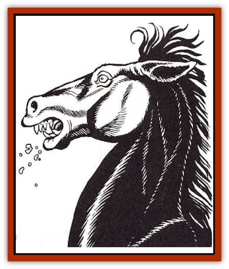

# Horse - Water

| Statistic | **Horse, Water-** |
| --- | --- |
| **Activity Cycle:** | Any |
| **Alignment:** | Chaotic evil |
| **Armor Class:** | 6 |
| **Climate/Terrain:** | Temperate coasts |
| **Damage/Attack:** | 2d6/1d8 |
| **Diet:** | Carnivore |
| **Frequency:** | Very rare |
| **Hit Dice:** | 5+3 |
| **Intelligence:** | Semi- (2-4) |
| **Magic Resistance:** | Nil |
| **Morale:** | Average (8-10) |
| **Movement:** | 28, Sw 20 |
| **No. Appearing:** | 1 |
| **No. of Attacks:** | 2 |
| **Organization:** | Solitary |
| **Size:** | L |
| **Special Attacks:** | See below |
| **Special Defenses:** | Nil |
| **THAC0:** | 15 |
| **Treasure:** | W(Z) |
| **XP Value:** | 650 |

The water-horse is an amphibious monster that looks like a beautiful [[Horse|horse]] of the finest quality. If it can be caught and tamed, it does indeed make a mount which is equal to any natural steed. It is a dangerous thing to mount a water-horse, however.

The water-horse is carnivorous, and will come on land to eat cattle, sheep, and anything else it can catch. It will also allow itself to be mounted, but once a rider is on its back it will bolt straight for the sea, carrying the rider under the waves to be drowned. It can make the skin of its back highly adhesive, so that the rider must make a saving throw vs. rods in order to break free. A *ring of free action* or similar magical protection will negate the magical adhesion.

Combat: A water-horse attacks with a crushing front-hoof trample for 2d6 damage or bites with its sharp teeth for Id8 damage. It can deliver a double rear-hoof kick for 2d6 damage but cannot do this in the same round as trampling with the front hooves. It suffers no combat penalties for being in water.

**Habitat/Society:** Water-horses are solitary and claim a stretch of coast up to 10 miles long as a territory. Nothing is known of their reproductive habits; they seem to live forever until killed. Male water-horses will occasionally mate with normal mares; the offspring is always a horse of the finest quality and can command a high price but must be fed on raw meat rather than grass and straw.

**Ecology:** Water-horses have no natural enemies, although they are sometimes hunted down by humans or [[Merman|merfolk]] when their depredations become intolerable. They can be trained, but if ever a tame water-horse comes within sight of salt water, it will revert to the wild and try to gallop straight in, taking its rider with it.

**Kelpie:** The [[Kelpie|kelpie]] of Scottish folklore is a type of water-horse, which has average to high Intelligence (8-14) and the ability to assume human form at will. The human form is that of a shaggy and wild-looking human, and in this form the kelpie may leap onto travelers and try to wrestle them into the water to be devoured. In horse form, the kelpie wears a fine bridle, and if it is somehow taken, the kelpie will beg to have it back and promise almost anything in return - however, it will not hesitate to break any promises if the bridle is returned to it. Most kelpies can speak the local human language and some can speak other languages as well.

---
## Discovery & Documentation

**Source Publication:** HR3 Celts Campaign (1992)
**Campaign Setting:** Advanced Dungeons & Dragons 2nd Edition
**Author(s):** Graeme Davis

### Other Creatures Found in This Source Book
   * [[Boobrie|Boobrie]]
   * [[Phouka|Phouka]]
   * [[Water_Leaper|Water Leaper]]
