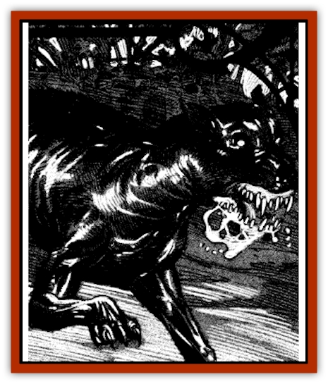

# Hound - Phantom

| Statistic | **Hound, Phantom** |
| --- | --- |
| **Activity Cycle:** | Any |
| **Alignment:** | Neutral |
| **Armor Class:** | 6 |
| **Climate/Terrain:** | Ravenloft |
| **Damage/Attack:** | 2-8 (2d4) |
| **Diet:** | Nil |
| **Frequency:** | Very rare |
| **Hit Dice:** | 2+2 |
| **Intelligence:** | Semi- (2-4) |
| **Magic Resistance:** | Nil |
| **Morale:** | Steady (11-12) |
| **Movement:** | 18 |
| **No. Appearing:** | 1-6 |
| **No. of Attacks:** | 1 |
| **Organization:** | Solitary or pack |
| **Size:** | M (5-6' long) |
| **Special Attacks:** | Fear check & poison |
| **Special Defenses:** | +1 or better weapon to hit |
| **THAC0:** | 19 |
| **Treasure:** | P (X,Y) |
| **XP Value:** | 175 |

A phantom hound is a [[Dog|dog]] so devoted to its former master that it returns after its death to guard that master's property or final resting place.

First noted in Sanguinia, a phantom hound is always some very large dog such as a mastiff, wolfhound, or Great Dane. Due to the corrupting influences of the Demiplane of Dread, the faithful canine is transformed into a terrifying, coal black creature with spectral eyes that glow a deep green. The beast's snout dribbles phosphorescent foalm and the lips are pulled back into a snarl, revealing enormous, sharp, elongated teeth.

Although they cannot speak, these creatures understand all that is said to them in the language of their former master. It is quite common for them to fill the night air with a mournful howl.

**Combat:** Phantom hounds pose no threat to those who do not trespass on the lands they guard. Those who unwisely drawn near these sinister creatures, however, will be attacked without mercy.

When it senses someone drawing near to its territory, the phantom hound announces its presence with a blood-chilling. wavering howl that can be heard across great distances. So dreadful is the sound of this cry that all who hear it must make a fear check.

The hound attacks with its powerful jaws, doing 2d4 points of damage with each successful bite. Anyone bitten by the beast must make a saving throw vs. poison with a +2 bonus or lose a point of Strength from the toxic foam that drools from the hound's mouth. A victim's Strength returns at the rate of 1 point per hour.

Although they look quite solid, phantom hounds are intangible creatures. As such, they can only be harmed by magical weapons of at least +1 enchantment. Lesser weapons simply flash through the body of the creature without harm.

Phantom hounds are immune to all manner of mind- or life-affecting magic but can be turned as if they were ghosts. Holy water that is splashed upon them caused 1d6-2 points of damage per vial.

**Habitat/Society:** Phantom hounds have no society per se, existing only to continue their devotion to their masters even beyond death.

Should interlopers take anything from a site guarded by a phantom hound, the hound will leave its territory to pursue them. The only way to escape such a hound is to kill it or return the stolen item. Offering such an item to the hound to preserve one's life has a 50% chance of causing the hound to take the item and return to its protected area.

Though usually solitary creatures, packs of phantom hounds may be encountered where a master kept a number of dogs. Whenever a pack is encountered, there will be 1d6 normal phantom hounds and one pack leader with 3+2 Hit Dice and an Armor Class of 5. The leader's cry causes those hearing it to suffer a -2 penalty on their Fear Checks.

**Ecology:** Phantom hounds will often go through the same routines in death that they did in life. It would not be uncommon for adventurers exploring an estate haunted by a phantom hound to see the beast digging in a flower garden, chasing phantom rabbits, rolling in decayed matter, or trotting along watchfully at the edge of the property.

---
## Discovery & Documentation

**Source Publication:** Ravenloft Appendix III (1991)
**Campaign Setting:** Ravenloft
**Author(s):** Kirk Botulla

### Other Creatures Found in This Source Book
   * [[Akikage|Akikage]]
   * [[Animator_Common|Animator, Common]]
   * [[Animator_Greater|Animator, Greater]]
   * [[Animator_Minor|Animator, Minor]]
   * [[Animator_General_Information|Animator, General Information]]
   * [[Bakhna_Rakhna|Bakhna Rakhna]]
   * [[Baobhan_Sith|Baobhan Sith]]
   * [[Beetle_Scarab|Beetle, Scarab]]
   * [[Boneless|Boneless]]
   * [[Boowray|Boowray]]
   * [[Bruja|Bruja]]
   * [[Carrionette|Carrionette]]
   * [[Carrion_Stalker|Carrion Stalker]]
   * [[Cat_Midnight|Cat, Midnight]]
   * [[Cat_Skeletal|Cat, Skeletal]]
   * [[Cloaker_Resplendent|Cloaker, Resplendent]]
   * [[Cloaker_Shadow|Cloaker, Shadow]]
   * [[Cloaker_Undead|Cloaker, Undead]]
   * [[Corpse_Candle|Corpse Candle]]
   * [[Death's_Head_Tree|Death's Head Tree]]
   * [[Doppelganger_Ravenloft|Doppelganger (Ravenloft)]]
   * [[Familiar_Pseudo-|Familiar, Pseudo-]]
   * [[Familiar_Undead|Familiar, Undead]]
   * [[Feathered_Serpent|Feathered Serpent]]
   * [[Fenhound|Fenhound]]
   * [[Figurine_Ceramic|Figurine, Ceramic]]
   * [[Figurine_Crystal|Figurine, Crystal]]
   * [[Figurine_Ivory|Figurine, Ivory]]
   * [[Figurine_Obsidian|Figurine, Obsidian]]
   * [[Figurine_Porcelain|Figurine, Porcelain]]
   * [[Figurine_General_Information|Figurine, General Information]]
   * [[Fleas_of_Madness|Fleas of Madness]]
   * [[Furies|Furies]]
   * [[Geist|Geist]]
   * [[Ghost_Animal|Ghost, Animal]]
   * [[Golem_Flesh_Ravenloft|Golem, Flesh (Ravenloft)]]
   * [[Golem_Mist_Ravenloft|Golem, Mist (Ravenloft)]]
   * [[Golem_Wax_Ravenloft|Golem, Wax (Ravenloft)]]
   * [[Gremishka|Gremishka]]
   * [[Hag_Spectral|Hag, Spectral]]
   * [[Head_Hunter|Head Hunter]]
   * [[Hearth_Fiend|Hearth Fiend]]
   * [[Hebi-No-Onna|Hebi-No-Onna]]
   * [[Hound_Skeletal|Hound, Skeletal]]
   * [[Imp_Wishing|Imp, Wishing]]
   * [[Ivy_Crawling|Ivy, Crawling]]
   * [[Jack_Frost|Jack Frost]]
   * [[Jolly_Roger|Jolly Roger]]
   * [[Kizoku|Kizoku]]
   * [[Lashweed|Lashweed]]
   * [[Leech_Magical|Leech, Magical]]
   * [[Leech_Psionic|Leech, Psionic]]
   * [[Lich_Defiler|Lich, Defiler]]
   * [[Lich_Drow|Lich, Drow]]
   * [[Lich_Elemental|Lich, Elemental]]
   * [[Lich_Psionic|Lich, Psionic]]
   * [[Living_Tattoo|Living Tattoo]]
   * [[Lycanthrope_Loup-garou|Lycanthrope, Loup-garou]]
   * [[Lycanthrope_Werejackal|Lycanthrope, Werejackal]]
   * [[Lycanthrope_Werejaguar_Ravenloft|Lycanthrope, Werejaguar (Ravenloft)]]
   * [[Lycanthrope_Wereleopard|Lycanthrope, Wereleopard]]
   * [[Lycanthrope_Wereray|Lycanthrope, Wereray]]
   * [[Mist_Ferryman|Mist Ferryman]]
   * [[Moor_Man|Moor Man]]
   * [[Obedient|Obedient]]
   * [[Odem|Odem]]
   * [[Paka|Paka]]
   * [[Plant_Blood_Rose|Plant, Blood Rose]]
   * [[Plant_Fearweed|Plant, Fearweed]]
   * [[Radiant_Spirit|Radiant Spirit]]
   * [[Recluse|Recluse]]
   * [[Remnant_Aquatic|Remnant, Aquatic]]
   * [[Rushlight|Rushlight]]
   * [[Sea_Spawn_Master|Sea Spawn, Master]]
   * [[Sea_Spawn_Minion|Sea Spawn, Minion]]
   * [[Shadow_Asp|Shadow Asp]]
   * [[Shattered_Brethren|Shattered Brethren]]
   * [[Skeleton_Archer|Skeleton, Archer]]
   * [[Skeleton_Insectoid|Skeleton, Insectoid]]
   * [[Skin_Thief|Skin Thief]]
   * [[Spirit_Psionic|Spirit, Psionic]]
   * [[Strahd_Skeleton|Strahd Skeleton]]
   * [[Strahd_Zombie|Strahd Zombie]]
   * [[Unicorn_Shadow|Unicorn, Shadow]]
   * [[Vampire_Drow|Vampire, Drow]]
   * [[Vampire_Nosferatu|Vampire, Nosferatu]]
   * [[Vampire_Oriental|Vampire, Oriental]]
   * [[Virus_General_Information|Virus, General Information]]
   * [[Virus_I|Virus I]]
   * [[Virus_II|Virus II]]
   * [[Virus_III|Virus III]]
   * [[Vorlog|Vorlog]]
   * [[Will_O'Dawn|Will O'Dawn]]
   * [[Will_O'Deep|Will O'Deep]]
   * [[Will_O'Mist|Will O'Mist]]
   * [[Will_O'Sea|Will O'Sea]]
   * [[Zombie_Cannibal|Zombie, Cannibal]]
   * [[Zombie_Desert|Zombie, Desert]]
   * [[Zombie_Wolf|Zombie Wolf]]
   * [[Zombie_Fog|Zombie Fog]]
