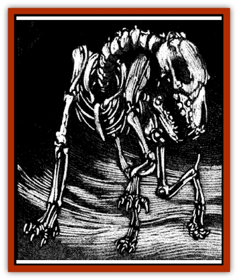

# Hound - Skeletal

| Statistic | **Hound, Skeletal** |
| --- | --- |
| **Activity Cycle:** | Any |
| **Alignment:** | Neutral |
| **Armor Class:** | 8 |
| **Climate/Terrain:** | Ravenloft |
| **Damage/Attack:** | 1-4 |
| **Diet:** | Nil |
| **Frequency:** | Very rare |
| **Hit Dice:** | 1-1 |
| **Intelligence:** | Non- (0) |
| **Magic Resistance:** | See below |
| **Morale:** | Fearless (19-20) |
| **Movement:** | 6 |
| **No. Appearing:** | 2-20 (2d10) |
| **No. of Attacks:** | 1 |
| **Organization:** | Solitary or pack |
| **Size:** | S-M (3-5') |
| **Special Attacks:** | Nil |
| **Special Defenses:** | See below |
| **THAC0:** | 20 |
| **Treasure:** | Nil |
| **XP Value:** | 65 |

Skeletal hounds are the magically animated skeletons of dogs created as guardians by evil wizards or priests. Originally created by Spelaka of Mordent, a reclusive necromancer, the creatures appear to have no ligaments, muscles, or joinings that would hold their bones together and allow movement, They lack internal organs, flesh, and eyes. They are given the semblance of life and held together by the magic of an *animate dead* spell.

They have no vocal cords, but have somehow retained their ability to bark and growl.

**Combat:** Skeletal hounds fight only at the behest of their creator. They move somewhat stiffly and slowly and do not fight as well as normal [[Dog|dogs]].

Skeletal hounds attack with a bite which causes 1-4 points damage. Very small dogs used as skeletal hounds inflict only 1-2 points of damage.

Skeletal hounds that were hunting or war dogs while living retain some memory of their former training. Such animals work as a pack, concentrating their attacks so that several hounds attack a single target simultaneously. War dogs try to move into strategically sound positions before attacking. Other than this instinctual strategy, skeletal hounds have no minds at all.

They are immune to all *sleep*, *charm*, and *hold* spells. Because the hounds are assembled from bones, cold-based attacks have no effect on them. Likewise, they are not affected by poisons or any sort of paralyzation. Skeletal hounds, like their humanoid counterparts, are also immune to fear spells and never need to check morale. as they are usually commanded to fight until destroyed.

Since they have no internal organs or soft tissues, edged and piercing weapons (like swords, daggers. and spears) inflict only half damage when used against skeletal hounds. Blunt weapons, such as maces, staves, and clubs, which have larger heads and are designed to break and crush bones cause normal damage.

Fire also causes normal damage to skeletal hounds, and holy water inflicts 2-8 points of damage per vial striking the creatures. When skeletal hounds are destroyed, they fall to pieces.

**Habitat/Society:** Skeletal hounds have no social life, nor do they engage in any activities beyond those assigned to them. They are found wherever there are wizards or priests of sufficient power to create them. They may be used as singular guards, assigned to watch a specific doorway, hall or room and commanded to bark when intruders enter the area. Piles of their bones may be scattered throughout treasure rooms or temple anterooms and commanded to flow together, animate and attack strangers. Packs of skeletal hounds may be loosed inside walled estates and told to roam and guard against trespassers.

Some priests who worship deities of death or dying create armies of skeletal hounds to serve alongside humanoid [[Skeleton|skeletons]] when they are needed for war of defense of the temple. Priests of good alignment, though they have less reservations about animating dogs than humanoids, may still find it repugnant to disturb any creature's eternal rest. Druids might be particularly disturbed by this violation of the natural order.

Skeletal hounds are capable of understanding and implementing simple commands. These may be as simple as the commands given to normal dogs (sit, stay, roll over, play dead) or as complex as those accorded guard dogs (watch and bark, guard and attack, etc.) Anything more complex leads to confusion and inaction or to wild attacks against anything that moves. Skeletal hounds take orders only from their creator or a person designated as their master of hounds during the casting of the *animate dead* spell.

**Ecology:** Unless their remains are destroyed or widely scattered, skeletal hounds may be recreated by another *animatc dead* spell.

---
## Discovery & Documentation

**Source Publication:** Ravenloft Appendix III (1991)
**Campaign Setting:** Ravenloft
**Author(s):** Kirk Botulla

### Other Creatures Found in This Source Book
   * [[Akikage|Akikage]]
   * [[Animator_Common|Animator, Common]]
   * [[Animator_Greater|Animator, Greater]]
   * [[Animator_Minor|Animator, Minor]]
   * [[Animator_General_Information|Animator, General Information]]
   * [[Bakhna_Rakhna|Bakhna Rakhna]]
   * [[Baobhan_Sith|Baobhan Sith]]
   * [[Beetle_Scarab|Beetle, Scarab]]
   * [[Boneless|Boneless]]
   * [[Boowray|Boowray]]
   * [[Bruja|Bruja]]
   * [[Carrionette|Carrionette]]
   * [[Carrion_Stalker|Carrion Stalker]]
   * [[Cat_Midnight|Cat, Midnight]]
   * [[Cat_Skeletal|Cat, Skeletal]]
   * [[Cloaker_Resplendent|Cloaker, Resplendent]]
   * [[Cloaker_Shadow|Cloaker, Shadow]]
   * [[Cloaker_Undead|Cloaker, Undead]]
   * [[Corpse_Candle|Corpse Candle]]
   * [[Death's_Head_Tree|Death's Head Tree]]
   * [[Doppelganger_Ravenloft|Doppelganger (Ravenloft)]]
   * [[Familiar_Pseudo-|Familiar, Pseudo-]]
   * [[Familiar_Undead|Familiar, Undead]]
   * [[Feathered_Serpent|Feathered Serpent]]
   * [[Fenhound|Fenhound]]
   * [[Figurine_Ceramic|Figurine, Ceramic]]
   * [[Figurine_Crystal|Figurine, Crystal]]
   * [[Figurine_Ivory|Figurine, Ivory]]
   * [[Figurine_Obsidian|Figurine, Obsidian]]
   * [[Figurine_Porcelain|Figurine, Porcelain]]
   * [[Figurine_General_Information|Figurine, General Information]]
   * [[Fleas_of_Madness|Fleas of Madness]]
   * [[Furies|Furies]]
   * [[Geist|Geist]]
   * [[Ghost_Animal|Ghost, Animal]]
   * [[Golem_Flesh_Ravenloft|Golem, Flesh (Ravenloft)]]
   * [[Golem_Mist_Ravenloft|Golem, Mist (Ravenloft)]]
   * [[Golem_Wax_Ravenloft|Golem, Wax (Ravenloft)]]
   * [[Gremishka|Gremishka]]
   * [[Hag_Spectral|Hag, Spectral]]
   * [[Head_Hunter|Head Hunter]]
   * [[Hearth_Fiend|Hearth Fiend]]
   * [[Hebi-No-Onna|Hebi-No-Onna]]
   * [[Hound_Phantom|Hound, Phantom]]
   * [[Imp_Wishing|Imp, Wishing]]
   * [[Ivy_Crawling|Ivy, Crawling]]
   * [[Jack_Frost|Jack Frost]]
   * [[Jolly_Roger|Jolly Roger]]
   * [[Kizoku|Kizoku]]
   * [[Lashweed|Lashweed]]
   * [[Leech_Magical|Leech, Magical]]
   * [[Leech_Psionic|Leech, Psionic]]
   * [[Lich_Defiler|Lich, Defiler]]
   * [[Lich_Drow|Lich, Drow]]
   * [[Lich_Elemental|Lich, Elemental]]
   * [[Lich_Psionic|Lich, Psionic]]
   * [[Living_Tattoo|Living Tattoo]]
   * [[Lycanthrope_Loup-garou|Lycanthrope, Loup-garou]]
   * [[Lycanthrope_Werejackal|Lycanthrope, Werejackal]]
   * [[Lycanthrope_Werejaguar_Ravenloft|Lycanthrope, Werejaguar (Ravenloft)]]
   * [[Lycanthrope_Wereleopard|Lycanthrope, Wereleopard]]
   * [[Lycanthrope_Wereray|Lycanthrope, Wereray]]
   * [[Mist_Ferryman|Mist Ferryman]]
   * [[Moor_Man|Moor Man]]
   * [[Obedient|Obedient]]
   * [[Odem|Odem]]
   * [[Paka|Paka]]
   * [[Plant_Blood_Rose|Plant, Blood Rose]]
   * [[Plant_Fearweed|Plant, Fearweed]]
   * [[Radiant_Spirit|Radiant Spirit]]
   * [[Recluse|Recluse]]
   * [[Remnant_Aquatic|Remnant, Aquatic]]
   * [[Rushlight|Rushlight]]
   * [[Sea_Spawn_Master|Sea Spawn, Master]]
   * [[Sea_Spawn_Minion|Sea Spawn, Minion]]
   * [[Shadow_Asp|Shadow Asp]]
   * [[Shattered_Brethren|Shattered Brethren]]
   * [[Skeleton_Archer|Skeleton, Archer]]
   * [[Skeleton_Insectoid|Skeleton, Insectoid]]
   * [[Skin_Thief|Skin Thief]]
   * [[Spirit_Psionic|Spirit, Psionic]]
   * [[Strahd_Skeleton|Strahd Skeleton]]
   * [[Strahd_Zombie|Strahd Zombie]]
   * [[Unicorn_Shadow|Unicorn, Shadow]]
   * [[Vampire_Drow|Vampire, Drow]]
   * [[Vampire_Nosferatu|Vampire, Nosferatu]]
   * [[Vampire_Oriental|Vampire, Oriental]]
   * [[Virus_General_Information|Virus, General Information]]
   * [[Virus_I|Virus I]]
   * [[Virus_II|Virus II]]
   * [[Virus_III|Virus III]]
   * [[Vorlog|Vorlog]]
   * [[Will_O'Dawn|Will O'Dawn]]
   * [[Will_O'Deep|Will O'Deep]]
   * [[Will_O'Mist|Will O'Mist]]
   * [[Will_O'Sea|Will O'Sea]]
   * [[Zombie_Cannibal|Zombie, Cannibal]]
   * [[Zombie_Desert|Zombie, Desert]]
   * [[Zombie_Wolf|Zombie Wolf]]
   * [[Zombie_Fog|Zombie Fog]]
