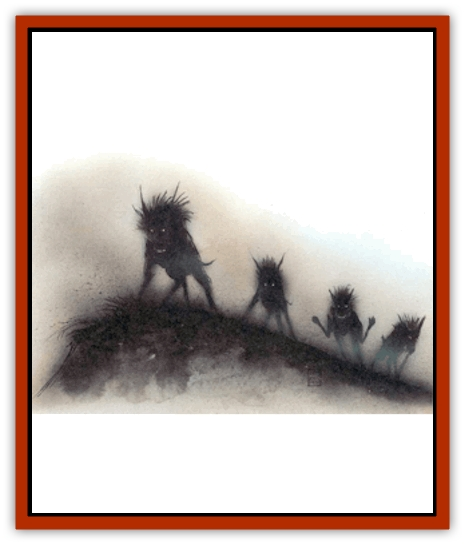

# Hound - Yeth

| Statistic | **Hound, Yeth** |
| --- | --- |
| **Activity Cycle:** | Night |
| **Alignment:** | Low (5-7) |
| **Armor Class:** | 0 |
| **Climate/Terrain:** | Any land |
| **Damage/Attack:** | 2d4 |
| **Diet:** | Carnivore |
| **Frequency:** | Very rare |
| **Hit Dice:** | 3+3 |
| **Intelligence:** | Nil |
| **Magic Resistance:** | 10% |
| **Morale:** | Fearless (19-20) |
| **Movement:** | 15, F1 27 (B) |
| **No. Appearing:** | 4-16 |
| **No. of Attacks:** | 1 |
| **Organization:** | Pack |
| **Size:** | M (4&rdquo;-5' tall) |
| **Special Attacks:** | Fear |
| **Special Defenses:** | Silver or magical weapons to hit |
| **THAC0:** | 17 |
| **Treasure:** | Neutral evil |
| **XP Value:** | 975 |

These fearsome flying hounds, magical creatures of the night, hunt humans, demihumans, and faerie folk.

The yeth hound pack, with its baying bell-like cries, causes fear to any being. Even those who stand their ground know fear, and that fear returns to them in the night or in dark places. Indeed, some metaphysicians have theorized that the hounds embody fear itself. The warrrior-poet Rodol of Ard wrote of the yeth hounds:

*The baying sound echoes through my blood.
I have heard the call of the Hound.
As in a nightmare, I run from that sound!
My bravery vanishes in fear's flood.
Whence come the hounds? In what cave do they lair?
Why have they chosen me, I who was brave?
What will become of me now, as fear's slave?
Will I live until morning to breathe light air?
They will never leave, for they lodge in my dreams.
I know they'll devour me, leaving only my screams.*

Indeed, the encounter with a pack of yeth hounds apparently provoked Rodol's retirement from adventuring. He secluded himself on his estate, banned [[Dog|dogs]] and [[Wolf|wolves]] from his lands, and devoted himself to poetry (without, however, improving much). Rodol lived many years after writing this poem, but he never left his castle. He reported terrible dreams almost every night. One evening he heard a pack of coyotes howling in the distance, and he died of a heart attack.

Standing five feet at the shoulder, yeth hounds weigh around 400 pounds. Their short fur is dull, nonreflective black; in darkness only the cherry-red glow of their eyes is visible. Their heads are almost human, flat with protruding noses instead of muzzles. Their short pointed ears curve up and away from the head, making them look like short horns. They give off an odor like chilled smoke.

Because they can fly, yeth hounds move silently. However, their ghastly howl chills the blood up to a mile away. These unnatural creatures frequently run with evil huntsmen or other powerful evil forces.

**Combat:** Those within 90' of a baying pack of yeth hounds must save vs. spells or flee in panic, usually to be pulled down and shredded by the ferocious pack. Only one saving throw per creature per encounter is allowed. If it fails, the character panics until he can no longer hear the baying. If it succeeds, he withstands the baying for the rest of that encounter.

The yeth hound is immune to all physical weapons except silver or magical ones. Silver weapons inflict 1 hp damage. Magical weapons cause damage equal to their bonus; for example, a sword +2 inflicts 2 hp damage. Magical weapons with no bonus cause 1 hp damage.

Although yeth hounds are smarter than dogs, their tactics in combat resemble those of pack hunters. They run their prey until it is exhausted, then surround the victim and rush in to finish it off. They have no claw attack, only a bite (2d4 damage). If under the control of a huntsman, he can direct their strategy or tactics.

Unnatural creatures of the night, yeth hounds are unaffected by torchlight or *light* spells but cannot stand daylight. Before sunrise they leave the hunt, always in enough time for a safe retreat to their dens. No coercion by any huntsman can change this. If exposed to natural sunlight, the hounds fade away in one round, to roam the Ethereal Plane forever. If killed on the Ethereal, they are permanently dead.

**Habitat/Society:** Yeth hounds are created by evil forces from the Lower Planes and given to loyal servants. If the servants are destroyed, the hounds fend for themselves. These pack animals intelligently seek powerful evil masters: [[Night_Hag|night hags]], [[Vampire_General_Information|vampires]], evil wizards, etc. Of course such a master must be immune to the fearful baying of the creatures and have some way to command them (usually telepathy). Magic lets them comprehend speech by spells, but they cannot talk.

Within a pack, the hound with the most hit points leads the rest. They give the leader instant cooperation and obedience. They do not help one another, and they are not swayed by threats or promises of great reward. They take pleasure only in the panicked cries of their prey, just before it is pulled down.

The pack lairs in a subterranean den in some remote wild place, sleeping or pacing, until night falls. No persuasion forces them into daylight.

**Ecology:** Yeth hounds eat to survive, but only once each lunar month. They devour warm-blooded prey, and prefer demihumans, [[Brownie|brownies]], and the like. No natural animal hunts a yeth hound, and many unnatural creatures avoid them as well.

---
## Discovery & Documentation

**Source Publication:** MC5 Greyhawk Appendix (1989)
**Campaign Setting:** Advanced Dungeons & Dragons 2nd Edition
**Author(s):** Grant Boucher, William W. Connors, Steve Gilbert, Bruce Nesmith, Chris Mortika, Skip Williams

### Other Creatures Found in This Source Book
   * [[Aspis|Aspis]]
   * [[Beastman|Beastman]]
   * [[Bonesnapper|Bonesnapper]]
   * [[Booka|Booka]]
   * [[Brownie_Buckawn|Brownie, Buckawn]]
   * [[Brownie_Quickling|Brownie, Quickling]]
   * [[Crystalmist|Crystalmist]]
   * [[Dragon_Cloud|Dragon, Cloud]]
   * [[Dragon_Oerth_Greyhawk|Dragon (Oerth), Greyhawk]]
   * [[Dragonfly_Giant|Dragonfly, Giant]]
   * [[Dragonnel|Dragonnel]]
   * [[Elf_Grugach|Elf, Grugach]]
   * [[Elf_Valley|Elf, Valley]]
   * [[Golem_Necrophidius|Golem, Necrophidius]]
   * [[Grell_Wild|Grell, Wild]]
   * [[Grung|Grung]]
   * [[Hobgoblin_Norker|Hobgoblin, Norker]]
   * [[Hook_Horror|Hook Horror]]
   * [[Horgar|Horgar]]
   * [[Iguana_Giant|Iguana, Giant]]
   * [[Ingundi|Ingundi]]
   * [[Kech|Kech]]
   * [[Kyuss_Son_of|Kyuss, Son of]]
   * [[Mite|Mite]]
   * [[Needleman|Needleman]]
   * [[Plant_Carnivorous_Oerth|Plant, Carnivorous (Oerth)]]
   * [[Plant_Carnivorous_Vampire_Cactus|Plant, Carnivorous, Vampire Cactus]]
   * [[Plasmoid_General_Information|Plasmoid, General Information]]
   * [[Rat_Oerth|Rat (Oerth)]]
   * [[Raven_Crow|Raven/Crow]]
   * [[Scarecrow|Scarecrow]]
   * [[Shadow_Slow|Shadow, Slow]]
   * [[Skulk|Skulk]]
   * [[Snail|Snail]]
   * [[Sprite|Sprite]]
   * [[Taer|Taer]]
   * [[Tentamort|Tentamort]]
   * [[Turtle_Giant|Turtle, Giant]]
   * [[Tyrg|Tyrg]]
   * [[Wolf_Mist|Wolf, Mist]]
   * [[Wraith_Oerth|Wraith (Oerth)]]
   * [[Zygom|Zygom]]
