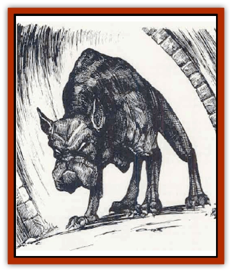

# Hound of Ill-Omen

| Statistic | **Hound of Ill-Omen** |
| --- | --- |
| **Activity Cycle:** | Any |
| **Alignment:** | Neutral |
| **Armor Class:** | 10 |
| **Climate/Terrain:** | Any |
| **Damage/Attack:** | Nil |
| **Diet:** | Unknown |
| **Frequency:** | Very rare |
| **Hit Dice:** | 1 |
| **Intelligence:** | Non- (0) |
| **Magic Resistance:** | Nil |
| **Morale:** | Fearless (20) |
| **Movement:** | 48 |
| **No. Appearing:** | 1 |
| **No. of Attacks:** | 0 |
| **Organization:** | Solitary |
| **Size:** | M (5' at shoulder) |
| **Special Attacks:** | Nil |
| **Special Defenses:** | Nil |
| **THAC0:** | 20 |
| **Treasure:** | Nil |
| **XP Value:** | 0 |

The hound of ill-omen is one of the many beasts that the gods use to punish mortals who have offended them in some way. Its appearance normally portends the death of the viewer, although there have been a few mortals who claimed to have survived such an encounter with their deity's agent of doom.

A hound of ill-omen never appears to punish a mortal for a minor transgression against a god. Its appearance indicates a major transgression on the part of the subject creature that needs to be addressed by the direct involvement of the deitv's servants.

**Combat:** The hound is a fearless creature that does not attack its chosen individual directly. Instead, it simply appears within a ghostly haze before the individual and howls once. While all creatures with 120 feet can hear the howling, only the intended individual can see the creature without use of magic.

All creatures who both view the hound and hear the howl are subject to its terrible effects. The howling causes the next 1d10 wounds suffered by the creature to cause four times their normal damage. Until all 1d10 wounds have been inflicted, no healing magic of any kind functions for the affected creature. A *remove curse* spell cast by a priest of at least 12th level within one turn of the hounds howling reduces the number of wounds to half the normal amount (1-5; round up). The quadruple damage remains unchanged, however.

Those subjected to the howl don't necessarily understand the nature of the curse bestowed by the hound. Instead, they receive an empathic feeling of death and dread and are immediately made aware of the transgression against the deity. Until first struck in combat, a cursed creature most likely has no idea of how the god plans to exact its revenge for the transgression.

Self-inflicted injuries (or injuries inflicted by others in an effort to circumvent the god's curse) do not reduce the number of wounds that must be suffered, though each still causes quadruple damage against the affected creature. only injuries sustained outside of the creature's ability to control will fulfill the conditions of the curse.

Once it has howled, the hound turns away from its victim and slowly pads off into the mists. Only those who can see the hound can attack it; the hound of ill-omen is immune to all attacks directed against it by those who can't see it.

Slaying the hound is a simple task, but the penalties for killing the god's messenger are equally severe. Those directly involved who were not subject to the howl are suddenly affected as if they were. When the hound of ill-omen dies, the god who sent the hound knows who planned to attack it, so even if the first attack killed the hound, or one or more of the attacks miss, all who attacked or p1anned to are aifezred as if the< had actually delivered the killing blow.

If the victim of the initial howling also participated in the attack, its effects on him are doubled and remove curse has no effect in reducing its severity. In addition, there is a 70% chance that the god will sent another servant (such as a [[Aasimon_Deva|deva]] or other [[Aasimon_General_Information|aasimon]]) to deal with the transgressor.

**Habitat/Society:** A hound of ill-omen serves its respective deity on that power's home plane of existence. It has no other responsibility than serving its power, and it is unique in that regard (no power has more than one hound of ill-omen). If a hound of ill-omen is slain, it reforms on its deity's home plane in 1d4 days.

**Ecology:** The hound of ill-omen feeds from the power of its patron deity, requiring no other nourishment in the fulfillment of its duties. It has no natural enemies, nor do the minions of other deities interfere in its travels or missions.

Some sages believe that the hound is not an actual creature at all, but a manifestation of the will of the deity. There is, unfortunately, small chance of putting the matter to a test.

---
## Discovery & Documentation

**Source Publication:** Monstrous Compendium, 1996 Annual, Volume 3 (1995)
**Campaign Setting:** Advanced Dungeons & Dragons 2nd Edition
**Author(s):** Jon Pickens

### Other Creatures Found in This Source Book
   * [[Alaghi|Alaghi]]
   * [[Alhoon|Alhoon]]
   * [[Aranea_Savage_Coast|Aranea (Savage Coast)]]
   * [[Arcane_Head|Arcane Head]]
   * [[Banedead|Banedead]]
   * [[Banelich|Banelich]]
   * [[Bat_Bonebat|Bat, Bonebat]]
   * [[Beetle|Beetle]]
   * [[Belgoi|Belgoi]]
   * [[Bladeling|Bladeling]]
   * [[Braxat|Braxat]]
   * [[Bunyip|Bunyip]]
   * [[Burbur|Burbur]]
   * [[Bvanen|Bvanen]]
   * [[Cat_Great_Snow_Tiger|Cat, Great, Snow Tiger]]
   * [[Chosen_One|Chosen One]]
   * [[Chronovoid|Chronovoid]]
   * [[Cildabrin|Cildabrin]]
   * [[Coffer_Corpse|Coffer Corpse]]
   * [[Disenchanter|Disenchanter]]
   * [[Dog_Temporal|Dog, Temporal]]
   * [[Dragon_Cerilia|Dragon (Cerilia)]]
   * [[Dragon_Ghost|Dragon, Ghost]]
   * [[Dragon_Lesser_Undead|Dragon, Lesser Undead]]
   * [[Dragon_Neutral_Amber|Dragon, Neutral, Amber]]
   * [[Dread_Warrior|Dread Warrior]]
   * [[Dreamweaver|Dreamweaver]]
   * [[Dream_Spawn_Greater_Ennui|Dream Spawn, Greater, Ennui]]
   * [[Dream_Spawn_Lesser_Morph|Dream Spawn, Lesser, Morph]]
   * [[Dwarf_Arctic|Dwarf, Arctic]]
   * [[Dwarf_Urdunnir|Dwarf, Urdunnir]]
   * [[Eel_Giant_Moray|Eel, Giant Moray]]
   * [[Elemental_Fire_Kin_Tome_Guardian|Elemental, Fire Kin, Tome Guardian]]
   * [[Elf_Rockseer|Elf, Rockseer]]
   * [[Ethyk|Ethyk]]
   * [[Faerie_Faerie_Fiddler|Faerie, Faerie Fiddler]]
   * [[Faerie_Petty_Bramble|Faerie, Petty, Bramble]]
   * [[Faerie_Petty_Gorse|Faerie, Petty, Gorse]]
   * [[Faerie_Petty|Faerie, Petty]]
   * [[Firenewt|Firenewt]]
   * [[Formian|Formian]]
   * [[Gargoyle_II|Gargoyle II]]
   * [[Giant_Cerilia|Giant (Cerilia)]]
   * [[Goblin_Cerilia|Goblin (Cerilia)]]
   * [[Golem_Magic|Golem, Magic]]
   * [[Golem_Shaboath|Golem, Shaboath]]
   * [[Hag_Bheur|Hag, Bheur]]
   * [[Hamadryad|Hamadryad]]
   * [[Human_Cerilia|Human (Cerilia)]]
   * [[Hybsil|Hybsil]]
   * [[Ibrandlin|Ibrandlin]]
   * [[Imp_Chaos|Imp, Chaos]]
   * [[Ixitxachitl_Ixzan|Ixitxachitl, Ixzan]]
   * [[Jabberwock|Jabberwock]]
   * [[Kyton|Kyton]]
   * [[Kyuss_Son_of|Kyuss, Son of]]
   * [[Lillend|Lillend]]
   * [[Life-Shaped_Creation_Guardian|Life-Shaped Creation, Guardian]]
   * [[Life-Shaped_Creation_Transport|Life-Shaped Creation, Transport]]
   * [[Lycanthrope_Werecrocodile|Lycanthrope, Werecrocodile]]
   * [[Lycanthrope_Werespider|Lycanthrope, Werespider]]
   * [[Magedoom|Magedoom]]
   * [[Manotaur|Manotaur]]
   * [[Mastiff_Shadow|Mastiff, Shadow]]
   * [[Meazel|Meazel]]
   * [[Mist_Scarlet_Dancer|Mist, Scarlet Dancer]]
   * [[Needleman|Needleman]]
   * [[Orc_Neo-Orog|Orc, Neo-Orog]]
   * [[Orc_Ondonti|Orc, Ondonti]]
   * [[Owlbear_II|Owlbear II]]
   * [[Pegataur|Pegataur]]
   * [[Phaerimm|Phaerimm]]
   * [[Reggelid|Reggelid]]
   * [[Render|Render]]
   * [[Saurial|Saurial]]
   * [[Scalamagdrion|Scalamagdrion]]
   * [[Sharn|Sharn]]
   * [[Snake_Messenger|Snake, Messenger]]
   * [[Spirit_Forest_Uthraki|Spirit, Forest, Uthraki]]
   * [[Spirit_Forest_Wood_Man|Spirit, Forest, Wood Man]]
   * [[Spirit_Ice_Orglash|Spirit, Ice, Orglash]]
   * [[Spirit_Rock_Thomil|Spirit, Rock, Thomil]]
   * [[Strider_Giant|Strider, Giant]]
   * [[Tembo|Tembo]]
   * [[Temporal_Glider|Temporal Glider]]
   * [[Temporal_Stalker|Temporal Stalker]]
   * [[Tether_Beast|Tether Beast]]
   * [[Thessalmonster|Thessalmonster]]
   * [[Time_Dimensional|Time Dimensional]]
   * [[Tomb_Tapper|Tomb Tapper]]
   * [[Undead_Dragon_Slayer|Undead Dragon Slayer]]
   * [[Unicorn_Black_Toril|Unicorn, Black (Toril)]]
   * [[Vaath|Vaath]]
   * [[Vortex_Spider|Vortex Spider]]
   * [[Weredragon|Weredragon]]
   * [[Zhentarim_Spirit|Zhentarim Spirit]]
