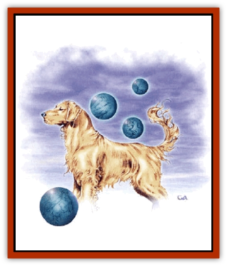
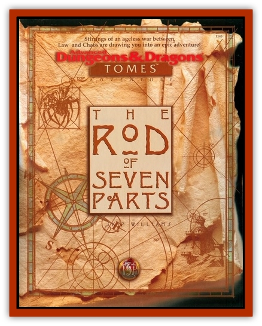

# Hound of Law

| Statistic | **Hound of Law** |
| --- | --- |
| **Activity Cycle:** | Any |
| **Alignment:** | Lawful neutral (Lawful good) |
| **Armor Class:** | 6 |
| **Climate/Terrain:** | Any |
| **Damage/Attack:** | By form, see below |
| **Diet:** | Carnivore |
| **Frequency:** | Very rare |
| **Hit Dice:** | 8+2 |
| **Intelligence:** | Average (8-10) |
| **Magic Resistance:** | 30% |
| **Morale:** | Fearless (19) |
| **Movement:** | Fl 18 (MC: A) |
| **No. Appearing:** | 1 or 1d6+1 |
| **No. of Attacks:** | By form, see below |
| **Organization:** | Solitary or pack |
| **Size:** | T (1' globe) |
| **Special Attacks:** | By form, see below |
| **Special Defenses:** | By form, see below |
| **THAC0:** | 13 |
| **Treasure:** | Nil |
| **XP Value:** | 3,000 |

The hound of law is a form of [[Will_O'Wisp|will o'wisp]] that the [[Vaati|wind dukes]] (the *vaati*) use as trackers. guards, and messengers. In its natural form, a hound of law is a faintly luminous sphere that sheds no more light than a firefly. The sphere can produce buzzing sounds by vibrating rapidly; this allows them to speak in a limited fashion.

Hounds of law can assume the forms of normal animals, which allows them to go about their missions unobtrusively. Hounds in animal form seem trim and muscular, but they can appear well-groomed, filthy, or anything in between.

**Combat:** A hound's keen senses give it a +1 bonus to its own surprise rolls and allow it to detect invisible creatures 50% of the time. A hound of law can move to the Astral or Ethereal plane or become invisible at will. A hound on the Ethereal or Astral plane can materialize and attack creatures on the Prime Material plane, imposing a -5 penalty on opponents' surprise rolls. Hounds of law cannot attack in their natural forms. When assuming animal forms, they can employ the form's attacks. Hounds in animal form have better ratings than normal animals. A hound can assume a new form once a round; each change takes only a few seconds, and the hound is free to move and attack after changing form. If a hound reverts to its normal form and remains in it for 1d4 rounds, it regains 10-60% of any damage it suffered in its previous form.

Hounds of law are unaffected by all spells except *ptrotection from evil (good)*, *magic missile*, and *maze*. Hounds of law gain a +1 attack bonus when fighting chaotic creatures, and chaotic creatures suffer a -1 attack penalty and a -1 penalty to each die of damage inflicted (minimum one point per die).

A hound can track creatures by sight and scent; use the tracking Proficiency. The hound's base tracking score is 16, and it ignores vision-based penalties (such as poor lighting or attempts to cover tracks).

If a creature a hound is tracking uses flight or teleportation magic of any kind, the hound can use the residual magic energies to automatically follow the creature. To determine success, make a tracking roll at a -2 penalty; adjustments for the trail's age apply, but other adjustments do not. If the roll fails, the hound cannot follow the creature. If the creature the hound is following died or was entrapped in a solid object or on another plane as a result of a teleport, a hound that has made a successful tracking roll senses the disaster and need not follow. When following a teleporting creature, a hound can carry 250 pounds of additional weight.

**Habitat/Society:** Hounds of law are found only in the company of vaati. They might be encountered anywhere that the vaati have interests. Lone hounds are nearly always performing some mission for their master, at least one of whom will be nearby.

**Ecology:** Hounds of law come from a breeding program developed by the vaati. The few hounds of law bred by vaati "wanderers" (the *wendeam*) are lawful good like their masters.

| Form | AC | MV |  |
| --- | --- | --- | --- |
| AT |
|  | Dmg |
| Dog | 0 | 15 | 1 | 2d4+2 |
| Elephant | 0 | 18 | 5 | 2d8+2/2d8+2/2d6+2/2d6+2/2d6+2 |
| Hawk | 0 | 3, Fl 36 (C) | 3 | 1d3/1d3/1d2* |
| Horse | 1 | 21 | 2 | 1d6+2/1d6+2 |
| Panther< | 0 | 15, Cl 3 | 3 | 1d4+2/1d4+2/1d6+2 |
| Rat | 1 | 18, Sw 6 | 1 | 1 |
| Shark | 0 | Sw 27 | 1 | 3d4+2 |
| Snake | 0 | 12, Sw 12 | 2 | 1d2/1d6** |

* Can dive for a +2 attack bonus
** Can constrict after the first hit for 1d8 points of damage each round.

---
## Discovery & Documentation

**Source Publication:** The Rod of Seven Parts (1996)
**Campaign Setting:** Planescape
**Author(s):** Skip Williams

### Other Creatures Found in This Source Book
   * [[Beast_of_Chaos|Beast of Chaos]]
   * [[Spyder_Fiend|Spyder Fiend]]
   * [[Vaati|Vaati]]
