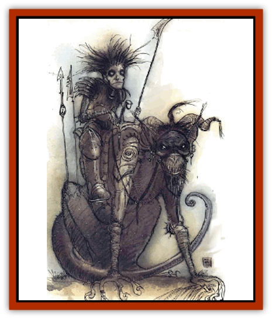

# Howler

| Statistic | **Howler** |
| --- | --- |
| **Activity Cycle:** | Any |
| **Alignment:** | Chaotic evil |
| **Armor Class:** | 5 (3) |
| **Climate/Terrain:** | Pandemonium |
| **Damage/Attack:** | 2d8 |
| **Diet:** | Omnivore |
| **Frequency:** | Very rare |
| **Hit Dice:** | 6 |
| **Intelligence:** | Low |
| **Magic Resistance:** | Nil |
| **Morale:** | Elite (13-14) |
| **Movement:** | 24 |
| **No. Appearing:** | 1d6 |
| **No. of Attacks:** | 1 bite, 1 quill |
| **Organization:** | Pack |
| **Size:** | L (8' tall) |
| **Special Attacks:** | Quills |
| **Special Defenses:** | Nil |
| **THAC0:** | 15 |
| **Treasure:** | Nil |
| **XP Value:** | 975 |

Howlers are the keening brood-hounds or Pandemonium, the singers of dementia who cluster around the great rocky spires in those plunging caves. In that eternally night-lit plane the howlers are drawn to shriek their madness to the moonless heavens

The howlers are gigantic beasts, four-legged, with the burly backs of oxen and scales glinting through their matted red fur. This fur spreads into a thick ruff of trembling quills that frame their simian faces. Their front claws are the clotted knots of coarse fingers too long crnshed under the beastly weight, their back feet are hooved. When they cry, they rock back until they almost stand and throw their muzzled faces toward the missing sky. Lips pursed into a perfect O, they howl the voices of madness.

**Combat:** Although brutish and cruel, howlers aren't particularly aggressive beasts. Scavengers by nature, they seldom attack groups larger than their own numbers or any that seem more capable of defending themselves. When a howler pack does attack, it usually singles out a weak victim, while trying to hold the rest at bay. If this proves impossible, the howler pack breaks and flees.

This doesn't mean, however, that howlers are weak opponents. Far from it - their own cowardice makes them formidable opponents. When a howler pack does attack, it is determined and ruthless. All energy is devoted to bringing down the prey.

In actual battle, howlers can choose from several attack forms. Normally they rush in on the first round of combat, attempting to get within biting distance as soon as possible. The rush and the round that follows are the two most dangerous moments or any howler attack. As they rush forward, their neck bristles rise to form a spined shield, reducing their Armor Class to 3. If the howlers move 120 reel or more in the charge, they gain a +2 bonus to their chance to hit and their damage is doubled for carrying the charge through. Finally, while in their frenzied charge, the howlers are immune to all morale checks.

Once in combat, howlers fight by snapping their powerful jaws and savagely slashing with their erect neck quills. The quills can only be used on those at the creatures' forward flanks and aren't particularly accurate (-2 on the chance to hit). Each successful hit jabs the person with 1d4 quills, and each quill causes 1d4 points of damage. Creatures struck by the quills must make a saving throw versus breath weapon for each quill. For each save that is failed, the quill remains embedded In the victim. The victim's attack rolls are reduced by 1. Removing quills takes 1d6 rounds and causes an additional 1d3 points of damage.

**Habitat/Society:** Howlers are beasts native to the tunnels of Pandemonium and are not naturally found on any other plane. Even within Pandemonium they aren't found everywhere. They stay far from the settled regions and the small tunnels, preferring the larger curved passages that pass for plains and grassland. On these plains they hunt in packs; for they are carnivorous scavengers.

There is no hard and fast size for a howler pack, as is the way of the animal kingdom. Packs range from 2 to as many as 20 members. This number includes bulls, females, and kits. (Of a pack, it is the bulls who defend the others, hence the small number met in a normal encounter) The packs scour the land. searching for anything edible. As news of their migrations travels through the tunnels, other dwellers in Pandemonium brace themselves for the agony that is sure to come.

Howlers are aptly named, for their howls cut through the whistling wind with the pitch of madness. Their cries have the same effects as the winds of Pandemonium, gradually driving those who hear them to insanity. Whenever a howler lets loose its cry, all within hearing distance, whether indoor or out, must make a check as if they were exposed to Pandemonium's winds. A howler's cry lacks the full strength of the winds - their keening pitch can never push a chancier beyond Stage 3 (Hysteria). Characters who have already reached Resignation exhibit all their tics and twitches when the howlers sing. Even on other planes, a howler's effect travels with it.

It is fortunate that howlers don't bay all the time. In that regard they are more like common [[Dog|dogs]]. They howl and keen occasionally, when the circumstances are right. As pack animals, they howl when they are lonely - kept in the stable apart from their masters, for example. They howl during the rutting season and when their territory is challenged. They howl when cornered. The DM has final say over when the beasts bay to the blackness.

**Ecology:** Howlers would be just another bane of Pandemonium were it not for those in the tunnels who can capture and tame the beasts to be good riding and pack mounts. A howler has the carrying capacity of a [[Horse|draft horse]], and is far better adapted to traveling the twisted tunnels than a simple horse.

Some wizards claim the howlers sing secrets of the planes, a code concealed in their pitch and their keening. Others think the wizards have been howled mad by their studies.

---
## Discovery & Documentation

**Source Publication:** Lankhmar: City of Adventure (2nd Ed.) (1993)
**Campaign Setting:** Lankhmar
**Author(s):** Bruce Nesmith, Douglas Niles, and Ken Rolston

### Other Creatures Found in This Source Book
   * [[Astral_Wolf|Astral Wolf]]
   * [[Behemoth|Behemoth]]
   * [[Bird_of_Tyaa|Bird of Tyaa]]
   * [[Cat_War|Cat, War]]
   * [[Cloaker_Sea|Cloaker, Sea]]
   * [[Cold_Woman|Cold Woman]]
   * [[Devourer_Lankhmar|Devourer (Lankhmar)]]
   * [[Ghoul_Kleshite|Ghoul, Kleshite]]
   * [[Ghoul_Lankhmar|Ghoul (Lankhmar)]]
   * [[Gladiator_Lizard|Gladiator Lizard]]
   * [[Horag|Horag]]
   * [[Ice_Gnome|Ice Gnome]]
   * [[Invisible_of_Stardock|Invisible of Stardock]]
   * [[Lizard|Lizard]]
   * [[Ophidian|Ophidian]]
   * [[Ray_Invisible_Flying|Ray, Invisible Flying]]
   * [[Scorpion|Scorpion]]
   * [[Simorgyan|Simorgyan]]
   * [[Snow_Serpent|Snow Serpent]]
   * [[Thunder_Children|Thunder Children]]
   * [[Wraith-Spider|Wraith-Spider]]
   * [[Zombie_Sea|Zombie, Sea]]
