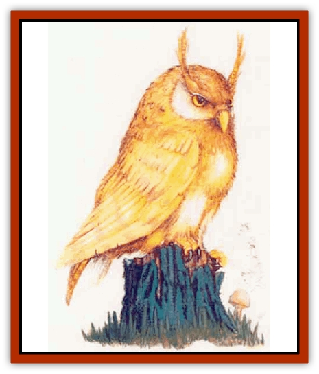

# Hsiao

| Statistic | **Hsiao** |
| --- | --- |
| **Activity Cycle:** | Night |
| **Alignment:** | Lawful neutral or lawful good |
| **Armor Class:** | 5 |
| **Climate/Terrain:** | Temperate forest |
| **Damage/Attack:** | 1d6 (claw)/1d6 (claw)/1d4 (beak) |
| **Diet:** | Omnivore |
| **Frequency:** | Rare |
| **Hit Dice:** | 4-15 |
| **Intelligence:** | Very (11-12) |
| **Magic Resistance:** | Nil |
| **Morale:** | Champion (15) |
| **Movement:** | 9, Fl 21 (C) |
| **No. Appearing:** | 1d4 |
| **No. of Attacks:** | 3 |
| **Organization:** | Household |
| **Size:** | M (5' tall, 15' wingspan) |
| **Special Attacks:** | Spells |
| **Special Defenses:** | Allies |
| **THAC0:** | 4 HD: 17 / 5-6 HD: 15 / 7-8 HD: 13 / 9-10 HD: 11 / 11-12 HD: 9 / 13-14 HD: 7 / 15 HD: 5 |
| **Treasure:** | O (I) |
| **XP Value:** | 4 Hit Dice: 420 / 5 Hit Dice: 650 / 6 Hit Dice: 975 / 7 Hit Dice: 1,400 / 8 Hit Dice: 2,000 / 9 Hit Dice: 3,000 / 10 Hit Dice: 4,000 / 11 Hit Dice: 5,000 / 12 Hit Dice: 6,000 / 13 Hit Dice: 7,000 / 14 Hit Dice: 8,000 / 15 Hit Dice: 9,000 |

The hsiao (sh-HOW), or guardian owls, are a race of peaceful philosopher-priests inhabiting the woodlands of Mystara.

Hsiao look like giant owls with broad-feathered wings and large golden eyes. Many observers explain that the hsiao seem to radiate an aura of comfort and intelligent understanding. Guardian owls are silent fliers, whose call brings to mind a dove's coo more than the questioning hoot of a normal [[Owl|owl]]. Hsiao can speak, but never to outsiders unless the occasion strongly warrants it. They do not carry weapons.

**Combat:** As peaceful creatures, the hsiao shun combat when possible. However, they do not shirk their duty in the face of an unavoidable battle.

A hsiao's only physical weapons are its sharp beak (1d4 points of damage) and two large claws (1d6 points of damage each). Normally, however, the creature uses its spells in battle before resorting to physical combat. A hsiao can cast priest spells with the ability of a cleric of the same experience level as the hsiao has Hit Dice. Most of these avians are 4th level (4 Hit Dice), while 25% of them have achieved higher levels (maximum of 15th level).

The hsiao's other option in combat is to call for aid. These birds know and work closely with many of the forest's denizens (including [[Actaeon|actaeons]], [[Centaur|centaurs]], [[Dryad|dryads]], [[Elf|elves]], [[Treant|treants]], and [[Unicorn|unicorns]]) and may call on them for assistance. In 50% of the cases where a hsiao cries for help, some woodland creature(s) answer the call, arriving in 1d4 rounds. The DM should determine which woodland denizen(s) come to the hsiao's aid either by simply choosing or by rolling on the Woodland encounter table.

**Habitat/Society:** Hsiao reside in the deep forests, making their homes in the highest trees - most often ancient oaks. The guardian owls build their nests, called households, of earth and leaves. Some extraordinarily elaborate nests feature large earthen tunnels that lace through a number or trees to connect many different chambers far above the forest floor. Other forest creatures often adopt abandoned hsiao households as their own laus. [[Tasloi|Tasloi]] and [[Imp_Mystara|wood imps]] in particular enjoy taking over these dwellings.

The eldest female usually heads the hsiao's small family groupings. Since these families are matrilineal, two hsiao that have bonded for life (in a ceremony known as the Moon's Flight), reside in the female hsiao's household. Guardian owls seldom have more than two offspring in the course of their lives. The female broods over a solitary, golden egg for three months before it hatches and a chick emerges. Young hsiao can fly within six months of hatching.

Once of age (able to fly), hsiao begin a rigorous process of schooling that can last up to 10 years and involves priestly teachings and continual questioning by elders.

Hsiao goals indude the preservation of woodland wilderness against intrusions by dangerous humanoids. The owls often remain friendly with local druids, working in tandem with them and occasionally exchanging favors.

Guardian owls wlll not interfere with player characters who inflict no damage to the woodlands or its inhabitants, but they will attempt to correct any PCs who harm their beloved forest.

**Ecology:** It is uncertain how the hsiao came to be; given their alignment and priestly powers, rumors call them the mortal offspring of a powerful lawful Immortal.

The hsiao's most important ecological role involves protecting the forest and its inhabitants.

---
## Discovery & Documentation

**Source Publication:** Mystara Appendix (1994)
**Campaign Setting:** Mystara
**Author(s):** John Nephew, Teeuwynn Woodruff, John Terra, Skip Williams

### Other Creatures Found in This Source Book
   * [[Actaeon|Actaeon]]
   * [[Agarat|Agarat]]
   * [[Ash_Crawler|Ash Crawler]]
   * [[Baldandar|Baldandar]]
   * [[Bargda|Bargda]]
   * [[Bhut|Bhut]]
   * [[Bird_Mystara|Bird (Mystara)]]
   * [[Blackball|Blackball]]
   * [[Choker|Choker]]
   * [[Coltpixie|Coltpixie]]
   * [[Crone_of_Chaos|Crone of Chaos]]
   * [[Darkhood|Darkhood]]
   * [[Darkwing|Darkwing]]
   * [[Decapus|Decapus]]
   * [[Deep_Glaurant|Deep Glaurant]]
   * [[Diabolus|Diabolus]]
   * [[Dimensional_Warper|Dimensional Warper]]
   * [[Dragon_Mystara_Crystalline|Dragon (Mystara), Crystalline]]
   * [[Dragon_Mystara_Jade|Dragon (Mystara), Jade]]
   * [[Dragon_Mystara_Onyx|Dragon (Mystara), Onyx]]
   * [[Dragon_Mystara_Ruby|Dragon (Mystara), Ruby]]
   * [[Drake_Mystara|Drake (Mystara)]]
   * [[Dragonfly|Dragonfly]]
   * [[Dusanu|Dusanu]]
   * [[Elemental_of_Chaos_Air_Earth|Elemental of Chaos, Air/Earth]]
   * [[Elemental_of_Chaos_Fire_Water|Elemental of Chaos, Fire/Water]]
   * [[Elemental_of_Law_Air_Earth|Elemental of Law, Air/Earth]]
   * [[Elemental_of_Law_Fire_Water|Elemental of Law, Fire/Water]]
   * [[Familiar_Mystara|Familiar (Mystara)]]
   * [[Frost_Salamander|Frost Salamander]]
   * [[Fundamental_Air_Earth|Fundamental, Air/Earth]]
   * [[Fundamental_Fire_Water|Fundamental, Fire/Water]]
   * [[Gargantua_Mystara|Gargantua (Mystara)]]
   * [[Geonid|Geonid]]
   * [[Ghostly_Horde|Ghostly Horde]]
   * [[Giant_Athach|Giant, Athach]]
   * [[Giant_Hephaeston|Giant, Hephaeston]]
   * [[Golem_Drolem|Golem, Drolem]]
   * [[Golem_Mystara_I|Golem (Mystara) I]]
   * [[Golem_Mystara_II|Golem (Mystara) II]]
   * [[Golem_Mystara_III|Golem (Mystara) III]]
   * [[Gray_Philosopher|Gray Philosopher]]
   * [[Guardian_Warrior|Guardian Warrior]]
   * [[Gyerian|Gyerian]]
   * [[Herex|Herex]]
   * [[Hivebrood|Hivebrood]]
   * [[Horde|Horde]]
   * [[Huptzeen|Huptzeen]]
   * [[Hutaakan|Hutaakan]]
   * [[Imp_Mystara|Imp (Mystara)]]
   * [[Jellyfish_Giant_Mystara|Jellyfish, Giant (Mystara)]]
   * [[Kna|Kna]]
   * [[Kopru|Kopru]]
   * [[Lizard_Mystara|Lizard (Mystara)]]
   * [[Lizard-kin_Mystara|Lizard-kin (Mystara)]]
   * [[Lupin|Lupin]]
   * [[Lycanthrope_Werejaguar_Mystara|Lycanthrope, Werejaguar (Mystara)]]
   * [[Lycanthrope_Wereswine|Lycanthrope, Wereswine]]
   * [[Magen|Magen]]
   * [[Manikin|Manikin]]
   * [[Mek|Mek]]
   * [[Mujina|Mujina]]
   * [[Nagpa|Nagpa]]
   * [[Neh-thalggu|Neh-thalggu]]
   * [[Nightshade_Mystara|Nightshade (Mystara)]]
   * [[Nuckalavee|Nuckalavee]]
   * [[Pegataur|Pegataur]]
   * [[Phanaton|Phanaton]]
   * [[Plant_Dangerous_Mystara|Plant, Dangerous (Mystara)]]
   * [[Plasm|Plasm]]
   * [[Rakasta|Rakasta]]
   * [[Rock_Man|Rock Man]]
   * [[Sabreclaw|Sabreclaw]]
   * [[Sacrol|Sacrol]]
   * [[Scamille|Scamille]]
   * [[Shapeshifter|Shapeshifter]]
   * [[Shargugh|Shargugh]]
   * [[Shark-kin|Shark-kin]]
   * [[Sollux|Sollux]]
   * [[Spectral_Death|Spectral Death]]
   * [[Spectral_Hound|Spectral Hound]]
   * [[Spider-kin|Spider-kin]]
   * [[Spirit_Mystara|Spirit (Mystara)]]
   * [[Statue_Living|Statue, Living]]
   * [[Surtaki|Surtaki]]
   * [[Tabi|Tabi]]
   * [[Thoul|Thoul]]
   * [[Thunderhead|Thunderhead]]
   * [[Tiger_Ebon|Tiger, Ebon]]
   * [[Topi|Topi]]
   * [[Tortle|Tortle]]
   * [[Vampire_Velya|Vampire, Velya]]
   * [[White_Fang|White Fang]]
   * [[Worm_Mystara|Worm (Mystara)]]
   * [[Wyrd|Wyrd]]
   * [[Yowler|Yowler]]
   * [[Zombie_Lightning|Zombie, Lightning]]
