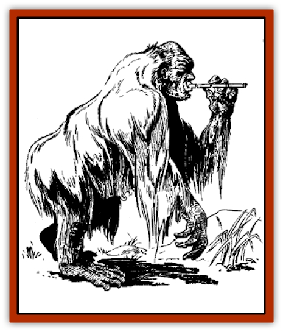

# Hsing-sing

| Statistic | **Hsing-sing** |
| --- | --- |
| **Activity Cycle:** | Any |
| **Alignment:** | Neutral |
| **Armor Class:** | 6 |
| **Climate/Terrain:** | Subtropical mountains and forests |
| **Damage/Attack:** | 1-6 or by weapon type |
| **Diet:** | Omnivore |
| **Frequency:** | Rare |
| **Hit Dice:** | 2+1 |
| **Intelligence:** | Average (8-10) |
| **Magic Resistance:** | Nil |
| **Morale:** | Average (10) |
| **Movement:** | 6, Sw 9 |
| **No. Appearing:** | 2-20 |
| **No. of Attacks:** | 1 |
| **Organization:** | Tribe |
| **Size:** | M (5' tall) |
| **Special Attacks:** | Nil |
| **Special Defenses:** | Nil |
| **THAC0:** | 19 |
| **Treasure:** | B |
| **XP Value:** | 65 |

The hsing-sing are a race of reclusive ape-like humanoids. Many scholars consider the hsing-sing to personify the principles of pacifism and harmony with nature.

Hsing-sing have bulky bodies covered with thick white fur. As they age, their fur darkens to rich, golden tones. Their long arms extend nearly to the ground. When swimming, their large, flat feet propel them through the water with ease. Their hairless faces look almost human, with bright blue or brown eyes, small noses, and smooth skin. However, their teeth are much longer and sharper than human teeth, resembling the fangs of carnivorous apes.

Their long fur offers natural protection against the elements, and hsing-sing do not wear clothing. However, tribal leaders sometimes wear armbands made of intricately woven vines as a symbol of authority. Females sometimes weave wild flowers into the fur of their arms and legs.

Hsing-sing speak the trade language and the language of their own race.

**Combat:** Hsing-sing are normally passive, friendly creatures, preferring flight to confrontation. But once a year, usually at the onset of spring, adult males instinctively complete a "war season". This season lasts for 6-16 (2d6 + 4) days. During that time, male hsing-sing become extremely savage and aggressive. They organize raiding bands of 4-20 (5d4) members, and attack human and humanoid settlements on the edge of their territories. Such attacks are impartial; the hsing-sing pillage good and evil creatures alike. To maximize the advantage of surprise, the hsing-sing seldom attack the same settlements two years in a row.

A raiding band of hsing-sing are armed with blowguns (50%), spears (30%), and parangs (20%). Additionally, 50% of the band carries specially constructed wicker shields. (Like any shield, it raises their Armor Class to 5.) Hsing-sing are quite adept at using poison, and their blowgun darts are always dipped in noxious concoctions. They have two principal poisons. The first type of poison causes death in 2-5 rounds if the victim fails his saving throw vs. poison. If the save is successful, the poison still causes 1-8 hit points of damage. The second type of poison is a strong muscle relaxant. If the victim fails his save, the poison paralyzes him for 2-12 (2d6) turns. If the saving throw is successful, the poison *slows* him (as per the spell) for 1-6 turns.

**Habitat/Society:** A hsing-sing tribe consists of 2-20 (2d10) males, an equal number of females, and a number of children equal to 50% of the total number of adults. Females have 1 hit die and fight from the branches, hurling clubs and stones at attackers. Children have 1-2 hit points and cannot make attacks. The oldest male member of the tribe serves as its leader.

A hsing-sing lair is a simple sleeping platform perched in the highest branches of a tall tree. A thatched roof offers some protection from the elements. Each family shares a single platform. Because of their love of nature, hsing-sing often keep rabbits, parrots, and other small creatures as pets.

Hsing-sing lead a simple existence. They spend most waking hours hunting for food, frolicking in the trees, and telling stories. Aside from making wicker shields, weapons, and simple tools, they practice no crafts. Though hsing-sing have no desire for material wealth, they collect small amounts of treasure, which they use for trade with humans. They usually stash their treasure in a hollowed-out branch near their sleeping platforms.

**Ecology:** Hsing-sing eat fruits and grains indigenous to the areas they inhabit, supplemented with small amounts of fish, deer, and other wild game. Because of their weakness for strong drink, they occasionally come to human villages to trade. On these trips, they bring rare treasure from the hidden enclaves of the forest, such as parrots, rare bird feathers, scented roots, and exotic fruits. In exchange, they take forged metal, pottery, rice, and wine.

Human hunters sometimes track down and kill hsing-sing for their fur. The golden fur of an elder hsing-sing is especially prized.

---
## Discovery & Documentation

**Source Publication:** MC6 Kara-Tur Appendix (1990)
**Campaign Setting:** Kara-Tur (Forgotten Realms)
**Author(s):** Rick Swan

### Other Creatures Found in This Source Book
   * [[Bajang|Bajang]]
   * [[Bakemono|Bakemono]]
   * [[Bisan|Bisan]]
   * [[Buso|Buso]]
   * [[Carp_Giant|Carp, Giant]]
   * [[Centipede_Spirit|Centipede, Spirit]]
   * [[Chu-u|Chu-u]]
   * [[Con-tinh|Con-tinh]]
   * [[Doc_cu'o'c|Doc cu'o'c]]
   * [[Duruch'i-lin|Duruch'i-lin]]
   * [[Flame_Spirit|Flame Spirit]]
   * [[Foo_Creature|Foo Creature]]
   * [[Gaki|Gaki]]
   * [[Gargantua|Gargantua]]
   * [[Goblin_Rat|Goblin Rat]]
   * [[Hai_Nu|Hai Nu]]
   * [[Hannya|Hannya]]
   * [[Hengeyokai|Hengeyokai]]
   * [[Hu_Hsien|Hu Hsien]]
   * [[Human_Kara-Tur|Human (Kara-Tur)]]
   * [[Ikiryo|Ikiryo]]
   * [[Jishin_Mushi|Jishin Mushi]]
   * [[Kala|Kala]]
   * [[Kaluk|Kaluk]]
   * [[Kappa|Kappa]]
   * [[Korobokuru|Korobokuru]]
   * [[Krakentua|Krakentua]]
   * [[Kuei|Kuei]]
   * [[Memedi|Memedi]]
   * [[Men-shen|Men-shen]]
   * [[Nat|Nat]]
   * [[Ningyo|Ningyo]]
   * [[Oni|Oni]]
   * [[P'oh|P'oh]]
   * [[P'oh_Gohei|P'oh, Gohei]]
   * [[Shan_Sao|Shan Sao]]
   * [[Shirokinukatsukami|Shirokinukatsukami]]
   * [[Spirit_Folk|Spirit Folk]]
   * [[Spirit_Nature|Spirit, Nature]]
   * [[Spirit_Stone|Spirit, Stone]]
   * [[Tako|Tako]]
   * [[Tengu|Tengu]]
   * [[Wang-Liang|Wang-Liang]]
   * [[Yuan-ti_Histachii|Yuan-ti, Histachii]]
   * [[Yuki-on-na|Yuki-on-na]]
