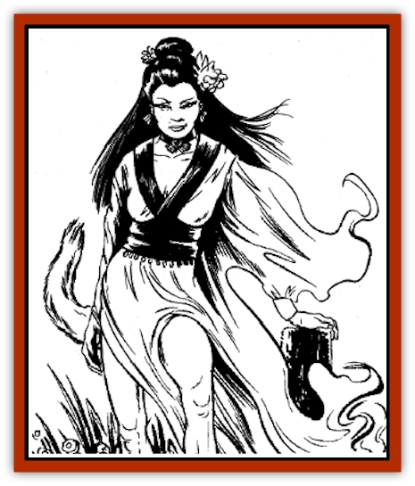

# Hu Hsien

| Statistic | **Hu Hsien** |
| --- | --- |
| **Activity Cycle:** | Any |
| **Alignment:** | Chaotic evil |
| **Armor Class:** | 7 |
| **Climate/Terrain:** | Temperate plain, forest, hill, and mountain |
| **Damage/Attack:** | 1-6 or by weapon type |
| **Diet:** | Special |
| **Frequency:** | Rare |
| **Hit Dice:** | 6 |
| **Intelligence:** | Genius (17-18) |
| **Magic Resistance:** | 50% |
| **Morale:** | Steady (11) |
| **Movement:** | 15 |
| **No. Appearing:** | 1-6 |
| **No. of Attacks:** | 1 |
| **Organization:** | Solitary or pack |
| **Size:** | M (5' tall) |
| **Special Attacks:** | See below |
| **Special Defenses:** | See below |
| **THAC0:** | 15 |
| **Treasure:** | I,S,T |
| **XP Value:** | 4,000 |

Lesser spirits who are cousins of the [[Hengeyokai|hengeyokai]], the hu hsien are a race of shapeshifting foxes�cunning, clever, and capable of endless mischief.

A hu hsien has two basic forms, and can *shapechange* freely between them. Its primary form looks like a normal fox with rustcolored or silver fur. Unlike a normal fox, however, a hu hsien fox can walk on its hind legs and hold items in its front paws. The hu hsien's second form is that of a human maiden. She has exceptional beauty and grace (18 Charisma). Her hair is long and flowing, and she wears long, silken robes. But unlike a normal maiden, the hu hsien's human form has a foxlike tail. The lovely hu hsien usually takes care to hide the tail beneath her robe.

The hu hsien can speak all languages common to the area she inhabits, as well as the language of animals.

**Combat:** Hu hsien delight in their ability to manipulate and torment hapless humans. They are noted for their trickery, and a character who scoffs at their existence is among the hu hsien's favorite victims.

A hu hsien can employ the following spell-like effects at will, once per round: *become invisible*, *polymorph self*, *disguise*, *chameleon*, *know history*, *hypnotism*, *read magic*, *comprehend languages*, *ventriloquism*, *apparition*, *ESP*, and *hypnotic pattern*. Once per day, she can use *possess*, *servant horde*, and *major creation*. Three times per week, she can use either *reward* or *ancient curse*. When in human form, she has the power of *fascination*.

The hu hsien can be hit only by +3 weapons or better. She has limited regeneration, healing at the rate of 2 hit points per hour. She is immune to fire and takes only half damage from cold-based attacks (no damage on a successful saving throw). She suffers double damage from electrical-based attacks. She greatly fears thunderstorms, since the Celestial Emperor sometimes sends the Thunder God to punish the hu hsien for her wicked ways.

The hu hsien sustains herself by draining the life force of human victims. To do so, she must assume human form and trick a human into spending time with her, generally by using her fascinate power to cause the victim to fall hopelessly in love. Thereafter, each day the victim spends with the hu hsien results in the loss of one experience level, similar to the effects of an energy drain. The victim, totally blinded by love, is not aware of what is happening and does not realize what has befallen him. Once this process begins, the victim only can be saved if the hu hsien is driven away or destroyed by others.

**Habitat/Society:** Hu hsien typically make their lairs near the outskirts of human villages. They sometimes occupy abandoned houses, using their magical powers to create the illusion of great wealth and luxury. Occasionally, their lair is a normal fox den, but the enchanted interior looks like a great mansion. Many times an unfortunate traveler has dined and slept in a grand hall, only to awaken in the cramped space under the floors of an old house, the guest of a hu hsien.

Hu hsien are not entirely cruel and ungrateful. They have been known to reward people who show them generosity or treat them kindly. Such rewards usually involve success at examinations, good fortune, or rescue in a moment of great danger.

Hu hsien are particularly attracted to scholars, both as allies and victims. A scholar who befriends a hu hsien, usually with regular tributes of gems and coins, may sometimes petition the lovely fox-creature's help in matters of academic research. The scholar lights sticks of incense in his study, then leaves the room for the night. When he later returns, the scholar will discover a particular volume protruding from the stacks on his shelves, or a particular document displayed on his desk. This volume or page contains the information he sought, courtesy of the hu hsien.

Hu hsien value wealth, and frequently acquire great treasure caches. Because of this, some wealthy people attribute their own material success to the worship of this lesser spirit. Near their mansions, they construct clay shrines in honor of the hu hsien, bearing the image of a fox embracing an ornately-dressed human. Tributes of gems, coins, and prayer are offered daily at these shrines.

**Ecology:** Though hu hsien obtain all sustenance from human victims, they have a weakness for wine of any type. Once intoxicated, they revert to their primary fox form.

---
## Discovery & Documentation

**Source Publication:** MC6 Kara-Tur Appendix (1990)
**Campaign Setting:** Kara-Tur (Forgotten Realms)
**Author(s):** Rick Swan

### Other Creatures Found in This Source Book
   * [[Bajang|Bajang]]
   * [[Bakemono|Bakemono]]
   * [[Bisan|Bisan]]
   * [[Buso|Buso]]
   * [[Carp_Giant|Carp, Giant]]
   * [[Centipede_Spirit|Centipede, Spirit]]
   * [[Chu-u|Chu-u]]
   * [[Con-tinh|Con-tinh]]
   * [[Doc_cu'o'c|Doc cu'o'c]]
   * [[Duruch'i-lin|Duruch'i-lin]]
   * [[Flame_Spirit|Flame Spirit]]
   * [[Foo_Creature|Foo Creature]]
   * [[Gaki|Gaki]]
   * [[Gargantua|Gargantua]]
   * [[Goblin_Rat|Goblin Rat]]
   * [[Hai_Nu|Hai Nu]]
   * [[Hannya|Hannya]]
   * [[Hengeyokai|Hengeyokai]]
   * [[Hsing-sing|Hsing-sing]]
   * [[Human_Kara-Tur|Human (Kara-Tur)]]
   * [[Ikiryo|Ikiryo]]
   * [[Jishin_Mushi|Jishin Mushi]]
   * [[Kala|Kala]]
   * [[Kaluk|Kaluk]]
   * [[Kappa|Kappa]]
   * [[Korobokuru|Korobokuru]]
   * [[Krakentua|Krakentua]]
   * [[Kuei|Kuei]]
   * [[Memedi|Memedi]]
   * [[Men-shen|Men-shen]]
   * [[Nat|Nat]]
   * [[Ningyo|Ningyo]]
   * [[Oni|Oni]]
   * [[P'oh|P'oh]]
   * [[P'oh_Gohei|P'oh, Gohei]]
   * [[Shan_Sao|Shan Sao]]
   * [[Shirokinukatsukami|Shirokinukatsukami]]
   * [[Spirit_Folk|Spirit Folk]]
   * [[Spirit_Nature|Spirit, Nature]]
   * [[Spirit_Stone|Spirit, Stone]]
   * [[Tako|Tako]]
   * [[Tengu|Tengu]]
   * [[Wang-Liang|Wang-Liang]]
   * [[Yuan-ti_Histachii|Yuan-ti, Histachii]]
   * [[Yuki-on-na|Yuki-on-na]]
